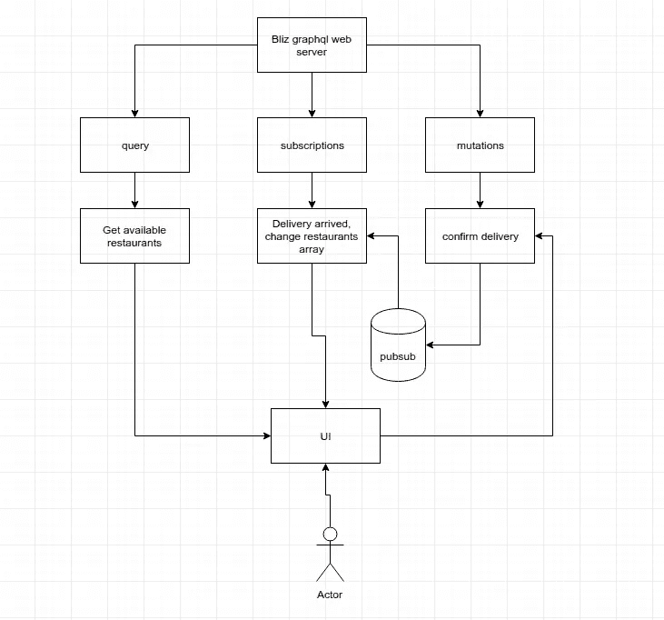
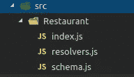
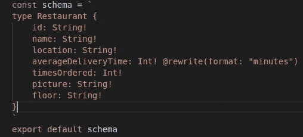
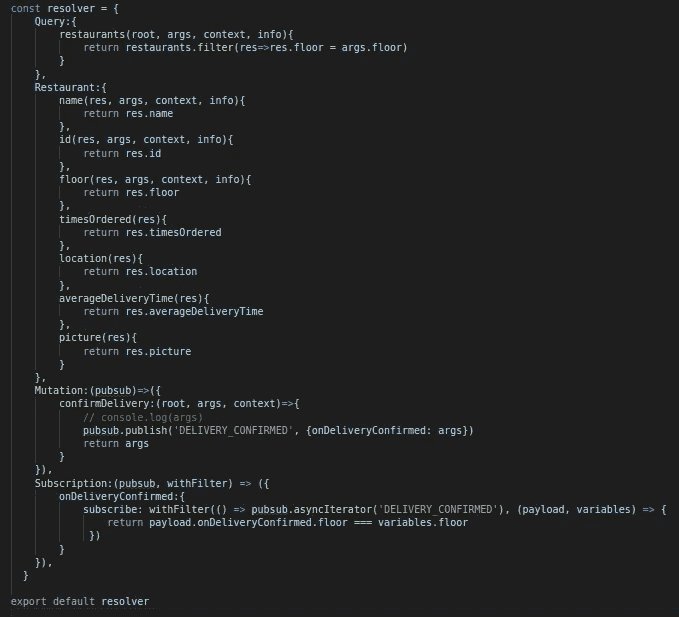
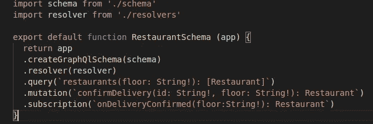
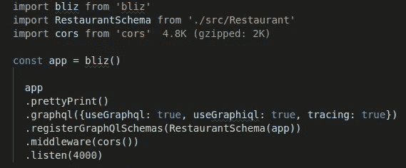
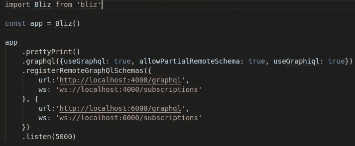

# Bliz.js 0.2.0 简介

> 原文：<https://itnext.io/introducing-bliz-js-0-2-0-6df3b1666e9d?source=collection_archive---------9----------------------->

用于编写 web 服务器的快速声明式框架，没有 taradiddles。

[**Bliz**](https://github.com/yuraxdrumz/Bliz) 支持 HTTP 服务器、带 Socket.io 的实时服务器和带远程模式拼接的 GraphQL 服务器。

# **问题**

起初，我想了解像 express.js 和 koa.js 这样流行的 web 服务器框架是如何工作的，在这个过程中，我意识到我可以创建一些东西，让我自己和我的公司编写 web 服务器变得更加容易，特别是使用 Graphql。如果你有时在一家超过 500 人的公司工作，你会知道融入新的想法、架构风格和语言是很难的，因为，坦率地说，没有人有时间，所以我想，为什么不把 Node 的本地 http 模块、socket.io 和 graphql 工具包装成一些声明性的和易于使用的东西，这样当人们看到它时就不会害怕，我可以以某种方式推动我们的公司达到甚至更好的实践和有点类似的代码库。

# 解决方案

[Bliz.js](https://github.com/yuraxdrumz/Bliz) 是一个框架，它允许您立即创建 HTTP/Socket.io/GraphQL 服务器，并且没有额外的依赖性。

您不必考虑为什么应该使用这个或那个包，您可以专注于编写您的服务器，Bliz 将在幕后为您处理引导和创建一切。所有这些都包含在可链接的函数和增强模块化的编码风格中。

这个图书馆不是:

1.  它在它的纸尿裤里(0.2.0 版本)，所以在 1.0.0 版本发布之前，我不建议在生产中使用它(我希望它会很快出现)。支持将不胜感激！
2.  它没有渲染引擎或类似的东西，它纯粹是用来创建 Restful/realtime/graphql API 的。也许以后会改变。

让我们来看几个 GraphQL 服务器的例子。注意，为了使用 Bliz，您必须了解 GraphQL 是如何工作的。你可以在这里阅读更多关于 GraphQL [的内容。关于 Bliz 的 http/socket.io 服务器的例子，请查看 Github 的自述文件。](https://graphql.org/learn/)

我们将创建一个简单的带有订阅和突变的食品递送 fetcher graphql API。我们的送货车将按楼层划分。以下是流程的概述

结构看起来会像这样

文件夹结构

我们的 Schema.js 有一个带有几个字段的餐馆类型。

schema.js

我们像一个常规的 GraphQL 模式一样定义我们的模式，不要介意重写[指令](https://graphql.org/learn/queries/#directives)，一旦文档准备好，就会有一个关于如何将它们添加到您的项目的好例子。

resolver.js

我们的 Resolvers.js 文件具有标准查询，该查询根据我们经过的楼层返回餐馆。餐馆对象有自己的字段解析器，以防您需要定制字段格式，最后我们有变异和订阅。

注意 Bliz 为变异和订阅注入了 pubsub 和 withFilter 辅助函数。注入的 pubsub 是一个本地事件发射器，尽管您可以添加自己的 pubsub 实现，如 Redis pubsub，只要它实现了 [AsyncIterator](https://scotch.io/tutorials/getting-started-with-asynchronous-iterators-and-generators) 。

我们只需发布一个关于突变的事件，并在订阅中订阅它，就这样:)

餐厅索引. js

我们的 Restaurant-index.js 结合了我们的模式和解析器，请注意我们是如何将主应用程序传递给它的。这种写作风格使你所有的代码模块化，更易测试。

我们在这里声明我们的查询、变异和订阅。这样我们就知道在 API 中处理餐馆时使用什么模式、什么解析器以及会发生什么。

主索引. js

我们的主 index.js 只是通过一个工厂函数创建了一个新的 Bliz 实例。注意我们链接了 pretty print()——这个函数打印所有的 web socket 事件(如果你有注册的话)和所有的 http 路由(如果你有 http 服务器的话)。Bliz 有很多可用的选项和配置，一旦完成，所有的东西都会在文档中。

我们注册了我们的餐馆模式，我们有一个 graphql 服务器在端口 4000 上运行，带有 graphiql playground 和 ws://localhost:4000/subscriptions，自动提供一些实时的好处。

# Bliz 微服务

Bliz 允许您立即创建像上面的餐馆服务这样的微服务，这要感谢幕后的 GraphQL 模式拼接。让我们看看如何创建一个网关来将所有这些微服务合并为一个。

假设我们有两个服务在运行，我们如何查询这两个服务并从客户端抽象出来？我们简单地称 Bliz 的 registerRemoteGraphQlSchemas。

现在你在这两个服务上的所有东西都将通过网关传递，包括订阅。

# 结论

我们让人们用不同的风格和软件包编写不同的软件。后来我们看到 [Bliz](https://github.com/yuraxdrumz/Bliz) 允许在很短的时间内创建各种 API，没有依赖性，也没有太多代码。所有后者对于人们快速开始编写软件是至关重要的，我希望 Bliz 将有助于创建更容易和更易维护的 API。

# 附言

使用 Bliz 有许多测试要写，文档要创建，更改要做，项目要构建。所有的贡献都将受到欢迎，我希望我们能一起创造一些惊人的东西。请随意克隆项目，并提交带有修复/想法/特性的 pull 请求。