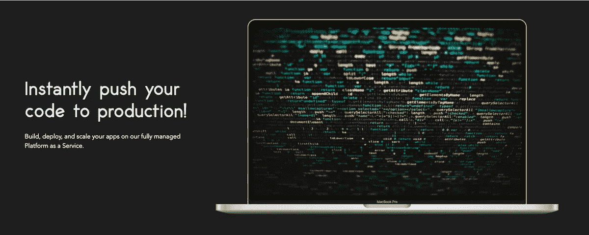
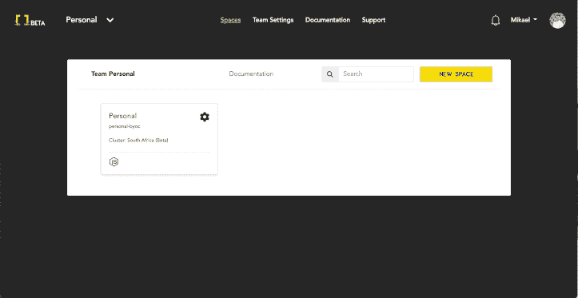
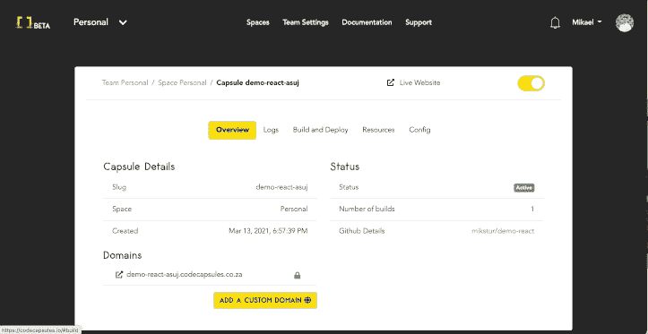
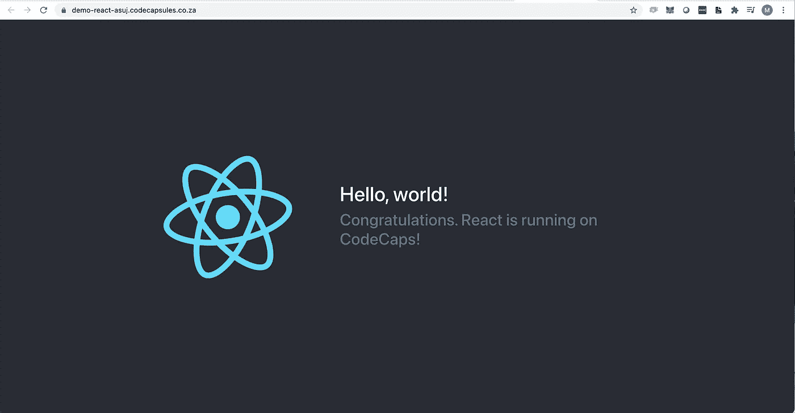
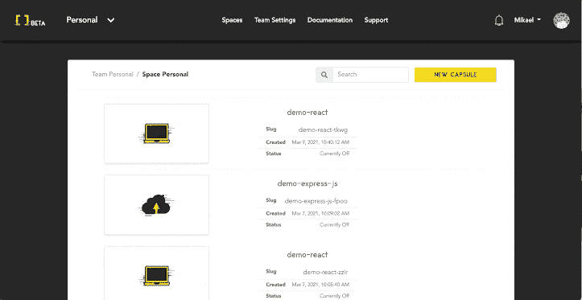
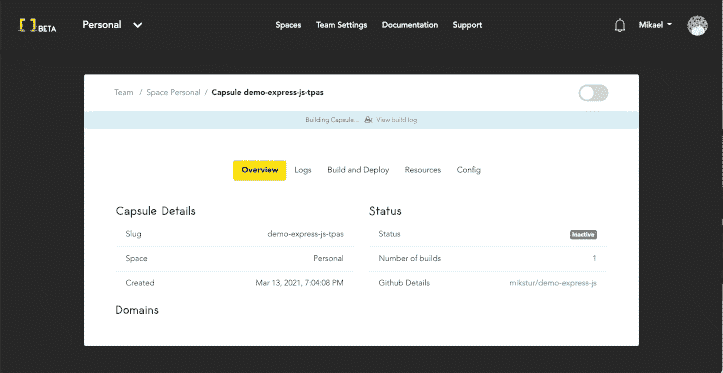
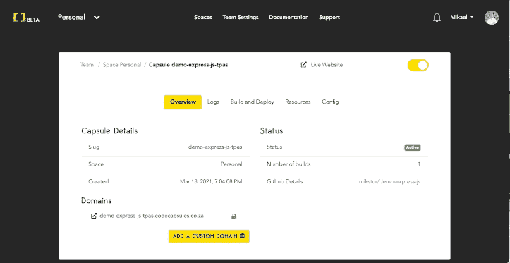
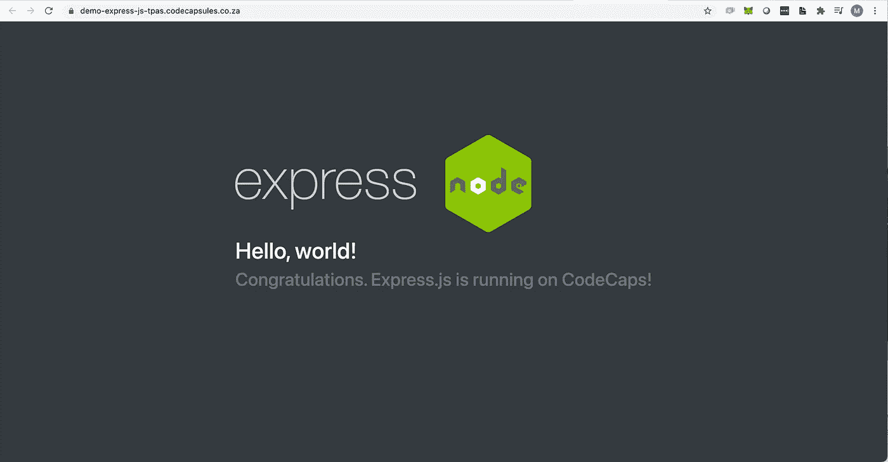
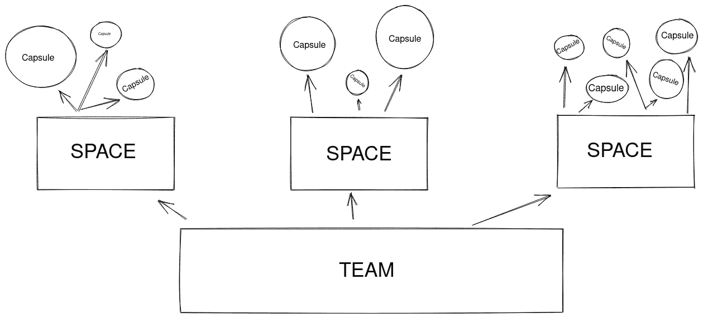

# 介绍代码胶囊

> 原文：<https://itnext.io/introducing-code-capsules-1d282eb3aa9a?source=collection_archive---------6----------------------->

# 背景

代码胶囊

*多年来，我们一直是无服务器的忠实粉丝。该术语以多种形式存在，如 PaaS(平台即服务)或 FaaS(功能即服务)，每个主要的云都有某种形式的无服务器服务，这允许我们作为开发人员持续集成和部署我们的最新代码，而不用担心基础设施。*

*在过去的几年里，我们很高兴将我们的后端应用程序部署到* [*Heroku*](https://www.heroku.com/) *，将我们的静态前端应用程序部署到*[*Netlify*](https://www.netlify.com/)*。我们发现开发人员的体验令人难以置信，我的许多项目仍然可以很容易地从* `*git push*` *部署，甚至在最初设置它的几年后。*

*这篇文章最初发表于 https://codecapsules.io/docs/introducing-code-capsules/*T21

# 我们作为开发者面临的主要问题

我们公司在 [Appstrax](https://appstrax.tech/) 的项目通常在各种云提供商处部署和维护，从 [AWS](http://aws.amazon.com/) 或 Heroku 到更小的本地(到南非)共享服务器环境。随着时间的推移，这给我们这样的公司带来了一些问题。

# 管理客户端基础设施计费

我们需要管理每个月所有客户项目基础设施的账单。

我们过去从各种云提供商那里收集所有发票，并将其分配给相关客户，最终重新开具发票以收回成本。

这取决于客户，对我们来说，大多数非技术客户希望我们代表他们管理基础设施。

如果我们可以让那些非技术客户根据相关的云资源输入他们的支付方式，并直接获得发票，那就太好了，这样可以节省我们一些管理时间。

# 知识转移

当一个团队成员离开公司时，有一个漫长而复杂的过程来移交所有正确的项目信息。

我们需要确保我们有正确的私钥、云帐户登录、文档和流程来维护和部署到相关的服务器。

需要一种解决方案来避免交换私钥和帐户登录的需要，以维护项目的完整性。

# 管理 SSL 证书

根据项目所使用的云或平台，管理 SSL 证书和私钥是一场噩梦。

我们希望完全避免接触任何私钥或服务器终端，只是让每个项目通过类似 LetsEncrypt 的东西来自动化它们的 SSL。

# 上下文切换

当需要维护或修复部署和基础设施时，团队成员通常会根据项目所在的位置在不同的云提供商之间进行上下文切换。

如果我们有一个每个团队成员都熟悉的统一仪表板，我们公司的生产力将会大大提高。

# 缺少南非 PaaS

南非的本地服务器在 CI/CD(持续集成和部署)方面缺乏开发经验，Heroku 和 Netlify 只针对美国或欧盟的服务器。

我们认为，如果我们能够拥有一个平台，将我们最喜欢的 PaaS 功能整合到一个平台中，同时为我们解决上述一些问题，特别是到南非本地服务器的 CI/CD，那将是一件了不起的事情。

我们在 2019 年通过使用各种云原生和开源技术开始原型制作[代码胶囊](https://codecapsules.io)，这导致该应用程序现在处于开放测试状态。

# 部署静态前端应用程序

创建前端胶囊

在将我们的 [Github](https://github.com/) 应用程序安装到您的 Code Capsules 用户帐户和团队中后，您可以通过几个简单的步骤轻松创建一个[前端 Capsule](https://codecapsules.io/docs/faq/what-is-a-capsule/) 。

1.  选择您的 Github 存储库和分支
2.  选择 Github 存储库中包含静态应用程序的文件夹(Angular、React 或 Vue)
3.  输入**构建命令**，它将告诉 Code Capsules 使用哪个命令来生成静态 HTML 和 JavaScript 内容
4.  输入产生的**静态内容文件夹路径**(构建命令的结果)

如果您输入 Build 命令，您会注意到它会在 Capsule 详细信息屏幕上的构建日志中运行:

前端封装构建日志

如果你有一个普通的 HTML 和 JavaScript 应用程序，你可能不需要构建命令。您可以简单地输入包含`index.html`文件的 Github 存储库中的文件夹路径，代码胶囊将在部署后提供该文件。

React 在代码胶囊上运行

# 部署后端应用程序

创建后端胶囊

类似于[前端胶囊](https://codecapsules.io/docs/faq/what-is-a-capsule/)的工作流程，只需几个简单的步骤就能让你的后端应用上线:

1.  选择您的 Github 存储库和分支
2.  选择 Github 存储库中包含静态应用程序的文件夹(Node、Python、Java 或。网络核心)
3.  输入**运行命令**，这将告诉代码胶囊使用哪个命令来启动您的服务器(确保您的应用程序绑定到一个`PORT`环境变量)

后端胶囊构建日志

[后端胶囊](https://codecapsules.io/docs/faq/what-is-a-capsule/)将把你的代码构建到一个容器中，并尝试为你的应用服务。

它还会在每次将新代码推送到 Github 分支时自动创建一个新的构建和部署。如果您喜欢手动创建构件，可以关闭此选项。

您可以查看下面的服务器日志:

胶囊详细信息屏幕

[前端和后端胶囊](https://codecapsules.io/docs/faq/what-is-a-capsule/)将自动创建一个安装了 SSL 证书的免费子域。您可以选择[通过 CNAME 或您可能使用的任何 DNS 提供商的记录将一个自定义域指向您的 capsule](https://codecapsules.io/docs/customising-your-domain-on-code-capsules/) 。

运行在代码胶囊上的 Node express.js

# 小组管理

我们对解决方案进行了分解，以允许开发人员[管理他们的应用程序和云资源](https://codecapsules.io/docs/faq/teams-spaces-and-capsules/)来最好地满足他们的需求。

代码胶囊团队，空间和胶囊

*   您可以创建任意多的[团队](https://codecapsules.io/docs/faq/what-is-a-team/)
*   您可以在团队中创建任意数量的[空间](https://codecapsules.io/docs/faq/what-is-a-space/)
*   您可以邀请用户加入您的团队
*   您可以为不同的团队添加不同的支付方式，如果您希望将客户的信用卡直接与团队关联，这将非常有用
*   您可以查看按团队细分的发票
*   您可以管理每个团队的 Github 存储库

代码胶囊团队管理

如果你想尝试一下，请查看我们的[文档](https://codecapsules.io/docs/)和[教程](https://codecapsules.io/docs/topic/tutorials/)。每个个人团队都可以享受一个免费的前端胶囊来[试试我们的新平台](https://codecapsules.io/)。

我们很乐意听到任何和所有的反馈(加入我们的 [Slack 团队](https://codecapsules.io/slack))，这样我们可以改进我们的解决方案，并希望为其他开发者增加价值🚀。