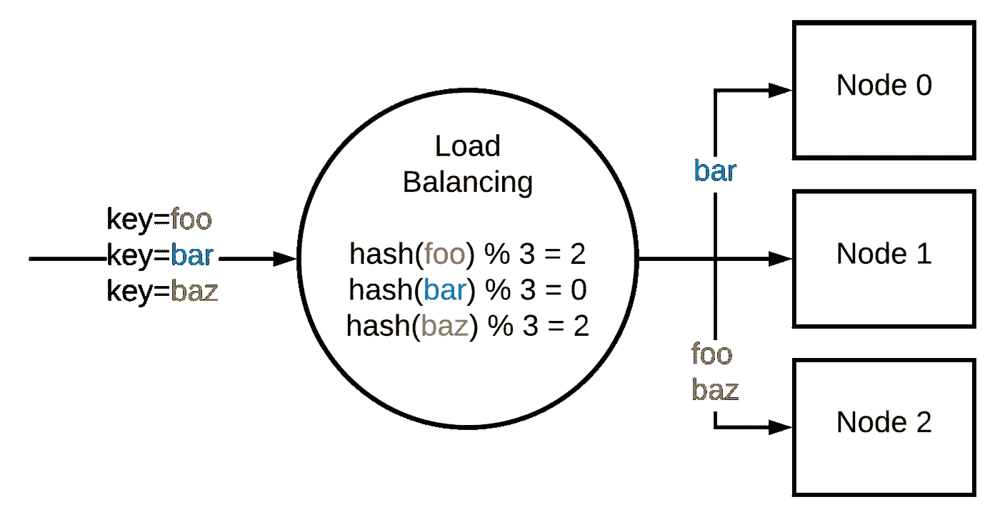
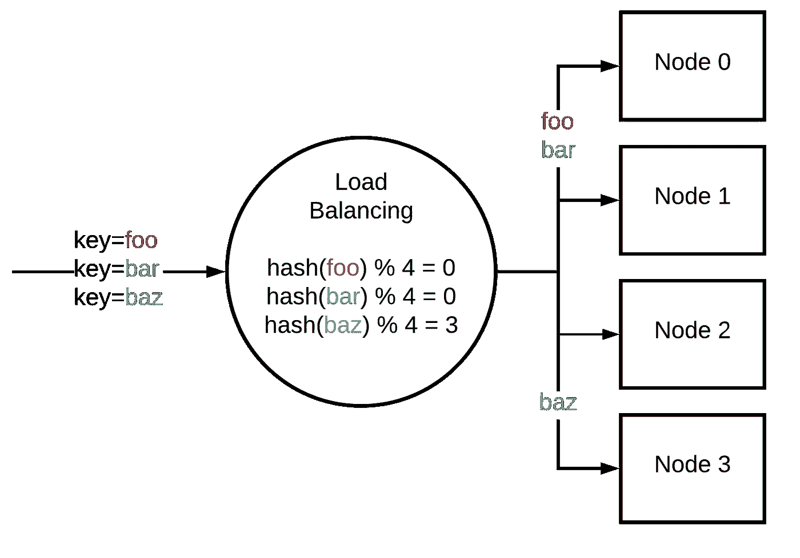
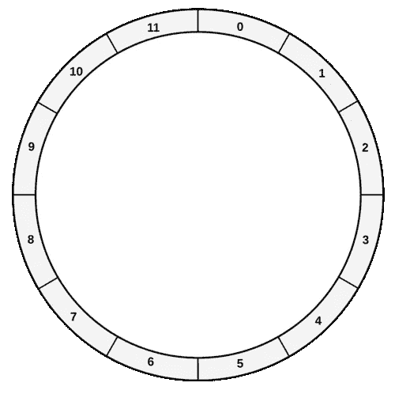
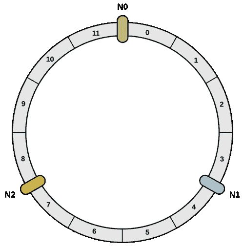
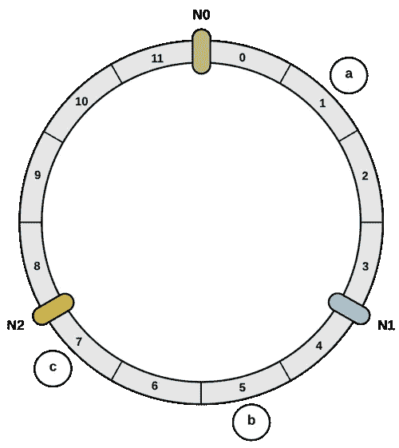
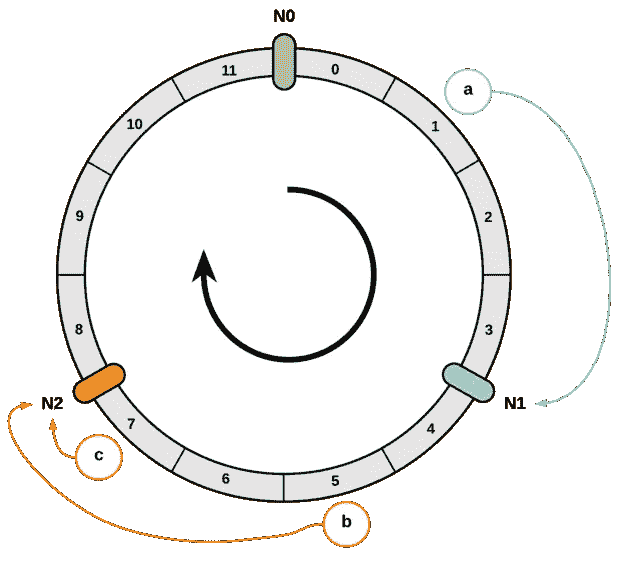
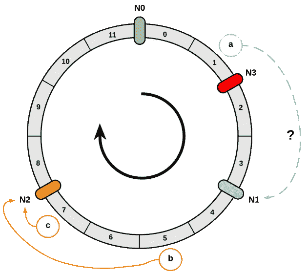
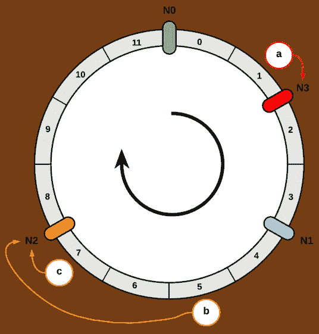
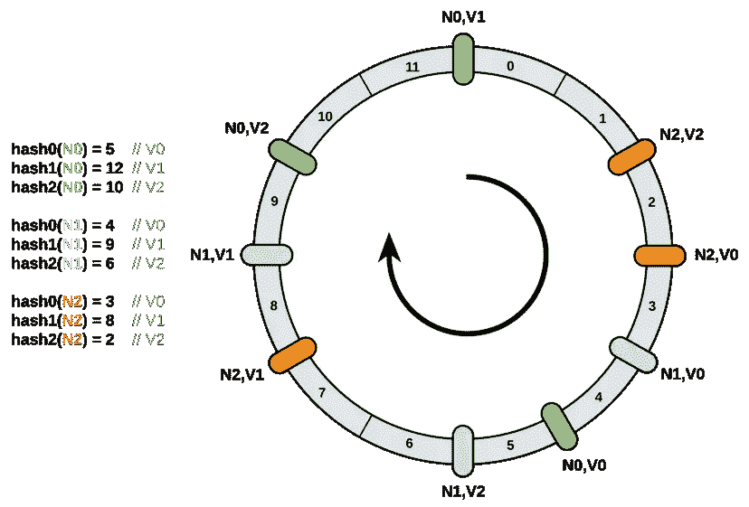

# 引入一致散列

> 原文：<https://itnext.io/introducing-consistent-hashing-9a289769052e?source=collection_archive---------1----------------------->

随着分布式架构的兴起，**一致哈希**成为主流。但是它到底是什么，它与标准散列算法有什么不同？背后的确切动机是什么？

首先，我们将描述主要概念。然后，我们将深入研究现有的算法，以了解与一致性哈希相关的挑战。

# 主要概念

## 散列法

哈希是**将任意大小的数据**映射到**固定大小的值**的过程。每个现有算法都有自己的规范:

*   MD5 生成 128 位哈希值。
*   SHA-1 产生 160 位散列值。
*   等等。

散列在计算机科学中有许多应用。例如，其中一个应用程序称为校验和。为了验证数据集的完整性，可以使用哈希算法。服务器对数据集进行哈希运算，并向客户端指示哈希值。然后，客户端对其版本的数据集进行哈希处理，并比较哈希值。如果它们相等，完整性**应该**被验证。

这里的“应该”很重要。最坏的情况是当**碰撞**发生时。冲突是指两个不同的数据片段具有相同的哈希值。让我们通过定义下面的散列函数来举一个现实生活中的例子:给定一个人，它返回他的生日(出生月份的第&天)。[生日悖论](https://en.wikipedia.org/wiki/Birthday_problem)告诉我们，如果一个房间里只有 23 个人，两个人同一天生日的概率(因此发生冲突)超过 50%。所以生日函数很可能不是一个好的哈希函数。

糟糕的散列函数

作为散列法的快速介绍，理解其主要思想是关于在**域**中传播值是很重要的。例如:

*   MD5 将值分布在 128 位的空间域中
*   一个由 32 个元素组成的数组支持的哈希表(或 hashmap)有一个内部哈希函数，可以将值分布到任何索引(从 0 到 31)。

## 负载分布

负载分布可以定义为在节点间分配负载的过程。这里的术语节点可以与服务器或实例互换。这是一个计算单元。

**负载平衡**是负载分配的一个例子。它是关于在一组资源上分配一组任务。例如，我们使用负载平衡在 web 服务器实例之间分配 API 请求。

说到数据，我们更愿意使用术语**分片**。数据库碎片是数据库中数据的水平分区。一个典型的例子是一个分成三个碎片的数据库，其中每个碎片都有全部数据的一个子集。

负载平衡和分片面临一些共同的挑战。例如，均匀地分布数据**以保证一个节点与其他节点相比不会过载。在某些情况下，负载平衡和分片还需要将任务或数据关联到同一个节点:**

*   **如果我们需要序列化、逐个处理给定消费者的操作，我们必须将请求路由到同一个节点。**
*   **如果我们需要分发数据，我们必须知道哪个碎片是特定键的所有者。**

**听起来耳熟吗？在这两个例子中，我们将值分布在一个域中。无论是分散到服务器节点的任务还是分散到数据库碎片的数据，我们都可以找到与散列相关的思想。这就是为什么散列可以与负载分布结合使用的原因。让我们看看怎么做。**

## **Mod-n 散列**

**mod-n 哈希的原理如下。使用哈希函数对每个键进行哈希运算，将输入转换为整数。然后，我们基于节点的数量执行模运算。**

**让我们看一个有 3 个节点的具体例子。这里，我们需要根据一个密钥标识符在这些节点之间分配负载。对每个密钥进行哈希运算，然后我们执行模运算:**

****

**这种方法的好处是它的无状态性。我们不必保持任何状态来提醒我们`foo`被路由到节点 2。然而，我们需要知道有多少节点被配置为应用模运算。**

**那么，在向外扩展或向内扩展(添加或删除节点)的情况下，该机制是如何工作的呢？如果我们添加另一个节点，模运算现在基于 4 而不是 3:**

****

**正如我们所看到的，键`foo`和`baz`不再与同一个节点相关联。使用 mod-n 散列，不能保证在键/节点关联中保持任何一致性。这是个问题吗？有可能。**

**如果我们实现一个使用分片并基于 mod-n 策略来分发数据的数据存储库会怎么样？如果我们扩展节点的数量，我们需要执行一个**再平衡**操作。在前面的示例中，重新平衡意味着:**

*   **将`foo`从节点 2 移动到节点 0。**
*   **将`baz`从节点 2 移动到节点 3。**

**现在，如果我们存储了数百万甚至数十亿的数据，并且我们需要重新平衡几乎所有数据，会发生什么？我们可以想象，这将是一个沉重的过程。因此，我们必须改变我们的负载分配技术，以确保在重新平衡时:**

*   **基于新的节点数量，分布尽可能保持一致。**
*   **我们必须迁移的密钥数量应该是有限的。理想情况下，它将只占键的 1/n，其中 *n* 是节点的数量。**

**这正是**一致散列**算法的目的。**

**“一致”这个词可能会让人有些困惑。我遇到过一些工程师，他们认为即使在面临可伸缩性的情况下，这种算法也会将一个给定的键与同一个节点关联起来。事实并非如此。它必须保持一致，直到某一点，以保持分布均匀。**

**现在，是时候探究一些解决方案了。**

# **会合点**

**Rendezvous 是解决我们问题的第一个算法。尽管发表于 1996 年的[原始研究](http://www.eecs.umich.edu/techreports/cse/96/CSE-TR-316-96.pdf)没有提到术语一致散列，但它确实为我们描述的挑战提供了一个解决方案。让我们看看 Go 中一个可能的实现:**

**它是如何工作的？我们遍历每个节点并计算它的哈希值。哈希值由一个`hash`函数返回，该函数根据一个键(我们的输入)和一个节点标识符产生一个整数(最简单的方法是对两个字符串的连接进行哈希运算)。然后，我们返回具有最高散列值的节点。这就是该算法也被称为最高随机权重哈希算法的原因。**

**rendezvous 的主要缺点是它的 O( *n* )时间复杂度，其中 *n* 是节点的数量。如果我们需要有限数量的节点，这是非常有效的。然而，如果我们开始维护数千个节点，可能会导致性能问题。**

# **环形一致散列**

**下一个算法是 1997 年由 Karger 等人在这篇[论文](https://dl.acm.org/doi/10.1145/258533.258660)中发布的。这项研究第一次提到了一致性哈希这个术语。**

**它基于环(端到端连接的阵列)。尽管这是最流行的一致性哈希算法(或者至少是最广为人知的)，但其原理并不总是被很好地理解。让我们深入研究一下。**

**第一个操作是创建环。戒指的长度是固定的。在我们的示例中，我们将其划分为 12 个部分:**

****

**然后，我们定位我们的节点。在我们的例子中，我们将定义`N0`、`N1`和`N2`。**

****

**节点暂时均匀分布。我们稍后将回到这一点。**

**然后，是时候看看如何表示键了。首先，我们需要一个函数`f`，它根据一个键返回一个环索引(从 0 到 11)。我们可以使用 mod-n 散列法。因为环的长度是恒定的，所以不会给我们带来任何问题。**

**在我们的例子中，我们将定义 3 个键:`a`、`b`和`c`。我们对每一个应用`f`。假设我们有以下结果:**

*   **`f(a) = 1`**
*   **`f(a) = 5`**
*   **`f(a) = 7`**

**因此，我们可以这样在戒指上放置钥匙:**

****

**我们如何将给定的键关联到一个节点？主要逻辑是**向前进**。从一个给定的键，我们返回前进时找到的第一个节点:**

****

**在这个例子中，我们将`a`关联到`N1`、`b`和`c`关联到`N2`。**

**现在，让我们看看**再平衡**是如何管理的。我们定义另一个节点`N3`。我们应该把它定位在哪里？整体分布不再有均匀的空间。是否应该重组节点？不，否则我们就不会一致了，不是吗？为了定位一个节点，我们重用我们介绍过的同一个散列函数`f`。它可以用节点标识符调用，而不是用键调用。所以新节点的位置是随机决定的。**

**于是出现了一个问题:当下一个节点不再是`N1`时，我们应该如何处理`a`:**

****

**解决方案如下:我们必须改变它的关联，并使`a`与`N3`相关联:**

****

**正如我们之前讨论的，一个理想的算法应该平均重新平衡 1/n 的键。在我们的例子中，当我们添加第四个节点时，我们应该将 25%的可能键重新关联到`N3`。是这样吗？**

*   **`N0`从索引 8 到 12:占总键的 33.3%**
*   **`N1`从索引 2 到 4:占总键的 16.6%**
*   **`N2`从索引 4 到 8:占总键的 33.3%**
*   **`N3`从索引 0 到 2:占总键的 16.6%**

**它的分布是不均匀的。我们如何改善这种情况？解决方法是使用**虚拟节点**。**

**假设我们不是在每个节点上放置一个点，而是放置三个点。此外，我们需要定义三个不同的散列函数。每个节点被散列三次，因此我们得到三个不同的索引:**

****

**我们可以通过向前移动来应用相同的算法。然而，一个关键字将与一个节点相关联，而不管它遇到的是哪个虚拟节点。**

**在这个例子中，分布如下:**

*   **`N0` : 33.3%**
*   **`N1` : 25%**
*   **`N2` : 41.6%**

**我们为每个节点定义的虚拟节点越多，分布就应该越均匀。平均而言，每台服务器有 100 个虚拟节点，标准分布约为 10%。以 1000 计，大概是 3.2%。**

**如果我们有不同大小的节点，这种机制也很有用。例如，如果一个节点被配置为理论上处理两倍于其他节点的负载，我们可以启动两倍的虚拟节点。**

**然而，虚拟节点的主要缺点是内存占用。如果我们必须处理成千上万台服务器，那就需要数兆字节的内存。**

**在继续之前，有趣的是，有时一个算法可以通过改变一小部分而得到实质性的改进。例如，谷歌在 2017 年发布的一种名为[的算法就是这种情况，该算法具有有界负载](https://ai.googleblog.com/2017/04/consistent-hashing-with-bounded-loads.html)。这个版本是基于我们描述的相同的环的想法。然而，他们的方法是在**任何更新**(添加/删除新的键或节点)时执行一个小的重新平衡。该版本在标准差方面优于原始版本，但代价是最坏的时间复杂度。**

# **跳转一致散列**

**2007 年，谷歌的两位工程师发表了[跳转一致哈希](https://arxiv.org/pdf/1406.2294.pdf)。与基于环的算法相比，这种实现*“不需要存储，速度更快，并且在桶之间均匀划分密钥空间以及在桶的数量变化时均匀划分工作负载方面做得更好”*。换句话说，它改善了工作负载在节点之间的分布(存储桶与节点是相同的概念),而没有任何内存开销。**

**下面是 C++中的算法(7 行代码🤯):**

**在环一致散列中，对于 1000 个虚拟节点，标准偏差约为 3.2%。在跳转一致散列中，我们不再需要虚拟节点的概念。然而，标准偏差仍然小于 0.0000001%。**

**但是有一个限制。节点必须按顺序编号**。例如，如果我们有一个服务器列表`foo`、`bar`和`baz`，我们就不能删除`bar`。然而，如果我们配置一个数据存储，我们可以应用算法来获得基于碎片总数的碎片索引。因此，跳转一致性哈希在分片的上下文中很有用，但在负载平衡的上下文中却没有用。****

# ****什么是完美一致的哈希算法？****

****现在我们已经有了一些一致散列的经验，让我们后退一步，看看什么是最完美的算法:****

*   ****平均而言，只有 1/n %的键会被重新映射，其中 *n* 是节点数。****
*   ****O( *n* )空间复杂度，其中 *n* 是节点的数量。****
*   ****每次节点插入/移除和每次关键字查找的时间复杂度为 O(1)。****
*   ****确保一个节点与另一个节点相比不会过载的最小标准偏差。****
*   ****它允许将权重与节点相关联，以应对不同的节点大小。****
*   ****它将允许任意节点名称(不按顺序编号)支持负载平衡和分片。****

****可惜这个算法不存在。基于我们所看到的:****

*   ****每次查找，Rendezvous 具有线性时间复杂度。****
*   ****环一致散列在没有虚拟节点概念的情况下具有较差的最小标准偏差。有了虚拟节点，is 空间复杂度为 O( *n*v* )，其中 *n* 为节点数， *v* 为每个节点的虚拟节点数。****
*   ****跳转一致散列不具有恒定的时间复杂度，并且不支持任意的节点名称。****

****这个话题仍然是开放的，最近有一些研究值得一看。比如 2005 年发布的[多探针一致哈希](https://arxiv.org/pdf/1505.00062.pdf)。它支持 O(1)空间复杂度。然而，为了实现ε的标准偏差，每次查找需要 O(1/ε)时间。例如，如果我们想要实现小于 0.5%的标准偏差，则需要散列密钥大约 20 次。因此，我们可以得到一个最小的标准偏差，但需要付出更高的查找时间复杂度。****

****************

****正如我们在引言中所说，一致的散列算法成为主流。现在在 MongoDB、Cassandra、Riak、Akka 等无数系统中使用。无论是在平衡负载还是分发数据的环境中。然而，在计算机科学中，每个解决方案都有权衡。****

****说到权衡，如果你需要跟进，你可能想看看 Damian gry ski[写的精彩帖子:](https://medium.com/u/3783299b75c8?source=post_page-----9a289769052e--------------------------------)****

**** [## 一致散列:算法权衡

### 喜欢这篇文章？给我买杯咖啡。

medium.com](https://medium.com/@dgryski/consistent-hashing-algorithmic-tradeoffs-ef6b8e2fcae8) 

其他一些值得一看的资源:

 [## 会合散列法

### 在任何类型的有状态分布式系统中，将一个键映射到一组机器的问题都很常见。即使…

medium.com](https://medium.com/i0exception/rendezvous-hashing-8c00e2fb58b0)  [## 使用新的一致性哈希算法改善负载平衡

### 在 Vimeo 的动态视频打包器中改进 HAProxy 负载平衡以获得更好的缓存局部性

medium.com](https://medium.com/vimeo-engineering-blog/improving-load-balancing-with-a-new-consistent-hashing-algorithm-9f1bd75709ed)****