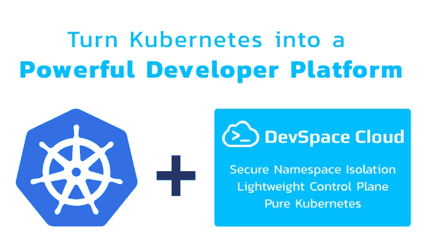
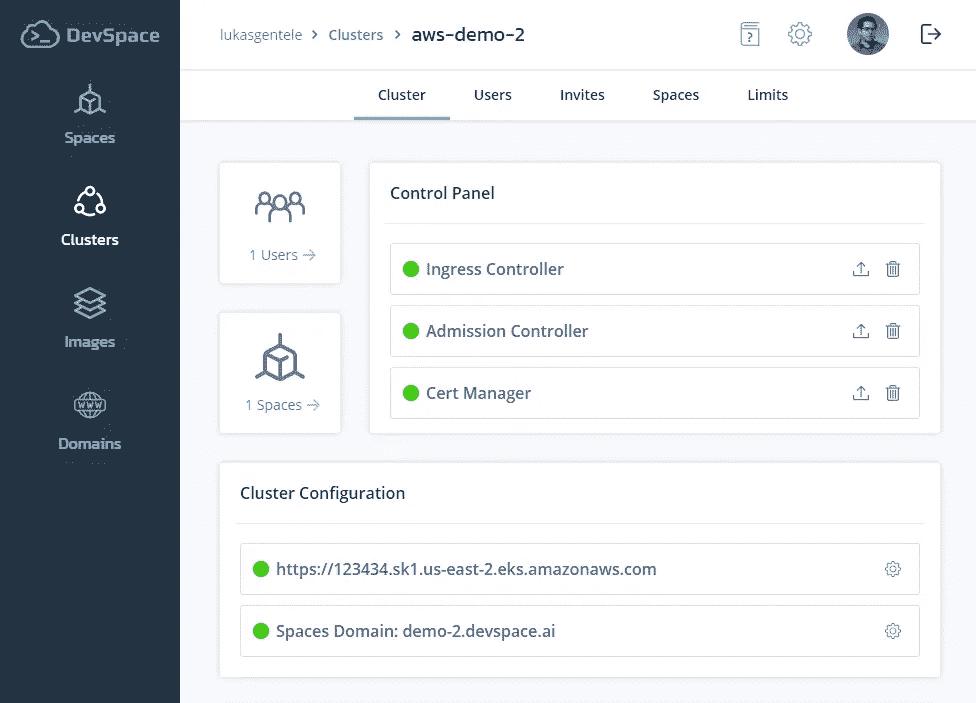
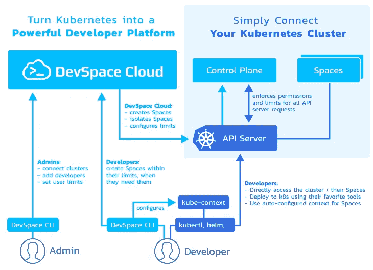
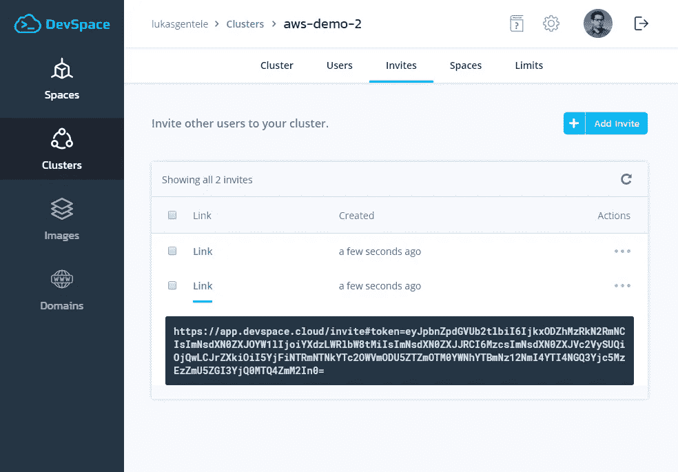
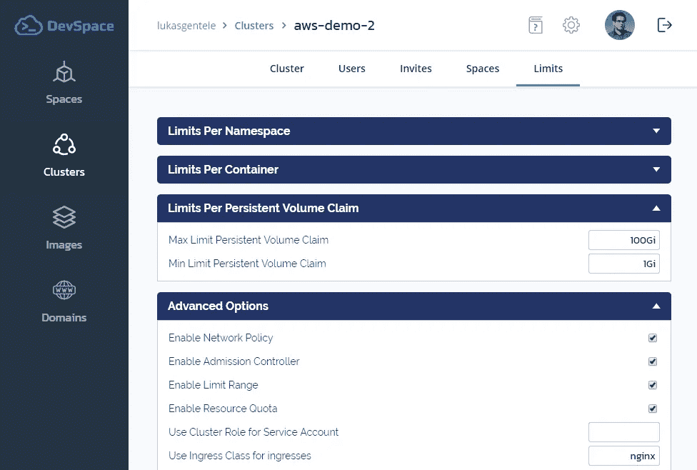
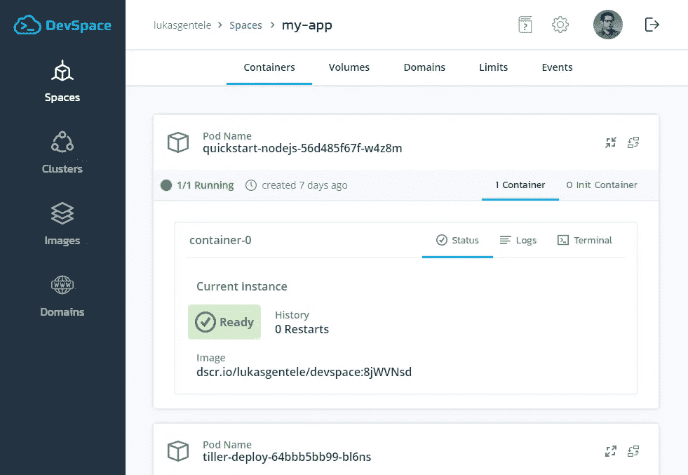

# 介绍 DevSpace Cloud:将 Kubernetes 变成一个强大的开发者平台

> 原文：<https://itnext.io/introducing-devspace-cloud-turn-any-kubernetes-cluster-into-a-powerful-developer-platform-9702ca2c89d5?source=collection_archive---------3----------------------->



2018 年 9 月，我们发布了我们的开源项目 [DevSpace CLI](https://github.com/devspace-cloud/devspace) ，作为一个客户端专用的命令行工具，用于改善 Kubernetes 的开发体验。从那时起，我们从云原生社区获得了许多积极且非常鼓舞人心的反馈。用户在聚会上和通过 Slack 等告诉我们的事情之一。在 Kubernetes 上接纳新的开发人员，有效地组织开发人员访问 Kubernetes，以及用 Kubernetes 管理开发人员团队仍然是巨大的难题。因此，我们决定建立 [DevSpace 云](http://devspace.cloud/)来解决这些问题。

今天，我很高兴地宣布 [DevSpace Cloud](http://devspace.cloud/) 推出测试版。本文解释了 DevSpace Cloud 解决的问题以及如何开始使用它。

# TL；速度三角形定位法(dead reckoning)

为您的开发团队提供对 Kubernetes 的访问是很困难的。

[DevSpace Cloud](http://devspace.cloud/) 让您只需一个命令就可以将任何 Kubernetes 集群转变为一个强大的开发人员平台，从而使事情变得更加简单:

```
$ devspace connect cluster? Please enter a cluster name (e.g. my-cluster) my-cluster? Which Kubernetes cluster do you want to connect? Select the kube context.
kubectl-context-1
kubectl-context-2
> current-kubect-context
kubectl-context-3...
```

[DevSpace Cloud](http://devspace.cloud/) 为您的集群添加了一个轻量级控制平面，并允许您通过一个中央管理 UI 来管理用户和权限。



截图 DevSpace Cloud:为您的集群配置控制平面

开发人员可以使用`devspace create space [space-name]`按需创建隔离的 Kubernetes 名称空间(=空间)，DevSpace Cloud 确保用户保持在他们的限制内，不能突破他们的空间。

在创建空间时，开源命令行工具 [DevSpace CLI](https://github.com/devspace-cloud/devspace) 会自动为空间添加一个 kubectl 上下文，这样开发者就可以方便地使用 kubectl、helm 等工具直接与 Kubernetes 进行交互。

# **为开发人员提供集群访问很难**

当看到 DevOps 的好处时，就不难理解为什么组织希望软件开发和 it 运营紧密集成:他们希望开发人员能够部署到目标基础架构，测试他们的应用程序是否按预期运行，并调试部署中的问题，而不是让开发人员构建一些东西并扔给系统管理员。

然而，当使用 Kubernetes 作为运行和扩展基于容器的应用程序的目标平台时，为开发人员提供安全和受控的 Kubernetes 访问并不容易。一般来说，为开发人员提供对 Kubernetes 的访问有两种流行的方法，这两种方法都有其缺点:

## **为开发人员创建单独的集群=高维护成本**

*   在大多数私有云场景中不可行
*   保持集群健康和最新的高维护性
*   对开发人员的工作没有集中控制
*   开发人员应该专注于代码，而不是因为成为他们开发集群的实际管理员而分心

## **共享一个发展集群=无政府状态**

*   管理多租户和隔离用户非常困难，需要设置 RBAC、服务帐户、网络策略、pod 安全策略等。
*   安全地实施用户限制和权限需要设置资源配额和配置限制范围
*   为开发人员创建和配置名称空间给管理员带来了手工劳动，并且会降低整个开发团队的速度
*   设置开发人员的机器需要手工操作

此外，这两种方法都有一个问题，即很难将集群访问权交给开发人员(例如，在每个开发人员的机器上设置 kubectl 上下文)，然后让他们使用 Kubernetes。

# 【DevSpace 云能帮上什么忙？

[DevSpace Cloud](http://devspace.cloud/) 允许您将任何 Kubernetes 集群转变为强大的开发人员平台。它适用于任何私有或公共云。



## [DevSpace Cloud](http://devspace.cloud/) 的工作原理是这样的:

1.  使用单一命令连接集群(参见下面的[入门](https://devspace.cloud/blog/2019/05/28/introducing-devspace-cloud-turn-kubernetes-into-a-powerful-developer-platform#getting-started-with-devspace-cloud)
2.  通过向用户发送邀请链接，将用户添加到群集
3.  通过直观的管理用户界面管理限制和权限
4.  让开发人员按需创建隔离的名称空间

DevSpace Cloud 允许集群管理员为开发人员提供对 Kubernetes 的安全、可控的访问。它允许开发人员按需创建名称空间，并为开发人员自动配置和管理 kubectl 上下文。系统管理员可以配置从计算资源限制到节点选择器和容忍度的一切。DevSpace Cloud 向 Kubernetes 集群添加了一个轻量级控制平面，确保开发人员不超出他们的限制。

## 主要特征

*   **中央用户&权限管理**
    DevSpace Cloud 为集群管理员提供了一个中央管理控制台。管理员可以使用它来管理集群用户，设置限制和权限，并控制开发人员在集群中的操作。
*   **安全的名称空间创建&隔离**
    借助开源命令行工具 DevSpace CLI，开发人员可以在任何需要的时候创建空间(=隔离的 Kubernetes 名称空间)。DevSpace Cloud 自动设置 RBAC、资源配额、网络策略、pod 安全策略等。隔离这些名称空间，并确保开发人员呆在他们的空间范围内。
*   **kubectl 的自动上下文处理**
    当开发人员使用 DevSpace CLI 创建一个空间时，它会自动为新创建的名称空间配置一个 ku bectl 上下文，并随着时间的推移更新该名称空间，例如当证书发生变化时。
*   **自动子域配置**
    DevSpace Cloud 会自动为每个空间生成并配置一个子域(+ Letsencrypt SSL 证书)，开发者可以在浏览器中轻松访问自己的应用。使用 DevSpace CLI 进行开发将额外提供通过端口转发经由本地主机的访问(了解关于使用 DevSpace CLI 进行开发的更多信息)。
*   **轻量级集群内控制平面**
    DevSpace Cloud 作为一项服务运行，只向您连接的每个集群添加一个非常轻量级的控制平面。它由准入控制器、入口控制器(可选)和证书管理器(可选)组成。
*   **多集群支持**
    管理组织内不同开发团队的多个集群，并根据需要共享对集群的访问。
*   **单一命令设置**
    连接您的 Kubernetes 集群并将其转变为强大的开发人员平台只需不到 5 分钟的时间(参见下面的[入门](https://devspace.cloud/blog/2019/05/28/introducing-devspace-cloud-turn-kubernetes-into-a-powerful-developer-platform#getting-started-with-devspace-cloud))。

## **安全性呢？**

DevSpace 云在设计上是安全的:

*   **群集访问令牌的加密密钥**
    DevSpace CLI 要求您指定加密密钥。这个密钥以散列的形式安全地存储在您的计算机上，不会存储在 DevSpace Cloud 中。连接集群时，DevSpace CLI 会生成一个服务帐户，使用您的加密密钥哈希对该帐户的访问令牌进行加密，然后将加密的令牌发送到 DevSpace Cloud。这意味着，当您提供加密密钥并运行操作时，DevSpace Cloud 只能访问您的集群。操作完成后，DevSpace Cloud 将无法访问您的群集，直到您运行另一个操作并再次提供您的加密密钥。
*   **无需 DevSpace Cloud**
    的直接集群访问任何 kubectl 命令或其他与 Kubernetes API 服务器的通信 ***都不会*** 触及 DevSpace Cloud。甚至是用户限制的实施等等。直接发生在您的 Kubernetes 集群内部的集群内控制平面中。

# **开发空间云入门**

## **1。正在安装 DevSpace CLI**

[DevSpace CLI](https://github.com/devspace-cloud/devspace) 是 DevSpace 云的开源命令行工具。您可以使用以下选项之一安装它:

**选项一:** [**NPM(推荐)**](https://gist.github.com/LukasGentele/b0e7d205068ce7b0f5e423b5a10ace81)

**选项二:** [**Mac 终端**](https://gist.github.com/LukasGentele/7f03c663216f0e3904d28736a29dda7a)

**选项三:**[**Linux Bash**](https://gist.github.com/LukasGentele/cc5dda8b06445c573db39297dc6cf064)

**选项 4:**[**Windows Powershell**](https://gist.github.com/LukasGentele/f0d0150f6c8f1bfd8ef5137265869f84)

## **2。将 Kubernetes 集群连接到 DevSpace 云**

## **3。管理用户&权限**



截图 DevSpace 云:通过生成邀请链接添加集群用户



截图 DevSpace 云:为集群用户设置默认限制



截图 DevSpace 云:查看您的空间中的窗格和容器

## **4。使用空格**

```
devspace create space [space-name]
```

命令行工具 DevSpace CLI 自动为每个空间创建一个新的 ku ectl 上下文，并使开发人员可以通过运行以下命令轻松地将当前的 ku ectl 上下文切换到现有的空间:

```
devspace use space [space-name]
```

如果开发人员不再需要空间，他们可以简单地删除它，DevSpace CLI 也将分别删除 kubectl 上下文:

```
devspace remove space [space-name]
```

除了使用 Spaces， [DevSpace CLI](https://github.com/devspace-cloud/devspace) 还可以用来定义应用程序应该如何部署到 Kubernetes。DevOps 工程师可以用声明性的`devspace.yaml`将这个部署过程存储在项目中，开发人员可以使用`devspace deploy`简单地部署项目，或者甚至使用`devspace dev`在 Kubernetes 集群中建立到编程 directl 的部署的实时连接。

## 了解更多信息:

*   [部署舵图、Kubernetes 载货清单等。使用 DevSpace CLI](https://devspace.cloud/docs/getting-started/deployment)
*   [使用 DevSpace CLI 直接在 Kubernetes 中开发云原生应用](https://devspace.cloud/docs/getting-started/development)

# **为什么使用 DevSpace 云？**

## **纯 Kubernetes，不含其他成分**

*   DevSpace Cloud 适用于任何 Kubernetes 集群，无论您想在集群中运行什么，例如 Istio、knative、custom operators 等。
*   用户直接与 Kubernetes 集群交互；因此，即使 DevSpace Cloud 宕机，开发人员也可以毫无问题地继续工作
*   用户与空间的交互方式与他们与常规名称空间的交互方式相同，所以所有您喜欢的 Kubernetes 工具(kubectl、helm、kustomize 等。)使用 DevSpace 云实现无缝工作

## **集群管理员的完全控制权**

*   通过 DevSpace Cloud UI 进行简单的用户和权限管理，并针对用户限制等提供广泛的配置选项。
*   自动化手动任务，如 RBAC 配置、pod 安全策略、网络策略、资源配额等。

## **面向开发人员的灵活自助服务**

*   按需空间创建和隔离(包括子域+ SSL)
*   kubectl 上下文的自动处理
*   减少管理员的管理和支持工作

# 结论

DevSpace Cloud 允许集群管理员为开发人员提供对 Kubernetes 的安全、可控的访问。通过隔离 Kubernetes 名称空间和用于管理用户和权限的中央控制面板，DevSpace Cloud 提供了一切来减少开发阶段设置多租户 Kubernetes 集群的人工工作。

DevSpace Cloud 允许你免费连接一个 Kubernetes 集群。在公测中，我们通常允许连接三个集群，每个集群最多有十个合作者。如果您希望连接更多的集群或添加更多的合作者，请在 [Slack](https://devspace.cloud/slack) 上 ping 我或给我发电子邮件: [lg@devspace.cloud](mailto:lg@devspace.cloud)

我也很高兴您对 DevSpace CLI 或 DevSpace Cloud 有任何反馈。如果您在设置方面有任何问题，或者您可能需要在团队中有效地与 DevSpace 合作，那么请联系我们。

**想在本地运行 DevSpace 云吗？**
我们目前正在开发企业版的 DevSpace Cloud，它可以完全在内部运行。如果你想加入提前访问名单，请给我发邮件: [lg@devspace.cloud](mailto:lg@devspace.cloud)

*原发布于*[*https://dev space . cloud*](https://devspace.cloud/blog/2019/05/28/introducing-devspace-cloud-turn-kubernetes-into-a-powerful-developer-platform)*。*