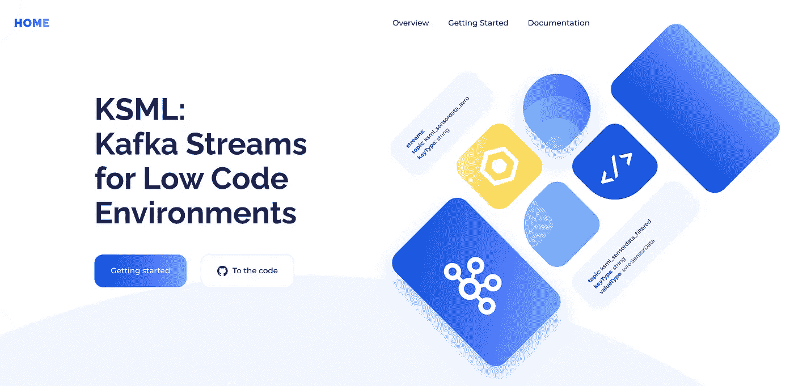

# 介绍 KSML:适用于低代码环境的 Kafka 流

> 原文：<https://itnext.io/introducing-ksml-kafka-streams-for-low-code-environments-1f813ee69a14?source=collection_archive---------5----------------------->

Kafka Streams 吸引了许多希望在 Kafka 基础上开发流媒体应用程序的开发人员。但是尽管框架很强大，Kafka Streams 还是很难避开编写 Java 代码和建立构建管道的要求。有一些重建 Kafka 流的尝试，但是直到现在像 Python 这样的流行语言还没有得到同样强大的(和维护的)流处理框架。在这篇文章中，我们将提出一个新的声明性方法来解锁 Kafka 流，称为 KSML。当你读完的时候，你将能够自己编写流应用程序，只需要使用一些简单的基本规则和 Python 代码片段。



# 背景

Axual 是面向企业客户的基于 Kafka 的流媒体平台供应商。在 Axual Platform 和 Axual Cloud 的名称下，我们主要向企业客户销售我们的解决方案。我们的总体使命是让流媒体变得简单，这意味着我们的产品试图为客户隐藏卡夫卡的复杂性。我们通过提供标准方法、标准化架构和简单安装来实现这一目标。更多关于 Axual 的信息，请访问[https://axual.com](https://axual.com/)。

Axual 产品的一个主要特点是为开发团队提供自助服务。直观的 UI 允许客户团队配置他们的通用 Kafka 平台。团队自己定义主题、模式和应用程序。严格的所有权和批准流程为企业提供了必要的数据治理。

自助服务的用户通常不太懂卡夫卡。他们了解 Kafka，甚至可能喜欢它，但他们的主要职责是构建一个恰好需要与 Kafka 交互的业务应用程序。自助服务允许他们将自己的应用程序定义为自定义应用程序或 Kafka 连接器。但直到最近，我们还没有办法轻松定义“简单转换”应用。Kafka Streams 提供了流处理的基础，但是需要 Java 开发人员和(通常很复杂)构建管道。

为了更容易定义流媒体应用，我们开始研究是否可以在不需要 Java 的情况下释放 Kafka 流的力量。

# 来自家庭助理的灵感


在新冠肺炎封锁期间，我开始试验[家庭助手](https://home-assistant.io/)，这是一个家庭自动化平台，集成了你家里的一切*和*厨房水槽。如果你对家庭自动化感兴趣，我强烈推荐你看看这个巨大的软件。

为了允许集成和控制来自任何供应商的任何类型的设备，Home Assistant 为自动化、脚本和传感器等定义了自己的 YAML 结构。YAML 真正的好处在于它是被解释的，不需要编译。

# 假设

Home Assistant 定义定制逻辑的方式引发了我们的思考:我们可以使用类似的结构来定义 Kafka Streams 拓扑吗？很容易按照以下方式来想象拓扑:

```
pipelines:
  main:
    from: some_topic
    to: some_other_topic
```

这个例子定义了一个拓扑，它只是将消息从源主题复制到目标主题。但任何熟悉卡夫卡作品的人都会立即意识到，这只能是整体解决方案的一部分。Kafka Streams 在 Java 中需要很多自定义的用户函数，比如谓词、键/值转换器和 ValueJoiners。如果我们想定义 YAML 的一切，我们需要一种无编译器的表达式语言。

然后我们转向了 [Jython](https://www.jython.org/) ，这是一个运行在 Java JVM 中的完整 Python 实现。运行 Python 代码就像创建 PythonInterpreter 的实例并让它执行以字符串形式提供的代码一样简单。

```
import org.python.util.PythonInterpreter;public class JythonHelloWorld {
  public static void main(String[] args) {
    try(PythonInterpreter pyInterp = new PythonInterpreter()) {
      pyInterp.exec("print('Hello Python World!')");
    }
  }
}
```

经过几天的修补，我们能够将这两者结合成我们预想的通用解释器。在深入例子之前，让我们看一下我们使用的测试环境。

# 设置测试环境

为了说明 KSML 的能力，我们设置了一个名为`ksml_sensordata_avro`的测试主题，其键/值类型为`String` / `SensorData`。`SensorData`模式包含以下字段:

```
{
  "namespace": "io.axual.ksml.example",
  "doc": "Emulated sensor data with a few additional attributes",
  "name": "SensorData",
  "type": "record",
  "fields": [
    {
      "doc": "The name of the sensor",
      "name": "name",
      "type": "string"
    },
    {
      "doc": "The timestamp of the sensor reading",
      "name": "timestamp",
      "type": "long"
    },
    {
      "doc": "The value of the sensor, represented as string",
      "name": "value",
      "type": "string"
    },
    {
      "doc": "The type of the sensor",
      "name": "type",
      "type": {
        "name": "SensorType",
        "type": "enum",
        "symbols": [
          "AREA",
          "HUMIDITY",
          "LENGTH",
          "STATE",
          "TEMPERATURE"
        ]
      }
    },
    {
      "doc": "The unit of the sensor",
      "name": "unit",
      "type": "string"
    },
    {
      "doc": "The color of the sensor",
      "name": "color",
      "type": [
        "null",
        "string"
      ],
      "default": null
    },
    {
      "doc": "The city of the sensor",
      "name": "city",
      "type": [
        "null",
        "string"
      ],
      "default": null
    },
    {
      "doc": "The owner of the sensor",
      "name": "owner",
      "type": [
        "null",
        "string"
      ],
      "default": null
    }
  ]
}
```

接下来，我们创建了一个生成器，它生成随机的测试数据并在主题上生成它。我们将省略这个生成器的细节，但是您可以假设它只是用从一个可能值列表中选取的随机值填充所有字段。

因此，没有任何进一步的延迟，让我们看看 KSML 如何允许我们处理这些数据。

# 实践中的 KSML

**例 1。检查主题数据**

第一个例子是我们检查特定主题的数据。定义如下:

```
streams:
  - topic: ksml_sensordata_avro
    keyType: string
    valueType: avro:SensorDatafunctions:
  print_message:
    type: forEach
    code: "print('key='+(key if isinstance(key,str) else str(key))+', value='+(value if isinstance(value,str) else str(value)))"pipelines:
  main:
    from: ksml_sensordata_avro
    forEach: print_message
```

让我们一次一个元素地剖析这个定义。在定义处理逻辑之前，我们首先定义定义所使用的流。在这种情况下，我们定义了`ksml_sensordata_avro`，如上所述，它具有`string`键和`SensorData`值。

接下来是处理逻辑可以使用的功能列表。这里我们只定义了一个函数`print_message`，它只是将消息的键和值打印到 stdout。

第三个元素`pipelines`定义了真正的处理逻辑。我们定义了一个名为`main`的管道，它从`ksml_sensordata_avro`获取消息，并将它们传递给`print_message`。

定义文件由 KSML 解析，并转换成 Kafka Streams 拓扑，如下[所述:](https://kafka.apache.org/27/javadoc/org/apache/kafka/streams/Topology.html#describe--)

```
Sub-topology: 0
    Source: KSTREAM-SOURCE-0000000000 (topics: [ksml_sensordata_avro])
      --> KSTREAM-FOREACH-0000000001
    Processor: KSTREAM-FOREACH-0000000001 (stores: [])
      --> none
      <-- KSTREAM-SOURCE-0000000000
```

生成的拓扑的输出如下所示:

```
key=sensor0, value={'owner': 'Evan', 'color': 'red', 'city': 'Xanten', '@type': 'io.axual.ksml.example.SensorData', 'type': 'AREA', 'unit': 'ft2', 'name': 'sensor0', 'value': '225', 'timestamp': 1620217832071L}
key=sensor1, value={'owner': 'Charlie', 'color': 'red', 'city': 'Alkmaar', '@type': 'io.axual.ksml.example.SensorData', 'type': 'HUMIDITY', 'unit': '%', 'name': 'sensor1', 'value': '86', 'timestamp': 1620217833268L}
key=sensor2, value={'owner': 'Dave', 'color': 'red', 'city': 'Alkmaar', '@type': 'io.axual.ksml.example.SensorData', 'type': 'HUMIDITY', 'unit': 'g/m3', 'name': 'sensor2', 'value': '89', 'timestamp': 1620217833269L}
key=sensor3, value={'owner': 'Charlie', 'color': 'white', 'city': 'Amsterdam', '@type': 'io.axual.ksml.example.SensorData', 'type': 'LENGTH', 'unit': 'm', 'name': 'sensor3', 'value': '392', 'timestamp': 1620217833269L}
key=sensor4, value={'owner': 'Dave', 'color': 'red', 'city': 'Xanten', '@type': 'io.axual.ksml.example.SensorData', 'type': 'LENGTH', 'unit': 'ft', 'name': 'sensor4', 'value': '459', 'timestamp': 1620217833270L}
key=sensor5, value={'owner': 'Bob', 'color': 'red', 'city': 'Alkmaar', '@type': 'io.axual.ksml.example.SensorData', 'type': 'TEMPERATURE', 'unit': 'C', 'name': 'sensor5', 'value': '466', 'timestamp': 1620217833270L}
key=sensor6, value={'owner': 'Dave', 'color': 'red', 'city': 'Amsterdam', '@type': 'io.axual.ksml.example.SensorData', 'type': 'HUMIDITY', 'unit': 'g/m3', 'name': 'sensor6', 'value': '37', 'timestamp': 1620217833270L}
key=sensor7, value={'owner': 'Evan', 'color': 'red', 'city': 'Alkmaar', '@type': 'io.axual.ksml.example.SensorData', 'type': 'TEMPERATURE', 'unit': 'F', 'name': 'sensor7', 'value': '704', 'timestamp': 1620217833271L}
key=sensor8, value={'owner': 'Dave', 'color': 'red', 'city': 'Leiden', '@type': 'io.axual.ksml.example.SensorData', 'type': 'STATE', 'unit': 'state', 'name': 'sensor8', 'value': 'on', 'timestamp': 1620217833271L}
key=sensor9, value={'owner': 'Dave', 'color': 'black', 'city': 'Leiden', '@type': 'io.axual.ksml.example.SensorData', 'type': 'HUMIDITY', 'unit': 'g/m3', 'name': 'sensor9', 'value': '67', 'timestamp': 1620217833272L}
key=sensor0, value={'owner': 'Evan', 'color': 'blue', 'city': 'Utrecht', '@type': 'io.axual.ksml.example.SensorData', 'type': 'TEMPERATURE', 'unit': 'F', 'name': 'sensor0', 'value': '2', 'timestamp': 1620217833272L}
key=sensor1, value={'owner': 'Alice', 'color': 'black', 'city': 'Amsterdam', '@type': 'io.axual.ksml.example.SensorData', 'type': 'LENGTH', 'unit': 'm', 'name': 'sensor1', 'value': '126', 'timestamp': 1620217833272L}
key=sensor2, value={'owner': 'Charlie', 'color': 'white', 'city': 'Xanten', '@type': 'io.axual.ksml.example.SensorData', 'type': 'HUMIDITY', 'unit': '%', 'name': 'sensor2', 'value': '58', 'timestamp': 1620217833273L}
```

如您所见，应用程序的输出正是我们在`print_message`函数中定义的内容，即主题中所有数据的转储。

**例二。将数据复制到另一个主题**

现在我们可以看到主题上有什么数据，我们将开始操纵它的路由。在本例中，我们将未修改的数据复制到辅助主题:

```
streams:
  - topic: ksml_sensordata_avro
    keyType: string
    valueType: avro:SensorData
  - topic: ksml_sensordata_copy
    keyType: string
    valueType: avro:SensorDatafunctions:
  print_message:
    type: forEach
    code: "print('key='+(key if isinstance(key,str) else str(key))+', value='+(value if isinstance(value,str) else str(value)))"pipelines:
  main:
    from: ksml_sensordata_avro
    via:
      - type: peek
        forEach: print_message
    to: ksml_sensordata_copy
```

您可以看到，在本例中，我们指定了第二个主题，作为所有消息复制到的目标主题。`print_message`功能不变，但是流水线确实发生了一些变化。这里引入两个新元素，分别是`via`和`to`。

`via`标签允许用户定义对数据执行的一系列操作。在这种情况下，只有一个操作，即`peek`操作，它不修改任何数据，只是在 stdout 上输出数据作为副作用。

`to`操作是所谓的“下沉操作”。接收器操作总是管道中的最后一个。将管道传递给接收器操作后，管道的处理不再继续。注意，在上面的第一个例子中，`forEach`也是一个接收操作，而在这个例子中，我们通过将`print_message`函数作为参数传递给`peek`操作来获得相同的结果。

当 KSML 翻译这个定义时，会创建以下 Kafka Streams 拓扑:

```
Sub-topology: 0
    Source: KSTREAM-SOURCE-0000000000 (topics: [ksml_sensordata_copy])
      --> none Sub-topology: 1
    Source: KSTREAM-SOURCE-0000000001 (topics: [ksml_sensordata_avro])
      --> KSTREAM-PEEK-0000000002
    Processor: KSTREAM-PEEK-0000000002 (stores: [])
      --> KSTREAM-SINK-0000000003
      <-- KSTREAM-SOURCE-0000000001
    Sink: KSTREAM-SINK-0000000003 (topic: ksml_sensordata_copy)
      <-- KSTREAM-PEEK-0000000002
```

输出类似于示例 1，但是现在在`ksml_sensordata_copy`主题上也可以找到相同的数据。

**例 3。过滤数据**

现在我们可以读写数据了，让我们看看是否可以将一些逻辑应用到处理中。在本例中，我们将根据值的内容过滤数据:

```
streams:
  - topic: ksml_sensordata_avro
    keyType: string
    valueType: avro:SensorData
  - topic: ksml_sensordata_filtered
    keyType: string
    valueType: avro:SensorDatafunctions:
  print_message:
    type: forEach
    code: "print('key='+(key if isinstance(key,str) else str(key))+', value='+(value if isinstance(value,str) else str(value)))" filter_message:
    type: predicate
    expression: value['color'] == 'blue'pipelines:
  main:
    from: ksml_sensordata_avro
    via:
      - type: filter
        predicate: filter_message
      - type: peek
        forEach: print_message
    to: ksml_sensordata_filtered
```

同样，首先我们定义处理中涉及的流和函数。您可以看到我们添加了一个名为`filter_message`的新函数，它根据消息值中的`color`字段返回`true`或`false`。这个函数在下面的管道中使用。

该流水线被扩展为包括一个`filter`操作，该操作将一个`predicate`函数作为参数。每个输入消息都会调用这个函数。只有函数返回`true`的消息才会被传播。所有其他消息都将被丢弃。

使用这个定义，KSML 生成以下 Kafka Streams 拓扑:

```
Sub-topology: 0
    Source: KSTREAM-SOURCE-0000000000 (topics: [ksml_sensordata_avro])
      --> KSTREAM-FILTER-0000000002
    Processor: KSTREAM-FILTER-0000000002 (stores: [])
      --> KSTREAM-PEEK-0000000003
      <-- KSTREAM-SOURCE-0000000000
    Processor: KSTREAM-PEEK-0000000003 (stores: [])
      --> KSTREAM-SINK-0000000004
      <-- KSTREAM-FILTER-0000000002
    Sink: KSTREAM-SINK-0000000004 (topic: ksml_sensordata_filtered)
      <-- KSTREAM-PEEK-0000000003 Sub-topology: 1
    Source: KSTREAM-SOURCE-0000000001 (topics: [ksml_sensordata_filtered])
      --> none
```

当它执行时，我们会看到以下输出:

```
key=sensor0, value={'owner': 'Evan', 'color': 'blue', 'city': 'Utrecht', '@type': 'io.axual.ksml.example.SensorData', 'type': 'TEMPERATURE', 'unit': 'F', 'name': 'sensor0', 'value': '2', 'timestamp': 1620217833272L}
key=sensor4, value={'owner': 'Bob', 'color': 'blue', 'city': 'Amsterdam', '@type': 'io.axual.ksml.example.SensorData', 'type': 'STATE', 'unit': 'state', 'name': 'sensor4', 'value': 'on', 'timestamp': 1620217833273L}
key=sensor5, value={'owner': 'Bob', 'color': 'blue', 'city': 'Amsterdam', '@type': 'io.axual.ksml.example.SensorData', 'type': 'HUMIDITY', 'unit': '%', 'name': 'sensor5', 'value': '14', 'timestamp': 1620217833277L}
key=sensor6, value={'owner': 'Charlie', 'color': 'blue', 'city': 'Alkmaar', '@type': 'io.axual.ksml.example.SensorData', 'type': 'STATE', 'unit': 'state', 'name': 'sensor6', 'value': 'off', 'timestamp': 1620217833278L}
key=sensor7, value={'owner': 'Bob', 'color': 'blue', 'city': 'Utrecht', '@type': 'io.axual.ksml.example.SensorData', 'type': 'AREA', 'unit': 'ft2', 'name': 'sensor7', 'value': '292', 'timestamp': 1620217833278L}
key=sensor4, value={'owner': 'Charlie', 'color': 'blue', 'city': 'Amsterdam', '@type': 'io.axual.ksml.example.SensorData', 'type': 'HUMIDITY', 'unit': '%', 'name': 'sensor4', 'value': '72', 'timestamp': 1620217833280L}
key=sensor5, value={'owner': 'Evan', 'color': 'blue', 'city': 'Leiden', '@type': 'io.axual.ksml.example.SensorData', 'type': 'LENGTH', 'unit': 'm', 'name': 'sensor5', 'value': '876', 'timestamp': 1620217833281L}
key=sensor8, value={'owner': 'Alice', 'color': 'blue', 'city': 'Utrecht', '@type': 'io.axual.ksml.example.SensorData', 'type': 'STATE', 'unit': 'state', 'name': 'sensor8', 'value': 'off', 'timestamp': 1620217833282L}
key=sensor1, value={'owner': 'Evan', 'color': 'blue', 'city': 'Alkmaar', '@type': 'io.axual.ksml.example.SensorData', 'type': 'LENGTH', 'unit': 'm', 'name': 'sensor1', 'value': '952', 'timestamp': 1620217833282L}
key=sensor2, value={'owner': 'Bob', 'color': 'blue', 'city': 'Leiden', '@type': 'io.axual.ksml.example.SensorData', 'type': 'TEMPERATURE', 'unit': 'F', 'name': 'sensor2', 'value': '602', 'timestamp': 1620217833286L}
```

如您所见，过滤操作完成了它的工作。只有字段`color`设置为`blue`的消息被传递给`peek`操作，而其他消息被丢弃。

**例 4。分支消息**

另一种过滤消息的方法是使用`branch`操作。这也是一个接收器操作，它关闭管道的处理。在这方面，它与`forEach`和`to`相似，但具有不同的定义和行为。

```
streams:
  - topic: ksml_sensordata_avro
    keyType: string
    valueType: avro:SensorData
  - topic: ksml_sensordata_blue
    keyType: string
    valueType: avro:SensorData
  - topic: ksml_sensordata_red
    keyType: string
    valueType: avro:SensorDatafunctions:
  print_message:
    type: forEach
    code: "print('key='+(key if isinstance(key,str) else str(key))+', value='+(value if isinstance(value,str) else str(value)))"pipelines:
  main:
    from: ksml_sensordata_avro
    via:
      - type: peek
        forEach: print_message
    branch:
      - if:
          expression: value['color'] == 'blue'
        to: ksml_sensordata_blue
      - if:
          expression: value['color'] == 'red'
        to: ksml_sensordata_red
      - forEach:
          code: |
            print('Unknown color sensor: '+str(value))
```

`branch`操作将一个分支列表作为参数，每个分支指定一个自己的处理管道。分支包含关键字`if`，它采用一个谓词函数来确定消息是否将流入该特定分支，或者是否将被传递到下一个分支。每条消息将只在一个分支中结束，即第一个分支，其中`if`谓词函数返回`true`。

在本例中，我们看到第一个分支将仅由`color`字段设置为`blue`的消息填充。一旦到达那里，这些消息将被写入`ksml_sensordata_blue`。第二个分支将只包含带有`color` = `red`的消息，这些消息将被写入`ksml_sensordata_red`。最后，最后一个分支输出颜色未知的消息，并结束任何进一步的处理。

KSML 将该定义转换为以下 Kafka Streams 拓扑:

```
Sub-topology: 0
    Source: KSTREAM-SOURCE-0000000000 (topics: [ksml_sensordata_blue])
      --> none Sub-topology: 1
    Source: KSTREAM-SOURCE-0000000001 (topics: [ksml_sensordata_red])
      --> none Sub-topology: 2
    Source: KSTREAM-SOURCE-0000000002 (topics: [ksml_sensordata_avro])
      --> KSTREAM-PEEK-0000000003
    Processor: KSTREAM-PEEK-0000000003 (stores: [])
      --> KSTREAM-BRANCH-0000000004
      <-- KSTREAM-SOURCE-0000000002
    Processor: KSTREAM-BRANCH-0000000004 (stores: [])
      --> KSTREAM-BRANCHCHILD-0000000005, KSTREAM-BRANCHCHILD-0000000006, KSTREAM-BRANCHCHILD-0000000007
      <-- KSTREAM-PEEK-0000000003
    Processor: KSTREAM-BRANCHCHILD-0000000005 (stores: [])
      --> KSTREAM-SINK-0000000008
      <-- KSTREAM-BRANCH-0000000004
    Processor: KSTREAM-BRANCHCHILD-0000000006 (stores: [])
      --> KSTREAM-SINK-0000000009
      <-- KSTREAM-BRANCH-0000000004
    Processor: KSTREAM-BRANCHCHILD-0000000007 (stores: [])
      --> KSTREAM-FOREACH-0000000010
      <-- KSTREAM-BRANCH-0000000004
    Processor: KSTREAM-FOREACH-0000000010 (stores: [])
      --> none
      <-- KSTREAM-BRANCHCHILD-0000000007
    Sink: KSTREAM-SINK-0000000008 (topic: ksml_sensordata_blue)
      <-- KSTREAM-BRANCHCHILD-0000000005
    Sink: KSTREAM-SINK-0000000009 (topic: ksml_sensordata_red)
      <-- KSTREAM-BRANCHCHILD-0000000006
```

很明显，KSML 在拓扑中集成了分支操作。它的输出如下所示:

```
key=sensor0, value={'owner': 'Evan', 'color': 'red', 'city': 'Xanten', '@type': 'io.axual.ksml.example.SensorData', 'type': 'AREA', 'unit': 'ft2', 'name': 'sensor0', 'value': '225', 'timestamp': 1620217832071L}
key=sensor1, value={'owner': 'Charlie', 'color': 'red', 'city': 'Alkmaar', '@type': 'io.axual.ksml.example.SensorData', 'type': 'HUMIDITY', 'unit': '%', 'name': 'sensor1', 'value': '86', 'timestamp': 1620217833268L}
key=sensor2, value={'owner': 'Dave', 'color': 'red', 'city': 'Alkmaar', '@type': 'io.axual.ksml.example.SensorData', 'type': 'HUMIDITY', 'unit': 'g/m3', 'name': 'sensor2', 'value': '89', 'timestamp': 1620217833269L}
key=sensor3, value={'owner': 'Charlie', 'color': 'white', 'city': 'Amsterdam', '@type': 'io.axual.ksml.example.SensorData', 'type': 'LENGTH', 'unit': 'm', 'name': 'sensor3', 'value': '392', 'timestamp': 1620217833269L}
Unknown color sensor: {'owner': 'Charlie', 'color': 'white', 'city': 'Amsterdam', '@type': 'io.axual.ksml.example.SensorData', 'type': 'LENGTH', 'unit': 'm', 'name': 'sensor3', 'value': '392', 'timestamp': 1620217833269L}
key=sensor4, value={'owner': 'Dave', 'color': 'red', 'city': 'Xanten', '@type': 'io.axual.ksml.example.SensorData', 'type': 'LENGTH', 'unit': 'ft', 'name': 'sensor4', 'value': '459', 'timestamp': 1620217833270L}
key=sensor5, value={'owner': 'Bob', 'color': 'red', 'city': 'Alkmaar', '@type': 'io.axual.ksml.example.SensorData', 'type': 'TEMPERATURE', 'unit': 'C', 'name': 'sensor5', 'value': '466', 'timestamp': 1620217833270L}
key=sensor6, value={'owner': 'Dave', 'color': 'red', 'city': 'Amsterdam', '@type': 'io.axual.ksml.example.SensorData', 'type': 'HUMIDITY', 'unit': 'g/m3', 'name': 'sensor6', 'value': '37', 'timestamp': 1620217833270L}
key=sensor7, value={'owner': 'Evan', 'color': 'red', 'city': 'Alkmaar', '@type': 'io.axual.ksml.example.SensorData', 'type': 'TEMPERATURE', 'unit': 'F', 'name': 'sensor7', 'value': '704', 'timestamp': 1620217833271L}
key=sensor8, value={'owner': 'Dave', 'color': 'red', 'city': 'Leiden', '@type': 'io.axual.ksml.example.SensorData', 'type': 'STATE', 'unit': 'state', 'name': 'sensor8', 'value': 'on', 'timestamp': 1620217833271L}
key=sensor9, value={'owner': 'Dave', 'color': 'black', 'city': 'Leiden', '@type': 'io.axual.ksml.example.SensorData', 'type': 'HUMIDITY', 'unit': 'g/m3', 'name': 'sensor9', 'value': '67', 'timestamp': 1620217833272L}
Unknown color sensor: {'owner': 'Dave', 'color': 'black', 'city': 'Leiden', '@type': 'io.axual.ksml.example.SensorData', 'type': 'HUMIDITY', 'unit': 'g/m3', 'name': 'sensor9', 'value': '67', 'timestamp': 1620217833272L}
key=sensor0, value={'owner': 'Evan', 'color': 'blue', 'city': 'Utrecht', '@type': 'io.axual.ksml.example.SensorData', 'type': 'TEMPERATURE', 'unit': 'F', 'name': 'sensor0', 'value': '2', 'timestamp': 1620217833272L}
key=sensor1, value={'owner': 'Alice', 'color': 'black', 'city': 'Amsterdam', '@type': 'io.axual.ksml.example.SensorData', 'type': 'LENGTH', 'unit': 'm', 'name': 'sensor1', 'value': '126', 'timestamp': 1620217833272L}
Unknown color sensor: {'owner': 'Alice', 'color': 'black', 'city': 'Amsterdam', '@type': 'io.axual.ksml.example.SensorData', 'type': 'LENGTH', 'unit': 'm', 'name': 'sensor1', 'value': '126', 'timestamp': 1620217833272L}
key=sensor2, value={'owner': 'Charlie', 'color': 'white', 'city': 'Xanten', '@type': 'io.axual.ksml.example.SensorData', 'type': 'HUMIDITY', 'unit': '%', 'name': 'sensor2', 'value': '58', 'timestamp': 1620217833273L}
```

我们看到管道处理的每条消息都是通过`print_message`函数发送的。但是分支操作对消息进行分类，并将带有颜色`blue`和`red`的消息发送到它们自己的分支中。显示为`Unknown color sensor`消息的颜色只有非蓝色和非红色。

**5。动态路由**

作为本文的最后一个例子，我们将使用 Kafka Streams 的 [TopicNameExtractor](https://kafka.apache.org/27/javadoc/index.html?org/apache/kafka/streams/processor/TopicNameExtractor.html) 动态路由消息。

```
streams:
  - topic: ksml_sensordata_avro
    keyType: string
    valueType: avro:SensorData
  - topic: ksml_sensordata_sensor0
    keyType: string
    valueType: avro:SensorData
  - topic: ksml_sensordata_sensor1
    keyType: string
    valueType: avro:SensorData
  - topic: ksml_sensordata_sensor2
    keyType: string
    valueType: avro:SensorDatafunctions:
  print_message:
    type: forEach
    code: "print('key='+(key if isinstance(key,str) else str(key))+', value='+(value if isinstance(value,str) else str(value)))"pipelines:
  main:
    from: ksml_sensordata_avro
    via:
      - type: peek
        forEach: print_message
    toExtractor:
      code: |
        if key == 'sensor1':
          return 'ksml_sensordata_sensor1'
        elif key == 'sensor2':
          return 'ksml_sensordata_sensor2'
        else:
          return 'ksml_sensordata_sensor0'
```

`toExtractor`操作采用一个函数，该函数通过返回一个主题名称字符串来确定每条消息的路由。在这种情况下，当消息的关键字是`sensor1`时，该消息将被发送到`ksml_sensordata_sensor1`。当它包含`sensor2`时，消息被发送到`ksml_sensordata_sensor2`。所有其他消息都发送到`ksml_sensordata_sensor0`。

等效的 Kafka Streams 拓扑如下所示:

```
Sub-topology: 0
    Source: KSTREAM-SOURCE-0000000000 (topics: [ksml_sensordata_sensor0])
      --> none Sub-topology: 1
    Source: KSTREAM-SOURCE-0000000001 (topics: [ksml_sensordata_avro])
      --> KSTREAM-PEEK-0000000004
    Processor: KSTREAM-PEEK-0000000004 (stores: [])
      --> KSTREAM-SINK-0000000005
      <-- KSTREAM-SOURCE-0000000001
    Sink: KSTREAM-SINK-0000000005 (extractor class: io.axual.ksml.user.UserTopicNameExtractor@713529c2)
      <-- KSTREAM-PEEK-0000000004 Sub-topology: 2
    Source: KSTREAM-SOURCE-0000000002 (topics: [ksml_sensordata_sensor2])
      --> none Sub-topology: 3
    Source: KSTREAM-SOURCE-0000000003 (topics: [ksml_sensordata_sensor1])
      --> none
```

输出也没什么特别的，因为它只显示所有消息。

# 当前状态

看过这些例子后，我希望我能激发你的兴趣。所以了解项目的现状是有好处的。

我们将 KSML 发布为版本 0.0.1，这表明人们应该将它视为技术预览版(或 alpha)软件，而不是在生产中使用它。写这篇文章的原因是我们认为有可能围绕 KSML 形成一个新的社区。我们希望其他人的输入和观点能极大地有利于语言的状态和实现，所以我们希望尽早利用你们的集体热情。

KSML 的状态已经比我们在这里展示的要先进得多。在本文中，我们只涉及了目前支持的最简单的操作。0.0.1 版本已经支持几乎所有 Kafka Streams 操作，尽管还没有完全测试。在数据类型方面，我们支持所有基本类型(字符串、整数、布尔等)，基本的 Avro 处理(通过 Python 字典)，并将很快引入 Json 支持。这使得 KSML 已经能够处理简单的流处理逻辑。

# 后续步骤

在不久的将来，我们预计围绕 KSML 有三个主要活动:

*   **测试，测试，测试**:我们已经测试了相当多的处理逻辑，但是为了达到第一个 alpha 版本而进行的内部重构可能会引入一些我们在这个阶段忽略的错误。因此，我们欢迎每个人尝试一下，并提出发现、建议和改进。
*   **建立社区**:通过这篇文章和一些演示，我们希望得到你对这个想法的真实反馈。它对你和你的用例有价值吗？您希望如何运行这些类型的处理管道？作为一个库，一个 Docker 映像或者一个通用的处理容器(比如 Kafka Connect)提供了什么？
*   **致力于测试版的发布**:我们知道当前的代码非常 alpha 化。单元测试和集成测试严重缺乏，但是我们在这个阶段没有关注这些，因为在这个阶段发现概念的有用性比优雅的代码更重要。但是当然，当我们发展 KSML 语言、它的类型模型和它的实现时，代码质量需要认真关注。

如果这篇文章引起了你的兴趣，请随时试驾，让我们听听你的经历。可以在 [https://ksml.io](https://ksml.io/) 找到主网站。代码托管在[https://github.com/Axual/ksml](https://github.com/Axual/ksml)。

# 关于作者

耶鲁安·范·迪塞尔多普是 Axual 公司的首席执行官和创始人，该公司为企业提供现成的 Apache Kafka 发行版。他在系统开发和架构方面有广泛的背景。在加入 Axual 之前，耶鲁安是凯捷的首席顾问，也是开源软件的全球思想领袖。