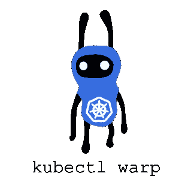

# kubectl warp 简介 Kubernetes 中的实时开发代码！

> 原文：<https://itnext.io/introducing-kubectl-warp-live-develop-code-in-kubernetes-9846c16d4bec?source=collection_archive---------5----------------------->



kubectl 在 Kubernetes 中运行代码的插件

Warp 是一个 kubectl 插件，它允许你在 Kubernetes 中直接执行你的本地代码，而不需要缓慢的映像构建过程。这是 MIT 授权的，可以在 [*GitHub*](https://github.com/ernoaapa/kubectl-warp) *买到。*

有时，我会面临一些我非常想解决的问题。这一次，我在用 Kubernetes 帮助我们在[极地小组](https://polarsquad.com)的客户时遇到了问题

> 如何在 Kubernetes 上直接执行我的本地代码？
> -随机开发者

这可能是开发人员在本地使用 Docker 时已经习惯的事情，但是使用 Kubernetes，所有容器都运行在集群中的某个服务器上。

我已经解决过一次了，当我在和艾略特项目一起工作的时候。因此，我所需要做的就是在 Kubernetes 上重新实现它，这就是我如何创建了`[kubectl warp](https://github.com/ernoaapa/kubectl-warp)`插件。

## …听起来很容易

假设你想用 Kubernetes 中的**来开发软件**

*   我在本地有源代码(可能是从 GitHub 克隆的)…
*   …我想将代码转移到 Kubernetes 的一个容器中…
*   … **构建**并开始项目和…
*   …对源文件进行**更改**,然后…
*   …实时重新加载代码，然后**看到**结果！

## 没那么容易…

要实现上述功能，您需要


正常更新流程

*   构建源代码
*   创建 Docker 图像
*   将图像推送到 Docker 存储库
*   将新版本部署到 Kubernetes
*   等待滚动更新
*   看结果

如果你需要在一分钟内多次这样做，你的开发周期就太慢了，而且你会开始怀念只有一个大型 monolith 应用程序的日子，那些你可以在本地轻松运行的程序。但是要在本地运行现在的“微服务”，你需要复制所有的依赖项(其他服务、数据库、存储等等。)来获得一个真正的“类生产”环境。

# 我为什么需要这个？

[网真](https://telepresence.io)很好地解决了这个问题**，它在本地运行你的项目**并将所有来自/去往 Kubernetes 的流量隧道传输到你的本地进程。

这在很多情况下都很好，但是如果您想要真正的“产品化”呢？如果要匹配内存/CPU 限制怎么办？CPU 架构？附加磁盘？传感器？突然间**有能力在 Kubernetes** 中运行项目听起来不错。

当您正在构建比简单的 web 应用程序稍微复杂一点的东西时，就是这种情况。尤其是当您在特殊环境中工作、针对高负载进行优化或构建物联网解决方案时。

# 它是如何工作的？

好了，让我们停止闲聊，让我们看看它是如何工作的。


翘曲通过避免跳过缓慢的步骤来加速这个过程

我希望它尽可能简单。例如，您可以使用共享 NFS 实现同样的事情(这在物联网开发中非常常见)，但是设置和拆除它是一个非常复杂的过程(猜猜有多少物联网设备仍在运行 Samba 服务器？).如果我们在引擎盖下有 Kubernetes，一定有更简单的方法。

`kubectl warp` command 在容器中运行你的命令，方式和`kubectl run`一样，但是在执行命令之前，它会将你所有的文件同步到容器中。

> `*kubectl warp*`**=**`*kubectl run*`**+**`*rsync*`

例如，要在 Kubernetes 中运行并实时重新加载 [NodeJS 项目](https://github.com/ernoaapa/kubectl-warp/tree/master/examples/nodejs)，您可以

```
$ kubectl warp -i -t --image node -- npm run watch*# Start editing files and it live reloads the changes!*
```

`kubectl warp`创建 *Pod* 其中，除了实际的容器，还有`sshd`容器运行(使用一次性 SSH 密钥)，因此我们可以用`rsync`将文件同步到 *Pod* 。

# 挑战

实现它比我想象的要复杂。最初，我计划用一个简单的 bash 脚本来实现它😀

## 初始同步

首先，我需要在实际的容器启动之前同步文件一次，这样当实际的容器使用定义的命令启动时，文件就已经可用了。
所以我需要`sshd`容器成为 init-container，并在第一次同步完成时完成它。这很容易，感谢`sshd -d`调试标志，除了它提出了另一个问题…

## 访问初始化容器

我需要一种方法来访问`sshd` init-container，但是 Kubernetes 只在*就绪*状态时将流量路由到 *Pod* ，但是当 init-container 正在运行时，它处于 *Init* 状态。
幸运的是，我发现，可以通过 Kubernetes API 向 init-container 进行端口转发(`kubectl port-forward`只在客户端阻止这一点)。[创建了一个 Github 问题](https://github.com/kubernetes/kubernetes/issues/72461)，希望在未来，我们可以用普通的`kubectl port-forward`打开到 init-container 的端口转发。

因此，它最终甚至比开始弄乱*入口*配置更好，这实际上是特定于环境的。
创建 *Pod* 后，`warp`开始从本地随机端口向`sshd`集装箱港口 22 转发端口，并在本地执行`rsync`命令。然后，当第一次同步完成时，init-container 成功完成，实际的容器启动。厉害！🎉

# 入门指南

使用 MacOS 和 Brew(其他请参见[文档](https://github.com/ernoaapa/kubectl-warp#linux--macos-without-brew))，您可以安装它

```
brew install rsync ernoaapa/kubectl-plugins/warp
```

从[这里](https://github.com/ernoaapa/kubectl-warp/tree/master/examples/nodejs)获取示例 NodeJS 项目

```
kubectl warp -i -t --image node demo -- npm install && npm run watch
```

# 结论

期待得到一些关于`kubectl warp`的反馈。这是早期的工作版本，并没有实现`kubectl run`的所有功能，例如，需要实现一个[功能来使用*持久卷*来更快地启动](https://github.com/ernoaapa/kubectl-warp/issues/1)，以使它变得更好。


kubiot.io —面向物联网的 Kubernetes

这只是[Kubiot——物联网的 Kubernetes](https://www.kubiot.io/)的一个开源部分。
**在**[**kubiot . io**](https://www.kubiot.io/)**报名提前获取！**