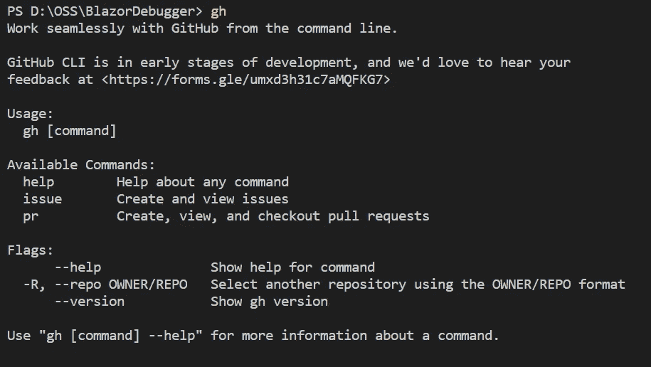
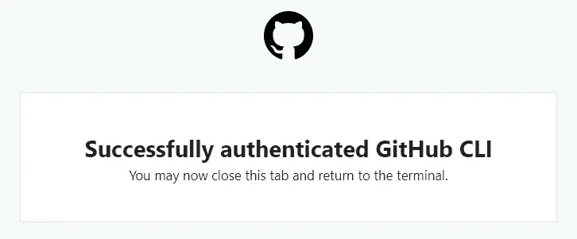
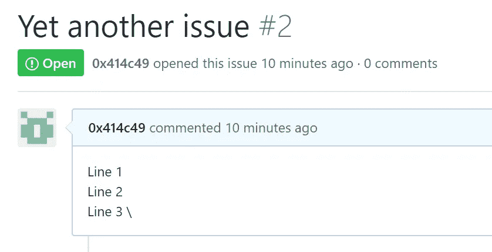

# 介绍官方 GitHub CLI

> 原文：<https://itnext.io/introducing-official-github-cli-2b43b1127e8d?source=collection_archive---------5----------------------->

## 从命令行与 GitHub 无缝协作。

我们大多数人可能都知道枢纽；这是一个非官方的 GitHub CLI 工具。最后，GitHub 发布了官方 CLI，并将其命名为 gh。gh 是一个新项目，让我们探索一个官方的 GitHub CLI 工具在完全不同的设计下会是什么样子。虽然这两个工具都将 GitHub 带到了终端上，但是 Hub 充当了 git 的代理，而 gh 是一个独立的工具。

# gh 提供什么？

该项目仍处于测试阶段，尚未作为最终产品发布，但目前，您可以处理问题和拉式请求。这意味着:列表、创建、查看。

# 它支持哪些平台？

该项目已经用 Go 语言编写，这意味着该项目已经是跨平台的。在[的项目库](https://github.com/cli/cli#installation-and-upgrading)上，有关于如何在不同的操作系统上安装它的变通办法，比如 Windows、macOS、Linux 发行版。

# 如何与 gh 合作？

使用这个工具很容易。它只有三个主要命令:**帮助、发布、公关。**

使用它很容易，只需在终端中执行`gh`即可。



如您所见，这个工具非常冗长，这很有帮助。有两个主要命令:issue 和 pr。

通过执行`gh issue`，出现子命令列表:

```
Available Commands:
  create      Create a new issue
  list        List and filter issues in this repository
  status      Show status of relevant issues
  view        View an issue in the browser
```

例如，您可以这样创建新问题:

```
gh issue create --title 'Yet another issue' --body 'I have an issue'
```

首先(只有一次)，它会要求验证，如果你按下 Enter，它会打开一个新的选项卡，要求你提供凭证。



```
PS D:\OSS\BlazorDebugger> gh issue create --title 'Yet another issue' --body 'Line 1 \  
>> Line 2 \
>> Line 3`
Notice: authentication required
Press Enter to open github.com in your browser...
Authentication complete. Press Enter to continue...Creating issue in 0x414c49/BlazorDebugger[https://github.com/0x414c49/BlazorDebugger/issues/2](https://github.com/0x414c49/BlazorDebugger/issues/2)
```

产生的问题:



## 下一步是什么？

您可以在[网站](https://cli.github.com/manual/)上获得完整的手册。它有完整的例子。几乎 gh 中的每个命令和子命令都是冗长的，无论何时你需要帮助，或者你做错了什么，它都会给你指引。

例如，我想看看其他选项或标志:

```
gh issue list --help
List and filter issues in this repositoryUsage:
  gh issue list [flags]Flags:
  -a, --assignee string   Filter by assignee
  -l, --label strings     Filter by label
  -L, --limit int         Maximum number of issues to fetch (default 30)
  -s, --state string      Filter by state: {open|closed|all}Global Flags:
      --help              Show help for command
  -R, --repo OWNER/REPO   Select another repository using the OWNER/REPO format
```

该项目仍处于测试阶段；可能会有漏洞和改进的空间。请随时通过这个[链接](https://forms.gle/umxd3h31c7aMQFKG7)给 GitHub 反馈。