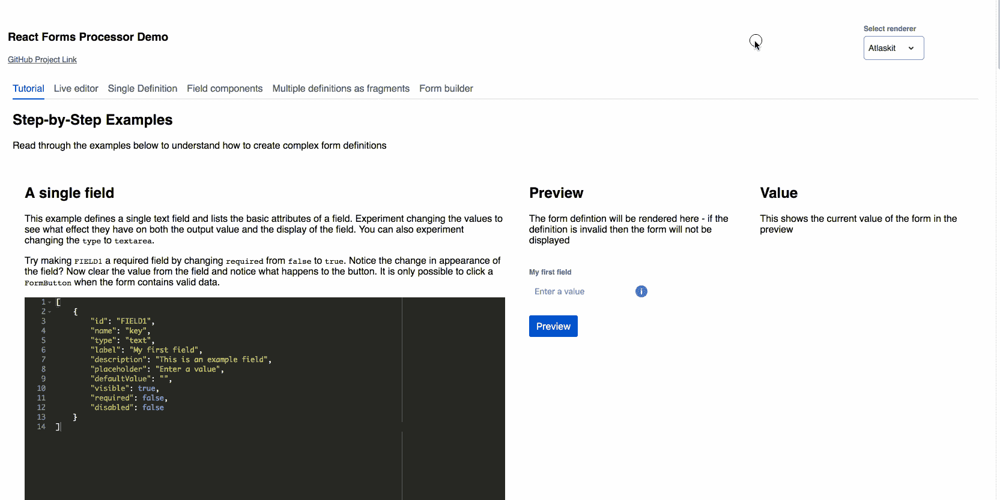
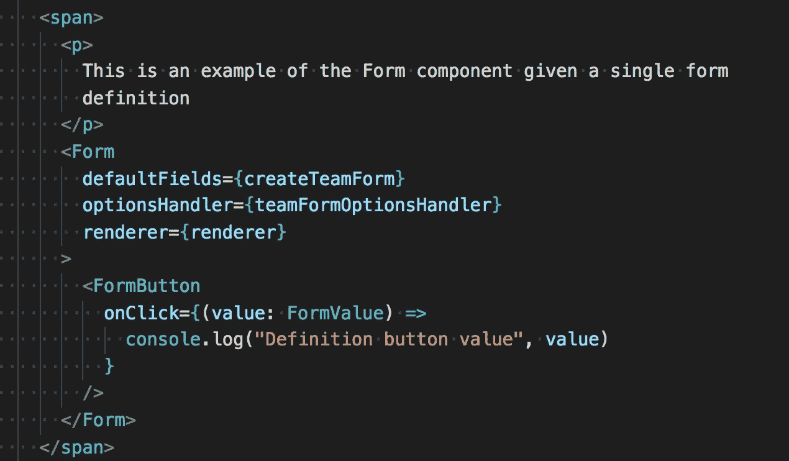
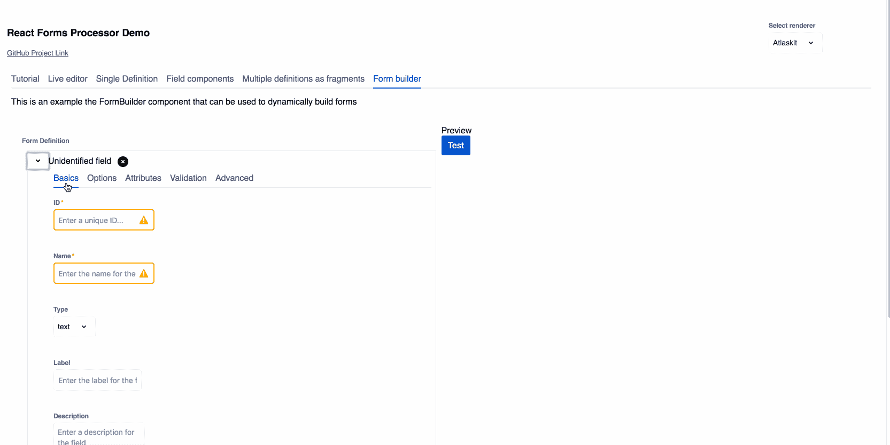

# React-Forms 处理器简介

> 原文：<https://itnext.io/introducing-react-forms-processor-35c9e5df5efc?source=collection_archive---------7----------------------->

这个博客旨在向您介绍我最近正在开发的一个新的表单库。因为有很多表单库，你可能需要知道这个有什么不同…

继续阅读，如果你:

*   *需要构建字段间关系复杂的表单*
*   *想要完全控制表单中的字段布局*
*   *想要呈现您选择的字段组件(例如，材料、引导程序、Atlaskit、原生 HTML 甚至您自己的库)*
*   *希望能够通过 GUI 构建表单，而无需编写任何代码*

…希望你还和我在一起。

## 建立关系

React-Forms-Processor (RFP)专注于定义字段之间的关系，而不是字段本身。例如，您可以:

*   希望一个字段仅在另一个字段具有特定值时可见
*   当表单可见时，希望该字段的值包含在表单的整体值中
*   希望您的表单只有在所有字段都有效时才有效

还有许多其他受支持的用例，大多数在[在线演示](https://draperd.github.io/react-forms-processor/)的教程中有详细描述。

## 如何使用它

RFP 利用 React 16.3 中引入的[新上下文 API](https://reactjs.org/docs/context.html) 来提供两个核心组件: **Form** 和 **FormFragment** 。默认情况下，将使用本地 HTML 元素呈现字段，但是您可以选择提供一个**呈现器**来获得更丰富的体验。在撰写本文时，已经有了 [Atlaskit](https://atlaskit.atlassian.com/) 和 [Material-UI](https://material-ui.com/) 渲染器，但是将来还会添加更多渲染器，并且编写自己的渲染器非常简单(只需将定义良好的属性映射到您想要渲染的每种类型的字段的所需组件的属性)。

然后为**表单**组件提供一个 JSON 定义，指定要呈现的字段以及它们之间的关系。如果你想对你的字段进行分组(例如，在选项卡、列、部分等中)，那么你可以将定义拆分成多个嵌套在**表单**组件中的**表单片段**组件。

## 表单生成器

为了使事情变得更简单，您可以使用在线演示中的 Form Builder 工具创建特定于您的表单的 JSON。这将为您提供正在构建的表单的预览，并显示 JSON 规范，供您复制并粘贴到应用程序中。

## 选项处理

静态选项可以在 JSON 模型中定义，但是如果您需要更动态的选项(例如，从服务器获取或者根据其他字段的变化值进行更新)。在[在线演示](https://draperd.github.io/react-forms-processor/)中，你可以看到一个例子，其中“单一定义”选项卡上的“成员”字段从 [SWAPI](https://swapi.co/) 中获取字符。

这种更高级的选项处理可以通过为您的**表单**组件提供一个 **optionsHandler** prop 来实现，该 prop 是一个接受当前表单值和字段以生成选项的函数，并且可以返回一个承诺或一组选项。

## 确认

目前有 4 个基本的处理验证器:

*   正则表达式模式匹配
*   最小字符长度
*   最大字符长度
*   最小和/或最大数值

…可以根据需要混合搭配。在未来，将会添加额外的验证器，并支持作为道具提供的自定义验证处理程序。

## 摘要

我真的很想得到一些关于我到目前为止所做的事情的反馈，以便知道这是否是一个我应该继续开发的项目。我相信它会对应用程序开发有用，因为它解决了我以前遇到的具体用例。

请试用[在线演示](https://draperd.github.io/react-forms-processor/)或安装 NPM 软件包，并在您自己的应用程序中试用，让我知道您的想法——无论是好是坏！

感谢阅读！

**下一篇文章:“** [**如何用 React 表单处理器创建表单**](https://medium.com/@dave.draper20/how-to-create-forms-with-the-react-forms-processor-9bcdd241f502)**”**