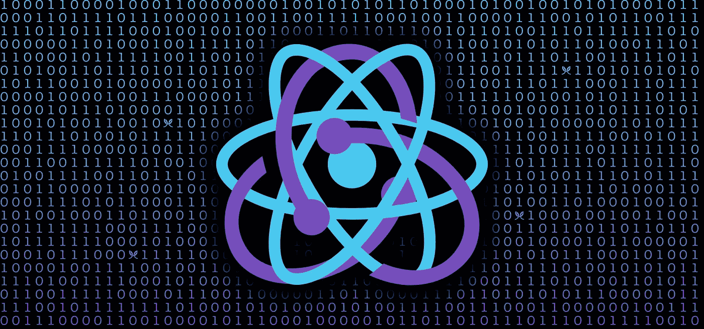

# 简介:Redux 挂钩

> 原文：<https://itnext.io/introducing-redux-hooks-1bf9c568ecc2?source=collection_archive---------1----------------------->



刚刚发布，随之而来的是一套全新的钩子，可能会改变你在 React 应用中编写 redux 的方式。在这篇文章中，我将让你了解为什么花了这么长时间才发布，API 是什么，以及最后我对移植到 hooks 的想法。

## 我们不是已经有了吗？

虽然[第三方库](https://github.com/facebookincubator/redux-react-hook)已经支持这个功能，但是这个功能我已经期待很久了，因为所有现有的解决方案都不是面向性能的。到目前为止，任何允许你使用像`useRedux`或`useConnect`这样的东西的现有库都不能解决一个关键的性能相关问题，这导致你的挂钩组件在任何时候**任何状态**改变时重新呈现，不管你的组件是否监听这个特定的状态。这是因为`6.x.x`。版本`react-redux`试图充分利用新的 React 上下文 API，不幸的是没有渲染保释技术。这意味着，无论何时一个`Context.Provider`更新，那么每个`Context.Consumer`也必须更新。因此，任何带有类似于`useRedux`或`useConnect`的钩子的组件将总是更新，而不管是否正在监听被更新的状态片。这个特殊的问题是`react-redux`不得不发布一个新的主要版本(即`7.x.x`)的原因，在这个版本中，它重写了代码，将自己从以前的上下文 API 实现中分离出来，现在已经准备好支持一组全新的钩子了！

## 这将如何影响我的代码？

嗯，看情况。新的挂钩允许您使用 redux 连接您的组件，而不再需要`connect()` HOCs。我个人认为这对于使用 redux 的大型应用程序来说是一个巨大的胜利，因为现在你实际上可以创建**自定义的可重用钩子**而不需要额外的容器组件。到目前为止，React 钩子很棒，但是你实际上不能创建一个钩子来从 redux 读取一些状态或者分派给它。因此，定制钩子非常适合 react-only 的东西，而当代码与 redux 有任何关系时，它们不会是首选。

这些新的 redux 挂钩的好处是，你不再需要用`mapStateToProps`、`mapDispatchToProps`和`connect`来维护单独的容器/表示文件，而是可以立即读取功能组件内部的状态。此外，您可以将任何现有的定制钩子与 redux 集成，而不是将状态数据作为参数传递给钩子，钩子本身现在可以直接从 redux 状态中读取它！

## 炮兵

虽然在撰写本文时，支持钩子的`react-redux`版本还只是 alpha 版本，但是您仍然可以在非生产的**级别上试验它们。**

要安装它，只需运行:

```
npm install react-redux@next// oryarn add react-redux@next
```

目前，有一套 4 个挂钩，包括:

## **使用选择器()**

从 Redux 存储状态中提取值并订阅存储的钩子。这本质上类似于在钩子中实现的`mapStateToProps`函数，但是有一些小的不同。

首先，没有可用的`ownProps`，应该使用自定义逻辑使用`useCallback`或`useMemo`来获得它们。

其次，用于选择状态片的选择器函数不会被缓存，除非您向`useSelector()`提供第二个参数。第二个参数是一个值数组，无论何时更改，选择器函数都将重新计算。如果您的选择器函数**依赖于`state`之外的其他变量**，那么您需要以数组的形式将这些变量作为第二个参数添加到这个钩子中。如果你的选择函数只依赖于状态，那么就忘记这个钩子的第二个参数。如果有帮助的话，这正是您在`useCallback`中要做的，在这里，只要作为第二个参数传入的值不变，相同的函数就会被重用。

useSelector 示例

除此之外，同样的智能渲染保释技术仍然适用，如果新的映射道具与旧的映射道具相同，您的组件将不会重新渲染。

由于 React Redux 中使用的批处理行为，一个调度的动作导致同一个组件中的多个`useSelector()`重新计算它们的值，*应该*只导致一次“挂钩”组件的重新呈现。因此，请放心，组件中的`useSelector()`钩子的数量**与该组件将拥有的重新渲染的数量**无关。在上面的例子中，我们可以将单个`useSelector()`拆分成两个独立的部分(一个读取标题，另一个读取内容),这样**和**在性能&渲染数量上完全相同。

## `useDispatch()`

一个暴露商店内部`dispatch`方法的钩子。每当一个组件需要触发 redux 动作时，这个钩子就是你所需要的。不幸的是，没有对应的`mapDispatchToProps`钩子，所以无论何时你想要触发任何动作，你都需要使用`dispatch(myActionCreator())`调用它的动作创建者。启动这样一个动作可能看起来是违反直觉的，因为你已经习惯于通过你的`connect()` HOC 调用一个已经用`dispatch`包装好的道具，但是钩子在这里是为了让事情更习惯化，并且给你的代码带来额外的清晰。

不幸的是，现在，无论何时您想要触发一个动作作为对用户事件的响应，您都必须创建一个匿名函数，如下所示:`() => dispatch(myActionCreator())`。由于匿名函数的性质，这将在每次重新渲染时获得一个新的引用。因此，如果您将它作为道具传递给另一个组件，那么后者将永远无法受益于渲染保释技术(`shouldComponentUpdate`、`memo`、`PureComponent`)。为了实现这一点，您必须使函数具有相同的引用，这在 hooks 世界中转化为将整个匿名函数包装在一个`useCallback()`中。

使用 Dispatch 示例

## 使用商店()

返回 Redux store 实例的挂钩。每当您创建一个需要访问由消费者应用程序定义的商店实例的库时，这是很有用的(即`connected-react-router`)。如果出于某种原因，一个组件使用了不同于其余组件的存储，或者如果你正在对一个没有用`Provider`包装的组件进行单元测试，这也可能是有用的。

使用商店示例

## 想法和要点

我应该把我的`connect()` HOCs 转换成钩子吗？嗯——还是那句话——这要看情况。首先，您失去了很多由`connect()`提供的**自动**引用缓存。这会导致您失去任何性能提升，除非您大量使用`useCallback()`(特别是对于正在使用`dispatch`的函数)。其次，如果你的代码依赖于`mapStateToProps`内的`ownProps`，你可能会用 redux 钩子比用`connect()` HOC 写出更多的代码。第三，您失去了`mapDispatchToProps`为动作创建者提供的依赖注入。

遗憾的是，从 redux HOCs 到 redux hooks 没有一行移植。你不能简单地用一个“useConnect()”钩子替换掉你的单个`connect()` HOC，因为没有任何钩子。在最初的 alpha 版本中曾经有一个`useRedux()`钩子，但是它很快就被废弃了，因为它没有给你适当地记忆你的动作创建者的能力，这导致了性能问题(如果你想知道为什么，我建议你阅读我关于 [redux performance](/3-small-tips-for-better-redux-performance-in-a-react-app-9cde549df6af) 的文章)。这意味着你现在拥有的每一个`connect(mapStateToProps, mapDispatchToProps)`吊钩都需要被两个独立的吊钩替换，如果使用`ownProps`的话，你的 *mapStateToProps* 可能会有**额外的**变化。因此，如果您想防范潜在的性能问题，您必须编写的代码比您按照`connect()`的方式编写的代码要多。

不管上面说的是什么，我们通常做的是有意地将我们的非智能层和智能层分开。这使得我们既可以重用单独的层，又可以通过将这两个层作为不同的实体来处理来简化测试过程(如果你想了解更多，我强烈建议你阅读我的关于 UI &状态层的[重要性的文章)。另一方面，钩子试图将这两者合并在一起，本质上是从智能&哑层创建一个单一的实体。这是一个新趋势，始于 2018 年 hooks 的发布。原因是，在大多数情况下，表示组件只与特定的容器组件相关，本质上组件的可重用性不是问题。另一方面，为了解决这个问题，测试发生了变化，很多人慢慢地从单元&实现测试(](https://levelup.gitconnected.com/the-importance-of-state-ui-actors-in-web-apps-f69cc523798b)[酶](https://airbnb.io/enzyme/))迁移到集成&用户输出测试([反应测试库](https://github.com/kentcdodds/react-testing-library))。

出于这些原因，合并非智能层和智能层可能是赢也可能是输，这取决于你的应用的架构和测试方式。虽然钩子可以增加可读性(不再需要在两个地方检查)和可维护性(关于文件组织和结构)，一些成熟的代码库可能希望保持现有的层分离，因为这对他们来说更好。

请记住，在一天结束时，钩子只是 hoc 或渲染道具组件的替代物，很可能你公司的利润不会依赖于它们。它们是实现细节。任何可以写成特设的东西都可以被重写为渲染道具或自定义钩子，反之亦然。我写这篇文章不是为了贬低钩子，而是为了让人们在快速跳上钩子重构的列车之前多思考一点。我个人对新 redux 挂钩的建议如下:

> 在您的定制钩子中选择它们，但是只有当连接逻辑简单并且性能不成问题时才在组件中使用它们。

如果这太严格，就忽略它，总是选择钩子，但是如果它变得很麻烦，不要害怕切换到非钩子实现。

感谢阅读:)

*👋 ***嗨，我是***[***Aggelos***](https://aggelosarvanitakis.me)***！如果你喜欢这个，考虑一下*** [***在 twitter 上关注我***](https://twitter.com/AggArvanitakis) ***并与你的朋友分享这个故事*😀***