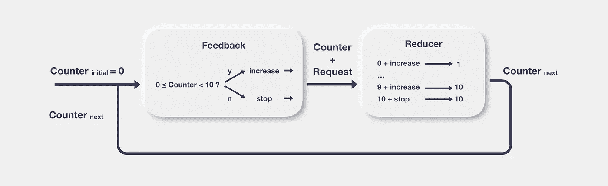
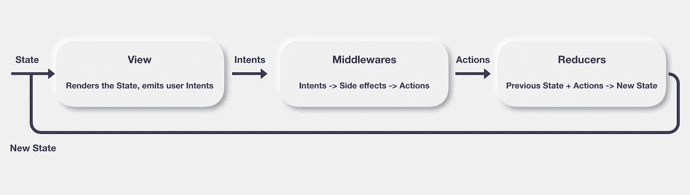
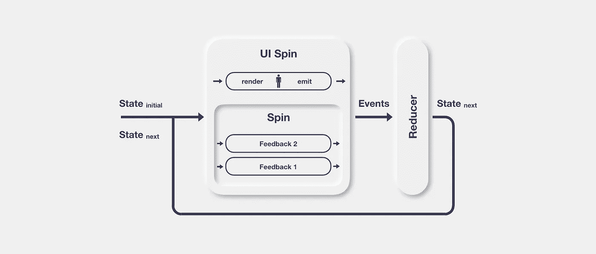

# Swift 的通用反馈回路系统 Spin 简介

> 原文：<https://itnext.io/introducing-spin-9a48de9680d6?source=collection_archive---------1----------------------->

杰里米·帕金斯在 [Unsplash](https://unsplash.com/?utm_source=unsplash&utm_medium=referral&utm_content=creditCopyText) 上的照片

# swift 应用中对架构模式的需求

随着最近[联合](https://developer.apple.com/documentation/combine)和 [SwiftUI](https://developer.apple.com/tutorials/swiftui/) 的引入，我们的代码库将面临一些过渡期。我们的应用程序将同时使用 Combine 和第三方反应式框架，或者同时使用 UIKit/AppKit 和 SwiftUI。这使得随着时间的推移很难保证一致的架构。很难知道这些新技术何时会被纳入我们的项目。从一开始就选择正确的架构可能会极大地简化未来的过渡。

像 [MVC](https://en.wikipedia.org/wiki/Model–view–controller) 、 [MVP](https://en.wikipedia.org/wiki/Model–view–presenter) 或 [MVVM](https://en.wikipedia.org/wiki/Model–view–viewmodel) 这样的传统架构模式主要负责 UI 层。当要在你的应用中以统一的方式混合上述技术时，它们不会有很大的帮助。例如，UIKit 应用程序中的 MVVM 将在很大程度上依赖于带有反应式扩展的双向绑定技术，如 RxCocoa 或 ReactiveCocoa。随着您逐渐引入 SwiftUI 和 Combine，这将变得不那么真实。很有可能你的应用程序中会有几个架构范例。

[VIPER](https://www.objc.io/issues/13-architecture/viper/) 稍微完整一点，因为它描述了场景之间的路由机制以及模型(实体)和管理它们的业务规则(交互器)之间的分离。这种模式加强了[干净架构](https://blog.cleancoder.com/uncle-bob/2012/08/13/the-clean-architecture.html)关于关注点分离和依赖性管理的原则。但是，和 MVxx 模式一样，当逐渐采用 Combine 或 SwiftUI 时，它不能保证语法和范式的一致性。

SwiftUI 是关于状态作为真理的单一来源，并对状态突变做出反应。这允许以声明的方式编写视图，而不是以冗长且容易出错的命令式方式。

近年来，出现了几种围绕状态概念的架构模式:如 [Redux](https://redux.js.org) 或 MVI，以及更普遍的单向数据流架构。有时他们提出以中央方式管理国家，有时以地方方式。这些都是很好的模式，它们非常符合国家是真理的唯一来源的观点。我很确定他们对 SwiftUI 的制作有很大的影响。

我自己已经在生产应用程序中实现了其中的一些模式。他们向我介绍了函数式编程，因为它们依赖于诸如不变性、纯函数、函数组合等概念。函数式编程和状态管理非常契合。函数式编程与数据不变性相关联，状态也应该如此。

然而，我经历了这种架构的一些缺点，这使我发现了反馈回路系统。

# 什么是反馈回路系统？

反馈回路是一个系统，它能够通过使用其计算的结果值作为自身的下一个输入来进行自我调节，根据给定的规则不断调整该值(反馈回路用于电子等领域，例如自动调整信号的电平)。

反馈回路图

以这种方式陈述可能听起来晦涩难懂，与软件工程无关，**但是**“根据某些规则调整一个值”正是一个程序，进而一个应用程序，所要做的！应用程序是我们想要管理的各种状态的总和，以便提供遵循精确规则的一致行为。

描述从一个值到另一个值的允许转换的规则由状态机描述。

## **什么是国家机器？**

> 它是一台抽象的机器，在任何给定的时间都可以处于有限数量的状态中的一种。状态机可以响应一些外部输入从一种状态改变到另一种状态。从一种状态到另一种状态的变化称为过渡。状态机由其状态列表、初始状态和每次转换的条件来定义。

因为应用程序是一个状态机，所以它可以由一个反馈回路系统来驱动。

反馈回路基于三个组件:初始状态、反馈和缩减器。为了说明它们中的每一个，我们将依靠一个基本的例子:一个从 0 数到 10 的系统。

*   **初始状态**:这是我们计数器的初始值，0。
*   **A feedback** :这是我们应用于计数器的规则，以达到我们的目的。反馈的输出是改变计数器的请求。如果 0 < =计数器< 10，那么我们要求增加它，否则我们要求停止它。
*   **一个减速器**:这是我们系统的状态机。它描述了在给定计数器先前的值和反馈计算出的请求的情况下，计数器所有可能的转换。例如:如果先前的值是 0，并且请求增加它，那么新的值是 1；如果先前的值是 1，并且请求增加它，那么新值是 2；诸如此类。当来自反馈的请求是停止时，则先前的值作为新值返回。

从 0 数到 10 的反馈回路

反馈是**唯一可以产生副作用的地方**(联网、本地 I/O、UI 渲染，无论你做什么都可以访问或改变循环本地范围之外的状态)。相反，reducer 是一个纯粹的函数，它只能在给定前一个值和转换请求的情况下产生一个新值。禁止在还原剂中产生副作用，因为这会影响其重现性。

# 传统单向数据流架构的缺点

正如你所看到的，反馈循环范式的特殊性在于状态既是输入又是输出，两者连接成一个整体形成一个单向循环。只要循环还在运行，我们就可以使用状态作为本地缓存来保存数据。

典型的用例是浏览分页 API。这种类型的系统允许使用当前状态来总是使前一页面 URL 和下一页面 URL 可访问，这使得将它存储在其他地方的需要变得无关紧要。

在更传统的单向数据流架构中，状态只是系统的输出。输入是“用户意图”,它触发副作用和状态突变。

单向数据流

我经历过这种架构的几个版本(Redux 和 MVI ),发现自己陷入了两个主要问题:

*   不将状态作为输入会导致在 UI 层或缓存存储库中维护本地状态。
*   依赖于输入，如意图或动作，这通常是枚举，迫使我们用“切换”语句来解析它们，以确定要执行的副作用。当我们添加新的意图或新的动作时，我们必须改变我们解析它们的方式，违背了固定规则的开/关原则。

我并不是说这些问题是使用这些架构的“禁忌”,也不是说我已经以最好的方式使用了它们。例如，我曾经做过 MVI 的一个变种，其中意图被“命令模式”所取代。每个命令负责自己的副作用执行。没有解析，命令是独立的。这种方法符合打开/关闭原则，因为添加新功能就是添加要执行的新命令；并且不修改解析意图或动作的方式。

但是，与其扭曲这些架构来满足我的需求，我更倾向于自然解决这些问题的方法:反馈循环系统。

# 什么是旋转？

让我们回到我们的主要关注点:提供一个架构模式，它可以吸收我们在应用程序中可以预期的技术差异。

正如我们所见，反馈循环是一种非常通用的模式。这将有助于我们缓解混合技术带来的问题。但是我们需要一种方法来以统一的方式声明反馈循环，而不管底层的反应式框架或选择的 UI 技术。这就是旋转发挥作用的地方。

[**Spin**](https://github.com/Spinners/Spin.Swift) **是一个在基于 Swift 的应用程序中构建反馈循环的工具，允许您使用统一的语法，而不管底层反应式编程框架和您使用的任何 Apple UI 技术(RxSwift、ReactiveSwift、Combine 和 UIKit、AppKit、SwiftUI)。**

让我们通过构建一个调节两个整数使它们收敛到它们的平均值的系统来尝试**旋转**(就像某种系统会调节立体声扬声器上的左右声道使它们收敛到相同的水平)。

我们需要州的数据类型:

我们还需要一种数据类型来描述要在级别上执行的转换:

为了描述控制转换的状态机，我们需要一个 reducer 函数:

到目前为止，代码没有与特定的反应式框架相关，这很好。

让我们写下将对每个级别产生影响的两个反馈。

使用 RxSwift:

带电抗 Swift:

使用联合收割机:

无论您选择哪种反应式技术，编写反馈回路(也称为**旋转**)就这么简单:

就是这样。你可以在应用的一部分使用 RxSwift，在另一部分结合使用，所有的反馈循环将使用相同的语法。

对于“类似 DSL”的语法爱好者来说，有一种更具声明性的方式:

如何开始循环？

混合反应式框架不再是一个问题👍。

## 在 UI 透视图中使用 Spin

虽然反馈循环可以独立存在，没有任何可视化，但在我们的开发人员的世界中，将它作为一种产生将在屏幕上呈现的状态的方式和一种处理用户发出的事件的方式更有意义。

幸运的是，将状态作为输入来呈现和返回来自用户交互的事件流看起来很像反馈的定义，我们知道如何处理反馈😁当然是旋转的。

一旦 **Spin** /feedback 循环建立起来，我们就可以用一个专门用于 UI 渲染/交互的新反馈来“装饰”它。存在一种特殊旋转类型来执行装饰:UISpin。

从全局来看，我们可以用下图说明 UI 环境中的反馈循环:

UI 使用环境中的旋转

在 ViewController 中，假设您有一个呈现函数，如下所示:

我们需要用 UISpin 来修饰“业务”旋转(例如在“viewDidLoad”函数中)。

在循环中发送事件非常简单；只需使用发射功能:

## SwiftUI 呢？

因为 SwiftUI 依赖于状态和视图之间绑定的思想，并负责呈现，所以连接 SwiftUI Spin 的方式略有不同，甚至更简单。

在您看来，您必须用“@ObservedObject”来注释 SwiftUI Spin 变量:

然后，您可以在视图中使用“uiSpin.state”属性来显示数据，并使用 uiSpin.emit()来发送事件。由于 SwiftUISpin 也是一个“ObservableObject ”,每个状态突变都会触发视图渲染。

UIKit (AppKit)和 SwiftUI 使用 UISpin 的方式非常相似，允许您将以前为 UIKit 屏幕编写的反馈循环集成到新的 SwiftUI 组件中。

混合 UI 范例不再是一个问题👍。

# 结论

我们已经达到了我们的目标:提出一个架构模式实现，它可以简化即将到来的技术之间的转换。

在 Spinners 组织中，您可以找到两个演示应用程序，它们演示了 Spin 与 RxSwift、ReactiveSwift 和 Combine 的用法。

*   一个基本的柜台应用: [UIKit 版本](https://github.com/Spinners/Spin.UIKit.Demo.Basic)和 [SwiftUI](https://github.com/Spinners/Spin.SwiftUI.Demo.Basic) 版本
*   使用依赖注入和协调器模式(UIKit)的更高级的“基于网络的”应用程序: [UIKit 版本](https://github.com/Spinners/Spin.UIKit.Demo)和 [SwiftUI 版本](https://github.com/Spinners/Spin.SwiftUI.Demo)

[还有旋转。快速回购](https://github.com/Spinners/Spin.Swift)。公关当然是受欢迎的(⭐️也是😏).

我计划开发一个 Kotlin 实现，兼容 RxJava 和 Flow(任何帮助将不胜感激)。

我希望你喜欢这篇文章。请随意留下评论，这样我们就可以交流了。