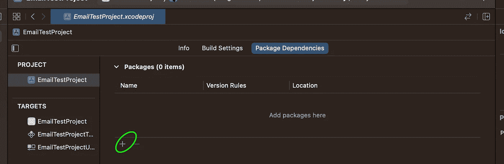
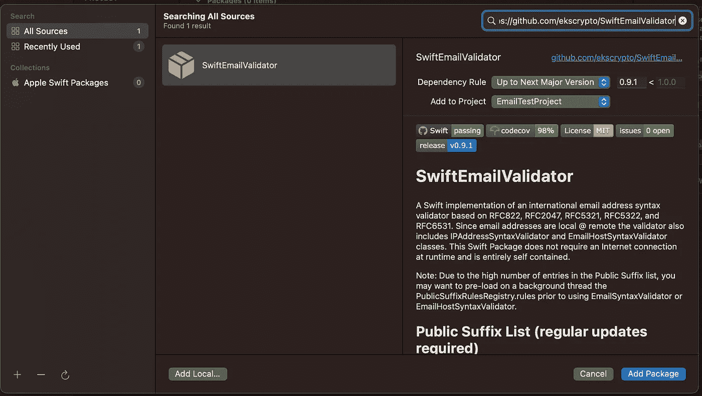
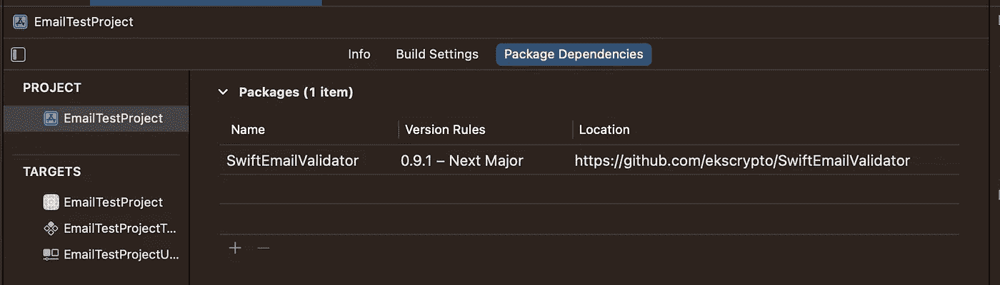

# SwiftEmailValidator 简介

> 原文：<https://itnext.io/introducing-swiftemailvalidator-df658af4ebb1?source=collection_archive---------2----------------------->

验证 99%的北美电子邮件只需不到 5 分钟的时间，但验证全球范围内 100%的有效电子邮件地址可能需要很长时间。引入 SwiftEmailValidator，消除这种痛苦。

在麻省理工学院的许可下发布，并可在 GitHub 上免费获得:[https://github.com/ekscrypto/SwiftEmailValidator](https://github.com/ekscrypto/SwiftEmailValidator)

[在线打印机](https://unsplash.com/@onlineprinters?utm_source=medium&utm_medium=referral)在 [Unsplash](https://unsplash.com?utm_source=medium&utm_medium=referral) 上拍摄的照片

如果你认为可以用一个“简单”的正则表达式来验证电子邮件，你很可能是在欺骗自己。快速回顾一下 EmailRegex.com，你会发现许多编程语言都存在多种不同的正则表达式，不幸的是，它们都不能 100%有效。更好的是非常难读和不可维护的。

几个声称研究过 RFC 标准的人列出了(大部分有效的)有效/无效电子邮件地址的例子，遗漏了边缘情况或更糟的情况，错误地将应该无效的电子邮件标记为有效，这并没有帮助。(即:something@123.123.123.123 不是有效的电子邮件地址，something@something.web 也不是)。

幸运的是，使用一点逻辑，以及可用的外部资源，比如来自[https://publicsuffix.org](https://publicsuffix.org)的公共后缀列表，就有可能构建一个更强大的验证器。

# 装置

*   从 Xcode 中，打开您的项目设置和“包依赖项”
*   点击“+”按钮添加新的依赖项
*   在搜索栏中，输入:[https://github.com/ekscrypto/SwiftEmailValidator](https://github.com/ekscrypto/SwiftEmailValidator)
*   查看显示的信息，然后点击“添加包”按钮。
*   完成后，该包应该作为依赖项列出。

突出显示“添加”按钮的 Swift 包依赖关系屏幕

Xcode 的 Swift 包管理器“添加包”屏幕

定义了依赖关系的 Xcode 包依赖关系屏幕

# 基本用法

要验证电子邮件地址的格式是否正确:

您还可以创建字符串扩展来添加. isValidEmail 布尔计算属性:

# 高级:指定 RFC 兼容性要求

使用验证器函数的“兼容性”参数，验证器可以验证三个级别的遵从性:

*   。 **ascii** : RFC 822 —美国 ascii 电子邮件
*   。**ASCII with Unicode extension**:RFC 2047—支持编码 Unicode 的美国 ASCII 电子邮件
*   。**unicode**:RFC 6531—smtputf 8 支持

# 高级:IPv4 / IPv6 地址作为域

如果您希望允许电子邮件地址直接使用 IPv4/IPv6 地址，就像在*my address @【127 . 0 . 0 . 1】*中一样，您可以将 allowAddressLiterals 设置为 true。

默认情况下，不允许使用 IP 地址。

# 高级:自定义公共后缀规则

公共后缀列表是维护顶级域名列表和适用于每个域名的一些验证规则的协作成果。这有助于网站所有者和浏览器供应商在不应该可用的级别阻止 cookies，也可以用于验证电子邮件地址的@domain 部分是否有效。

SwiftEmailValidator 库内置了一个版本的公共后缀列表，但您可能希望让您的应用程序定期下载该列表的较新版本以保持最新，或者您可能有一些想要支持的内部域。

规则的格式是*[[字符串]]* 。外部数组是公共后缀的列表，内部数组是该后缀的规则列表。

一组具有值 *[["com"]]* 的规则将指示 email@com 是无效的，但是允许 email@website.com。

具有值 *[["*，" com"]]* 的一组规则将指示 email@website.com 是无效的，但是 email@subdomain.website.com 是允许的。

一组值为 *[["*，" com"]，["！myserver "，" com"]]* 表示 email@com，email@website.com 是无效地址，但 email@myserver.com 是允许的。以感叹号开头的规则是“例外”，优先于其他规则。

您可以在[https://github . com/ekscrypto/SwiftEmailValidator/blob/main/Utilities/update-Suffix . Swift](https://github.com/ekscrypto/SwiftEmailValidator/blob/main/Utilities/update-suffix.swift)找到一个 Swift 脚本来下载公共后缀列表的最新副本并生成适当的 *[[String]]* 规则

虽然该库有广泛的单元测试，但电子邮件验证一直很棘手。处理所有边缘案例都需要付出巨大的努力。请确保在生产中使用该库之前对其进行全面测试。

我希望这个库能对你们中的一些人有所帮助，我确信它会在我当前和即将到来的项目中对我有所帮助。干杯，编码快乐！