# KubeSphere 开源 Kubernetes 平台简介

> 原文：<https://itnext.io/introducing-the-kubesphere-open-source-kubernetes-platform-8fc4600d2e72?source=collection_archive---------1----------------------->

## 本地安装上该平台的概述

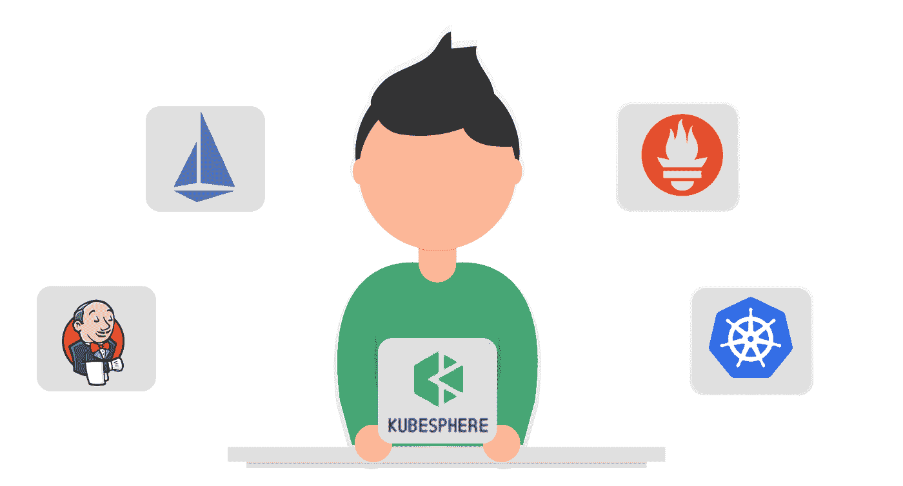

> “KubeSphere 是一个用于云原生应用管理的分布式操作系统，使用 Kubernetes 作为其内核。它提供即插即用的架构，允许第三方应用无缝集成到其生态系统中”。(来自 https://kubesphere.io)

在第一篇文章中，我们将:

*   介绍 KubeSphere 平台及其主要功能
*   使用 KubeKey 安装程序安装一个本地 Kubernetes 集群和其中的 KubeSphere

这个本地安装并不允许你使用 KubeSphere 的所有特性，但是它一定会帮助你更好地理解这个平台和它提供的所有有趣的功能。

## 关于 Kubesphere

KubeSphere 是一个容器平台，其功能通过其可插拔架构提供，具有特定的组件，可以在平台安装期间或之后启用。可用组件包括:

*   App Store，一个基于 Helm 的应用程序商店，用于基于 [OpenPitrix](https://github.com/openpitrix/openpitrix) 的应用程序生命周期管理
*   DevOps 系统专为 Kubernetes 中的 CI/CD 工作流而设计
*   监控系统部署基于 Prometheus 的堆栈来导出和检索监控数据
*   实现日志收集、查询和管理的日志系统
*   警报和通知允许通知平台上发生的特定事件
*   服务网格是基于 Istio 的，它支持可观察性、跟踪、流量控制

每个组件的细节可以在[这里](https://kubesphere.io/docs/pluggable-components/overview/)找到。默认情况下，仅启用监控系统。下图列出了 KubeSphere 几乎开箱即用的所有工具……印象深刻吧？👍

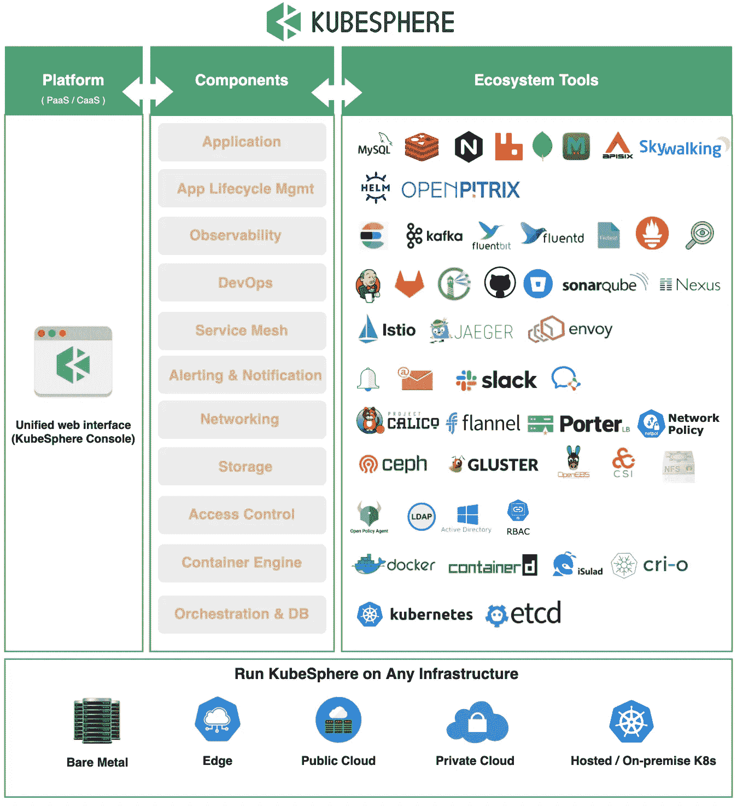

每个功能类别的开源项目，可以很容易地部署在 KubeSphere 中

此外，KubeSphere 可以安装在 Kubernetes 集群上，也可以直接安装在 Linux 机器上。在后一种情况下，安装程序将首先创建一个集群，并在该集群上安装 KubeSphere。在下一部分中，我们将提供一个本地虚拟机，并使用 kube key(KubeSphere 的新安装工具)在其中安装 Kubernetes 和 KubeSphere。

> KubeSphere 可以安装在任何本地 Kubernetes 集群和 Kubernetes 发行版上。

## 使用 KubeKey 创建本地单节点集群

为了创建一个集群并在其上安装 KubeSphere，我们将使用[Multipass](https://Multipass . run)在本地创建一个 Ubuntu 虚拟机:

首先我们定义一个 cloud-init 文件，我们将在下一步使用这个文件在虚拟机中安装所需的包(这些包在[的依赖需求](https://kubesphere.io/docs/quick-start/all-in-one-on-linux/)中列出)

```
**$ cat<<EOF > cloud.init** packages:
  - conntrack
  - socat
  - ebtables
  - ipset
**EOF**
```

接下来，我们创建一个名为 **ks 的 Ubuntu 18.04 虚拟机。**我们确保为其提供足够的资源，并提供之前定义的 cloud-init 文件:

```
$ multipass launch --name ks --cpus 4 --mem 5G --disk 30G --cloud-init ./cloud.init 18.04
```

接下来，我们从虚拟机上的根 shell 下载 KubeKey 二进制文件:

```
# curl -sfL https://get-kk.kubesphere.io | VERSION=v1.1.1 sh -
# chmod +x kk
```

然后，使用下面的命令，我们可以使用 KubeKey 创建一个单节点 Kubernetes 集群，并在该集群上安装 KubeSphere:

```
# ./kk create cluster \
  --with-kubernetes v1.20.6 \
  --with-kubesphere
```

ℹ️在这个命令中使用了几面旗帜:

*   *- with-kubernetes* 指定我们想要安装的 kubernetes 集群的版本
*   *- with-kubesphere* 指定我们希望在集群准备就绪时自动安装 kubesphere

[支持列表](https://kubesphere.io/docs/installing-on-linux/introduction/kubekey/#support-matrix)列出了 Kubesphere 目前支持的 Kubernetes 版本。

以上命令显示了虚拟机的当前状态，并在完成安装过程之前要求确认:

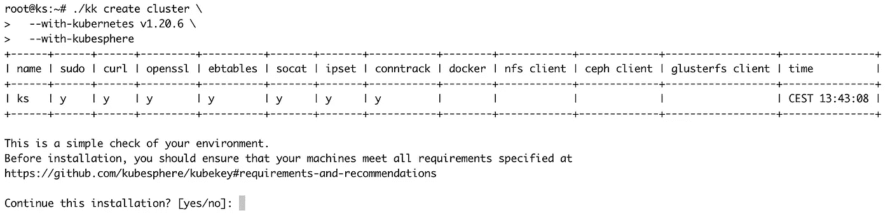

KubeKey 安装程序需要几分钟的时间，它使用 **kubeadm** 来构建集群。

安装完成后，我们将获得以下输出，其中提供了 web 控制台的 URL 和管理员密码:

```
#####################################################
###              Welcome to KubeSphere!           ###
#####################################################Console: [http://192.168.64.117:30880](http://192.168.64.117:30880)
Account: admin
Password: P@88w0rdNOTES：
  1\. After you log into the console, please check the
     monitoring status of service components in
     "Cluster Management". If any service is not
     ready, please wait patiently until all components
     are up and running.
  2\. Please change the default password after login.#####################################################
[https://kubesphere.io](https://kubesphere.io)             2021-07-22 14:17:19
#####################################################
INFO[14:17:23 CEST] Installation is complete.
```

ℹ️使用前面的安装命令，我们用默认配置选项创建了一个单节点集群。我们也可以先创建一个配置文件，修改它，然后使用这个配置运行集群创建命令。例如，下面的命令在 *config-sample.yaml* 文件中创建一个默认配置。

```
$ ./kk create config \
  --with-kubernetes v1.20.6 \
  --with-kubesphere
```

这个文件定义了一个**集群**和一个**集群配置**资源，我们可以在这个[要点](https://gist.github.com/lucj/8a2e7c2288efbbeda212a04eea71f526)中看到。这些资源允许对集群进行细粒度配置，例如:

*   主节点和工作节点的规范(IP 地址、用户名、认证方法)
*   Kubernetes 版本
*   要使用的 CNI 插件
*   必须在集群中安装/激活的组件(监控、日志记录、devops 工具、service mesh……)
*   …以及更多

KubeKey 可以使用这个文件通过下面的命令创建集群。

```
$ ./kk create cluster -f config-sample.yaml
```

## KubeSphere web 界面

创建命令的输出提供了登录到 web 控制台的所有信息

```
Console: [http://192.168.64.117:30880](http://192.168.64.117:30880)
Account: admin
Password: P@88w0rd
```

登录后，我们进入仪表板，对应于顶部菜单中的**工作台**项目。从那里我们得到基本信息和应用程序其他部分的链接。

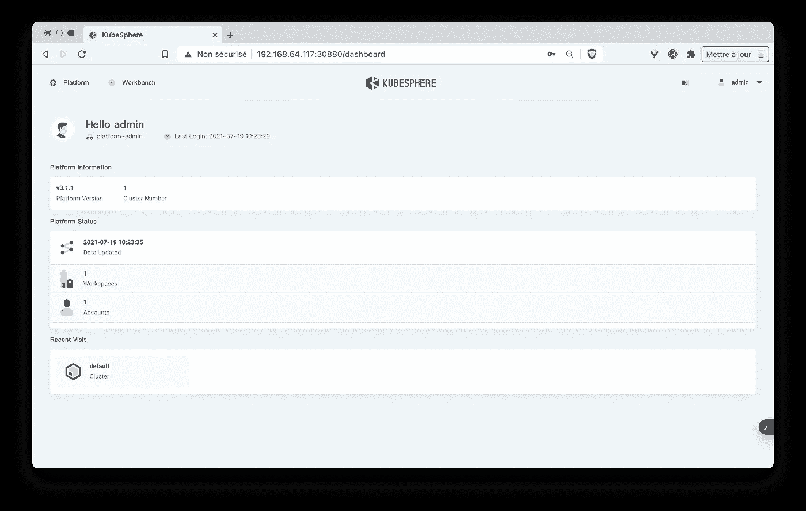

KubeSphere 仪表板

从**平台**项目，仍然在顶部菜单中，我们可以访问 KubeSphere 的 3 个主要部分，如下所示。

**集群管理**

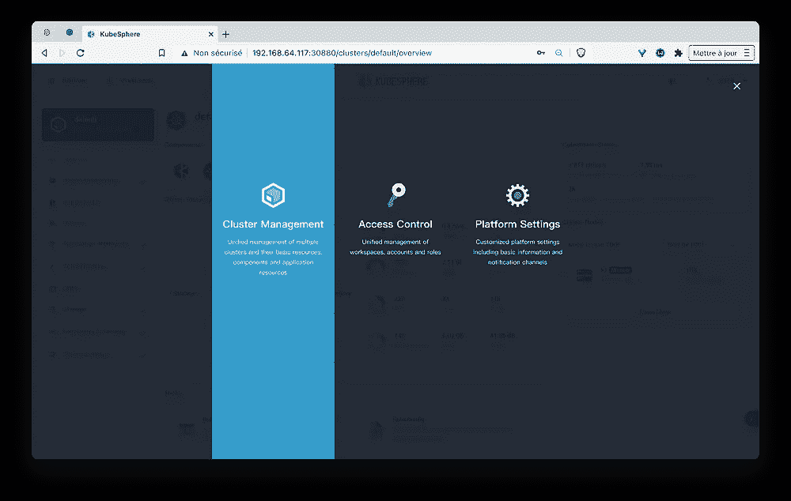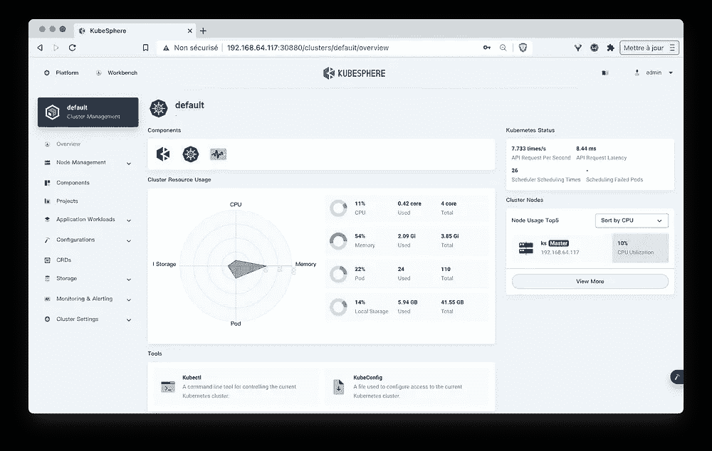

Kubernetes 集群管理

该菜单允许您从集群管理员的角度管理多个 Kubernetes 集群及其资源。在当前示例中，该视图提供了关于我们的单节点集群的信息。从左侧的菜单中，我们可以:

*   获取集群节点的详细信息
*   管理 KubeSphere **项目**
*   查看集群中部署的组件(稍后会详细介绍)
*   管理 Kubernetes 资源(工作负载、配置、CRD、存储…)
*   密切监视集群的运行状况

KubeSpher 的**项目**是一个基于常规 Kubernetes 名称空间的商业概念。它提供了额外的功能，允许在 KubeSphere 的**工作区**中对资源进行分组和隔离。

让我们首先创建一个名为 **demo** 的项目，稍后我们将使用该项目并在其中部署工作负载。

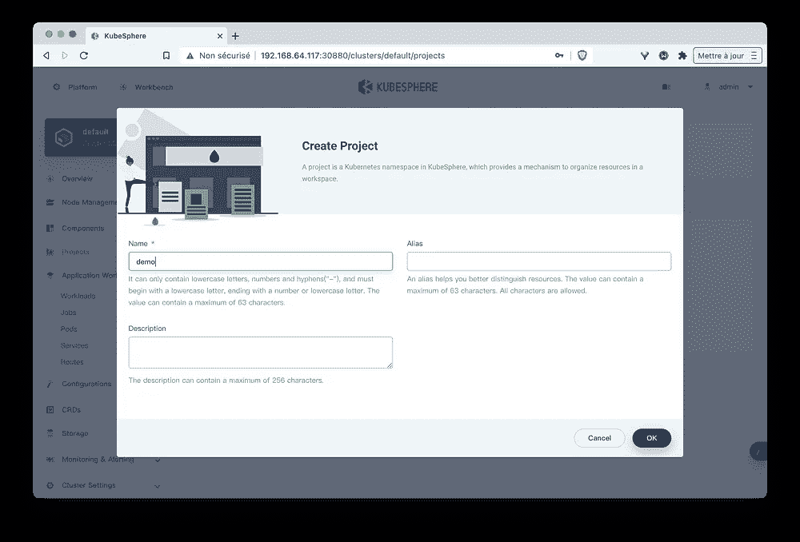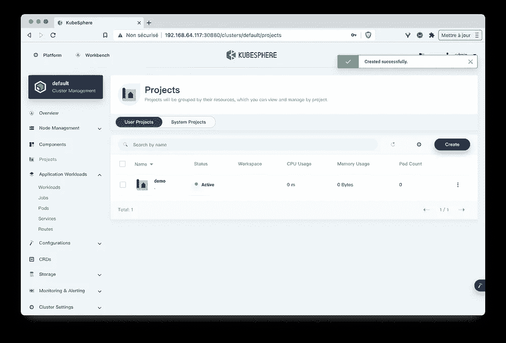

创建演示项目

创建后，我们可以获得项目的详细视图并管理其配额。

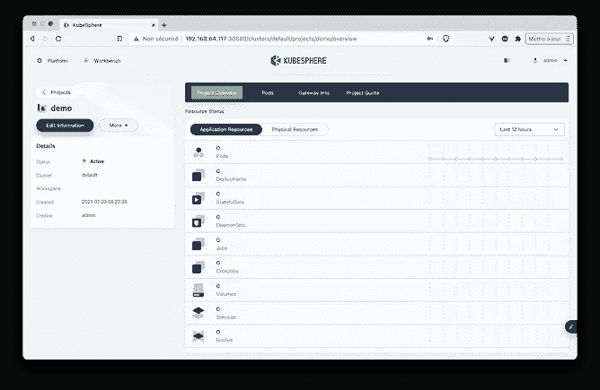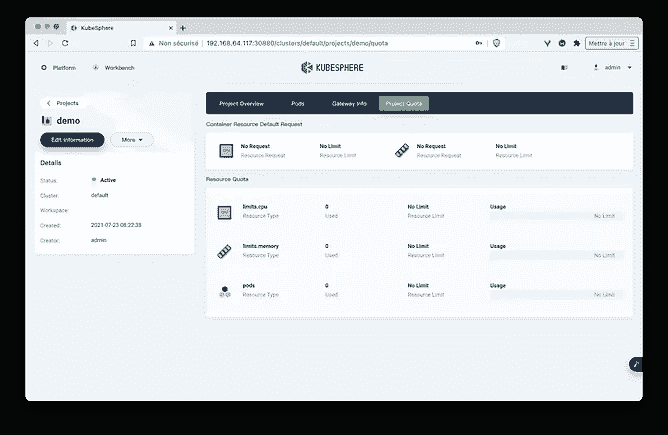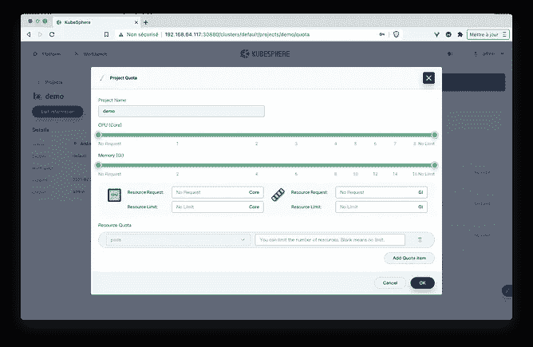

项目和定额管理的详细视图

在**项目定额**视图中，我们可以很容易地:

*   为项目中的每个容器定义 RAM 和 CPU 的默认请求/限制
*   定义项目中运行的资源可以使用的 RAM 和 CPU 的限制
*   限制项目中的资源数量(pod、部署、服务、机密等)

**访问控制**

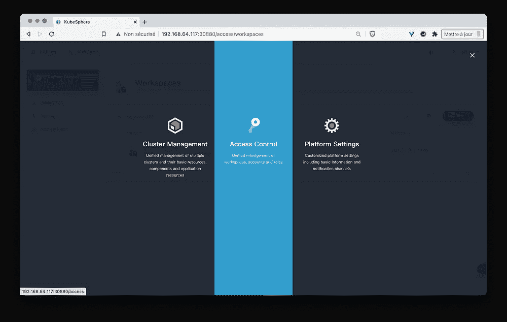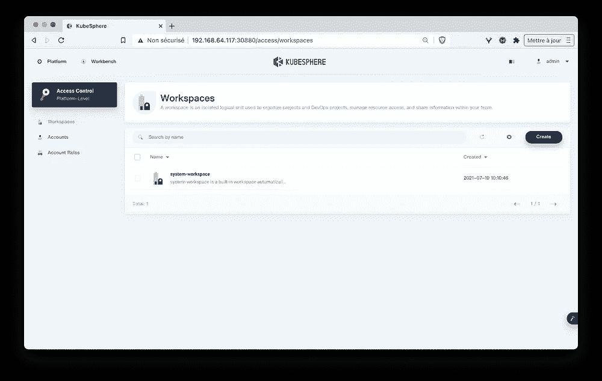

访问控制

此菜单允许您管理整个 KubeSphere 平台的访问。可以创建几个实体:

*   工作区(用于管理多个 KubeSphere 项目)
*   帐目
*   角色

工作空间被定义为“一个独立的逻辑单元，用于组织项目和开发项目，管理资源访问，以及在团队内部共享信息”。这基本上是一个提供集群业务视图的概念。

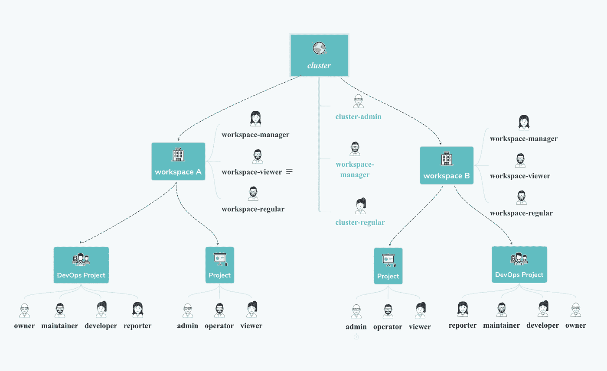

使用 KubeSphere 工作区和项目的分层视图示例

让我们创建一个名为 **demo:** 的工作区

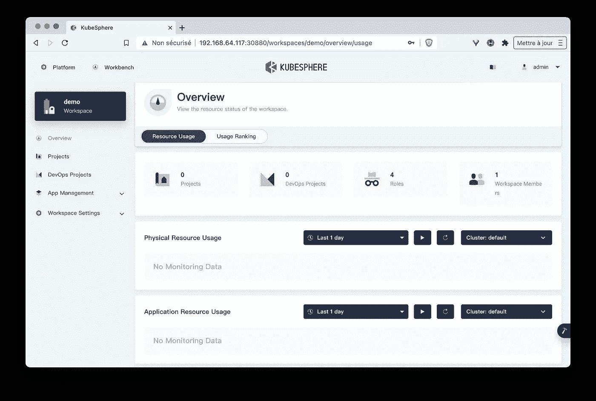

创建一个名为 demo 的工作区

创建工作空间后，我们可以定义:

*   属于工作区的项目和 DevOps 项目的列表(稍后会详细介绍)
*   可以在工作区中使用的应用程序存储库。应用程序存储库由托管 Helm 应用程序的 URL 指定
*   应用于工作区的配额
*   工作区中存在的角色和成员

为了将**演示**项目添加到**演示**工作区，我们需要进入**集群管理**部分的项目细节。

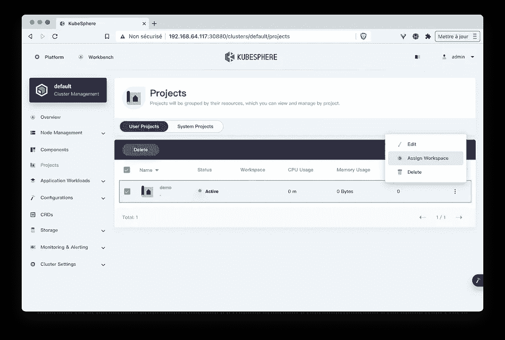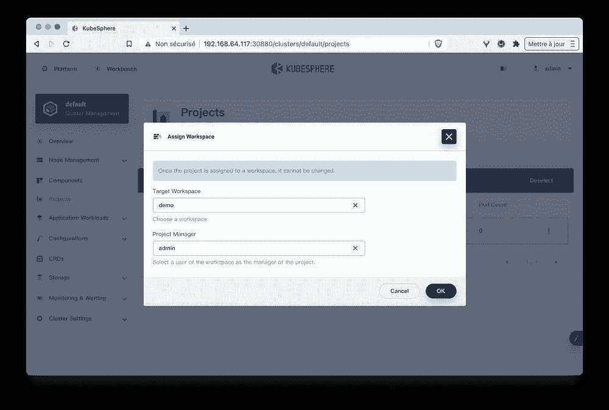

将**演示**项目添加到**演示**工作区

在下一部分中，我们将说明如何将一些工作负载部署到演示项目中。

## 平台设置

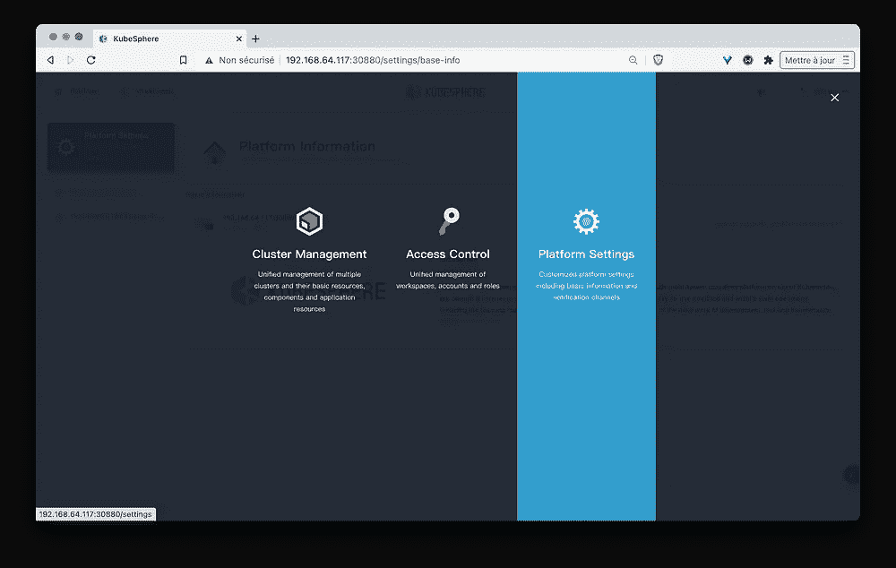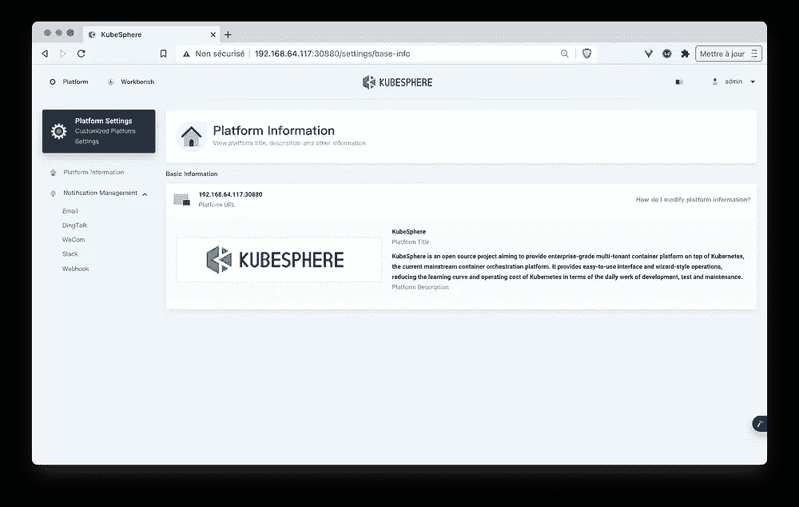

平台设置

此菜单允许获取关于 KubeSphere 平台的信息，并管理通知，以便平台的事件可以通过以下方式发送:

*   电子邮件
*   松弛的
*   瞎扯
*   WeCom
*   webhook

为了定义应该发送的警报，我们需要首先安装**警报和通知**系统。对于每个可插拔组件，这可以在 KubeSphere 的初始设置过程中完成，也可以在安装之后完成。在下文中，我们将说明如何在初始设置后启用组件，我们将重点关注 **DevOps** 系统，但同样的过程也适用于**警报和通知**系统或任何其他组件。

# 安装组件

当我们创建集群并在其中部署 KubeSphere 时，自动安装了**监控**组件(由于该组件，我们可以看到所有关于资源使用的漂亮图形。我们可以从**集群管理**的**组件**菜单中看到当前安装的所有组件。

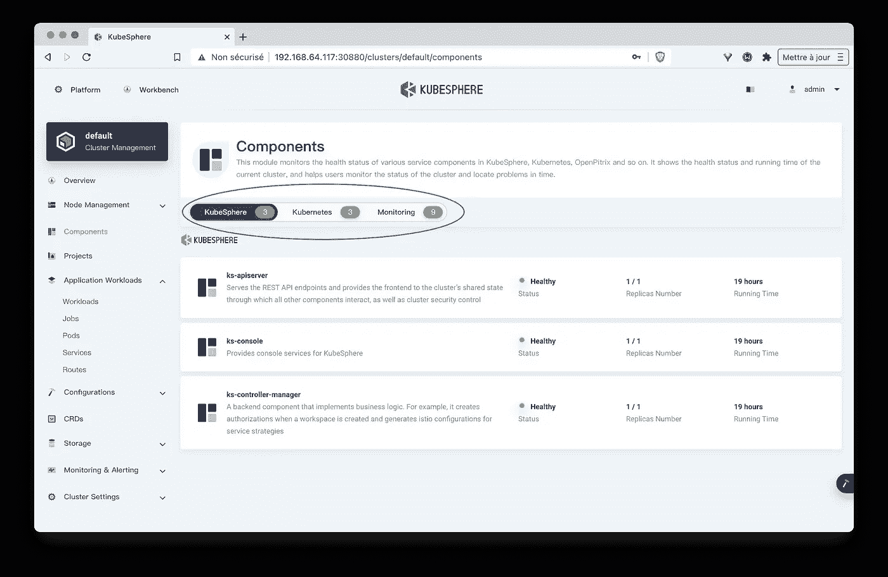

在创建时，我们可以指定额外的组件，但我们也可以在平台建立后安装它们。

在这一部分中，我们将启用 DevOps 组件，该组件基于 [Jenkins](https://jenkins.io/) ，有助于以直接和可视化的方式测试应用并将其发布到 Kubernetes。

由于已经部署了 KubeSphere，我们需要修改它附带的一个**集群配置**CRD(customresourcedinformation):

*   首先，我们进入 CRDs 菜单项
*   接下来，我们选择集群配置
*   然后我们将 *devops.enabled* 属性设置为 *true*

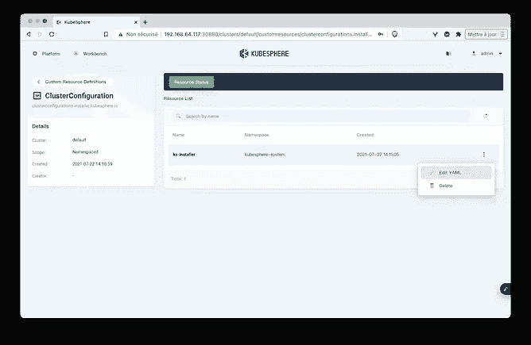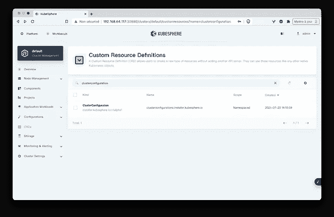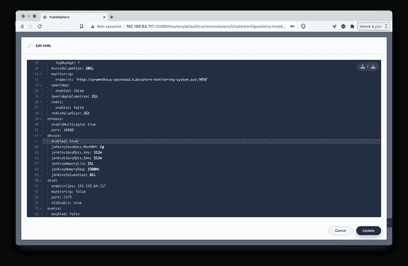

安装平台后启用 DevOps 组件

可以使用以下命令监控组件的安装:

```
$ kubectl logs -n kubesphere-system $(kubectl get pod -n kubesphere-system -l app=ks-install -o jsonpath='{.items[0].metadata.name}') -f
```

DevOps 组件准备就绪需要几分钟时间。一旦它可用，我们就可以在群集视图中看到它和所有相关的窗格:


DevOps 系统可用并在组件菜单项中列出

DevOps 系统允许执行许多操作，包括:

*   Jenkins 插件管理
*   [二进制转图像(B2I)](https://kubesphere.io/docs/project-user-guide/image-builder/binary-to-image/)
*   [源到图像(S2I)](https://kubesphere.io/docs/project-user-guide/image-builder/source-to-image/)
*   代码依赖缓存
*   代码质量分析
*   管道测井
*   通过 web 用户界面管理 CI/CD 管道

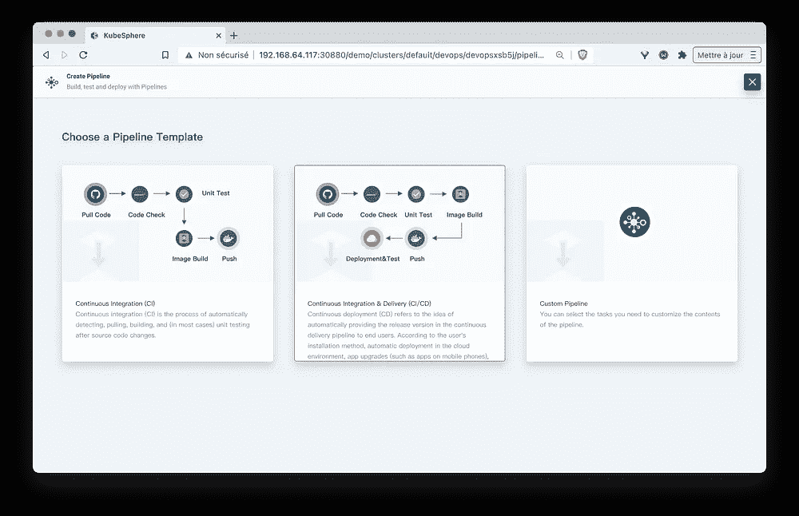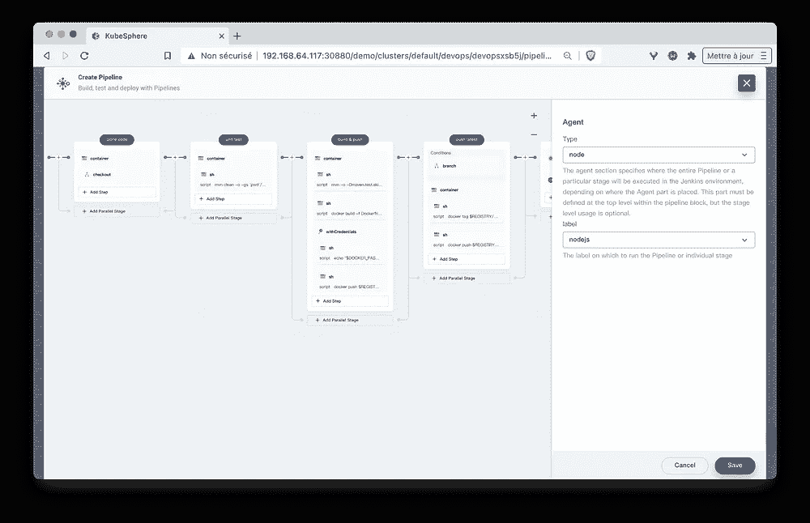

从 KubeSphere 管理 CI/CD 管道

我们不会深入讨论 DevOps 系统使用的细节，如果你想了解更多，你可以遵循 [KubeSphere 的 DevOps 用户指南](https://kubesphere.io/docs/devops-user-guide/)中提供的详细教程。

DevOps 系统将是 KubeSphere 系列的下一篇文章的目的，并且将涵盖使用 Jenkinsfile 创建 CI/CD 管道。

## 部署示例 web 应用程序

KubeSphere 允许您使用表单或在线编辑器非常容易地创建 Kubernetes 资源。让我们看看如何在一个简单的例子中实现这一点。

从**集群管理**部分的**应用工作负载**菜单中，我们可以通过 Deployment/stateful set/daemon set/Job/cron Job 等不同的资源来部署和公开工作负载。

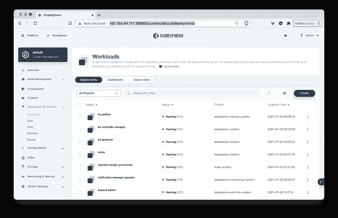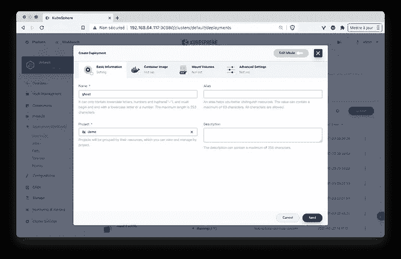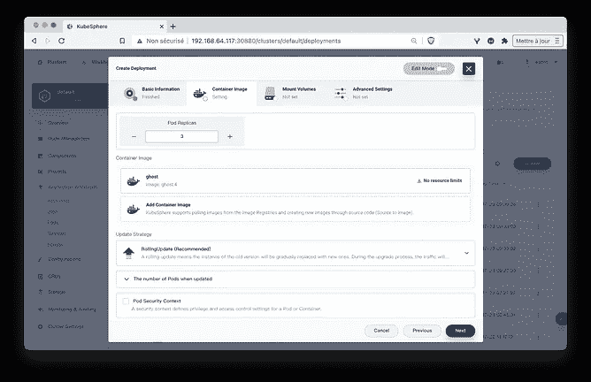

使用 Ghost 容器映像的 3 个副本创建部署

验证创建后，需要几十秒钟才能看到 Ghost Pods 已创建并正在运行:

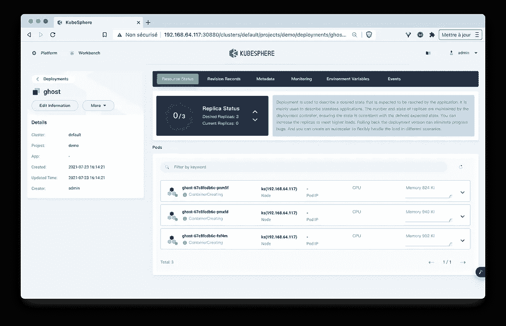

3 个 Ghost 副本开始运行

然后，我们可以用服务公开部署。这一次，我们使用**编辑模式**来定义我们需要的确切规范。在本例中，我们指定了一个监听端口 30000 的节点端口服务。

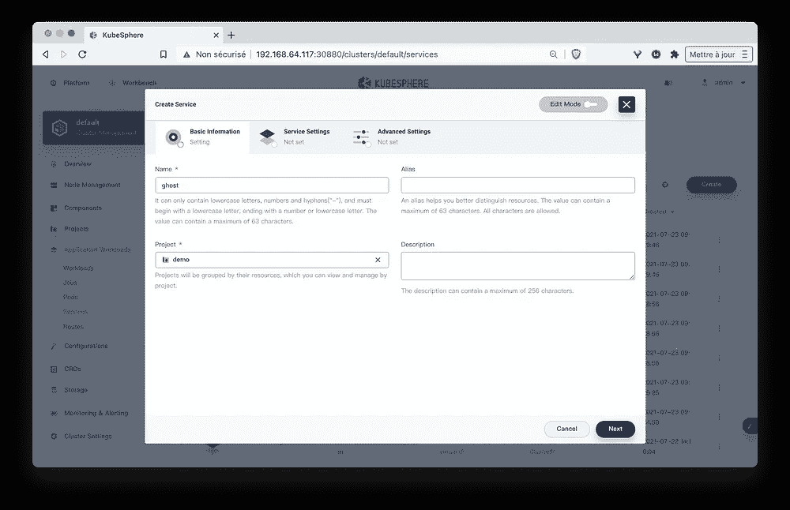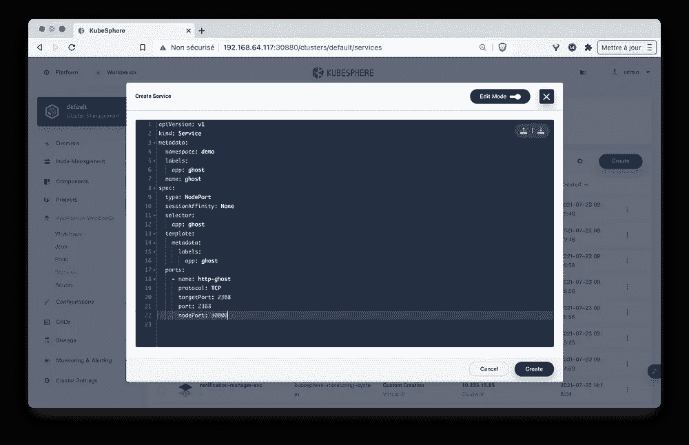

使用节点端口服务公开 Ghost Pods

然后，我们可以使用本地虚拟机的 IP 和新创建的服务的节点端口来访问 ghost 接口:

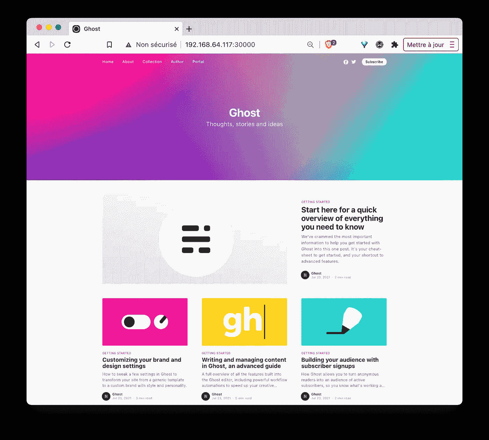

访问 ghost web 界面

## 关键外卖

这篇文章给出了 KubeSphere 的一个非常高层次的观点，因此只触及了这个伟大平台的表面。在以后的文章中，我们将详细介绍 DevOps 系统和 Kubernetes 多集群管理，这是两个主要功能。

更多剧集正在制作中，请不要犹豫在本地运行 KubeSphere 并使用它:)