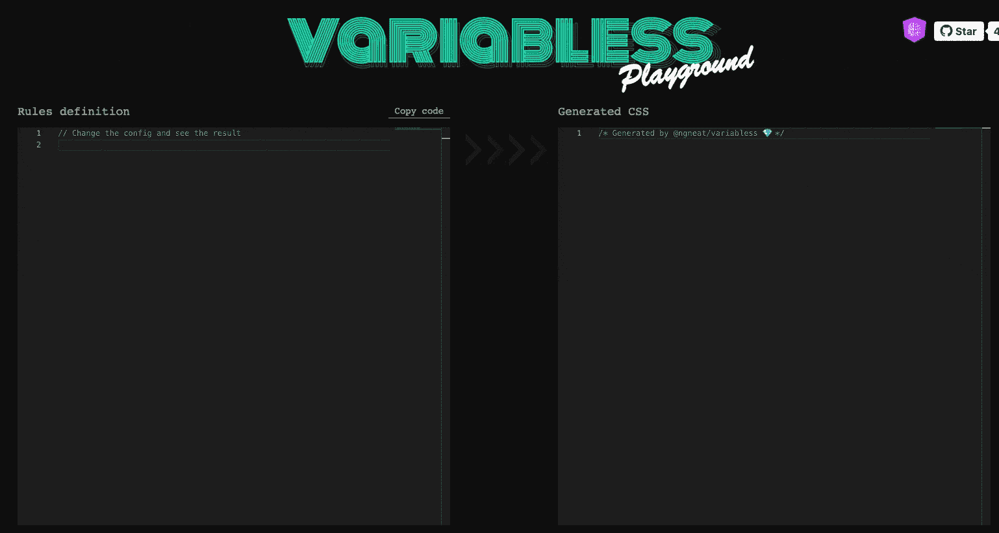
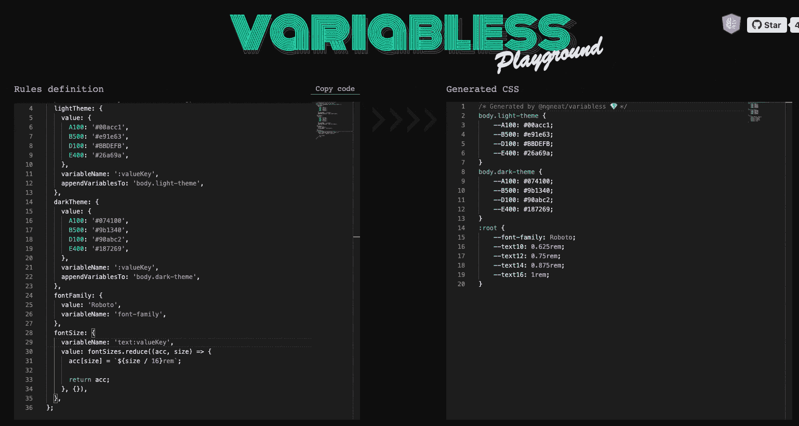

# 介绍 Variabless — JS 和 CSS 天作之合

> 原文：<https://itnext.io/introducing-variabless-js-css-a-match-made-in-heaven-80d38c295f7b?source=collection_archive---------2----------------------->


感谢[露比·德里](http://www.rubideri.com)设计了这个令人敬畏的标志🎉

我们都经历过。我们开始一个新项目，用 CSS variabless 创建我们的主题，然后最差；我们添加了公开 JS API 的第三方库来改变它们的风格。我们现在要干嘛？我们如何与那些图书馆分享我们可爱的主题？

别担心。我们掩护你！让我们看看 Variabless 的魔力:

## 一个单一的真相来源

Variabless 将把您的 Variabless 定义文件转换为 CSS 变量或属性，允许您在 JS 和 CSS 文件中使用这些值，而不是管理两组主题定义，一组在 CSS 中，另一组在 JS 中:



你可以在 [Variabless 游乐场](https://ngneat.github.io/variabless/)现场试试

现在，我们可以将主题传递给第三方库，并在 JS 代码中的任何地方使用它:

或者像其他变量一样在 CSS 文件中使用它:

## 样式生成器

Variabless 允许您轻松地创建实用程序类或任何您希望引用变量值的选择器。例如，让我们添加字体大小类:



尽可能简单🔥

## 使用 JS 的力量

Variabless 使用一个 JS 配置文件。这意味着你可以利用 JavaScript 来防止重复并保持你的配置整洁🧼

我们来看看下面的配置。我们想定义几种字体大小:

使用 JS，我们可以很容易地用一个更干净、更具可伸缩性的选项来替换它:

由于 Variabless 使用 JS 和 CSS 文件，您可以获得 IDE 的自动完成功能🎉

# 入门指南

## 装置

运行以下命令，通过 yarn 或 npm 安装 Variabless 包:

```
npm i -D @ngneat/variabless
yarn add -D @ngneat/variabless
```

## 使用

有两种方法可以通过 CLI 或 Webpack 插件使用 Variabless。

**推荐的方法** **是使用 Webpack 插件**，因为它为您提供了在开发过程中添加/删除变量的能力，同时您还可以处理项目，并在进行更改时看到结果。

你所要做的就是将`VariablessWebpackPlugin`添加到你的插件列表中:

您可以通过 CLI [在这里](https://github.com/ngneat/variabless#cli)找到使用信息。

将 Variabless 生成的文件包含在您的样式中:

将生成的文件添加到您的`.gitignore`文件中，没有必要跟踪它。

欲了解更多信息，请访问 variabless repo、docs 和 playground:

[](https://github.com/ngneat/variabless) [## GitHub-ng neat/variabless:JS & CSS-天作之合💎

### Variabless 允许您以一种真实的方式管理应用程序范围的 CSS 样式和变量…

github.com](https://github.com/ngneat/variabless) 

这个图书馆是我和❤️一起创建的