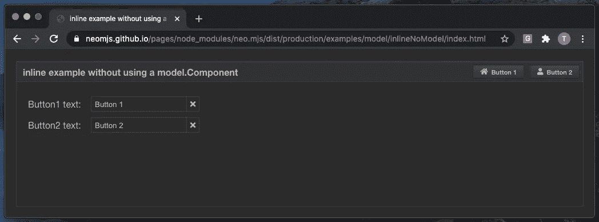
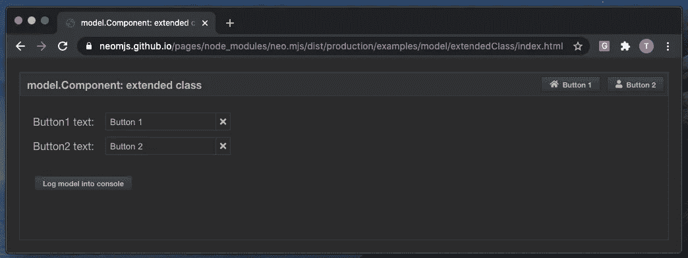
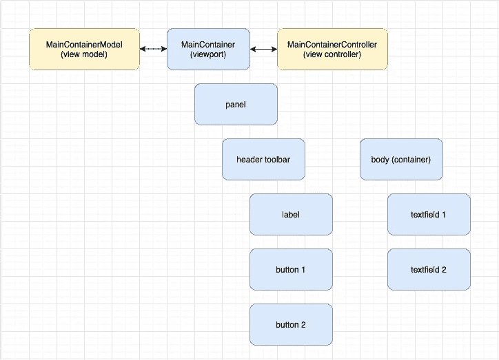
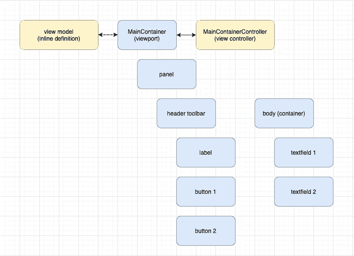
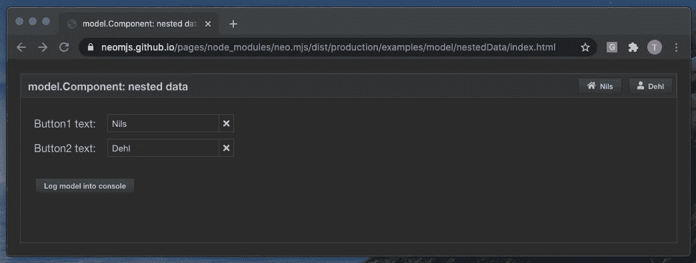
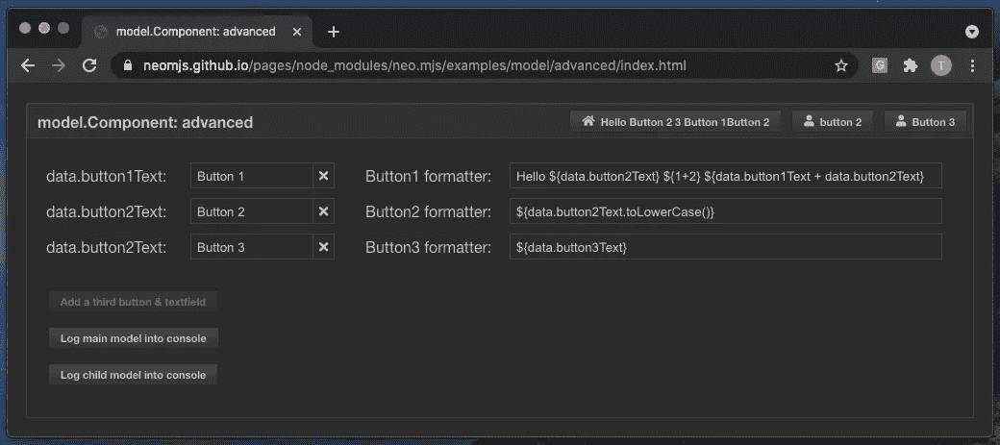
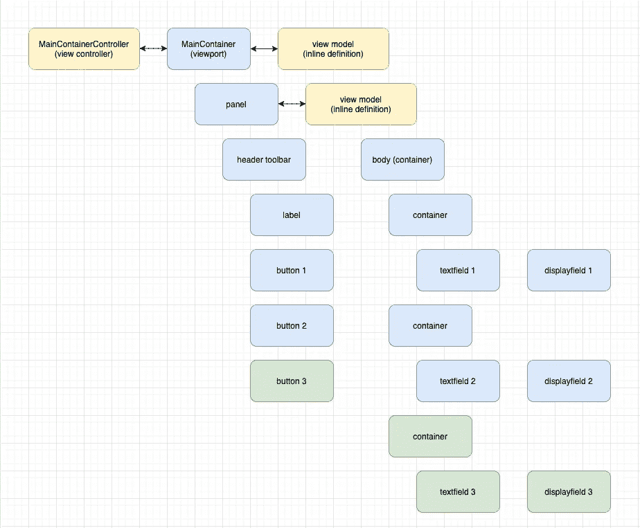
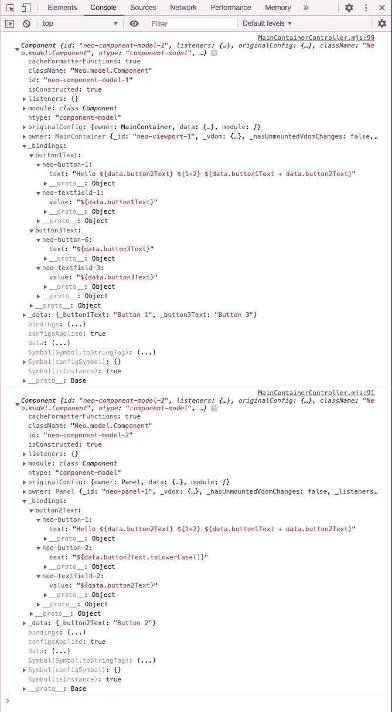

# neo.mjs Javascript UI 框架视图模型介绍

> 原文：<https://itnext.io/introducing-view-models-for-the-neo-mjs-javascript-ui-framework-f0989154a00f?source=collection_archive---------3----------------------->

**【重要更新】**此文已弃用。对于 neo.mjs 第 2 版，逻辑得到了显著改进。下面是新版本:

[](https://tobiasuhlig.medium.com/enhance-your-frontend-state-management-with-view-models-7bf49e1a0991) [## 使用视图模型增强您的前端状态管理

### 您很可能使用过 MobX、Redux 或 React 上下文 API。

tobiasuhlig.medium.com](https://tobiasuhlig.medium.com/enhance-your-frontend-state-management-with-view-models-7bf49e1a0991) 

本文将介绍使用新视图模型实现的一些可能性和优势。我们将讨论代码。很多！

虽然在 [neo.mjs](https://github.com/neomjs/neo) 中使用视图模型相当容易，但理解其内部逻辑是具有挑战性的，即使对于有经验的 Javascript 开发人员来说也是如此。

这篇文章分为两部分:

1.  如何为你的应用程序使用视图模型，包括几个示例应用程序的代码以及视频和在线演示
2.  引擎盖下:设计目标&谈视图模型的实现

欢迎来到第 1 部分！

# 内容

1.  介绍
2.  neo.mjs 是什么？
3.  不使用视图模型的简单演示应用程序
4.  使用视图模型类的简单演示应用程序
5.  使用内嵌视图模型的简单演示应用程序
6.  使用嵌套数据的简单演示应用程序
7.  高级演示应用
8.  在线演示
9.  源代码位置
10.  铊-溴
11.  感谢您的反馈！

# 1.介绍

组件(扩展[组件的类。基本](https://github.com/neomjs/neo/blob/dev/src/component/Base.mjs))和视图控制器(扩展[控制器的类)。组件](https://github.com/neomjs/neo/blob/dev/src/controller/Component.mjs)已经在框架内部很长时间了，所以支持 [MVVM 设计模式](https://en.wikipedia.org/wiki/Model-view-viewmodel)的缺失部分是视图模型。

我很兴奋地宣布，这个框架现在为这个主题提供了一个优雅的解决方案。优雅尤其与绑定格式化程序相关，它开箱即用，无需创建或使用模板引擎。这里的术语是[模板文字](https://developer.mozilla.org/en-US/docs/Web/JavaScript/Reference/Template_literals)。

视图模型可以帮助您调整复杂组件树的状态，并减少锅炉板代码。

我认为深入这个主题的一个好方法是创建一个简单的演示应用程序，首先不使用视图模型，然后将其转换为使用它们的版本。从那里我们可以转移到更高级的用例。

# 2.neo.mjs 是什么？

如果您已经熟悉该框架，请跳到第 3 步。

[neo.mjs](https://github.com/neomjs/neo) 是一个麻省理工学院许可的开源项目，它使你能够构建多线程前端，而无需关心工人设置或通信层。


一个扩展的 ES8+类配置系统帮助你在专业水平上创建 Javascript 驱动的 UI 代码。

一个独特的方面是，开发模式直接在浏览器中运行，没有任何构建或转换。对于调试来说，这可以节省大量时间。

只需更改一个顶层框架配置，就可以切换到 SharedWorkers 模式。这种模式使你能够创建下一代用户界面，否则这是很难实现的。

阅读这篇文章不需要任何网络工作者的知识。

请记住，所有组件实例都存在于应用程序工作者领域中。这意味着视图模型也存在于这个范围内。

# 3.不使用视图模型的简单演示应用程序



我们正在创建一个包含面板的视口(MainContainer)。

我们希望将两个文本字段都连接到匹配的按钮，这样，更改输入值将会更新按钮文本。单击按钮应该会将匹配的字段值重置为其原始值。

[在线演示(分销/制作)](https://neomjs.github.io/pages/node_modules/neo.mjs/dist/production/examples/model/inlineNoModel/index.html)

这个演示应用的架构非常简单:


让我们看一下主容器代码:

视图定义不包含任何应有的业务逻辑。

基于 JSON 的项目定义遵循架构图。

您将注意到基于字符串的按钮处理程序和监听器→它们将被映射到我们的视图控制器中，期望在那里(或者在父视图控制器中)找到具有相同名称的真实方法。

我们还使用了 4 个引用，这使得访问特定项目更加容易。有几种不同的方法可以访问子项，例如使用[管理器。组件](https://github.com/neomjs/neo/blob/dev/src/manager/Component.mjs)。

主容器控制器:

我们使用配置来存储我们的两个数据属性 button1Text_ 和 button2Text_。使用尾部下划线，配置系统将使我们能够选择性地使用 beforeGetName()、beforeSetName()和 afterSetName()。“名称”等于配置名称的大写版本。

在`afterSetButton1Text()`中，我们正在更新 button1 引用的文本配置以及 textfield1 引用的值配置。

`afterSetButton2Text()`对 button2 和 textfield2 执行相同的操作。

我们忽略第一个初始调用(oldValue === undefined)，因为在这个时间点，视图控制器还没有解析视图配置。我们在`onViewParsed()`方法内部做这件事。

您可能想知道我们是否应该在`updateReferences()`中添加更多检查，例如，如果您在 textfield1 中键入，该方法不仅会调整 button1 文本配置，还会将 textfield1 本身的值 config 设置为相同的值。这很好！如果设置了相同的值，就不会有变化事件→相关的`afterSet()`方法不会被触发→不检查增量更新甚至 DOM 操作。

`onButtonClick1()`将把我们的`button1Text`控制器配置设置为初始值，`onTextField1Change()`将把控制器配置设置为新的输入值。“2”也是如此。

您也可以将这两个数据属性添加到视图类(MainContainer)中。这对于本例来说没有意义，但这是创建新组件的一般方法(扩展所需的基类并向其中添加新配置、新方法和/或覆盖)。

希望到现在一切都清楚了。第一个演示应用程序非常简单。如果没有，请提问！

# 4.使用视图模型的简单演示应用程序



显然，我们保持相同的视图架构。
嗯，我添加了一个按钮来记录模型实例:)
(图中没有显示，因为不相关)

唯一的区别是我们添加了新的模型。组合中的组件类别:

我们正在扩展模型。组件，并将我们的 2 个数据属性添加到一个数据配置中，而不是将每个属性都添加为顶级配置。这对于支持更深层次的嵌套数据结构非常重要。

当然，您也可以在这里添加新的方法或覆盖。neo.mjs 的一个优点是你可以扩展和改变几乎所有的东西。

下一个主容器:

我们正在导入新的模型类(第 2 行),并将导入的模块放入模型配置中。

在视图定义中，您会注意到 4 个引用都不见了。我们不再需要它们了。

相反，我们使用 4 个绑定对象。

```
bind: {
    value: '${data.button1Text}'
},
```

绑定对象中使用的键应该匹配类配置名。

我们的视图模型将在组件生命周期的早期自动添加绑定的配置键值。这发生在组件`constructor`完成之前。

我们的视图模型还会在每次相关数据属性改变时更新组件配置。

当然，您可以为每个组件添加多个绑定。

仔细观察绑定值→ `”${data.button1Text}”`,您会注意到我们使用了与[模板文字](https://developer.mozilla.org/en-US/docs/Web/JavaScript/Reference/Template_literals)完全相同的语法。唯一的区别是，这是一个真正的字符串，而不是``。

主容器控制器:

您会注意到控制器内部的逻辑变得更简单了。

2 个数据属性配置消失。

我们使用 2 个按钮处理程序和 2 个 textfield 更改监听器来简单地更改视图模型数据属性。

`controller.getModel()`将返回连接组件父树中最近的模型，因此不是每个组件都必须使用自己的模型。

我使用两种不同的方法来改变数据属性，只是为了演示的目的。

```
this.getModel().data['button1Text'] = value;
```

或者

```
this.getModel().data.button1Text = value;
```

如果您确定数据属性确实存在于父树链中最近的模型上，您可以简单地为它分配一个新值。

这个“任务”触发了引擎盖下的 setter。

```
this.getModel().setData({
    button2Text: value
});
```

`setData()`是做这件事的更好方法。您可以一次更改多个数据属性，该方法将在组件视图模型的父链中搜索每个键。如果没有为给定的键找到匹配，新的数据属性将在最接近的模型级别上注册。

**到目前为止我们学到了什么:**

1.  使用视图模型是可选的，没有它们也可以创建相同的业务逻辑。
2.  视图模型可以减少代码量:
    使用绑定，你只需要更新 vm 数据属性

# 5.使用内嵌视图模型的简单演示应用程序



主容器:

如果我们只想在视图模型上设置数据属性，我们不需要扩展这个类。

相反，我们可以将一个对象分配给组件模型配置。

`module: ComponentModel`在这里是可选的，但是模型导入(第 1 行)不是。因为视图模型是可选的，所以框架不会自动导入它们的基类。

# 6.使用嵌套数据的简单演示应用程序



主容器:

【旁注】我在这里用的是 [Nils](https://www.linkedin.com/in/nils-dehl/) 的名字，我希望这样没问题:)Nils 是 Ext JS 的专家，也是早期 [neo.mjs](https://github.com/neomjs/neo) 的贡献者之一。再次感谢你对现实世界演示应用的帮助！

我跳过了模型对象定义中的`module: ComponentModel`。

我们在这里嵌套了 3 层数据。

```
bind: {
    text: '${data.user.details.firstname}'
}
```

我们的绑定值仍然遵循[模板文字](https://developer.mozilla.org/en-US/docs/Web/JavaScript/Reference/Template_literals)语法。

只有两个数据属性设置发生了变化。

您仍然可以简单地将数据属性叶更改为赋值。
(甚至通过`Object.defineProperty()` → get() & set())创建嵌套结构)

在`setData()`方法中使用基于字符串的数据路径很重要。值可能是对象，在这种情况下，我们无法知道属性的结束和值的开始。在第 2 部分中有更多关于这个主题的内容。

# 7.高级演示应用



高级演示体系结构是之前演示的扩展版本。这次我们使用两个视图模型。

body 容器使用垂直框(vbox)布局，因为我们现在也想显示每个按钮格式化程序，所以我们将每个“行”包装到一个容器中(包含一个 textfield 和一个 displayfield 的水平框(hbox)布局)。

我对一些项目使用了绿色→当你点击“添加第三个按钮&文本字段”按钮时，这些项目会被动态添加。

主容器:

这里真正重要的部分是顶层视图模型包含数据属性`button**1**Text` & `button**3**Text`，而面板(子)视图模型包含`button**2**Text`。

查看前两个按钮格式化程序:

```
text: 'Hello ${data.button2Text} ${1+2} ${data.button**1**Text + data.button**2**Text}'
```

button1 格式化程序包含主容器模型`button1Text`数据属性以及面板模型`button2Text`数据属性。

显然，无论模型级别如何，我们都希望文本在这两个属性中的任何一个发生变化时都会更新。这正是所发生的:)

```
text: '${data.button2Text.toLowerCase()}'
```

您可以对每个数据属性调用函数。数据属性解析器足够智能，可以判断出您的绑定属性名称是“data.button2Text”。

由于 button2Text 是一个字符串，使用`.toLowerCase()`就可以了。

主容器控制器:

在第一个方法`onAddButtonTextfieldButtonClick()`中，我们在面板主体中添加了一个新的“row”容器。我们的视图定义中的`itemDefaults` config 仍然在使用，所以我们不需要指定模块或布局。

同时，我们还在标题工具栏中添加了 button3。

这里的关键部分是，两个项目定义都包含绑定配置，它们应该以与我们的初始视图定义相同的方式工作。

好消息是:动态添加绑定也非常好:)

快速了解 3 种数据属性更新方法:

```
updateButton2Text(value) {
    this.getReference('panel').getModel().setData({
        button2Text: value || ''
    });
}
```

访问面板(子)模型是最好的方法。另外两种方法只是为了测试不同的方式。

```
updateButton3Text(value) {
    this.getModel().data['button3Text'] = value;
}
```

我们的 MainContainerController 连接到我们的 MainContainer 视图。调用`this.getModel()`将访问顶层视图模型。因为`button1Text`和`button2Text`是在这个层次上定义的，所以它工作得很好。

```
updateButton1Text(value) {
    this.getReference('panel').getModel().setData('button1Text', value || '');
}
```

这个调用基本上是一个测试:我们在面板(子)模型上调用`setData()`，知道`button1Text`数据属性确实存在于父级。工作正常。

# 8.在线演示

**分发/生产:**
基于 Webpack 的构建(缩小)。在所有主流浏览器中运行。

[示例/模型/高级/](https://neomjs.github.io/pages/node_modules/neo.mjs/dist/production/examples/model/advanced/index.html)

[示例/模型/扩展类/](https://neomjs.github.io/pages/node_modules/neo.mjs/dist/production/examples/model/extendedClass/index.html)

[示例/模型/内联/](https://neomjs.github.io/pages/node_modules/neo.mjs/dist/production/examples/model/inline/index.html)

[示例/模型/inlineNoModel/](https://neomjs.github.io/pages/node_modules/neo.mjs/dist/production/examples/model/inlineNoModel/index.html)

[示例/模型/嵌套数据/](https://neomjs.github.io/pages/node_modules/neo.mjs/dist/production/examples/model/nestedData/index.html)

**开发模式:** 直接在你的浏览器内部使用真实代码，不需要任何编译或编译。这种模式仅限于 Chromium (Chrome & Edge)，因为其他浏览器还不支持 worker 范围内的 JS 模块。

[范例/模型/高级/](https://neomjs.github.io/pages/node_modules/neo.mjs/examples/model/advanced/index.html)

[示例/模型/扩展类/](https://neomjs.github.io/pages/node_modules/neo.mjs/examples/model/extendedClass/index.html)

[示例/模型/内嵌/](https://neomjs.github.io/pages/node_modules/neo.mjs/examples/model/inline/index.html)

[示例/模型/inlineNoModel/](https://neomjs.github.io/pages/node_modules/neo.mjs/examples/model/inlineNoModel/index.html)

[范例/模型/嵌套数据/](https://neomjs.github.io/pages/node_modules/neo.mjs/examples/model/nestedData/index.html)

您可以将模型实例动态登录到您的控制台
(左下角的按钮):



您的重点应该放在绑定和数据配置上。

[提示]控制台日志在开发模式中更有意义
→非精简类名。

# 9.源代码位置

你可以在这里找到所有例子的源代码:
【https://github.com/neomjs/neo/tree/dev/examples/model】T4

我们将讨论模型的内部逻辑。本文第 2 部分中的组件。到目前为止，它“只是”500 行代码，我尽力保持它非常干净和结构化。

如果你是一名 Javascript 专家，并且很想现在就深入研究一下:
[https://github . com/neom js/neo/blob/dev/src/model/component . mjs](https://github.com/neomjs/neo/blob/dev/src/model/Component.mjs)

# 10.铊-溴

使用新的 [neo.mjs](https://github.com/neomjs/neo) 视图模型可以做的事情的可能性是惊人的！您不仅可以显著减少您的锅炉板应用程序代码，而且还可以轻松地修改您的视图相关状态。

总结一下:

1.  使用视图模型是可选的，没有它们也可以创建相同的业务逻辑。
2.  视图模型可以减少代码量:
    使用绑定，你只需要更新 vm 数据属性。
3.  您可以动态地改变您的视图，绑定是持久的。
4.  您可以动态地添加包含绑定的视图，即使它们没有自己的视图模型。
5.  不是每个视图都需要自己的视图模型，你总是可以通过调用`myComponent.getModel()`来访问最近的父模型。
6.  我个人建议不要为应用程序视图结构中的“叶节点”注册模型(例如按钮、表单字段或其他简单的组件)。

# 11.感谢您的反馈！

我很期待看到像您这样有才华的开发人员使用这项新技术可以实现什么。

如果你有什么好东西或有问题，请务必给我一个 ping！

第 2 部分(幕后:设计目标&讨论视图模型实现)应该在接下来的几天内准备好。这一篇还将包含对未来增强的讨论(例如，在格式化程序中使用方法)，您的反馈对这一点至关重要。

最诚挚的问候&快乐编码，
托比亚斯