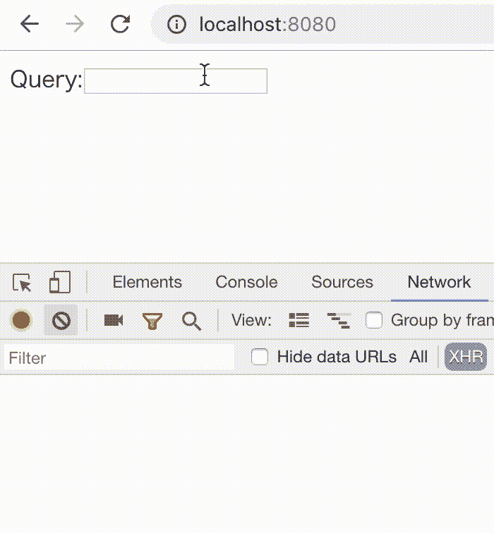

# 用钩子反应的可移植异步函数介绍

> 原文：<https://itnext.io/introduction-to-abortable-async-functions-for-react-with-hooks-768bc72c0a2b?source=collection_archive---------2----------------------->

寻求反应钩的可能性。


> 有一篇后续文章描述了该库的实现细节。请点击访问[。](https://medium.com/p/1f2091b5a1c3)

## TL；速度三角形定位法(dead reckoning)

只需访问 codesandbox 中的[示例](https://codesandbox.io/s/github/dai-shi/react-hooks-async/tree/master/examples/04_typeahead)并尝试一下。

## 背景

在 JavaScript 中你不能取消承诺，这也是像 redux-saga 和 redux-observables 这样的库受欢迎的原因之一，因为它们允许取消。虽然它们和 Redux 一样都是很好的解决方案，但是可能会出现这样的情况:您只想要一个承诺的取消机制，而不是整个框架。如前所述，JavaScript 没有取消机制，但是 DOM 有。它叫做[人工流产控制器](https://developer.mozilla.org/en-US/docs/Web/API/AbortController)。它仅在最新的浏览器中受支持，但 polyfills 应该对旧浏览器和 Node.js 有所帮助。

React Hooks API 是 React 16.7 即将推出的新特性。您可以创建一个自定义挂钩来跨组件共享逻辑。钩子只是函数，你可以很容易地组合它们。有许多关于定制钩子的提议，包括处理异步函数。据我所知，还没有关于可移植异步函数的提议。如果我们可以用钩子轻松地使用可移植的异步函数，这对于引入大框架不是一个好的选择的小用例来说将是有用的。

在本文中，我们用一个用例来说明如何在钩子中实现它。我们不深入研究库的实现，而是关注它的使用来理解它是如何被接受的。用例是所谓的“提前输入搜索”，你有一个可以输入的文本框，当你输入一个搜索查询时，搜索结果会即时显示出来。在这个用例中有三个困难；a)我们必须处理钩子中的异步副作用，b)我们需要中止先前不再有效的不完整搜索，c)我们希望在开始搜索之前有一个延迟，以减少网络请求的数量。

## 处理异步函数的钩子

现在，让我们看看处理可移植异步函数的钩子。第一个是创建异步任务的钩子。

```
const task = useAsyncTask(func, inputs);
```

`func`是一个带有 AbortController 参数的函数。该函数返回一个承诺，但该函数负责取消 AbortController 的承诺。只是这个钩子的一个规则。没有魔法。`inputs`是一个输入数组，就像`useEffect`的第二个参数一样。这控制何时创建异步任务。这确实很棘手，但是让我们假设开发人员已经习惯于使用第二个参数`useEffect`。这个钩子返回的`task`包含了任务状态的信息，你可以很容易地对它进行析构:`const { pending, error, result } = task;`

第二个钩子运行由上面第一个钩子创建的异步任务。

```
useAsyncRun(task);
```

这只会启动一次异步任务。然而，这并不意味着只有一个异步任务会运行。如上所述，我们可以通过`inputs`控制创建异步任务，因此最终它会运行几个异步任务。`useAsyncRun`的重要之处在于，如果前一个任务尚未完成，它会自动中止该任务。您可以向`useAsyncRun`的参数传递一个 falsy 值，通过它您可以控制何时启动一个异步任务。

核心钩子就是上面的两个，但是我们需要另一个钩子用于我们的用例。第三个挂钩是顺序组合几个异步任务。

```
const combinedTask = useAsyncCombineSeq(task1, task2);
```

这个钩子返回的`combinedTask`包含了关于组合任务状态的信息，但是对于`result`，从每个任务中读取它应该更容易并且类型安全。

虽然`useAsyncTask`足以创建一个异步任务，但是用它需要处理 AbortController 的规则编写一个`func`并不容易。因此，我们提供了两个包装`useAsyncTask`的辅助钩子。

```
const task1 = useAsyncTaskTimeout(func, delay);
const task2 = useAsyncTaskFetch(url);
```

`useAsyncTaskTimeout`只是等待一定的时间，然后运行`func`。

`useAsyncTaskFetch`是从`url`获取 JSON 数据。您还可以使用“POST”方法并通过选项获取非 JSON 数据。

## 用例示例

是时候编码并运行用例了。我们使用 GitHub 知识库搜索。在这个用例示例中，当您键入一个查询字符串时，它将显示搜索结果。



示例的截屏

下面是实现这个例子的代码。关于 TypeScript 中的具体代码，请访问 codesandbox 中的[示例](https://codesandbox.io/s/github/dai-shi/react-hooks-async/tree/master/examples/04_typeahead)或 GitHub 中的[库](https://github.com/dai-shi/react-hooks-async)。

```
const GitHubSearch = ({ query }) => {
  const url =
    `https://api.github.com/search/repositories?q=${query}`;
  const timeoutTask = useAsyncTaskTimeout(
    useCallback(() => true, [query]),
    500,
  );
  const fetchTask = useAsyncTaskFetch(url);
  const combinedTask = useAsyncCombineSeq(timeoutTask, fetchTask);
  useAsyncRun(query && combinedTask);
  if (!query) return null;
  if (timeoutTask.pending) return <div>Waiting...</div>;
  if (fetchTask.error) return <Err error={fetchTask.error} />;
  if (fetchTask.pending) return <Loading abort={fetchTask.abort} />;
  return (
    <ul>
      {fetchTask.result.items.map(({ id, name, html_url }) => (
        <li key={id}>
          <a target="_blank" href={html_url}>{name}</a>
        </li>
      ))}
    </ul>
  );
};

const App = () => {
  const [query, setQuery] = useState('');
  return (
    <div>
      Query:
      <input
        value={query}
        onChange={e => setQuery(e.target.value)}
      />
      <GitHubSearch query={query} />
    </div>
  );
};
```

代码的一些注释:

1.  `useAsyncTaskTimeout`的第一个论点是最棘手的一个。因为钩子使用输入标识来创建一个异步任务，所以您需要记忆它来控制它。在这种情况下，我们使用`useCallback`。注意，第一个参数函数的返回值在这里并不重要。
2.  我们在`useAsyncRun`的第一个论点中使用`query &&`。这是为了防止在`query === ''`时运行异步任务，我们在`if (!query) return null;`前不渲染任何东西。
3.  `timeoutTask.pending`代表 500ms 延迟的等待阶段，而`fetchTask.pending`代表联网阶段。不幸的是，我们无法在网络阶段区分连接阶段和传输阶段。
4.  您可以通过按下`<Loading abort={fetchTask.abort} />`中的一个按钮来手动中止获取任务，该按钮的代码没有在本文中显示。

在演示中看看它是如何工作的。

[](https://codesandbox.io/s/github/dai-shi/react-hooks-async/tree/master/examples/04_typeahead?module=%2Fsrc%2FGitHubSearch.tsx) [## react-hooks-async-example-code sandbox

### 为 web 应用程序定制的在线代码编辑器

codesandbox.io](https://codesandbox.io/s/github/dai-shi/react-hooks-async/tree/master/examples/04_typeahead?module=%2Fsrc%2FGitHubSearch.tsx) 

## 图书馆

如果你有兴趣，请去图书馆看看。我们仍然不确定这是如何被接受的，并希望听到各种反馈，包括自定义挂钩设计、用例、实现问题等等。请通过 Medium responses、Twitter 和 GitHub 问题给我留言。

[](https://github.com/dai-shi/react-hooks-async) [## 戴式/反应式挂钩异步

### React Hooks-Dai-Shi/React-Hooks-async 的异步函数库

github.com](https://github.com/dai-shi/react-hooks-async) 

## 最终注释

在开始开发这个想法之前，我犹豫了一下，因为在 React 路线图中，我们预计在不久的将来会有悬念和 react-cache。总的来说，这将大大改变数据获取。

好吧，在写作的时候，悬念和反应缓存还没有出现。不过，胡克也不是。对于某个用例，没有悬念的钩子在数据获取中可能起作用，也可能不起作用。我们会看到的。