# Angular 语言服务简介

> 原文：<https://itnext.io/introduction-to-angular-language-service-4d3e67901a77?source=collection_archive---------1----------------------->

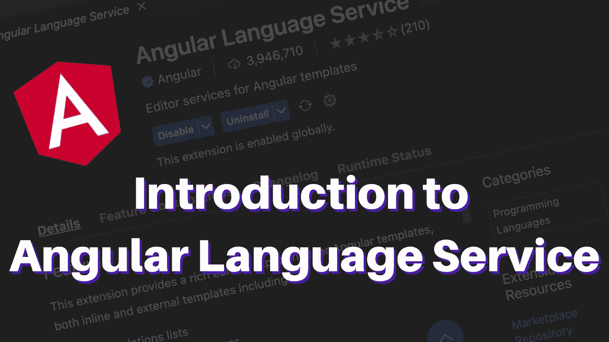

使用 Angular 有它的缺点，但真正让它开始变得有趣的是它的语言服务。

## 什么是语言服务？

语言服务是一个你输入代码的程序，它会在每个文件的基础上向你报告**完成**、**错误**、**提示**和**诊断**，同时区分每个文件的语法和语义错误。这就是 Angular 语言服务为 Angular 项目所做的事情。

## 它对我们有什么帮助？

角度代码文件以**结尾。ts** 或**。html** ，所以代码编辑器认为我们正在编写 Typescript 和 html 代码，但这并不完全正确。因为，除此之外我们还在编写 Angular 的具体语法，比如:**组件**、**指令**、**属性** / **事件** **绑定**等。代码编辑对它们一无所知。

这就是语言服务为我们做的；它知道你在一个 Angular 项目中，并告诉编辑器 Angular 的具体语法是什么。

> VS 代码使用 [Typescript 语言服务](https://github.com/typescript-language-server/typescript-language-server)和 [HTML 语言服务](https://github.com/microsoft/vscode-html-languageservice)来理解 Typescript 和 HTML 文件，因为它们被广泛使用，所以默认情况下它们与 VS 代码捆绑在一起。

如果我们刚刚安装了 VS 代码，并使用内联模板打开了一个 Angular 组件，我们将看到以下内容:

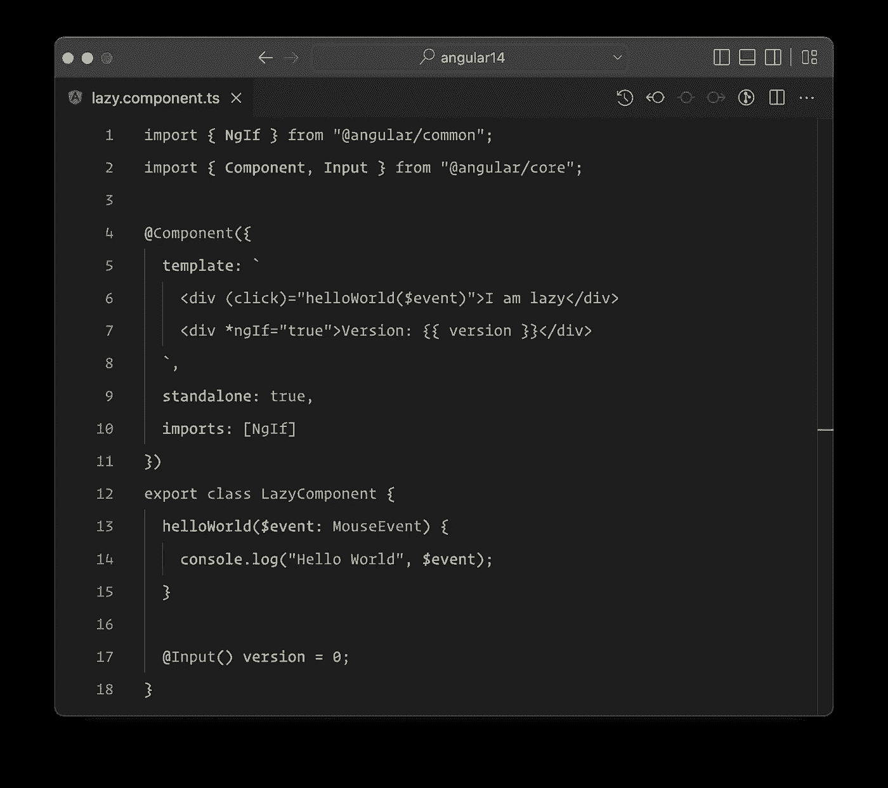

带内嵌模板的角度组件(无语言服务)

因为编辑器认为这是一个 typescript 文件，所以它不会为模板部分提供代码突出显示，并且它将像字符串一样显示，即使编辑器支持 HTML(这里我们在一个 Typescript 文件中)。

所以，我们不会从中获得任何对 Angular 和 HTML 语法的支持。因此，如果我们将鼠标悬停在 **div** 或**点击绑定**或 ***ngIf 指令**上，我们将不会得到任何信息。

**语言服务**告诉编辑器我们在一个 **Angular** 组件中，并把模板字段当作一个 Angular 模板，它实际上是一个具有增强功能的 HTML(上面有一些面筋)。

如果我们安装 [Angular 语言服务](https://marketplace.visualstudio.com/items?itemName=Angular.ng-template)并再次打开那个文件。我们会看到更好的东西。

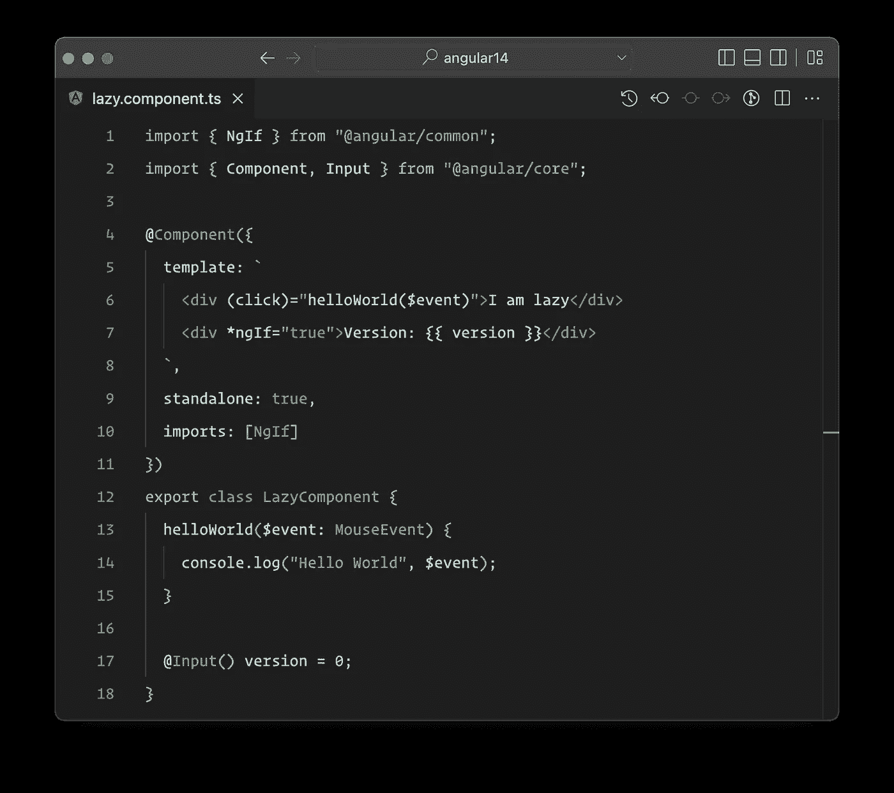

语法高亮显示的角度组件

让我们将鼠标悬停在模板中的一些元素上，看看它提供了什么样的信息。

## 事件绑定

如果我们将鼠标悬停在 **click** 事件上，我们会看到该信息只是 **div** 元素中的 **addEventListener** (因为这就是点击绑定的作用)。

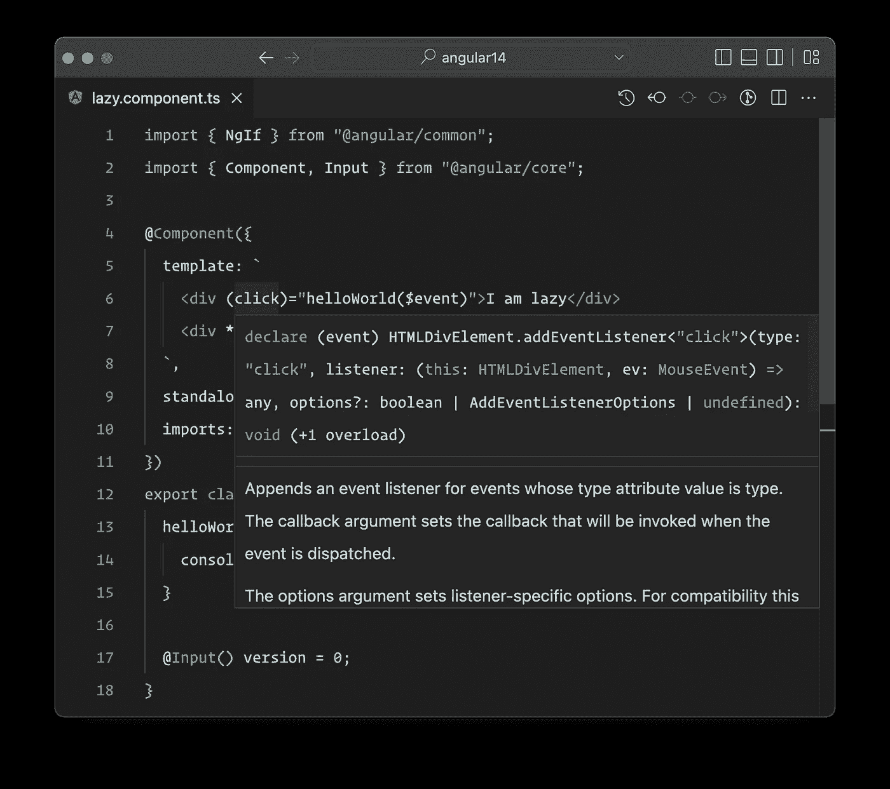

事件绑定信息

而 **$event** 值的类型是 **MouseEvent** ，因为这是一个 **addEventListener** 与 **click 事件类型**所分派的。所以，没有神奇的🪄！

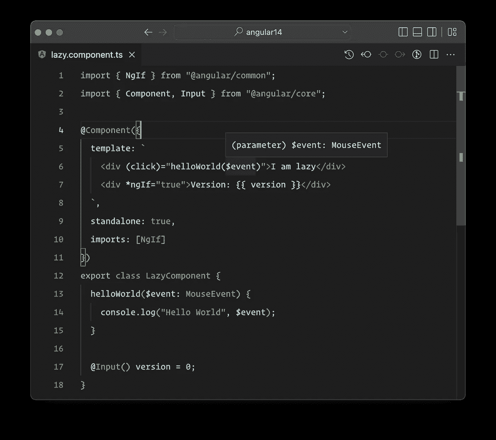

$事件信息

让我们添加一个具有**输出**的组件，并将其添加到模板中。

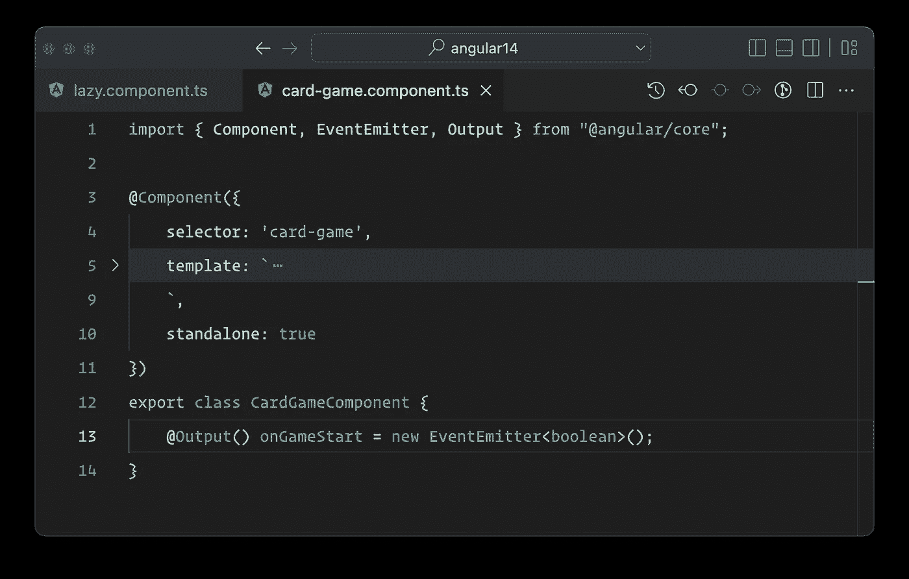

当我们将鼠标悬停在 **onGameStart** 事件上时，我们可以看到这只是一个 **EventEmitter** 发出一个**布尔值**，没错！

组件输出中有关事件绑定的信息

## 插入文字

如果我们将鼠标悬停在插入的**版本**变量上，我们可以看到将会显示正确的类型，因此版本只是类型号为的 **LazyComponent** 的**属性**。这也适用于复杂类型。

> 一切都显示正确类型的原因是因为 Angular 模板是严格类型化的，而语言服务只是使用幕后的 Angular 编译器来获取所有这些信息。

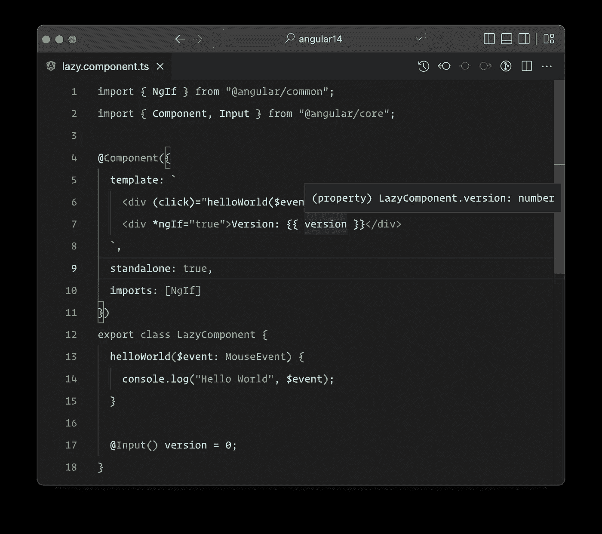

插值信息

## 数据绑定

让我们向之前创建的组件添加一个**输入**，并从 **LazyComponent** 向其传递一些数据。

游戏版本输入是数字类型的，这里我们传递一个数字类型的属性。一切都很好。

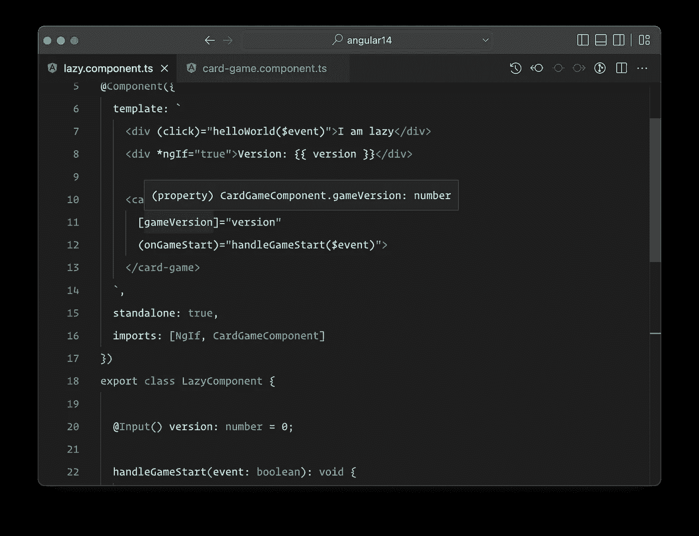

数据绑定信息

让我们将 LazyComponent 上的属性更改为字符串类型，看看我们会得到什么:

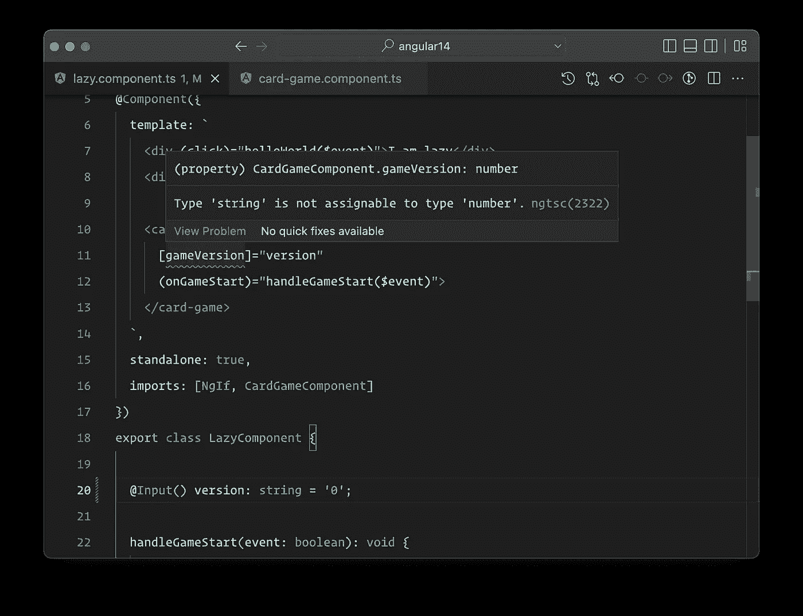

将属性传递给组件时出错(类型错误)

是的，我们会得到一个错误，告诉我们传递的属性的类型与输入要求的类型不同。

## 指令信息

在模板中我们有一个 ***ngIf** 指令。如果我们悬停在它上面，我们将看到它来自的类和它的一般类型，在这种情况下，它是一个布尔值。因此，我们需要向 ***ngIf** 指令传递一个布尔表达式。

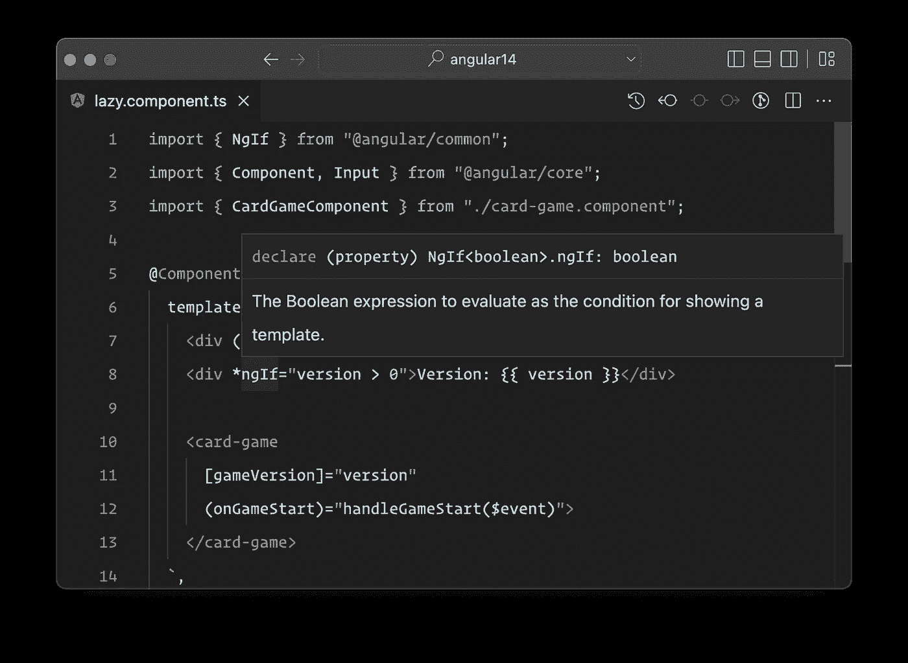

让我们为指令添加一个**NGF，看看编辑器给了我们什么信息。**

是的，它将向我们展示指令类是 NgForOf 及其泛型类型。目前为止很棒！

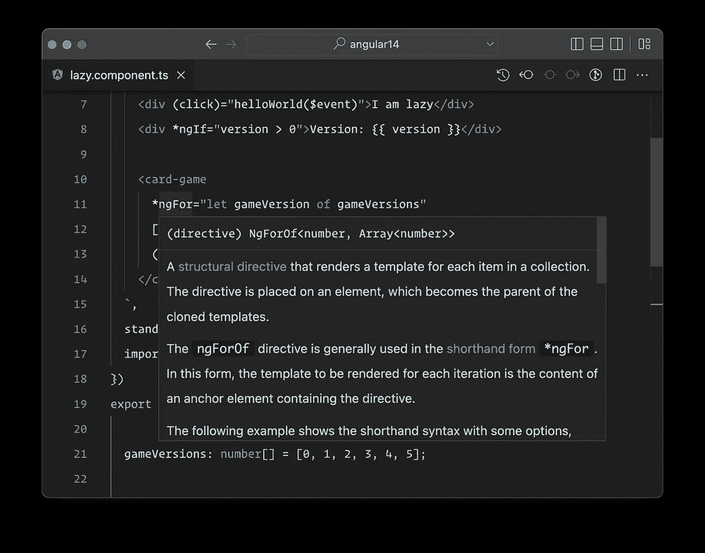

这些是语言服务提供给我们的一些信息！

但还有更多，耶🥳！

## 转到定义

我们可以**在模板中的每个项目上右键单击**，然后单击**转到定义**，它会将我们带到那里！无论是**组件**、**指令**、**输入**、**事件**、 **DOM** 元素等。

正如我们所见，它将把我们送到正确的地方，无论是在我们的组件、指令、Angular 提供的指令，还是 DOM 元素的类型，如 **lib.dom.ts** 等。

## 转到参考

我们也可以使用 **Go to references** 选项，它会向我们显示我们使用过所搜索项目的每个地方！

## 重命名模板中的符号

因为 Angular 中的所有内容都是**类型脚本**，我们可以使用模板中的**重命名符号**，该符号的所有引用都将被重命名。无论是**输入**、**输出**、**类属性**还是**方法**等。

如果我们从内部类而不是从模板中重命名符号功能，它将不能 100%正确地工作，因为在 VS 代码本身中有一个[问题还没有解决！](https://github.com/microsoft/vscode/issues/115354)

## 代码自动完成

如果我们开始在模板上写东西，语言服务将提供我们可以使用的 VS 代码自动完成数据，可以是输入、输出、事件、类属性等等。

## 代码修复

在最新版本的语言服务中，我们可以利用代码修复。我们可以直接从模板中创建**属性**或**方法**，或者修复我们可能写错的东西。

正如我们所看到的，它将创建方法并传递我们传递给该方法的事件类型，在本例中是 **MouseEvent** 。

**角语服务**有了长足的进步！因为有了 Ivy 编译器，它被从头开始重写了，这是值得的！因为现在我们有了所有这些以前不可能的好东西。

还会有很多很酷的东西出现，比如为独立组件和 NgModules 导入组件、指令和管道。

在那之前，去安装语言服务(如果你还没有的话)并充分利用它，它有很多优点，让你的编码更容易！

如果你喜欢这篇文章，给我一个关注，并为下一篇做好准备。👋