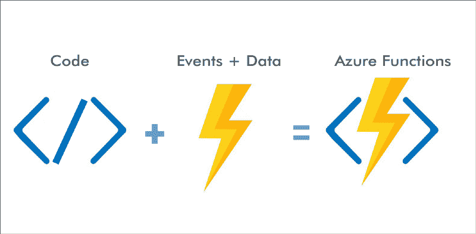
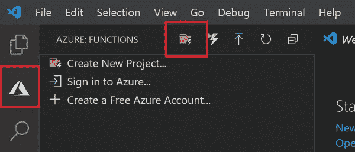
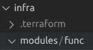
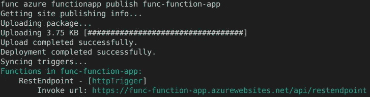

# 使用 Terraform 的 Azure 函数简介

> 原文：<https://itnext.io/introduction-to-azure-functions-using-terraform-eca009ddf437?source=collection_archive---------1----------------------->


伊万·班杜拉在 [Unsplash](https://unsplash.com?utm_source=medium&utm_medium=referral) 上的照片

# 介绍

在这篇文章中，我将提供一个快速的**介绍**到 [**Azure 函数**](https://azure.microsoft.com/en-us/services/functions/) 和 [**Terraform**](https://www.terraform.io/) 以及一个**动手**的例子，这个例子很容易理解。

有很多关于 Azure 函数的文章，但是大多数都没有解释如何使用 **CI/CD** 管道自动化**真实世界场景**的部署。

本文不会深入讨论创建特定 CI/CD 管道的细节，而是通过一个简单的例子来关注自动化在 Azure 中部署 **Function App** 所需的**基础设施和代码**。将提供命令，以便您可以使用此代码轻松地与任何 CI/CD 工具集成，如 [**Azure DevOps**](https://azure.microsoft.com/en-us/services/devops/?nav=min) 或 **Jenkins** 。

我们将首先快速介绍一下 **Azure Functions** 和 Terraform，然后进行动手练习。注意，我们没有时间涵盖所有关于**地形**的概念，但我会提供一些链接作为参考。

# Azure 函数

Azure 功能是 Azure 中的**无服务器** **事件驱动**计算服务，类似于 [AWS Lambda](https://aws.amazon.com/lambda/) 。这也被称为功能即服务或 [**Faas**](https://en.wikipedia.org/wiki/Function_as_a_service) 。简言之， [**无服务器**](https://martinfowler.com/articles/serverless.html) **就是执行不需要任何服务器**的业务逻辑的任何东西。这个**去掉了 DevOp** s 的操作方面。



无服务器意味着你不需要管理任何服务器、操作系统或基础设施，你只需要专注于代码。Azure Functions 处理部署、可用性、伸缩性等等；这对开发者来说是非常好的。

第二个方面，是**事件驱动的**。相比其他无服务器产品，如 [Azure 应用服务](https://azure.microsoft.com/en-us/services/app-service/)；有了 Azure Functions，你只需编写对事件做出反应的小函数，而不用编写一个完整的应用程序。每个函数都将有一个您在函数旁边定义的特定触发器，这可能是一个 [**Azure 事件网格**](https://azure.microsoft.com/en-us/services/event-grid/) 主题或者是许多其他 [**触发器**](https://docs.microsoft.com/en-us/azure/azure-functions/functions-triggers-bindings?tabs=csharp#supported-bindings) 中的一个 HTTP 端点。这意味着您只关心编写函数的逻辑。你可以用语言的选择来编写这个逻辑:JavaScript，C#，F#或者 Java。

FaaS 的另一个重要特点是它采用现收现付的模式。你只为你使用的东西付费，如果一个函数没有被调用，你不需要支付任何东西。这使得 Azure 功能非常划算，特别是对于有大量峰值的工作负载。

在这篇 [**文章**](/scaling-my-app-serverless-vs-kubernetes-cdb8adf446e1) 里我讲了很多关于**无服务器**的内容，所以多看看了解一下吧。

# 将（行星）地球化（以适合人类居住）

[**Terraform**](https://www.terraform.io/) 是一个众所周知的开源**基础设施作为 Code**([**IaC**](https://en.wikipedia.org/wiki/Infrastructure_as_code))工具。IaC 是使用机器可读的定义文件管理和配置整个 IT 基础架构(包括物理机和虚拟机)的过程。

**Terraform** 使用易于阅读的**声明性**文件，以直观、人类可读的格式描述您的基础设施。您可以描述您需要哪些云服务，Terraform 将为您提供这些服务。它与公共云提供商紧密结合，但也可以在内部使用。它与 AWS**中的 [CloudFormation](https://aws.amazon.com/cloudformation/) 等工具非常相似，但 Terraform 可以在许多云提供商之间工作。声明性的优点在于它保持了基础设施的状态，所以当你运行它时，它会检查你想要的和已经存在的，并且只修改需要的。这不仅仅是简单的自动化脚本或配置管理； **Terraform 可以安全可靠地协调您的整个基础设施**。例如，如果您想减少应用程序的虚拟机数量，只需减少 Terraform 定义文件中的数量，Terraform 就会检测到数量减少并删除其中一个虚拟机。**

Terraform 遵循 [**GitOps**](https://www.gitops.tech/) 原则，所有代码都保存在源代码控制中，因此每个变更都需要得到团队的批准，并且所有变更历史都被保存下来以供审计。忘记复杂的变更管理流程，使用 Terraform，如果您需要更改您的基础架构，您可以像更改代码一样提出拉式请求；并遵循标准实践，如 PR 评审、代码质量、CI/CD 等。

要了解更多关于 Terraform 的内容，可以查看 [**官方文档**](https://www.terraform.io/intro/index.html) 或者这篇[大文章](https://geekflare.com/terraform-for-beginners/)了解**模块、变量、状态、计划**等核心概念；以及 **Terraform 生命周期**。

# 动手示例

在我们开始之前，确保你对地形有所了解。你可以在这里 获得本练习 [**的**源代码。****](https://github.com/javiramos1/azure_functions_terraform_demo)

我们将使用 Terraform 提供应用程序和存储帐户来存储功能；并且我们将使用 [**Azure 功能核心**](https://docs.microsoft.com/en-us/azure/azure-functions/functions-run-local?tabs=linux%2Ccsharp%2Cbash#v2) 来部署功能本身。我们将创建一个 **Makefile** 来自动化这个过程。这样，Jenkins 或 Azure DevOps 就可以调用 **make** 命令。

## 设置

在开始之前，请确保您具备以下要求:

*   具有有效订阅的 Azure 帐户。[免费创建账户](https://azure.microsoft.com/free/?ref=microsoft.com&utm_source=microsoft.com&utm_medium=docs&utm_campaign=visualstudio)。
*   [Node.js](https://nodejs.org/) ，主动 LTS 和维护 LTS 版本(推荐 10.14.1)。使用`node --version`命令检查您的版本。请注意，目前还不支持最新的 NodeJS 版本。
*   [**Azure CLI**](https://docs.microsoft.com/en-us/cli/azure/install-azure-cli)**管理 Azure 资源。**
*   **[**Visual Studio 代码**](https://code.visualstudio.com/) 在[支持的平台](https://code.visualstudio.com/docs/supporting/requirements#_platforms)之一上。**
*   **[**Azure Functions Core**](https://docs.microsoft.com/en-us/azure/azure-functions/functions-run-local?tabs=linux%2Ccsharp%2Cbash#v2)对功能进行管理。**
*   **将 [**Azure 函数扩展**](https://marketplace.visualstudio.com/items?itemName=ms-azuretools.vscode-azurefunctions) 为 Visual Studio 代码。**
*   **地形 **CLI** 。从 [**这里**](https://www.terraform.io/downloads.html) 下载，解压后放入你的系统`PATH.`**

**确保您可以登录到 [Azure 门户](https://login.microsoftonline.com/organizations/oauth2/v2.0/authorize?client_id=c44b4083-3bb0-49c1-b47d-974e53cbdf3c&response_type=code%20id_token&scope=https%3A%2F%2Fmanagement.core.windows.net%2F%2Fuser_impersonation%20openid%20email%20profile&state=OpenIdConnect.AuthenticationProperties%3DLzR9qCiyV4prT5hzJcG3le4KyQk9yA2npK1RkE_mrRoPgRoS21WUGXSPOsRgMNxZuMzr6AYrbiWxLDfeGihv7ImYTltO1mscPPieYji3_O5EfYY2YYHB2bFnvxXsgCrE&response_mode=form_post&nonce=637507338749166161.ZWM0YWViYTItMmIwNS00NzliLWJkOGQtOTY4YmFmZDk1Y2ZhYjEyYjNiYjItMDU5Ni00ODBkLWI2MWItYWM3ZTJjMmQwMzQ3&redirect_uri=https%3A%2F%2Fportal.azure.com%2Fsignin%2Findex%2F&site_id=501430&client-request-id=503988f0-04fc-4ea1-83b5-4ac379b30e5b&x-client-SKU=ID_NET45&x-client-ver=5.3.0.0)。然后，使用命令行登录:**

**`az login`**

**这将打开浏览器，您可以在其中输入详细信息。**

## **创建项目**

**我们开始吧！**

**我们将该项目分为两个文件夹:**

*   **`infra`:部署功能 app 的 Terraform 文件。**
*   **`functions`:包含 Azure 函数。包含执行业务逻辑的 ***NodeJS*** 函数的主应用程序。**

**创建这些到项目，并光盘到*功能*文件夹。**

**现在，让我们使用 [**Visual Studio 代码**](https://code.visualstudio.com/) 创建一个使用 **HTTP** 触发器的示例函数，也就是说，当我们点击一个 HTTP 端点时，该函数将被调用，该端点将在我们部署该函数时生成。**

*   **在活动栏中选择 Azure 图标，然后在 Azure: Functions 区域中，选择 Create new project…图标。**

****

*   **为项目工作环境选择一个目录位置，然后选择“选择”。**
*   **根据提示提供以下信息:**
*   **为您的功能项目选择语言:选择`TypeScript`。**
*   **为项目的第一个功能选择一个模板:选择`HTTP trigger`。**
*   **提供一个函数名:Type `RestEndpoint`。**
*   **授权级别:选择`Anonymous`，这使得任何人都可以调用你的函数端点。要了解授权级别，请参见[授权密钥](https://docs.microsoft.com/en-us/azure/azure-functions/functions-bindings-http-webhook-trigger#authorization-keys)。**
*   **选择您希望打开项目的方式:选择`Add to workspace`。**
*   **使用这些信息，Visual Studio 代码生成一个带有 HTTP 触发器的 Azure Functions 项目。您可以在浏览器中查看本地项目文件。要了解更多关于创建的文件，请参见[生成的项目文件](https://docs.microsoft.com/en-us/azure/azure-functions/functions-develop-vs-code#generated-project-files)。**

**此外，单击“登录 Azure”按钮将 Visual Studio 代码与您的帐户连接起来。**

**现在你可以通过点击 ***F5*** 从 Visual Studio 代码中**运行**该函数。您也可以运行:**

**`func run`**

**您可以看到本地运行的 HTTP 触发函数的 URL 端点。**

****

**我们现在有了一个 Azure Functions **NodeJS** 应用程序，可以运行并部署到 **Azure** 中。**

**如果你想学习如何使用 Visual Studio 代码扩展来部署它，你可以继续遵循官方指南。**

## **添加 Terraform 文件**

**让我们添加 Terraform 文件，它将提供以下内容:**

*   ****资源组。****
*   ****存储账户**。存储功能代码。**
*   **[**应用洞察**](https://docs.microsoft.com/en-us/azure/azure-monitor/app/app-insights-overview) 进行监控。**
*   **[**服务计划**](https://docs.microsoft.com/en-us/azure/app-service/overview-hosting-plans) 用于运行该功能。**
*   **包含不同函数的函数应用程序。**

**Terraform 是模块化，建议您创建模块来处理特定类型的基础设施。为了管理 Azure 函数，我们将创建一个**模块**来执行上面列表的最后 3 点。**

**进入之前创建的 *infra/* 文件夹，创建一个文件夹模块来存储我们自己的模块。在此为功能模块创建一个新文件夹 *func/* 。**

****

**创建一个 ***main.tf*** 文件，该文件将包含创建 Azure 函数资源的代码。输入以下内容:**

*   **第 8–13 行:创建用于监控的应用洞察资源。**
*   **第 15–26 行:创建一个服务计划来运行这些功能。如果需要，您可以重复使用现有的服务计划。**
*   **第 28–57 行:创建函数应用程序。我们使用 *app_settings* 传递运行时或应用洞察参考等属性。我们还选择 Linux 运行时并指定存储帐户，以便函数应用程序资源知道它可以在哪里存储源代码。**

**在顶部，您可以看到需要传递给该模块的**输入变量**。我们希望之前已经创建了资源组和存储帐户。这是 *main* Terraform 文件的工作，它将创建这两个资源，然后使用我们刚刚创建的模块。**

**接下来，让我们在主文件夹中名为 ***vars.tf*** 的单独文件中定义一些我们需要的变量:**

**我们需要 Azure ***订阅 ID*** 和 ***租户 ID*** 来访问 **Azure** 。我们还有资源组名称和资源位置的变量。如果使用命令行选择或传递它们，您可以看到不同的值。请注意我们如何为资源组和位置设置默认值，因为我们不需要经常更改它们，但是我们仍然希望能够在不更改许多文件的情况下更新它们。**

**接下来，我们需要为 Terraform 添加一个负责与 Azure 对话的 [**提供者**](https://www.terraform.io/docs/providers/index.html) 。创建一个名为 ***provider.tf*** 的文件:**

```
provider "azurerm" {subscription_id = var.SUBSCRIPTION_IDtenant_id = var.TENANT_IDfeatures {}}
```

**我们使用我们之前为您的订阅和租户 id 定义的变量，这些变量是**机密**；但是我们如何传递这两个秘密呢？首先，你不应该把它们放在你的源代码中，Jenkins 应该在运行 Terraform 时管理并注入这些变量。这可以在运行时使用以下方法完成:**

**`--var` SUBSCRIPTION_ID="…"**

**通常，你会有几个变量，所以更好的方法是创建一个**变量文件**。但是首先，我们如何获得订阅 ID 和租户 ID？只需运行 ***az 登录*** 即可得到输出。订阅 id 是“ *id* ”字段，租户 ID 是“ *tenantId* ”字段。**

**创建一个变量 ***func.tfvars*** 来保存这两个秘密:**

```
SUBSCRIPTION_ID = “02d6b8fc-….”
TENANT_ID = “77b59865–….”
```

**一定要加上 ***/*。将*转换为*。gitignore* 文件，这样就不会将这些秘密提交给源代码库。**

**好了，现在我们有了管理函数、提供者和定义的变量的模块。让我们创建 Terraform **主**文件。在*下*文件夹中创建一个 ***func.tf*** 文件:**

*   **第 1–4 行:创建资源组来保存我们所有的资源。我们引用在 ***vars.tf*** 文件中创建的变量。**
*   **第 6–11 行:我们使用*random _ string*terra form util 为存储帐户创建一个随机数，因为它们需要是全局唯一的。**
*   **第 13–21 行:创建存储帐户。请注意我们是如何在资源组上设置依赖关系的，您也可以引用以前的资源，Terraform 会检测到这种依赖关系。**
*   **第 23–29 行:在存储帐户中创建容器。**
*   **第 32–41 行:我们调用了之前创建的模块。我们传递在模块文件顶部定义的所有必需的输入变量。**

**就这样，现在我们准备好部署基础架构了。首先，让我们初始化 Terraform，运行:**

**`terraform init`**

**然后运行:**

```
terraform apply -var-file=func.tfvars
```

**注意我们是如何传递我们的秘密 *func.tfvars* 文件的。这应该会将您的基础设施部署到 Azure。进入**门户**查看结果。您应该会看到存储帐户和功能应用程序。如果您单击左侧的功能菜单，您将看不到任何功能。这是因为我们使用 **Azure 核心工具**来部署功能本身。我们将基础设施与代码分开。**功能是开发者的责任**，不应由 Terraform 处理。**

**要部署功能，转到*功能*文件夹并运行:**

```
func azure functionapp publish func-function-app
```

**注意那个***func-Function-app***是 Terraform 之前创建的函数 App 的名字，这是 Azure Functions CLI(针对*开发者*)和 Terraform(针对 *DevOps* )之间的链接。**

**现在，您应该能够看到门户中的功能了。该命令还将打印 URL，您可以点击该 URL 来测试该功能。**

****

**如果你有一个小团队，你可能想把 Terraform 文件和代码放在同一个代码库中，这就是我们的情况。在这种情况下你可以使用 ***Makefile*** 来自动化一切。在根目录下创建一个 ***Makefile*** :**

**现在你可以简单地运行 ***make*** 来使用 Terraform 部署基础设施，然后使用 *Azure Functions Core* 工具部署功能。**

**这些是命令:**

*   ****make** :使用服务计划创建一个基于 Linux 的功能应用程序，它还安装了用于监控的应用程序洞察。之后，它部署功能。总共有 2 个主要目标可以单独运行，请查看 Make 文件了解详细信息。使用 *make setup* 创建功能 app， *make deploy* 部署功能。**
*   ****制作销毁**:销毁功能 app。**

**如果您在运行这些应用程序时遇到问题，请在这里查看 [**我的源代码**](https://github.com/javiramos1/azure_functions_terraform_demo) 以获得帮助。**

# **结论**

**在这篇文章中，我简单介绍了一下 **Terraform** 和 **Azure 函数**。然后，我们进入了一个实践示例，展示了如何从实际代码中分离出与基础设施相关的资源。使用 **IaC +无服务器**时，这些界限变得**模糊**。基础设施也是代码，功能也是基础设施。**

**我建议总是**将云资源与代码**分开。如果服务很小，你可以像我们一样把它们放在同一个存储库中，但是最好把它们放在相关但独立的存储库中。Terraform 存储库将接受更多审核，因为它处理更敏感的资源。但是我们如何在 DevOps 团队和开发人员之间共享资源呢？例如，开发人员如何知道 Terraform 创建的功能应用程序资源的名称是什么？这可以随时更改。在我的 [repositor](https://github.com/javiramos1/azure_functions_terraform_demo) y 中，我创建了一个临时文件，然后在 Makefile 中使用它从 Terraform 输出中读取函数名。如果这些库是分离的，我推荐使用一个类似[**Azure Key Vault**](https://docs.microsoft.com/en-us/azure/key-vault/general/overview)的秘密库，将包含敏感数据的*JSON***terra form**输出作为秘密存储在秘密库中，这种方式非常容易保护开发者对资源的访问。**

**如果你喜欢这篇文章，记得鼓掌，并关注我的更多更新！**

**我希望你喜欢这篇文章。欢迎发表评论或分享这篇文章。跟随[***me***](https://twitter.com/JavierRamosRod)**进行未来岗位。****