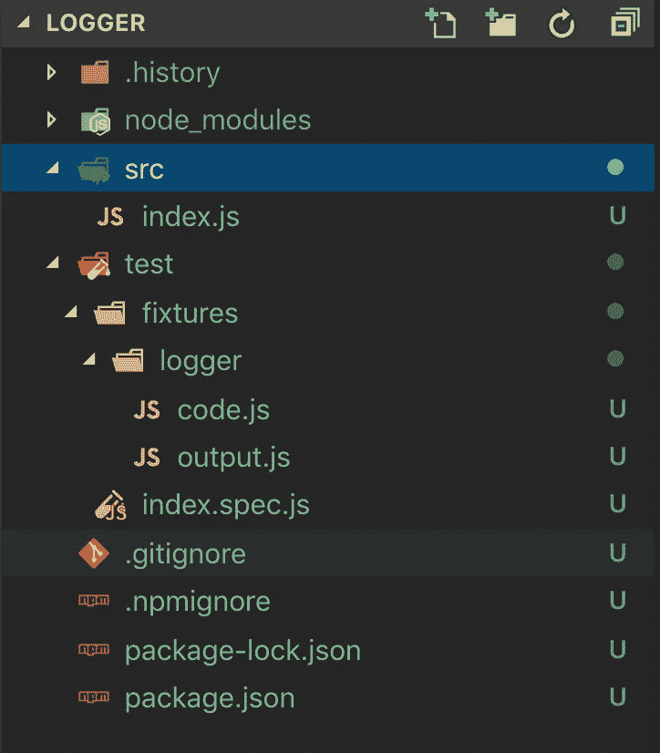
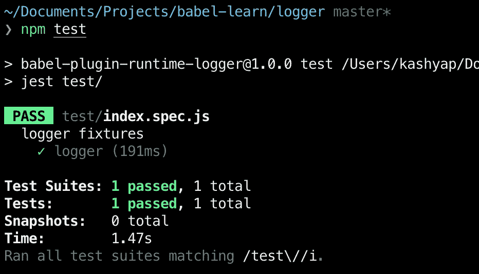

# 自定义巴别塔插件简介

> 原文：<https://itnext.io/introduction-to-custom-babel-plugins-98a62dad16ee?source=collection_archive---------2----------------------->


Babel 是一个 JavaScript 编译器，它允许我们通过将 JavaScript 转换成浏览器可以理解的代码来使用最新最好的版本。它无疑是市场上帮助前端开发的最强大的工具之一。

在这篇文章中，我们将探索巴别塔架构的基础，创建一个基本插件，并研究如何测试我们的插件。

Babel 不同于将代码转换为二进制格式的传统编译器，例如，Babel 可以:

*   源代码转换又称编译，即代码到代码的转换
*   多填充缺失特征
*   我们可以用源代码想象出任何其他东西

Babel 通过插件和预置的力量做到了这一点。简而言之，插件是帮助执行单一任务的原子组件。比如有把箭头函数转换成 ES5 函数的插件，有反应函数调用的 JSX 等等。另一方面，预置是插件的组合，通过避免安装多个插件和担心调用顺序来简化工作流程。[阅读本文](https://levelup.gitconnected.com/eli5-babel-and-the-gang-e5329313a107)了解插件和预置的详细解释。

# 巴别塔建筑

在我们继续构建示例插件之前，让我们简单地看一下支持插件使用的 Babel 的架构。

我们的代码通过几个主要阶段。其中一些阶段对于任何编译器来说都是非常常见的，而一些阶段对于 Babel 来说是定制的。

> 查看这个网站,它帮助我们想象这篇文章的下一部分

1.  **生成抽象语法树(AST)** :将作为输入传入 Babel 的代码转换成树状对象。这个阶段被称为**解析**。在内部，这个阶段被分成两个子阶段，第一个阶段将代码转换成词法标记，而下一个阶段将这些标记转换成 AST。每一条语句(或其一部分)都被转换成一个令牌，并最终转换成 AST 中的一个`Node`，它包含诸如`Node` 的类型(如`FunctionDeclaration`、`ReturnStatement`、`BooleanExpression`)、它在源代码中的开始和结束位置以及其他元数据等信息，这些信息有助于进一步理解`Node`，并提供可能对处理该`Node`有用的信息。
2.  **消费插件**:一旦 AST 生成，Babel 编译器利用各种插件将代码从一种形式转换成另一种形式。这个阶段也被称为**遍历**。应用于 AST 的插件/预置列表以 Babel 配置的形式提供。插件是按照定义和预置的顺序来应用的，反之亦然。这个阶段本质上是在 AST 上工作，并输出另一个 AST，它由插件执行的变更组成。
3.  **生成代码**:AST 修改完成后，AST 转换回代码。

虽然我们上面讨论的听起来非常复杂。多亏了 [工具](https://babeljs.io/docs/en/next/babel-generator)的[主体](https://babeljs.io/docs/en/next/babel-parser) ，这使得构建和使用巴别塔插件变得相对容易。

因为插件实际上是针对代码生成的 AST 工作的，而不是代码本身，所以在继续插件开发之前，我们需要理解最后一件事。

要修改 AST，我们需要访问 AST 节点。传统上，如果我们有一个类似树的对象，并且我们想要修改它，在几轮开发尝试和错误之后，我们可能会以 lodash-esque API 结束，以从 AST 创建/更新/删除任何东西。但是在 Babel 中，引入了一个叫做`Visitors`的重要主题，事情略有不同，这个主题基于[访问者模式](https://en.wikipedia.org/wiki/Visitor_pattern)。每个`Visitor`对象由遇到特定节点类型时将被调用的方法组成。如果我们想为所有的`Identifier`和`FunctionDeclaration`节点调用一个访问者，它将如下所示:

```
const visitor = {
  Identifier: {
    enter() {
        console.log("Identifier enter called");
    }
    exit() {
        console.log("Identifier exit called");
    }
  },
  FunctionDeclaration: {
    enter() {
        console.log("FunctionDeclaration enter called");
    }
    exit() {
        console.log("FunctionDeclaration exit called");
    }
  }
};
```

每次遇到某种类型的节点，在`Visitor`上触发相应的`enter`方法，然后在控件退出该节点时调用`exit`方法。如果我们不关心在`exit`发生了什么，我们可以简单地将声明与`enter`方法合并。

```
const visitor = {
  Identifier() {
      console.log("Identifier enter called");
  }
};
```

我们从经验中知道，代码是高度相互依赖的，我们不能简单地假设没有隐式或显式的依赖。出于这个原因，Babel 在 AST 旁边提供了一个`Path`,它表示节点之间的关系以及每个节点的元数据。因此，每当我们修改 AST 时，`Path`就会更新以响应 AST 的变化。

```
const visitor = {
  Identifier: {
    enter(**path**) {
        console.log("Identifier enter called"**, path.node.name**);
    }
    exit(**path**) {
        console.log("Identifier exit called"**, path.node.name**);
    }
  }
  FunctionDeclaration: {
    enter(**path**) {
        console.log("FD enter called"**, path.node.name**);
    }
    exit(**path**) {
        console.log("FD exit called"**, path.node.name**);
    }
  }
};
```

还有其他高级概念，比如作用域和绑定，我们将在以后的文章中讨论。

# 示例插件

我们现在准备构建我们的示例插件。在这个例子中，我们将实现一个简单的目标:确定程序中每个方法的运行时间。

为了简单起见，我们只考虑几个例子，这些例子对于我们的插件来说很容易处理(但是足够真实):

我们有三个函数，它们运行循环，评估 If 条件，调用其他函数，并且包含返回引用的嵌套函数。

为了能够记录每个方法的运行时间，我们将使用`console.time`和`console.timeEnd`方法。想法很简单，我们的插件将在函数的顶部插入`console.time`,如果存在的话，在`return`语句之前插入`console.timeEnd`,如果不存在的话，在函数的末尾插入`console.timeEnd`。

## 项目设置

我们可以建立一个空白的 NodeJS 项目来创建一个 Babel 插件。如果你有兴趣走那条路，还有约曼发电机。

```
mkdir babel-plugin-runtime-loggercd babel-plugin-runtime-loggernpm init -y
```

一旦项目被创建，创建一个文件夹`src`并在其中创建`index.js`文件。这是我们将要创建插件的文件。这个想法很简单:

1.  在每个功能的顶部插入`console.time(functionName)`
2.  在`return`语句之前的函数末尾插入`console.timeEnd(functionName)`(如果存在)

## 创建访问者

首先，让我们创建一个空白访问者，并为其命名:

接下来，我们识别何时处理我们的`FunctionDeclaration`。如果是这样，我们可以简单地在那里插入我们的`time`语句:

这看起来有点混乱，所以让我们在`FuntionDeclaration`上分解`enter`方法:

> W 当遇到一个函数声明时(即在回车上)获取当前`path`的`body`(即获取`BlockStatement within it a.k.a the body of the function`)并且在所有事情之前(即`unshift`进入`body`)插入一个`CallExpression`(即函数调用)，该函数调用控制台对象上的时间方法，节点名称作为参数

唯一自然的下一个问题是:我如何知道调用什么？存在哪些函数，需要哪些参数？答案并不复杂，巴别塔网站有很棒的[文档解释类型](https://babeljs.io/docs/en/next/babel-types.html)并且有[助手可用](https://babeljs.io/docs/en/next/babel-helpers)来简化你可能需要应用的任何复杂条件和检查。强烈建议使用 [AST 可视化工具](https://astexplorer.net/)来帮助理解更复杂的工作流程。

现在，我们可以将`exit`部分添加到`FunctionDeclaration`中，根据函数的最后一条语句是否为`ReturnStatement`来完成处理。

基于函数中最后一条语句的类型，我们在当前最后一条语句之前或之后插入`timeEnd`函数调用。

这样，我们的插件开发就完成了。现在让我们来测试一下我们到目前为止所做的改变。

## 测试

为了测试这个插件，幸运的是我们不需要依赖真实世界的应用程序。相反，我们将使用`babel-plugin-tester`库和`Jest`来测试插件。

```
npm i -D jest babel-plugin-tester
```

插件测试器有几种测试插件的方法，在这里可以看到。但是我们将选择需要最小配置的选项，这样我们就可以投入并测试我们的插件。该选项依赖于`fixtures`，它只是预先决定的输入和输出组合。如`babel-plugin-tester`存储库所示:

```
fixtures
├── first-test # test title will be: "first test"
│   ├── code.js # required
│   └── output.js # required
└── second-test
    ├── .babelrc # optional
    ├── code.js
    └── output.js
```

为了设置我们的测试使用`jest`运行，我们首先在`src`旁边创建一个`test`文件夹，并在其中创建一个`index.spec.js`文件:

我们用来自`src`的`plugin`和在`test`内的`fixtures`文件夹中定义的`fixtures`来调用`pluginTester`。

在这种情况下，我们只定义了一个名为`logger`的 fixture，其内容为`code.js`，正如我们在一开始所讨论的:

现在，我们在运行测试和验证我们的断言之前创建预期的`output.js`文件:

该项目的整个目录结构非常简单:



项目文件夹结构

我们现在可以使用`jest`调用这些测试:

```
./node_modules/.bin/jest test/
```

结果如下所示:



所有成功的测试

由于所有的测试都按照预期运行，我们看到测试用例通过了。如果有任何错误，由于有了`babel-plugin-tester`，我们会看到它被清楚地标记出来。


意外结果的迹象

# 摘要

Babel 无疑是一个非常强大的 JavaScript transpiler，并且提供了很多功能。参考[这个](https://github.com/jamiebuilds/babel-handbook/blob/master/translations/en/plugin-handbook.md)链接了解关于巴别塔编译器内部工作基础的细节，参考[这个](https://github.com/jamiebuilds/babel-docs/tree/master/en_US/authors)链接了解关于成为更好的插件作者的其他细节。

本文中展示的全部代码可在[这里](https://github.com/40x/babel-plugin-runtime-logger)获得。

*如果你喜欢这个博客，一定要为它鼓掌，* [*阅读更多*](https://medium.com/@kashyap.mukkamala) *或者关注我的*[*LinkedIn*](https://www.linkedin.com/in/kashyap-mukkamala/)*和*[*Twitter*](https://twitter.com/JSSculptor)*。*