# 构建数据网格:初学者指南

> 原文：<https://itnext.io/introduction-to-data-mesh-59e6f3a4c15e?source=collection_archive---------0----------------------->

艾莉娜·格鲁布尼亚克在 [Unsplash](https://unsplash.com?utm_source=medium&utm_medium=referral) 上的照片

# 介绍

如果你正在阅读这篇文章，你可能想知道什么是 [**数据网格**](https://martinfowler.com/articles/data-mesh-principles.html) ，老实说，我仍然在想同样的事情。看了很多文章，还是很迷茫。

***如何实现一个*** [***数据网格***](https://medium.com/grensesnittet/what-is-data-mesh-4a9f7b6c0355) *？*纵观不同的文章，其实现方式，甚至某些观点，都大相径庭。似乎每个人对数据网格的解释都不一样，调整一些想法以适应他们当前的流程，这与发生在 Scrum 和其他敏捷方法学上的事情类似。有时候我真的怀疑这是不是下一个流行词，仅此而已；因为当你放大细节时，似乎**数据网格**只不过是**应用我们已经应用于应用**的相同概念，例如可观察性、安全性、自助服务、治理、 [DDD](https://en.wikipedia.org/wiki/Domain-driven_design) 等。**到**到**数据**。

本文的目标是试图阐明与**数据网格**相关的所有概念，包括实现它所需的过程和工具。这只是我个人对围绕这个话题发表的所有文章的尝试。

# 什么是数据网格？

在我看来，数据网格中描述的**概念并不新鲜，**如果你是开发人员或数据工程师，你应该对它们很熟悉。革命性的是,**数据网的创造者[扎马克·德格哈尼](https://twitter.com/zhamakd)，**如何将所有的想法整合到一个惊人的新范例中。

我相信**数据网**的目的是将 [**OLTP**](https://en.wikipedia.org/wiki/Online_transaction_processing) 世界的思想，即**操作平面**带入 [**OLAP**](https://en.wikipedia.org/wiki/Online_analytical_processing) 世界，即**数据平面**。目标是采纳诸如[域驱动设计](https://en.wikipedia.org/wiki/Domain-driven_design)(用于开发微服务) [DevOps](https://en.wikipedia.org/wiki/DevOps) (自动化和自助服务基础设施)或可观察性(安全性、日志记录和治理)的想法；并将它们应用于数据世界。

当前 **Data Mesh** 试图解决的问题是，数据世界倾向于在自己的泡泡中与组织的其他部分隔离开来；这就是为什么 OLTP 领域中许多众所周知的最佳实践还没有应用到 OLAP 世界的原因。

新的 [**数据网格**](https://medium.com/grensesnittet/what-is-data-mesh-4a9f7b6c0355) 范例与 [**数据操作**](https://en.wikipedia.org/wiki/DataOps) 旨在**使用相似的原则和流程统一操作和数据平面**。这符合当前的趋势，因为来自不同行业的公司正在意识到，如今**每个公司都是软件公司**，需要使用在软件开发中已被证明是成功的相同原则和技术“作为软件”来实现，包括**扁平的组织结构、更好的可审计性和可问责性、敏捷流程、联合治理、跨职能团队和领域驱动设计。**

简而言之，我认为**数据网**不是一项技术，而是更像一个整体**愿景**，其中**数据成为一等公民**，作为一种产品被生产和消费，就像任何其他服务一样。

我认为 [Zhamak Dehghani](https://twitter.com/zhamakd) 在描述下一个逻辑步骤方面做得非常出色，从而统一了创建这一革命性范例的流程，旨在**修复当前在大多数组织的数据平面中实施的过时的集中式流程**。这是由于在 **OLAP** 世界的“流程设计”方面缺乏创新，导致了低效的方法和流程。由于 [**大数据**](https://en.wikipedia.org/wiki/Big_data) 相对较新，大部分行业都专注于**大数据**的技术方面，而在**提炼、改进和实施更好的流程**以处理数据并将其集成到组织中方面做得不多。 [Zhamak](https://twitter.com/zhamakd) 根据她与真实客户打交道的丰富经验，总结出一套**原则**，为**更加一致和连贯的数据管理和集成方法设定了**指导方针**。**

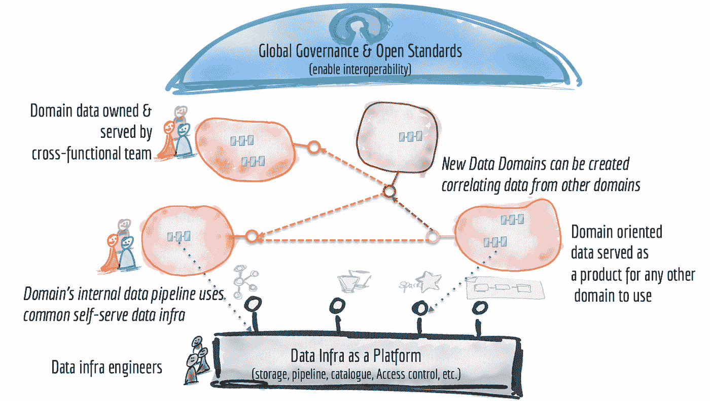

数据网格概念概述

接下来，让我们回顾一下 OLTP 和 OLAP 世界是如何发展的，以及为什么将它们更紧密地结合在一起很重要。

# 从 OLTP 到 OLAP

在本节中，让我们回顾一下如何将当前在**操作平面**中实现的概念集成到**数据平面**中。

## OLTP 世界

**操作平面**是应用程序运行的地方，这些应用程序是为付费用户准备的。因此，很自然地认为 **OLTP** 世界在流程创新和优化方面往往领先，因为它是**的主要收入驱动因素**。相比之下，数据平面往往更多地用于收入优化，这听起来可能不太重要，但事实是，许多业务利益相关者低估了数据驱动决策的力量以及对公司收入的影响程度。

在过去的十年中，OLTP 领域取得了巨大的进步。我们从独立的独石，到分布式独石，到容器，再到 [**微服务**](https://en.wikipedia.org/wiki/Microservices) **。**

技术创新之后是流程创新，我们学会了如何使用[领域驱动设计](https://en.wikipedia.org/wiki/Domain-driven_design) ( **DDD** )围绕业务领域构建微服务，我们改进了敏捷技术以便变得更加**灵活**，我们通过创建自助服务平台来提高自动化效率，我们开发了工具来密切监控和**审计**我们的所有系统，确保我们的应用程序具有最佳**质量**， 云提供商已经发展到提供大量的服务，以促进最重要领域的发展。

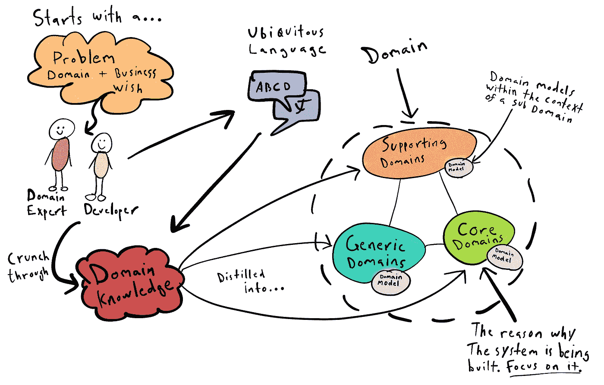

DDD 在行动

我们也看到了使用 [**Kafka**](https://en.wikipedia.org/wiki/Apache_Kafka) 等工具的**流处理**的兴起，它正在慢慢取代旧的批处理系统，使我们能够创建**基于异步**事件的松散耦合且易于扩展的应用程序。 [**Kubernetes**](https://en.wikipedia.org/wiki/Kubernetes) 允许我们在任何云中或本地部署任何工作负载，而 [**服务网格**](https://www.redhat.com/en/topics/microservices/what-is-a-service-mesh) 用于统一操作平面，允许我们管理任何工作负载，无论其部署在何处。

我们似乎也增加了**安全性**和**自动化** **流程**:静态代码分析、质量检查、测试(大量测试！)，等等。

最近，由于 [**DevOps**](https://en.wikipedia.org/wiki/DevOps) 实践(以及 [DevSecOps](https://www.ibm.com/cloud/learn/devsecops) )的兴起，我们已经看到了工程部门的统一，每个人都是开发人员。传统的运营人员已经学会以与传统开发人员相同的方式开发服务，使用 I[n 基础结构如 Code](https://en.wikipedia.org/wiki/Infrastructure_as_code) 、CI/CD 等为开发人员创建**自助服务平台**；因此，现在运营商可以构建供开发人员使用的服务，而不是要求运营人员去做事情，以便支持 DevOps 原则，例如**自我管理平台和独立的跨职能团队**。这使用相同的过程和工具统一了不同的角色；运营商为客户开发服务，就像开发商一样，唯一的区别就是运营商的客户就是开发商。最终，每个人都使用相同的**工具** (Git、Kubernetes 等)和相同的**流程** (Pull Request Review、CI/CD 等)来构建服务。尽管如此，数据科学家和数据分析师生活在一个不知道所有这些“好东西”的平行宇宙中；在数据世界中使用这些最佳实践不是很好吗？

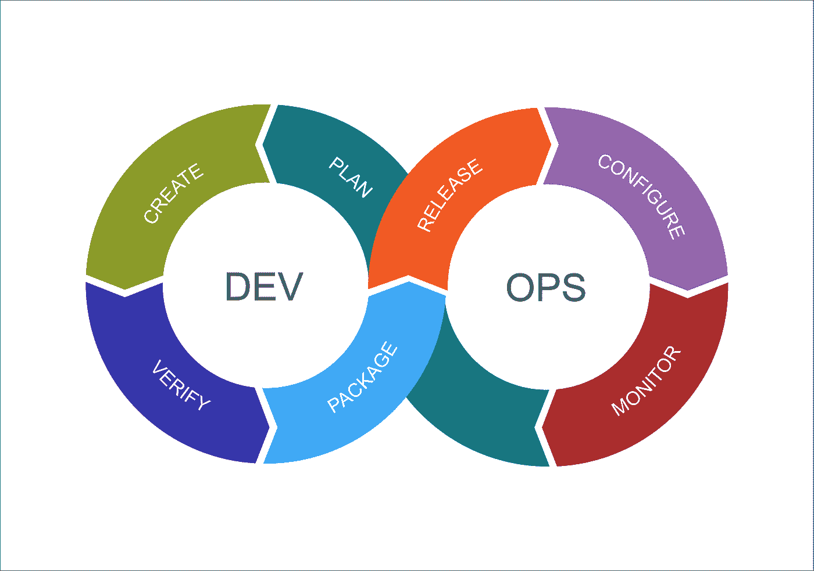

与几年前相比，任何人都可以不费吹灰之力创业并扩大规模。我们拥有构建大规模应用程序所需的工具、基础架构、流程和方法，但在数据领域却很难做到这一点。

接下来，让我们回顾一下数据世界发生了什么…

## OLAP 世界

由于 [**大数据**](https://en.wikipedia.org/wiki/Big_data) 的兴起，数据世界也发生了很大的变化，但在我看来，这些快速变化更多的是被动的，而不是主动的，这是对互联网上发生的快速变化的技术反应，主要由**人工智能和机器学习**驱动。我们必须快速适应接收和处理大量数据。

我们从旧的独立数据仓库**转移到数据湖**转移到数据湖**，从关系数据转移到不同类型的**【图形、表格、文档等】，从批处理转移到实时处理，从静态报告转移到动态仪表板等。****

**[**Kappa 架构**](https://hazelcast.com/glossary/kappa-architecture/) 的引入是为了统一批处理和流处理，因此无论数据是静止的还是移动的，我们都可以使用相同的工具来构建分析。这使我们能够实时检测信用卡欺诈或调用机器学习模型。**

**我们还有用于**数据目录和治理**的[工具](https://www.collibra.com/us/en?source=mkto-fallback-page)，因此我们可以轻松地发现和跟踪数据；我们创造了工具来确保我们的数据是可信的。**

**[**机器学习**](https://en.wikipedia.org/wiki/Machine_learning) 一直是这场革命的主要驱动力，推动数据工程师创造创新的解决方案，旨在处理训练机器学习模型所需的大量数据。**

**然而，**与运营层面**相比，我们在数据层面仍有不同的流程、工具、技能和方法。开发人员编写的应用程序会产生大量数据，而没有考虑这些数据对组织有多大价值。由数据工程师来决定如何获得这些数据，并将其转换为数据分析师或数据科学家使用；数据分析师负责尝试理解这些数据。在数据领域，我们正在做我们知道在 OLTP 领域不好的事情:由于围绕技术方面而不是业务领域构建的集中式体系结构，造成了孤岛和瓶颈。**

**在**机器学习**中，与数据分析相比，由于 [**MLOps**](https://ml-ops.org/) 实践能够更好地监控、自动化、部署、治理和审计 ML 模型，因此对流程进行了更多的研究和改进。**

**测试、监控和管理数据的流程也各不相同。我们目前有两个不同的世界，重复了很多工作。我们需要**统一重复的交叉方面**，例如治理、质量、自动化、流程、服务等。**

## **新世界**

**在我看来，数据网格原则是通过借鉴 **OLTP** 世界的思想，特别是 **DevOps** 原则和分布式**微服务**架构而创建的。**

**如今，我们有良好的流程来构建使用微服务的应用程序，我们的运营商也以同样的方式构建服务，具有最小的摩擦和高生产率。另一方面，我们也有一个由**数据工程师**组成的团队，努力跟上源数据的不断变化，同时满足下游消费者的需求。这与我们在创建微服务流程之前在 OLTP 中遇到的问题完全相同。这造成了团队之间的摩擦、低生产率、质量问题、缺乏治理和无法扩展。**

**得益于 [**Kappa 架构**](https://hazelcast.com/glossary/kappa-architecture/) **，我们已经朝着统一运营和数据层面迈出了重要一步。**通过统一批处理(OLAP)和实时(OLTP/OLAP ),我们迈出了缩小开发人员和数据科学家之间差距的第一步。现在我们可以在 OLTP 中使用流处理引擎进行异步通信、事件处理、事件源/ [CQRS](https://www.martinfowler.com/bliki/CQRS.html) 和数据存储；同时，使用相同的流引擎加载数据、执行 ETL 以及将数据从 A 移动到 B，这些都是传统的 OLAP 任务。我确实相信，拥有一个**流引擎平台**，比如 [**Kafka**](https://kafka.apache.org/) 或 [**Pulsar**](https://pulsar.apache.org/) 是极其重要的，以便使您的平台现代化，迁移到微服务、[无服务器](https://www.ibm.com/cloud/learn/serverless)、服务网格以及最终的**数据网格**。**

**接下来，我们还需要使用**领域驱动设计** ( [**DDD**](https://en.wikipedia.org/wiki/Domain-driven_design) )将数据平面分解为不同团队拥有的多个领域，创建**数据微服务**。数据网格建立在将责任分散和分配给最接近数据的人的基础上，以支持持续的变化和可伸缩性，目标是允许团队之间的组织自治，而不是对“数据”团队的集中依赖，这种依赖会造成瓶颈，类似于 OTLP 领域在 **DevOps** 创建时发生的情况..**

**我们还需要将**数据视为一种产品**，而不是 OLTP 世界中发生的事件的副作用。这意味着**像对待一个有合同、版本、客户和发布周期的应用程序一样对待数据。这个想法是创造真正的**数据所有者**，负责为他们的消费者创造数据产品。我们需要像对待其他客户一样对待数据消费者。消费者不应该纠结于如何消费数据，相反，数据生产者必须确保下游消费者可以轻松地发现和使用数据。****

**数据消费者将使用**数据** [**目录**](https://www.collibra.com/) 来查找数据并请求访问。数据生产者将授予访问权。通过使用联合治理，策略将被自动化、验证和执行，联合治理还将设置互操作性规则并治理不同的契约和模式演进。**

**此外，我们需要能够轻松扩展和自我调配的**自助式数据平台**。需要标准工具为数据用户提供良好的体验。这包括监控、可观察性、安全性等。这在 OLTP 世界中是必不可少的，但是在数据世界中却常常缺少这一点，因为在数据世界中缺乏可观察性会产生数据质量问题和安全漏洞。尽管工具是为解决这些问题而创建的，但它们专注于使用新工具解决特定问题，而不是重用 OLTP 领域的概念和工具。我们习惯于为我们的代码实现静态代码分析、容器图像扫描器、度量、日志等，但是检查数据和元数据的质量问题、生成变更日志、沿袭等在 OLAP 世界中是经常缺少的。**

**最后，我们需要**联合治理**，它定义了互操作性标准，但是将责任推给了域所有者。想法是通过创建跨不同域的软件定义和自动化治理来虚拟化对数据的访问。**

**统一实时 和**批量** **数据**的[**治理也是非常重要的，创建工具还可以分析移动数据并检查质量、沿袭并能够对实时数据进行编目。**](https://docs.confluent.io/cloud/current/stream-governance/overview.html)**

**简而言之，**数据网格**是“所有权、转换&数据服务”的分散化，而不是拥有一个所有者(OLTP)，一个由数据工程团队和另一个团队管理访问的独立 ETL 管道。**

**现在我们对这个新世界有了更好的了解，让我们更深入地挖掘数据网格原理。**

# **数据网格原则**

**到目前为止，我们所看到的是需要缩小应用程序开发和数据产品开发之间的差距，我们需要统一流程。我们知道我们需要围绕业务领域建立跨职能团队；这在许多组织中已经存在，但现在我们需要确保每个团队不仅要构建应用和服务，还要构建**数据产品**来实现管道、安全性、监控、发现能力和其他一切轻松消费数据所需的东西。**

**让我们回顾一下[扎马克](https://martinfowler.com/articles/data-mesh-principles.html)描述的为数据网格奠定基础的原则。**

## **域名所有权**

**这一原则背后的想法是在数据平面和操作平面旁边使用**域驱动设计**([**【DDD】**](https://en.wikipedia.org/wiki/Domain-driven_design))来缩小两个平面之间的差距。目标是围绕业务领域划分团队，每个团队完全跨职能，但不仅仅是在操作层面上( **DevOps** )，而且是在分析层面上。每个团队都应该有一个数据所有者、数据工程师和 QA 团队，他们不仅要验证微服务，还要验证数据质量。**

**我们需要建立一个架构模型，通过**域**来安排分析数据。组织其他部分的域 API 不仅应该包括操作能力，还应该包括对域产生的分析数据的访问。**

**数据网格建立在**去中心化**的理念之上，将责任分配给最接近数据的人，以支持持续的变化和可伸缩性。这里的组件由分析数据、元数据和为其服务的必要计算组成。这意味着，每个跨职能团队还将包括数据工程师和数据所有者，并创建供其他客户(如业务分析师或数据科学家)消费的产品。**

**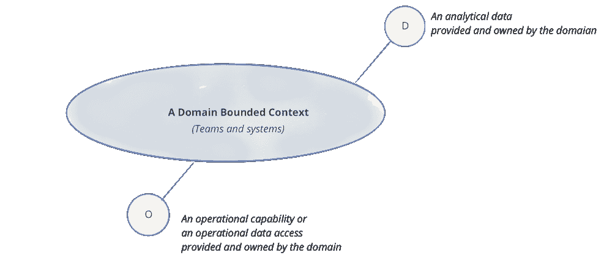**

## **数据作为一种产品**

**每个领域都有数据**产品负责人**，他们负责确保数据作为产品交付的客观措施。这些措施包括数据质量、减少数据消耗的准备时间等。**

**领域数据产品负责人必须深入了解谁是数据用户，他们如何使用数据，以及他们习惯使用哪些方法来消费数据。数据用户和产品所有者之间的对话是建立数据产品界面的必要条件。**领域驱动设计**应该用来设置正确的领域和[有界上下文](https://www.martinfowler.com/bliki/BoundedContext.html)以减少团队之间的摩擦。请记住，编写应用程序的团队很可能会产生数据，他们也必须拥有数据，并将数据作为产品提供给下游用户。**

**每个团队都有**数据产品开发人员**的角色，负责构建、维护和服务数据产品。数据产品开发人员将与该领域的普通开发人员一起工作。每个领域团队可以提供一个或多个数据产品。**

**一个**数据产品**由包含管道的**代码**、包含元数据的**数据**本身以及运行管道所需的**基础设施**组成，如**Apache**[**Spark**](https://spark.apache.org/)**或** [**Pulsar**](https://pulsar.apache.org/) 。目标是让应用程序代码和数据管道代码在同一个团队拥有的同一个域下。正如您所看到的，我们正在将责任转移给真正理解领域和创建数据的人，而不是数据平面中的“数据”所有者，他们通常努力理解数据并在团队之间制造摩擦。这意味着更改应用程序和数据的人负责使用模式版本化和文档将数据发展传播给不同的利益相关者。这确保了数据模式的更改可以由数据创建者轻松实现，而不是由数据分析者在事后试图适应更改。**

**将构建数据产品想象成使用相同的过程构建应用程序。如果您更新了一个服务，那么您就增加了 API 的版本并广播了这一变化。每个人都明白定义良好的 API 的重要性。这个原则的意思是，你应该对数据做同样的事情。如果你生成数据，你还应该负责以一种标准且易于使用的格式存储它，也许是一个以拼花格式的 [**数据湖**](https://en.wikipedia.org/wiki/Data_lake) 或者一个数据仓库。如果您更改了数据，您需要处理模式演变，对其进行版本化并广播更改；与操作 API 相同。**

**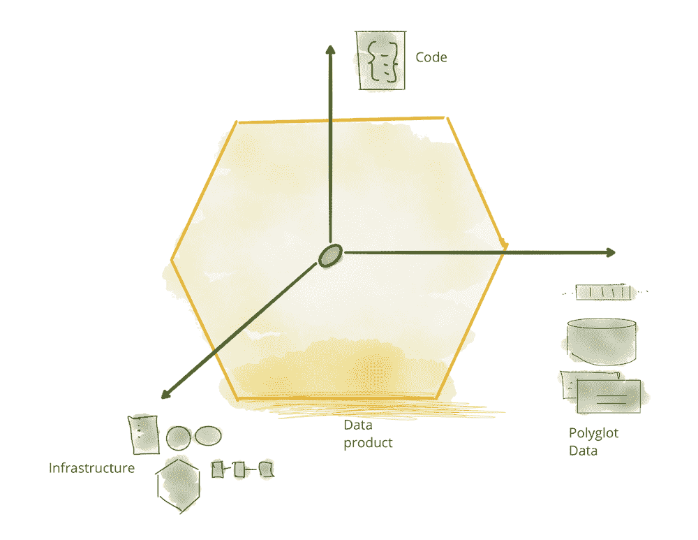**

****数据产品**必须有一个**模式**，附带**版本**、**元数据**，支持**加密**，可**寻址**并便于**发现**、**目录**注册和**发布，**它们还必须易于监控，以便我们可以跟踪 SLA。ETL 管道是数据产品的一部分，对消费者来说是隐藏的。你可以在[原始文章](https://martinfowler.com/articles/data-monolith-to-mesh.html#DataAndProductThinkingConvergence)中了解更多关于数据产品的属性，其中 *Zhamak* 解释了数据产品的主要属性，即可发现性、安全性、可探索性、可理解性、可信性等。**

**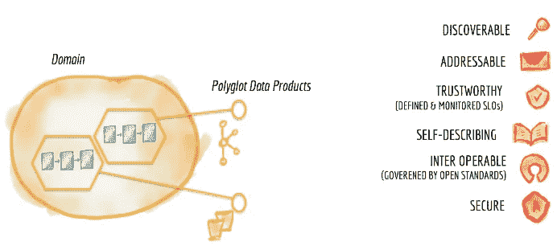**

**数据产品属性**

**注意**数据产品可以由聚合不同数据集的其他数据产品**组成。数据工程师可以很容易地使用定义良好的 API 来合并数据，以创建聚合数据集供其他团队使用。数据工程师不需要领域知识，他们在一个不同的[有界环境](https://www.martinfowler.com/bliki/BoundedContext.html)中工作，他们只需要知道足够多的知识就可以创建聚合结果。**

## **自助式数据平台**

**从**基础架构**的角度来看，我们的目标是随着我们转向完全自助服务平台，逐步改进和简化配置流程。您可以使用 Kubernetes 的强大功能，使用相同的通用语言来管理 OLTP 和 OLAP 资源。这将使我们能够轻松地创建集群、存储等等。**

**下一步是供应管道，添加[编排](https://argoproj.github.io/argo-workflows/)工具、存储供应、访问控制、查询引擎、 [Spark](https://spark.apache.org/) 集群、Kafka/Pulsar 集群等。最终目标是创建一个完全自动化的自助服务平台，其中包括构建和管理数据产品所需的所有工具。这套工具将使用相似的语言( **Kubernetes** )和相似的方法( [**GitOps**](https://www.gitops.tech/) )统一数据和应用产品。最终目标是有一个**声明性的**方法，为领域开发者按需提供数据基础设施，并最终抽象出技术细节，供包括数据所有者在内的非技术人员使用。正如我们之前提到的，运营商不仅要为开发者，还要为数据科学家和数据分析师构建服务。请记住，现在我们一起构建应用程序和数据产品，因此我们必须使用相同的服务，无论我们所做的是 OLTP 还是 OLAP 相关的。我们应该能够消费提供 Kubernetes 集群的服务，就像我们消费运行 [Spark](https://spark.apache.org/) 作业的服务一样。**

****安全性**需要**自动化**同样，当数据消费者请求访问数据产品时，需要由所有者使用自动化工具授权，不需要其他团队的任何手动干预。**自动化**是实现**分权**的关键。**

**一旦我们达到了这个层次，下一个合乎逻辑的步骤就是在工具之上创建抽象，以简化非技术人员的使用。需要实现一个**网格迷信平面**来在高层次上跟踪网格上发生的一切。例如，发现特定用例的数据产品的能力最好通过搜索或浏览数据产品的网格来提供；或者关联多个数据乘积以创建更高阶的乘积。**

**不幸的是，**目前没有平台或产品来管理数据网格**中的数据平面，所以这取决于每个公司在现有工具的基础上开发抽象。我确实认为，在不久的将来，数据网格平台将为网格提供一个监管平台，包括自助服务平台、可观察性、数据管理(质量、沿袭、治理……)、策略执行和集成。我们需要像 [**Istio**](https://istio.io/) 这样的东西，它在**服务网格**中可用，在**数据网格**中可用。**

**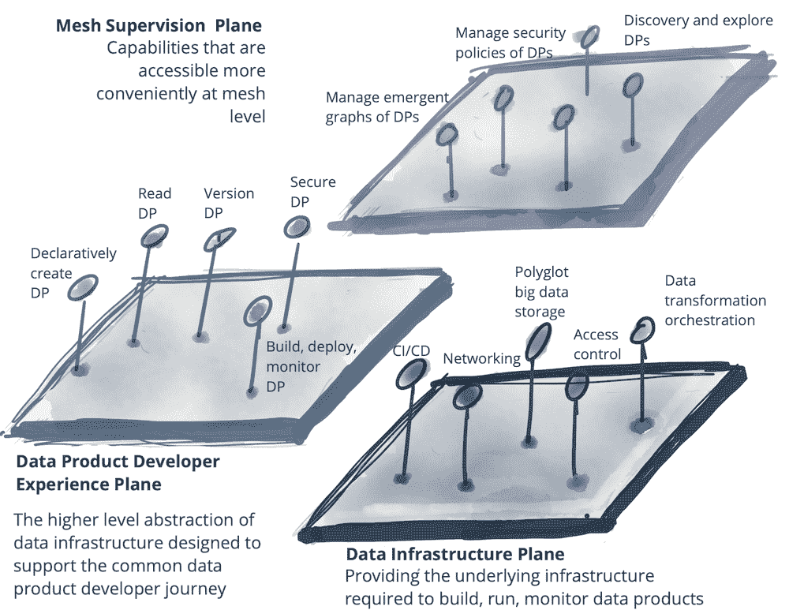**

**数据基础设施抽象**

**我们不能忘记**可观察性**，在数据网格中，良好的监控和审计对于确保数据质量和合规性至关重要。**

## **联合治理**

**数据网格实现需要一个治理模型，该模型包含去中心化、通过全球标准化实现互操作性，以及在平台中自动执行决策。尽管我们可以分散工具和执行，但我们不能完全分散数据治理，否则我们将陷入数据无政府状态。这个想法是创建一个团队来保持集权和分权之间的平衡。这就是每个领域需要本地化的决策，以及所有领域应该全局做出的决策。**

**数据网格治理的优先事项往往不同于 OLAP 世界的传统治理。数据网格的联合治理包含了变化和多个受限的上下文。适当的组织结构和架构对于联合治理模式的运行是必要的，以便在尊重本地域自主权的同时，达成**互操作性**的决策和标准，并有效地实施全球政策。**

**这个想法是**在保持全球水平的互操作性和集成标准的同时，尽可能地将决策本地化**,这样不同的组件可以很容易地集成。在数据网格中，[工具](https://www.collibra.com/us/en)可用于实施全球策略，如 [GDPR](https://gdpr.eu/) 实施或访问管理，以及本地策略，其中每个域为其数据产品设置自己的策略，如访问控制或数据保留。**

**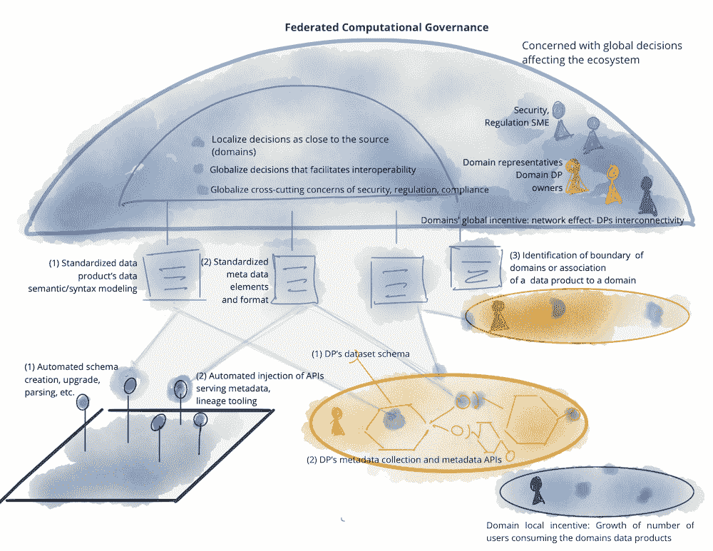**

**下表解释了集中式治理模型和新的数据网格模型之间的差异。**

**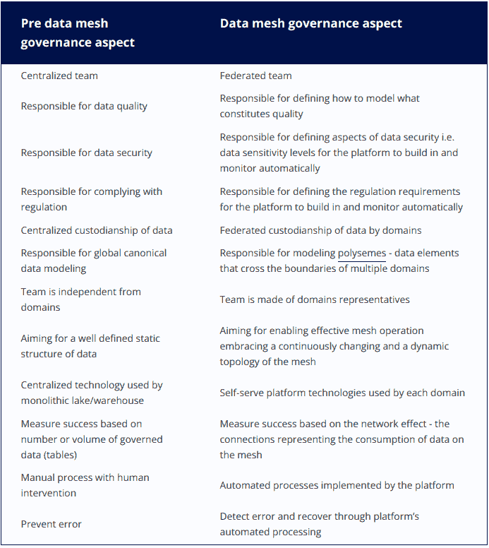**

**最后，下表**总结了**向数据网格的过渡:**

**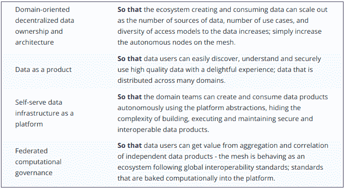**

**得益于**数据网格**及其领域驱动的设计方法；数据消费者不必是领域专家，他们可以直接消费数据，因为它是一种不可操作的 T2 格式。**

**在一个数据网格中，**每个团队负责处理与团队域**相关的数据。他们必须收集数据并将其移动到正确的存储位置，以便数据用户可以轻松使用。数据工程师将是团队的一部分，他们可能会使用 Kafka 等流引擎来移动数据和执行 ETL，或者以批处理或微批处理的方式运行数据管道。关键在于，数据管道只是数据域的内部复杂性和实现，在域内内部处理，而不是有单独的数据工程团队。**

**总而言之，**数据网格原则**基于成熟的 **OLTP** 理念，目标是**构建像应用程序**这样的数据产品，通过定义契约并遵守**安全性**和**互操作性**标准，以可靠的方式向消费者提供这些产品。数据产品必须**可发现、可寻址、可信任、自描述、可互操作&安全** *。*这些数据产品是由跨职能团队围绕每个业务领域内定义良好的有限环境构建的。这些产品必须相互兼容和互操作，并且使用自助式数据基础架构创建。**

# **实现数据网格**

**此时，您可能会想:“好吧，这很有道理，但是我如何实现数据网格呢？”**

**如果你看看一些数据网格的实现，比如宝马、摩根大通，你会注意到高度的集中化。这是因为数据网格还处于起步阶段，我们只有一套非常高级的原则可以使用。我在介绍中提到过，这就是 Scrum 所发生的事情，每个公司都不同地解释和实现了这种方法，借用了一些概念，同时保持了其他概念的完整性。**

**目前，我们有 [**多种数据网格**](https://towardsdatascience.com/theres-more-than-one-kind-of-data-mesh-three-types-of-data-meshes-7cb346dc2819) ，有些高度集中，有些则更加分散。**迁移到分散式架构既困难又耗时**，需要很长时间才能达到能够大规模运行的适当成熟度水平。虽然存在技术上的挑战，但主要的困难是试图改变组织的思维模式。这是因为大多数公司都是以严格的等级和集中的方式创建和运营的。这就是为什么迁移到微服务也很困难，为什么没有那么多组织实施真正分散的微服务架构的原因。**

**重要的是，如果你的公司还没有准备好，你不要急于实施一个**数据网格**，你需要首先达到一定的成熟度。**

## **成熟度级别和要求**

**我将尝试总结成功实现**数据网格**所需的**先决条件**:**

*   **你需要一个围绕业务领域设计的**扁平的**组织结构，由**跨职能团队**组成。产品和工程师应该作为一个团队工作，QA 团队不应该分开。如果你有一个传统的公司结构，你有运营团队，QA 团队，产品团队，数据科学家团队等。那么您的数据网格实现很可能会失败。**
*   **你需要一个健康的 [**DevOps**](https://en.wikipedia.org/wiki/DevOps) 文化，其中所有团队成员都是以**自动化**方式构建服务的开发人员，如果可能的话，使用声明性 [**GitOps**](https://www.gitops.tech/) 实践。**
*   **你需要一个现代化的平台来提高生产力，并对用户隐藏技术细节。您可以选择使用 **Kubernetes** 或云**无服务器**技术，但是您需要某种程度的抽象来实现自助服务基础设施。还推荐使用 [**服务网格**](https://www.redhat.com/en/topics/microservices/what-is-a-service-mesh) 来统一您架构的网络方面。**
*   **你需要一个**流引擎平台**比如 [**卡夫卡**](https://kafka.apache.org/) 或者 [**脉冲星**](https://pulsar.apache.org/) ，对我来说这是绝对必须拥有的。需要迁移到微服务并统一批处理和流。这是缩小 OLTP 和 OLAP 工作负载之间差距的第一步，二者都可以使用流平台来开发事件驱动的微服务或移动数据。这些平台将允许您以可靠的方式复制不同格式或数据库中的数据。这样，您可以开始以不同的形式提供相同的数据，以满足下游消费者的需求。**
*   **你需要迁移到**微服务**。关键是要了解 [**领域驱动设计**](https://en.wikipedia.org/wiki/Domain-driven_design) ( **DDD** )是如何工作的。如果你能理解 DDD 的概念，并学习如何围绕业务领域分割微服务并设置有界的上下文，那么将同样的想法应用到数据产品上会容易得多。**
*   **您使用**数据湖或数据仓库**已经有一段时间了，如果您不熟悉大数据及其含义，那么实施数据网格将非常困难，可能根本没有必要。**
*   **你需要管理**元数据**，并且有一种方法来寻址、发现和**编目**数据。**

## ***既然数据网状分布，***这是否意味着* ***数据湖泊*** *都死了？****

***一点也不，仅仅因为数据网格鼓励一个**分散的**架构，并不意味着我们不能使用一个中央数据湖，这是一个实现细节，使用廉价的深度存储来保存和管理我们的数据是有意义的。这并不意味着我们集中数据，数据将被分隔在桶中，并可通过 URL 寻址，它也可以被发现和加密(安全性)。**一个数据湖拥有实现一个数据网所需的所有属性**，并且它与它的原则并不矛盾；这就是为什么这是实现数据网格最常见的方式。***

***同样真实的是，随着 [**大规模数据库**](/massive-scale-databases-5b5917ed94e5) 和数据仓库的兴起，我们注意到廉价数据湖的使用在减少。 **Kubernetes** 可用于以符合成本效益的方式运行数据库，遵循**领域驱动设计**原则，每个业务领域都有一小组微服务，这些微服务生成的数据可存储在同一个数据库中。例如， [**ScyllaDB**](https://www.scylladb.com/) 可以用于 OLTP 和 OLAP 工作负载，因为调度器可以管理长时间运行的查询，而不会影响短时间的 OLTP 查询。***

***一种更加分散的数据网格方法是在组织中分布多个数据存储。此外，相同的数据可以以不同的形式存储。例如，图形数据库可用于查询复杂的关系。通过这种方式，您的数据产品可以在数据目录中以表格的形式发布，无需使用深层存储和查询引擎就可以直接进行查询。您所需要的只是一个数据目录和一个可用于 OLAP 查询的数据库。在您的域中有几个数据库也是可以的。对于您的应用程序，您可能有 [**PostgreSQL**](https://postgresql.org/) ，CRUD 事件可以广播到您的流平台( **Kafka** )，然后由您的 OLAP 服务使用，该服务可以将数据写入 OLAP 数据库，如 [**ClickHouse**](https://clickhouse.com/) 。在本例中，在单个边界内 [PostgreSQL](https://postgresql.org/) 将拥有可变数据的当前数据快照，而 [**ClickHouse**](https://clickhouse.com/) 将拥有可提供给数据消费者的历史数据。拼图的最后一块是通过添加模式、版本、API、元数据并将其添加到目录中，从而转变为数据产品。***

***把一个**数据** **API** 看作是通用的东西。在 OLTP 领域，我们使用 REST APIs，因为它们是可寻址的、自文档化的并且有版本支持。当然，你也可以为数据产品使用 **REST** API，你可以请求下载不同格式的数据，这对许多消费者来说非常好，但在 OLAP 世界 **SQL** 是事实上的语言，JDBC 是利用数据的唯一方式。因此，在 **OLAP** 世界中，一个 API 可以是一个简单的**视图**，它位于目录中附有元数据的数据之上。此外，API 可以是一个简单的 **Jenkins** 作业，它触发一个 Spark 作业，该作业在特定位置生成一组 parquet 文件。***

***好的数据 API 的另一个例子是 **Kubernetes** 资源，您可以创建自定义 [**CRDs**](https://www.bmc.com/blogs/kubernetes-crd-custom-resource-definitions/) 来定义数据产品，它包括生成数据产品所需的所有资源，包括 ETL、卷、服务等的作业。***

***所有的**数据 API**应该使用相同的全球定义的数据格式，以使消费非常简单，**互操作性**在任何分散的架构中都非常重要，这样不同的服务就可以相互交流。这是联合治理团队的功能之一，以确保数据的互操作性。***

******

***现在，让我们看看构建数据网格需要什么…***

## ***数据网格组件***

*****储存*****

***在数据网格中存储数据最常见的方式是**深度存储**。无论您是选择 AWS [**S3**](https://aws.amazon.com/s3/) 还是 GCP [**GCS**](https://cloud.google.com/storage/) 等云提供商，还是选择 [**MinIO**](https://min.io/) 等云不可知工具，您都可以获得构建数据网格所需的正确成分。这些工具提供了构建数据产品所需的所有 [**特性**](https://martinfowler.com/articles/data-monolith-to-mesh.html#DataAndProductThinkingConvergence) 。使用 URL 可以对对象进行寻址，您可以进行细粒度的访问控制、版本控制、加密、元数据和可观察性。您可以轻松地监控和管理存储在数据湖中的数据。***

***另一个选择是使用数据仓库。新的现代数据仓库有了很大的改进，由于无服务器分析，它们不需要任何维护，您可以直接使用它们，而不用担心操作负担。谷歌的 [**大查询**](https://cloud.google.com/bigquery/) 可能是现有的最好的数据仓库，它拥有满足你所有分析数据需求所需的所有特性，包括构建数据产品。***

***新的现代引擎已经创建，能够统一实时和批量数据，并以非常低的延迟执行 **OLAP** 查询。例如， [**Apache Druid**](https://druid.apache.org/) 能够以经济高效的方式接收和存储大量数据，最大限度地减少对数据湖的需求。我在我的 [**上一篇文章**](/olap-query-engines-for-big-data-5f17b88d6ebc) 中谈到了这些工具的可扩展性。***

*****数据处理*****

***在数据网格中，数据处理被封装在数据产品中。没有中央 ETL 管道，它们隐藏在不同的团队后面。这意味着你可以使用已经在使用的工具，比如 Spark、 [Airflow](https://airflow.apache.org/) 、 [Trifacta](https://www.trifacta.com/) (它也提供自助服务基础设施)等。***

*****数据网格**不是技术，是**新心态**，和微服务一样。数据质量、数据清理和数据处理等重要任务仍然存在，但不再集中，而是由不同的团队在联合治理下进行管理。***

*****元数据和数据目录*****

> ***简而言之，数据目录是组织中数据资产的有序清单。它使用元数据来帮助组织管理他们的数据。它还帮助数据专业人员收集、组织、访问和丰富元数据，以支持数据发现和治理。”***

***在 AWS 中，您可以使用 [**胶合目录**](https://docs.aws.amazon.com/glue/latest/dg/populate-data-catalog.html) 来存储包括模式和视图在内的所有元数据。这可以导出到其他外部[工具](https://marketplace.collibra.com/listings/jdbc-driver-for-aws-glue-catalog/)进行数据治理。GCP 有一个优秀的 [**数据目录**](https://cloud.google.com/data-catalog) ，可以与大查询完美集成。***

***一个著名的开源工具是 [**Datahub**](https://github.com/linkedin/datahub) 用于对您组织中的资产进行编目，并可用于轻松发现和跟踪您的数据***

***一个企业的备选方案是**。对于移动/实时数据你可以使用 [**流治理**](https://docs.confluent.io/cloud/current/stream-governance/overview.html) 。*****

*****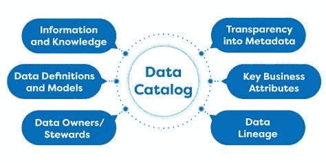*****

*******查询引擎*******

*****在这一点上，我们有团队运行 ETL 管道，生成数据并以一种容易被发现和寻址的方式存储它。对于临时查询或创建聚合产品，我们还需要查询引擎来透明地查询数据，而不依赖于用来存储数据的技术。*****

*****您可能在关系数据库中有一个快速数据层，在**深层存储中有历史数据**。尽管如此，数据消费者应该在不知道实现细节的情况下查询它。这一点非常重要。*****

*******像 [**Presto**](https://prestosql.io/docs/current/admin/web-interface.html) 或 [**Trino**](https://trino.io/) 这样的查询引擎**可以用来查询数据，而不管数据存储在哪里。它们可以与数据目录集成，并连接来自不同数据源的数据。我在我的 [**上一篇文章**](/olap-query-engines-for-big-data-5f17b88d6ebc) 中讲了很多关于查询引擎的内容。*****

*****BI 工具*****

***数据分析师是最常见的数据消费者，他们倾向于较少的技术，并倾向于使用不同的工具。 **BI 工具**如 [**Tableau**](https://www.tableau.com/) 或 [**Qlik**](https://www.qlik.com/us) 在组织中可扩展性使用，以获得更好的洞察力，做出更好的决策。***

***在数据网格中，拥有不同层次的数据抽象是很常见的。运行生成数据的应用程序的域名所有者创建低级数据产品。这些原始数据可能对数据科学家和机器学习有用，但对创建报告的业务用户来说可能太细了。正如我们之前提到的，聚合数据创建新的更高级别的数据产品是很常见的，这些数据产品更容易消费和与 BI 工具集成。***

## ***迁移到数据网格***

***从**将您的 OLTP 工作负载转移到微服务**开始，改变您的思维模式并学习流程和工具。之后，您可以开始向数据添加元数据、数据目录、世系等。***

***接下来，开始转移责任，将所有权移近源头。尝试将相同的数据质量、治理和可发现性应用于[移动数据](https://docs.confluent.io/cloud/current/stream-governance/overview.html)来统一批量和实时数据，通过这样做，您可以使用相同的技术堆栈间接统一数据和操作层面。***

***尝试**围绕查询**为你的数据建模，这些是你的消费者，你需要非常了解他们。不要试图对数据建模，把它放在某个地方，然后忘记它。例如，根据您可能需要对数据进行不同分区的查询，这是行不通的。**使用不同的分区方案甚至不同的数据库(图形、文档、表格……)复制数据**是可以的。当您使用领域驱动设计围绕查询建模和描述数据时，您正在为您的客户创建真正的数据产品。***

***利用**云**的力量为 ETL 管道创建易于消费的数据服务。如果你在云中运行，你可以使用无服务器的数据服务，如 **AWS** **S3** 、Glue 和 Athena 来运行转换、移动数据、加密数据、编目数据和发现数据。如果你使用 Kubernetes，你可以使用 MinIO 作为存储层或者任何数据库/数据仓库，因为现在大多数都可以在容器中运行。然后，您可以开始创建自助服务功能来为 ETL 管道创建集群或 spark 作业。接下来，您可以创建自己的自定义 [**CRDs**](https://www.bmc.com/blogs/kubernetes-crd-custom-resource-definitions/) 和 [**操作符**](https://kubernetes.io/docs/concepts/extend-kubernetes/operator/) 来创建更高级别的抽象，以便生成数据产品。您可以使用 [**Trifacta**](https://www.trifacta.com/) 等工具在他们的自助服务平台中创建数据产品。***

***看看开发人员在 OLTP 领域做了些什么，想想你能给 OLAP 世界带来的想法，比如可观察性、自动化、流平台等。例如，如果开发人员正在使用 Kafka，那么利用该技术为您的数据产品创建 ETL 管道。如果他们使用微服务，尝试通过定义和管理模式及其变更来推动团队开始拥有数据。目标是**通过使用流引擎作为主干，慢慢地转移到一个分散的架构**，以达到新旧系统之间的最终一致性。***

***现在让我们仔细看看实现数据网格的可能方法。***

## ***构建数据网格的步骤***

***在他的博客中， [Sven Balnojan](https://svenbalnojan.medium.com/) 做了出色的工作，解释了建立数据网所需的不同步骤。我真的建议查看他的文章**以获得更多细节，但是我将尽我所能在这里用三个主要阶段来总结它:*****

*   *****第 1 阶段:使您的数据可寻址。所以很容易被发现。标准化存储桶名称，并使用 REST 方法使用资源名称命名数据产品，例如*S3://my-domain/data-service-a/resource/date*。这已经是朝着数据标准化和易于消费迈出的巨大一步。向端点添加**SLA**并**监控**它们以确保数据始终可用。现在，您可以重新路由您的查询引擎和 BI 工具，以使用独立且可寻址的新数据产品。对于**数据仓库**，使用相同的方法，按照标准化的命名约定创建标准模式和视图。您的数据平台团队将负责这个阶段，仍然使用集中的方法；同样，我们需要一步一步来，稍后我们将解决集中所有权问题。*****
*   *******阶段 2:元数据和数据目录(可发现性):**如果您还没有这样做，请改进元数据并添加数据目录以实现数据可发现性，这样任何人都可以在您的组织中购买任何数据产品。您需要一个[位置](https://www.collibra.com/us/en)来搜索、发现和“购买”您企业内部的数据。您还需要一种方法来请求和授予对数据产品的访问权限，这种方法对于数据所有者和消费者来说是可用的，而不需要中央团队的参与。在这一阶段，对数据产品特性的工作增加了对数据质量、沿袭、监控等的测试。静止数据和移动数据。*****
*   *******阶段 3:通过打破数据块实现领域驱动设计。这是至关重要的一步。您需要尝试将所有权交给创建数据的领域团队，使其转向非集中式架构。每个团队必须拥有他们的数据资产、ETL 管道、质量、测试等。请记住，您仍然需要**联合治理**来实现数据标准化、安全性和互操作性。如果您已经准备好了，就不需要进行重大的更改，您只需要确保将这些功能构建为服务，以便创建一个自助服务平台。在此阶段，您可能会引入**数据操作**实践，并提高可观察性和自助服务能力。这样，您可以统一您的 OLTP 和 OLAP 流程和工具。*******

***一旦你创建了你的第一个"**数据微服务**"，重复上面的过程，将遗留的数据块分解成更分散的服务。***

***同样，这只是过渡到数据网格的一种方式，而不是唯一的方式，您可以选择实现一些特性，而忽略一些。您需要**选择最适合您组织的模式**。记住将数据产品视为组织中的任何其他服务，构建自动化、可观察性、API、应用 SLA、安全性、审计等。***

*****Data Mesh** 比微服务更进一步，创造了更难测试、验证、发现和改变的数据产品。这就是为什么**实现数据网格是非常困难和繁琐的**。一次又一次的事实证明，大爆炸的方法是行不通的；因此，就像我们对 Scrum 所做的一样，**正确的方法是慢慢地开始将数据网格思想**和原则整合到您当前的平台中，并从作为副产品的数据迁移到完全独立的数据产品。***

******我需要一个数据网格吗？******

*****数据网格难以实施**,因为去中心化的特性总是会增加复杂性；但同时，为了解决公司目前面临的可伸缩性问题，它也是必需的。集中式架构适用于小公司或非数据驱动的公司，如果是这种情况，请不要实施数据网格。***

***仅当您遇到**扩展困难、团队摩擦、数据质量问题、瓶颈和治理/安全问题**时，才实施数据网格。您还必须面对包含大量结构化和非结构化数据的大数据问题。***

***您还需要足够的预算来实现向数据网格的复杂过渡，并且需要足够多的具备适当技能的人员来执行迁移过程。***

# ***结论***

*****数据网格**仍然是一个不断发展的新兴范例；但是关于领域驱动设计、去中心化、数据所有权、自动化、可观察性和联合治理的核心原则；会留下来。***

***想想哪些原则更适合你的组织，不实现所有原则或者不完全实现它们是可以的。慢慢介绍原理**；当您过渡到分布式和分散式架构时，大爆炸式的方法永远不会奏效。*****

*****您可能想知道在 OLTP 领域迁移到微服务和服务网格，同时迁移到**数据网格**是否有意义；虽然看似合理，但会有相当大的风险。我建议迁移到微服务，首先实现一个服务网格，因为它更成熟，你有更好的工具可用。这也会给你时间将你的心态从单一的性质转变为分散的性质。然后，您可以使用学到的经验转移到数据网格。*****

*****如果在任何阶段你迷路了，总是看看 OLTP 世界，并尝试借用一些想法；最终，我们努力实现的是一个关于工具和流程的全公司生态系统，以统一运营和数据平面，允许公司在团队之间没有摩擦的情况下以任何规模增长。*****

*****归结起来就是:**像对待应用程序一样对待数据！*******

*******更新**:我目前在坦桑尼亚帮助当地的一所学校，我创建了一个 [**GoFundMe 活动**](https://www.gofundme.com/f/help-the-mango-school-children-in-tanzania) 来帮助孩子们，通过这个[链接](https://www.gofundme.com/f/help-the-mango-school-children-in-tanzania)来捐款，每一点帮助！*****

******记得来* ***拍拍*** *如果你喜欢这篇文章* [***关注*******me****](https://javier-ramos.medium.com/subscribe)**或*[*订阅*](https://javier-ramos.medium.com/membership) *获取更多更新！*******

******[**订阅**](https://javier-ramos.medium.com/subscribe) 获得**通知**当我发表一篇文章和 [**加入 Medium.com**](https://javier-ramos.medium.com/membership)访问数百万或文章！******