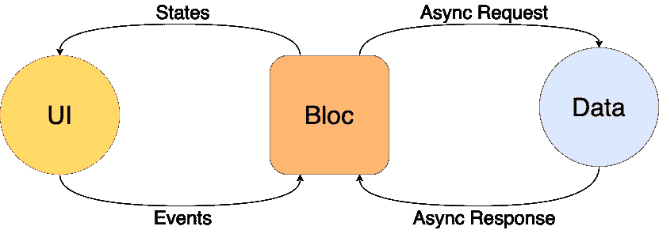

# 颤振抑制介绍

> 原文：<https://itnext.io/introduction-to-flutter-bloc-524510218c86?source=collection_archive---------0----------------------->

颤振块模式已经成为颤振社区中最流行的设计模式之一。在 GitHub 上几乎有 4000 颗星(在撰写本文时)，bloc package 提供了一个强大的工具，可以帮助您构建可反应和可维护的移动应用程序。

那么 block 到底是什么，人们为什么要用它呢？Bloc 代表业务逻辑组件，用于管理应用程序中的状态。这就是为什么所有在屏幕上发生变化的事情都可以在一个组件中处理，而不是在整个应用程序的不同位置处理。

让我们进入 flutter bloc 包的核心组件。

## 集团

Bloc 处理 UI 和任何业务逻辑之间的所有交互。Bloc 将事件作为输入，运行这些事件所需的任何算法，并返回一个状态。就这么简单。

## 事件

事件是发送给集团采取行动的东西。事件可以由软件中发生的一些动作触发，无论是点击按钮还是接收数据。基于发送的事件，块应该执行一些逻辑。

## 州

一旦逻辑被执行，程序块需要返回一个状态。状态是应用程序中可以改变的东西。无论它是在实际的 UI 上还是在后台(就像正在接收的认证)。

## 博客建筑

一旦接收到状态，就需要对其进行处理，并相应地重新构建小部件。这就是 BlocBuilder 的用途。每当状态发生变化时，它将使用新的状态信息重建所有子部件。

## BlocProvider

如果您的 Bloc 在多个地方使用，该怎么办？这就是 BlocProvider 的用武之地。BlocProvider 类似于 blocs 的 InheritedWidget。其子树中的所有小部件都可以访问 BlocProvider 中已经实例化的 bloc。

有了这些，你就有了集团模式的基础。有了这些基础，您就可以创建干净的软件，将业务逻辑从 UI 中完全分离出来。您将能够实现一个清晰的架构，并拥有更易于维护和调试的代码。

我要感谢菲利克斯·安杰洛夫，他是 flutter 集团的经理。我将继续学习更多关于 BLoC 和更高级的方面，比如处理多个 BLoC。所以请在 medium 上关注我，或者订阅我的 YouTube 频道了解更多信息！

链接到 flutter _ bloc:[https://pub.dev/packages/flutter_bloc](https://pub.dev/packages/flutter_bloc)

感谢阅读！

在推特上关注我:@tadaspetra