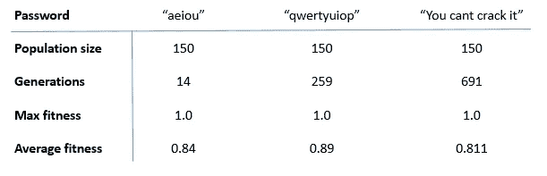
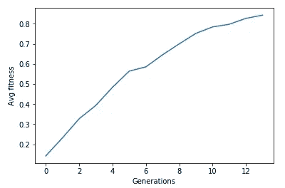
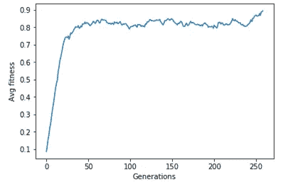
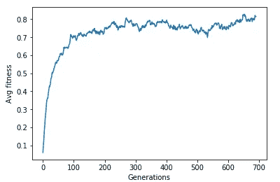

# 遗传算法简介

> 原文：<https://itnext.io/introduction-to-genetic-algorithm-ce03b5865dc0?source=collection_archive---------2----------------------->

## 离进化生物学过程更近了一步，以推断自然现象如何被用来解决复杂的计算机科学问题。


## 介绍

在我们开始之前，我们需要了解遗传算法的真正遗传性。基于自然选择和进化的现象，遗传算法试图利用遗传交叉、变异等过程来高度优化进化的过程，在计算机科学的情况下是收敛到问题的解决方案的过程。

## 流动

遗传算法的分步过程受自然进化的影响很大。它经历了一系列的事件，每一个事件的成功都依赖于前一个事件，用更新更好的种群来补充老的种群。在这里，更好意味着更新的群体有更好的 DNA。现在人口的确切定义，它的实体和他们的 DNA，是相当模糊的，取决于手头的问题。这些步骤是，

*   **初始化:**第一步，创建第一个群体，定义其大小、包含的实体、适应度参数等。在真正的魔术开始之前，这更像是一个预处理步骤。
*   **适合度计算:**这需要计算每个实体的适合度。现在，适应度基本上是一个分数，它定义了当前实体与所需的最终/完美实体的接近程度，越接近，其分数越高。
*   **选择**:在这里我们从我们的人口中选择被允许繁殖的实体。一个完美的精英主义将要求只选择最好的一个，一个更现实的方法将是把选择的事情留在随机性的手中，唉，有点偏向于具有更好的适应分数的实体。
*   交叉:在这里，被选中的实体繁殖后代，最重要的是我们如何结合父母的 DNA 来创造孩子的 DNA。
*   突变:孩子并不总是他们父母的完美复制品，有时甚至会表现出他们任何一方都没有的行为。在这里，我们试图阐明突变的概率以及它如何影响孩子的 DNA。

## **问题**

为了更好地理解和欣赏这种逻辑，让我们举一个例子并用遗传算法来解决它。教一个特工猜密码怎么样？现在我们将试着对代理公平一点，对于每一个猜测，我们提供一个正确的分数，可以是代理答对的字母数。密码可以是任意长度，为了简单起见，我们只使用英文字母和空格。为什么这个问题很难？英语字母表中有 26 个字母，考虑到大写和小写，我们得到 52 个，加上空格(空白字符)，我们有 53 个可能的字符用于一个位置。假设密码是“笔比剑更有力量”，我们有 53 个字母竞争 34 个位置(短语长度)。那是 53 * 53 * 53…总共 34 次，相当于超过 42 个 180 亿种不同的组合(只要谷歌一下，看看这个数字有多大，提示:有 58 个零)。现在想象一下，有人试图随机猜测它。即使最快的超级计算机也需要数年时间(比我们宇宙的寿命还要长)才能解决。首先，我们可以选择较小的密码，但问题仍然存在，随着字符的增加，复杂性呈指数增长。

## 第一步:**初始化**

这里我们定义了总体，假设它是密码当前可能的猜测的数量，这使得每个这样的猜测成为一个实体。现在实体(guess)的 DNA 将是猜测的密码，在我们的例子中是一个`N`长度的字符序列。让我们把它编码掉，

```
class Population:
    def __init__(self, pop_size, dna_size, target, mutate_prob = 0.01):
        self.pop_size = pop_size
        self.dna_size = dna_size
        self.entities = [Entity(dna_size) for x in range(pop_size)]
        self.mutate_prob = mutate_prob
        self.target = targetclass Entity:
    def __init__(self, dna_size = None, dna = None):
        self.dna_size = dna_size
        if dna:
            self.dna = dna
            self.dna_size = len(dna)
        else:
            self.dna = choose_random_alphabets(dna_size)
        self.fitness = 0.01

    def  __str__(self):
        return "".join(self.dna)def choose_random_alphabets(size):
    relevant_characters = string.ascii_letters + ' '
    return random.sample(relevant_characters, size)
```

也让我们初始化大小为 150 的群体，首先每个实体将是随机的字符序列，

```
target = "aeiou"
pop = Population(150, len(target), list(target))
```

## 第二步:**体能计算**

密码的适合度应该是多少？显然是正确位置上正确字符的数量。因此，对于每一个猜测，我们将逐个字符地进行比较，并计算我们找到相似字符的次数。最后，将除以密码的长度，我们得到一个有界的相似性得分，这是所选猜测的得分或适合度。(将这些添加到实体类中)

```
def calculate_fitness(self, target):
    self.fitness = max(self.compare(target), 0.01)def compare(self, another_dna_value):
    matched_count = 0
    for x,y in zip(self.dna, another_dna_value):
        if x == y:
            matched_count += 1
    return matched_count/self.dna_size
```

## 第三步:**选择**

我们有一个猜测的群体，并且我们知道他们的适合度，现在我们需要确定有资格将他们的信息传递给下一代猜测者的感兴趣的候选人。一种经过试验和测试的方法是基于猜测的适合度分数来提供猜测的重要性概率，即猜测的适合度分数越高，其被选择的机会就越大。为此，我们通过将每个实体的适合度除以所有适合度值的总和来归一化每个实体的适合度。这给了我们每个实体的重要性的概率。现在我们只需要加强这种重要性的逻辑，这可以通过，(把这些加到人口类中)来完成

```
def create_mating_pool(self):
    # calculate the fitness
    ttl_fitness = 0
    for x in self.entities:
        x.calculate_fitness(self.target)
        ttl_fitness += x.fitness
    # normalize the fitness
    normalized_fitness = []
    entities = []
    for x in self.entities:
        x.fitness = x.fitness/ttl_fitness
        normalized_fitness.append(x.fitness)
        entities.append(x)
    # create a mating pool
    for x in range(self.pop_size):
        yield np.random.choice(entities, 2, p = normalized_fitness)
```

## 第四步:交叉

在到达这一部分时，我们得到成对的父母(较老的猜测群体),并且我们试图阐明如何将他们的信息(他们的密码字符)传递给孩子(较新的群体)。让我们用一个简单的单点杂交逻辑来解释，也就是说，孩子的一半 DNA 来自不同的父母。这一半可能有字面意义，是 DNA 的中点，或者我们可以随机选择一个切割点。按照后一种逻辑，我们有，(把这些加到人口类别中)

```
def crossover_random_single_point(self, first_parent, second_parent):
    # get random index
    index = np.random.choice(len(first_parent.dna), 1)[0]
    # crossover by the index
    part_one = first_parent.dna[:index]
    part_two = second_parent.dna[index:]
    # combine
    part_one.extend(part_two)
    modified_gene_value = part_one
    # return
    return modified_gene_value
```

## **第五步:突变**

听说过棕色眼睛的父母生出蓝色眼睛的婴儿吗？还是动物为了在新环境中生存而发展出更新的器官？所有这些都是经典的突变例子，其中一些 DNA 基因发生了改变。在我们的例子中，我们随机检查孩子猜测的密码(DNA)的每个字符(基因),并基于一个概率，询问我们是否需要修改(突变)这个字符。如果不是，我们继续，如果是，我们用另一个随机字符替换它。通常我们保持这个突变率很低，否则它会掩盖进化的进程。(将这些添加到人口类别)

```
def breed(self):
    # till we have populated same size
    new_population = []
    for first_parent, second_parent in self.create_mating_pool():
        # crossover logic
        modified_gene_value = self.crossover_random_single_point(first_parent, second_parent)
        # mutate; if you are unlucky...or lucky?
        for index in range(len(modified_gene_value)):
            # check if mutate probability is satisfied
            if np.random.random() <= self.mutate_prob:
                modified_gene_value[index] = choose_random_alphabets(1)[0]
        # create new entity with the parent's combined genes
        new_population.append(Entity(dna = modified_gene_value))
    # when done replace the population
    self.entities = list(new_population)
```

## 解决办法

将这些碎片结合在一起，并重复几代人的步骤，让我们看看我们的群体需要多长时间才能正确猜出不同的密码。



用遗传算法解决密码破解问题。

对于每个单独的密码，我们还可以绘制几代人的平均适应度的进度图。



密码:“aeiou”



密码:“qwertyuiop”



密码:“你不能破解它”

有一点是显而易见的，随着一代人的增加，人口的适应性也在增加。当然，由于突变，会有一些振荡，但从更大的角度来看，群体随着更新的实体而进化，随之我们也有机会找到更好的解决方案。

## 结论

我们举了一个经典的密码破解的例子，遗传算法可以用于各种各样的问题，在这些问题上，我们对适应度没有多少概念。一些广泛的例子可以是旅行推销员、功能优化、多目标优化、游戏代理等。我们还保持了许多固定的参数，如变异率、种群大小、适应度分数，还对选择不同的交叉、变异和选择逻辑的效果进行了深入的研究。看到这些变化对我们的解决方案的影响将会很有趣。或许在另一篇文章里。

干杯。