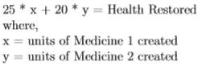
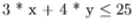
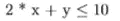
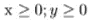
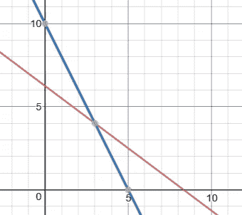

# Python 线性编程简介

> 原文：<https://itnext.io/introduction-to-linear-programming-with-python-1068778600ae?source=collection_archive---------2----------------------->

## 从简单的概述到用例的全面实现，让我们试着理解传统方法的需求、方法和行为。

## 介绍

线性规划是用来最大化或最小化一个函数的技术。想法是通过用线性关系最好地表示它们来优化一个复杂的函数。更简单地说，我们试图优化(最大化或最小化)一个用线性项表示并受线性约束限制的函数。

## 用例—奇迹工作者

让我们尝试形式化一个用例，并贯穿整篇文章。假设你是一名魔法治疗师，你的目标是治愈任何寻求帮助的人。你越能治愈一个人，就越好。你治愈背后的秘密是两种药物，每一种都使用特殊的草药。创建一个单位的药物 1，你需要 3 个单位的药草 A 和 2 个单位的药草 B。同样，创建一个单位的药物 2，你分别需要 4 个和 1 个单位的药草 A 和 B。现在 1 号药可以治疗一个人 25 单位生命值(不管是什么)，2 号药可以治疗 20 单位。让事情更复杂的是，你只有 25 和 10 个单位的草药 A 和 B 可以使用。现在的问题是，为了下一个走进来的人的健康最大化，你会创造多少种药物？

## 建模问题

首先，让我们试着确定所述问题的目标(我们想做什么和如何做)和约束(边界函数)。

从问题中可以清楚的看出，我们想要尽可能多的增加生命值。药物是唯一能帮助我们的东西。我们不确定的是每种药物的产量。按照数学家的逻辑，假设我们创建了`x`个医学单位 1 和`y`个医学单位 2。那么恢复的总健康可以由下式给出，

这是我们想要最大化的目标函数。现在这两种药物都依赖于我们数量有限的草药。让我们了解一下约束条件。如果我们创建药品 1 和 2 的`x`和`y`单位，

*   我们使用了`3 * x + 4 * y`单位的草药 A。但是我们只有 25 个单位，因此约束条件是，我们的草药 A 的总用量不能超过 25，表示为:

*   我们使用了`2 * x + 1 * y`个单位的草药 B。我们有 10 个单位的草药 B，因此约束条件是，我们的草药 B 的总用量不应超过 10，表示为:

*   此外，所生产的药品数量不能为负数(没有意义),因此，它们应该等于或大于零，表示为:

## 解答—图形表示

解决问题的一种方法是将其表示为图形，这需要绘制函数、约束条件并找到任何感兴趣的点。让我们画出我们的函数，看看我们能从中推断出什么。

将草药 A 绘制为红色，草药 B 绘制为蓝色。交点是(3，4)

从图中可以明显看出，交叉点是(3，4)，它表示，如果我们创建 3 个单位的药物 1 和 4 个单位的药物 2，考虑到草药的限制，我们最好能够治愈下一个病人。凭直觉，我们想找到一个满足所有约束的解决方案。由于约束只有很少的变量(只有`x`和`y`)，将问题转化为低维的图形，我们可以将其形象化为 2D 图。随着对草药的约束被转化为线条，我们的解决方案现在转化为一个交叉点。更好的是，它在正象限，满足了我们的第三个约束。

但是变量计数更大的问题怎么办？还是约束更多？把它们都画出来并形象化不是很难吗？还有你是不是总想策划解决这类问题？让我们尝试利用现代计算能力。

## 解决方案— Python 编程

Python 有一个名为 [PuLP](https://pythonhosted.org/PuLP/#) 的很好的包，可以用来使用线性编程解决优化问题。首先，我们必须将函数建模为变量，并调用纸浆的求解模块来找到最佳值。开始了，

让我们试着理解代码，

*   第 1–2 行:我们进口纸浆包装。
*   第 4–5 行:我们通过给出一个合适的名称来定义我们的问题，同时指定我们的目标是最大化目标函数。
*   第 7–9 行:这里，我们定义`LpVariable`来保存目标函数的变量。接下来的参数指定了已定义变量的上限和下限。根据第三个约束，它是非负的，因此第二个参数为 0，第三个参数为 None(代替无穷大)。最后一个参数表示所需的输出是离散的还是连续的。
*   第 11–12 行:用定义的变量表示目标函数，并附有简短描述。
*   第 13–15 行:根据变量输入药草的约束条件。
*   第 17–18 行:将目标和约束输出到一个文件中，以便移植和重用。(下次只需加载并运行)
*   第 20–21 行:调用求解器模块并优化函数。

现在让我们回顾一下输出，

显然，这个解决方案是最优的，并且与我们从图形表示中得到的结果相似。

## 结论

从这个基本的例子向前看，当我们试图解决现实世界的复杂问题时，优化的真正潜力就展现出来了。无论是试图找到资金的最佳分配，以最大限度地提高国家的经济，还是试图找到最佳的材料组合，以降低建筑成本，但最大限度地延长其寿命。随着问题变得越来越复杂，从手动到更有效和自动化的解决方案搜索过程模式是有意义的。这时我们就可以利用 python 了。

*在我的* [*个人网站*](http://mohitmayank.com/) *上找到更多这样的文章。*

干杯。