# MongoDB 简介

> 原文：<https://itnext.io/introduction-to-mongodb-2f81773c3c4f?source=collection_archive---------2----------------------->

在这篇文章中，我将介绍 MongoDB，这是一个非常流行的 NoSQL 数据库。在第一部分，我将与您分享我收集的关于 MongoDB 的一般信息。在下一节中，我将展示如何在您的机器上安装 MongoDB，以及如何进行必要的配置。在最后一节中，我将演示执行 CRUD 操作的基本 mongo shell 方法。


如果你准备好了，让我们开始吧。

# 什么是 MongoDB？

**MongoDB** 是一个开源的、跨平台的面向文档的 [NoSQL](http://www.wikizero.biz/index.php?q=aHR0cHM6Ly9lbi53aWtpcGVkaWEub3JnL3dpa2kvTm9TUUw) 数据库。

*   MongoDB **将数据存储在灵活的类似 JSON 的文档中**，这意味着不同文档的字段可能不同，数据结构也可能随着时间的推移而改变
*   MongoDB 的核心是一个**分布式数据库，因此内置了高可用性、水平伸缩和地理分布，并且易于使用**
*   MongoDB**免费使用**。

在下图中，你可以看到自 2008 年以来，基于栈溢出中标签的使用，NoSQL 数据库技术的发展趋势。正如您所看到的，MongoDB 在基于这个标准的其他产品中更受欢迎。

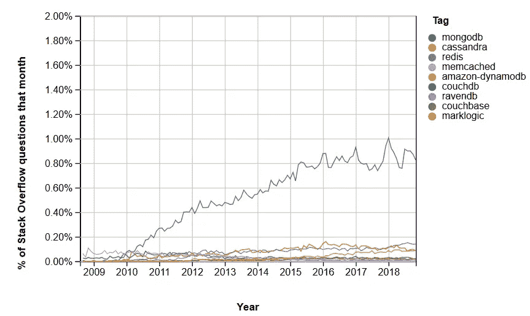

来源:[堆栈溢出趋势](https://insights.stackoverflow.com/trends?tags=mongodb%2Ccassandra%2Ccouchdb%2Cmarklogic%2Cravendb%2Ccouchbase%2Cmemcached%2Credis%2Camazon-dynamodb)

根据 [Stack Overflow 开发者调查结果 2019](https://insights.stackoverflow.com/survey/2019) ，MongoDB 连续第三年成为最受欢迎的数据库:

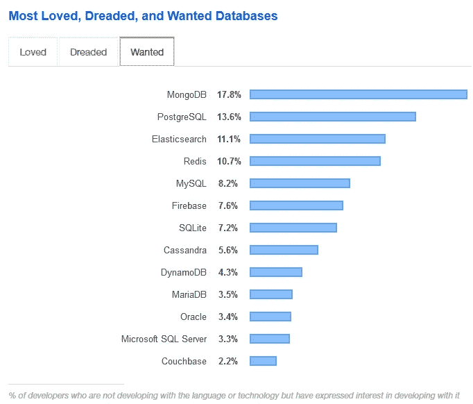

来源:[https://insights . stack overflow . com/survey/2019 #最喜欢最害怕最想要的](https://insights.stackoverflow.com/survey/2019#most-loved-dreaded-and-wanted)

## **数据库、集合和文档**

MongoDB 致力于数据库、集合和文档的概念。

**数据库**是集合的物理容器。

**集合**是一组 MongoDB 文档。

一个**文档**是一组键值对。

下表显示了 RDBMS 术语与 MongoDB 的关系。

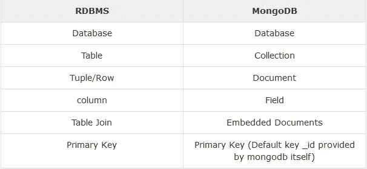

来源:[https://www.tutorialspoint.com/mongodb/mongodb_overview.htm](https://www.tutorialspoint.com/mongodb/mongodb_overview.htm)

MongoDB 将数据作为文档存储在名为 **BSON** (二进制 JSON)的二进制表示中。相关信息存储在一起，以便通过 MongoDB 查询语言进行快速查询访问。字段可能因文档而异；不需要向系统声明文档的结构——文档是自描述的。

下面是 MongoDB 中的一个样本文档:


# **安装和配置**

我用的是 Windows 10，所以我会给出 Windows 的使用说明。

首先，去[这个网站](https://www.mongodb.com/download-center/community)下载你的操作系统版本的 MongoDB:


MongoDB 默认安装在*C:\ Program Files \ MongoDB*下。

在*C:\ Program Files \ MongoDB \ Server \ 4.0 \ bin 文件夹*中有两个可执行文件: **mongod** 和 **mongo:**

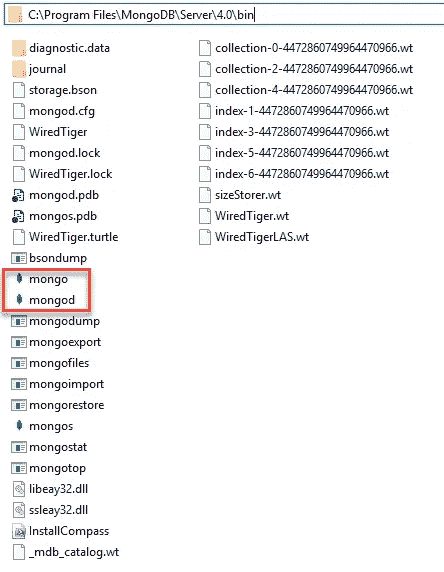

[**mongod**](https://docs.mongodb.com/manual/reference/program/mongod/#bin.mongod) 是 MongoDB 系统的主要守护进程。它处理数据请求、管理数据访问并执行后台管理操作。`mongod`有几个默认参数，比如在`/data/db`中存储数据，在端口 27017 上运行。

`mongo`是连接到特定`mongod`实例的命令行 shell。当您不带参数运行`mongo`时，它默认连接到本地主机的端口 27017。

现在进入*控制面板- >系统- >高级系统设置- >环境变量*，编辑 **Path** 变量，添加*C:\ Program Files \ MongoDB \ Server \ 4.0 \ bin*(注意路径中的版本号)。这一更改使 MongoDB 可以从机器上的任何地方进行访问。

如上所述，MongoDB 的默认数据存储目录是`/data/db.`，因此您需要在 c 盘中创建这些目录。

现在，打开命令提示符并运行以下命令。

`mongod`

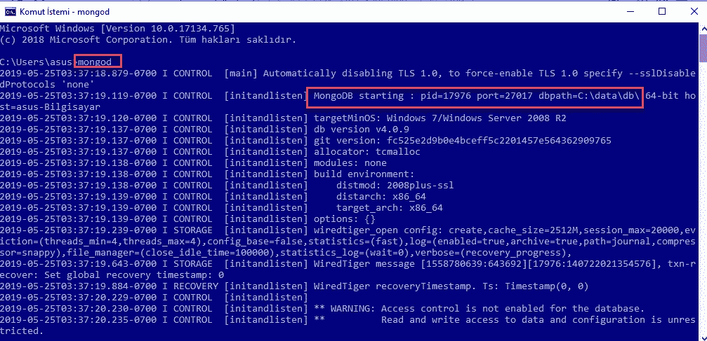

然后，打开一个 ***新命令提示符*** 并运行下面的命令:

`mongo`

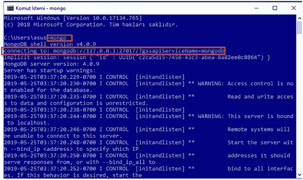

在下一节中，我们将在这个窗口中运行我们所有的 mongo shell 方法。

如果您导航到我们运行`mongod`的第一个命令 shell，您可以看到如下的*连接已接受*消息:

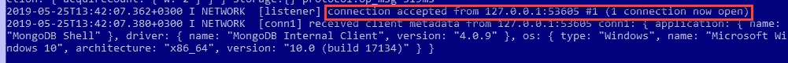

希望您能跟随我，成功安装您的 MongoDB 并连接到它。在下一节中，我们将创建一个数据库、一个集合，并在这个数据库上执行 CRUD 操作(创建、读取、更新和删除)。

# `mongo`壳牌方法

## **列出数据库**

```
show databases
```

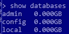

## **创建数据库**

```
use <db_name>
```

如果数据库不存在，就会创建一个名为`<db_name>`的数据库。如果数据库存在，它的连接将为事务打开。你被切换到这个数据库。

现在，让我们创建数据库:

```
use MoviesDb
```

您可以通过运行`db`命令来查看您当前的数据库:

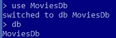

## **创建收藏**

```
db.createCollection('Movies')
```

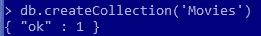

## **创建文档**

`db.collection.insertOne()`:将文档插入收藏。

`db.collection.insertMany()`:将多个文档插入一个集合。

`db.collection.insert()`:将一个或多个文档插入集合。

现在，让我们向我们的*电影*收藏中插入一个文档:

```
db.Movies.insert({ title: "12 Angry Men", director: "Sidney Lumet", year: 1957, budget: 350000})
```

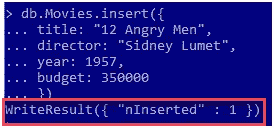

我们可以通过运行以下命令来查看插入的文档:

```
db.Movies.find()
```

这个命令显示了*电影*收藏中的所有文档。如果我们在末尾加上`pretty()`，数据会更容易阅读:

```
db.Movies.find().pretty()
```

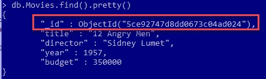

该模式为每个文档添加了一个自动生成的类型为`ObjectId`的`_id`属性。

集合中的文档不需要遵循相同的结构。我们将在下面的例子中看到这一点。

现在，我们将插入另一个文档，它包含一个 ***数组*** 作为*流派*字段的值:

```
db.Movies.insert({ title: "Shutter Island", director: "Martin Scorsese", year: 2010, budget: 80000000, genre: ["Mystery", "Thriller"]})
```

此外，我们可以插入包含一个 ***对象数组*** 作为字段值的文档。我们将插入另一个包含具有该属性的 *stars* 字段的文档:

```
db.Movies.insert({ "title": "Interstellar", "director": "Christopher Nolan", "year": 2014, "budget": 1650000000, "genre": ["Adventure","Drama","Sci-Fi"], "stars": [ { "name": "Matthew McConaughey", "birthYear": 1969, "nationality": "American", "wonOscar": true }, { "name": "Anne Hathaway", "birthYear": 1982, "nationality": "American", "wonOscar": true } ]})
```


此外，我们可以同时插入多个文档:

```
db.Movies.insertMany([{ title: "Fight Club", director: "David Fincher", year: 1999, budget: 63000000, genre: ["Drama"]},{ title: "Arrival", director: "Denis Villeneuve", year: 2016, genre: [ "Drama", "Mystery", "Sci-Fi" ]},{ title: "Bajrangi Bhaijaan", director: "Kabir Khan", year: 2015, genre: [ "Action", "Comedy", "Drama" ]}])
```

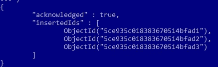

## **更新文档**

`db.collection.update` ( *查询*，*更新*，*选项*):修改集合中已有的一个或多个文档。根据 ***更新*** 参数，该方法可以修改现有文档的特定字段或完全替换现有文档。

现在，让我们更新“到达”的预算:

```
db.Movies.update({title: “Arrival”}, {$set: {budget: 47000000}})
```

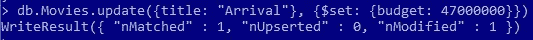

## **查询收藏**

`db.collection.find` ( *查询*，*投影*):选择集合或视图中的文档，并将[光标](https://docs.mongodb.com/manual/reference/glossary/#term-cursor)返回给所选文档。

***查询*** :可选。使用[查询运算符](https://docs.mongodb.com/manual/reference/operator/)指定选择过滤器。若要返回集合中的所有文档，请省略此参数或传递一个空文档({})。

***投影:*** 可选。指定要在符合查询过滤器的文档中返回的字段。要返回匹配文档中的所有字段，请省略此参数。

现在，让我们看看我们在上一节中更新的文档:

```
db.Movies.find({title: “Arrival”}).pretty()
```

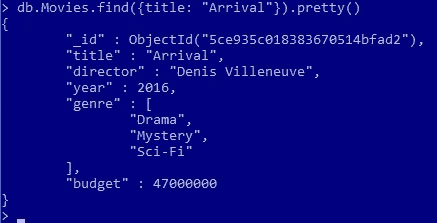

*   我们可以在查询中使用下面的 ***比较运算符*** :

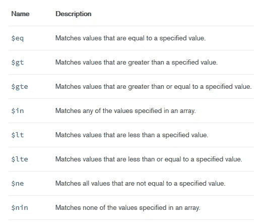

来源:[https://docs.mongodb.com/manual/reference/operator/query/](https://docs.mongodb.com/manual/reference/operator/query/)

现在，让我们看看 2000 年以后上映的电影，只使用 ***投影*** 参数得到*标题*字段:

```
db.Movies.find({year: {$gt: 2000}}, {title: 1, _id: 0}).pretty()
```

默认情况下，总是显示 *_id* 字段。所以我们需要明确的提到`_id:0`如果不想展示的话。

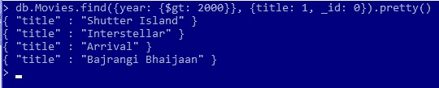

*   我们也可以在查询中使用 ***逻辑运算符*** 。

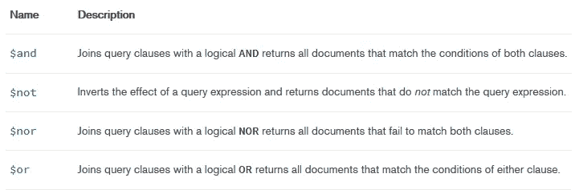

来源:[https://docs.mongodb.com/manual/reference/operator/query/](https://docs.mongodb.com/manual/reference/operator/query/)

让我们找出在 2000 年之前发行并且预算超过 5000 万的电影:

```
db.Movies.find({$and:[{year: {$lt: 2000}}, {budget: {$gt: 50000000}}]}).pretty()
```

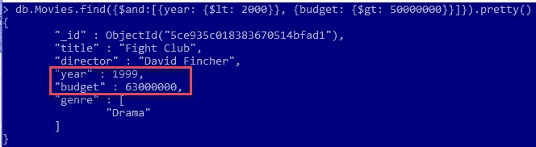

*   我们也可以像查询数组成员一样查询内部字段。

让我们来寻找把*科幻*作为其类型之一的电影:

```
db.Movies.find({genre: “Sci-Fi”}, {title: 1, _id: 0}).pretty()
```

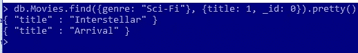

## **文件汇总**

聚合操作处理数据记录并返回计算结果。聚合操作将多个文档中的值组合在一起，并可以对分组的数据执行各种操作以返回单个结果。

`db.collection.aggregate:`计算集合中数据的聚合值。

我们可以通过下面的命令找到 2000 年以前上映的电影的*预算*的总和:

```
db.Movies.aggregate({ $match: { year: { $lt: 2000 }} },{ $group: { _id : null, sum : { $sum: “$budget” } } })
```

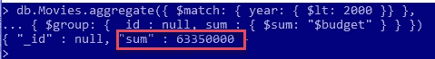

## **算一个收藏**

```
db.Movies.count()
```

我们也可以将此方法与`find()`方法配合使用:

```
db.Movies.find({genre: “Drama”}).count()
```

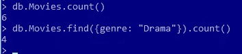

## **整理收藏**

在 MongoDB 中对文档进行排序，需要使用`sort()`方法。该方法接受包含字段列表及其排序顺序的文档。使用 1 和-1 来指定排序顺序。1 用于升序，而-1 用于降序。

以下命令按照*预算*降序排列电影:

```
db.Movies.find({}, {title: 1, budget: 1, _id: 0}).sort({budget: -1})
```

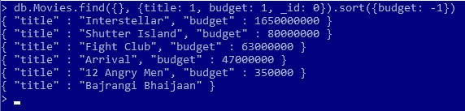

## **移除文件**

```
db.collection.remove(<query>,<justOne>)
```

***查询:*** 使用[查询运算符](https://docs.mongodb.com/manual/reference/operator/)指定删除条件。若要删除集合中的所有文档，请传递一个空文档({})。

***just one:*****可选。**要将删除限制在一个文档内，设置为 true。省略使用默认值 false 并删除所有符合删除条件的文档。

```
db.Movies.remove( {title: “Arrival”}, {justOne: true} )
```

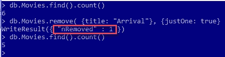

以下命令删除集合中的所有文档:

```
db.Movies.remove({})
```

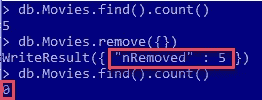

## **移除收藏**

```
db.Movies.drop()
```

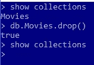

## **删除数据库**

```
db.dropDatabase()
```

这将删除选定的数据库。如果您没有选择任何数据库，那么它将删除默认的*测试*数据库。

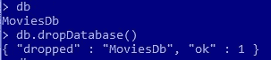

我在这里结束这篇文章。如果你想了解更多关于 MongoDB 的内容，可以在这里阅读官方文档[。](https://docs.mongodb.com)

我希望这篇文章给了你关于 MongoDB 的有用信息，并且你喜欢阅读。如果您有任何问题和/或评论，请在下面的回复部分告诉我。

再见！

***参考文献***

[*https://www.mongodb.com/what-is-mongodb*](https://www.mongodb.com/what-is-mongodb)

[*https://www.mongodb.com/compare/mongodb-mysql*](https://www.mongodb.com/compare/mongodb-mysql)

[https://docs . MongoDB . com/manual/reference/program/mongod/# bin . mongod](https://docs.mongodb.com/manual/reference/program/mongod/#bin.mongod)

[https://docs.mongodb.com/manual/reference/method/T42](https://docs.mongodb.com/manual/reference/method/)

[https://docs . MongoDB . com/manual/aggregation/# aggregation-pipeline](https://docs.mongodb.com/manual/aggregation/#aggregation-pipeline)

[*https://www.tutorialspoint.com/mongodb/*](https://www.tutorialspoint.com/mongodb/)

[*https://www . tutorialspoint . com/MongoDB/MongoDB _ sort _ record . htm*](https://www.tutorialspoint.com/mongodb/mongodb_sort_record.htm)

[*https://stack overflow . com/questions/4883045/MongoDB-difference-between-running-mongo-and-mongod-databases*](https://stackoverflow.com/questions/4883045/mongodb-difference-between-running-mongo-and-mongod-databases)