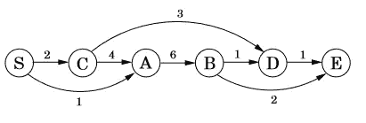
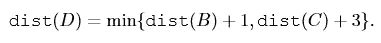
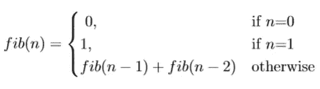
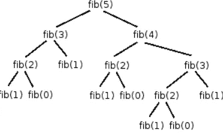
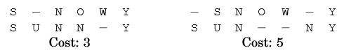
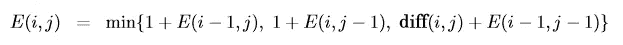
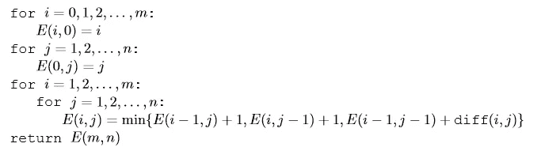
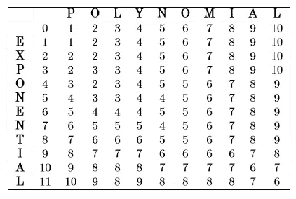

# 多维动态规划简介

> 原文：<https://itnext.io/introduction-to-multi-dimensional-dynamic-programming-666b095b2e7b?source=collection_archive---------5----------------------->

## 理解解决微型依赖问题的技术背后的直觉，以最终解释正在讨论的问题。

## 什么是动态编程？

这是一种解决特殊类型问题的技术，这些问题可以分解成许多相互依赖的子问题。所谓依赖，我的意思是要解决一个子问题，你需要其他子问题的答案。这将动态编程(dp)与其他方法(如分而治之)区分开来，在其他方法中，我们通常创建独立的子问题。对 dp 最直观的解释之一是将其定义为一个有向图，其中节点是子问题，两个节点之间的边表示一个问题对另一个问题的依赖性。

图 1:有向图，节点是子问题，边是依赖关系。

举一个例子，我们必须找到从 S 到 D 的最短路径(参考图 1)。仔细看，你可以通过 B 或 C 到达 D，因此逻辑上最短的路径应该通过其中一个。为此，我们定义 dist(x) =从 S 到任何节点‘x’的最短距离。我们必须求解 dist(D ),它也可以写成，

到 D 的最短路径是到 B 和 c 的最短路径的函数。

同样，dist(B)可以用 A 来表示，dist(C)可以用 s 来表示。通过求解它们中的每一个，我们得到 dist(D ),即预期的解。总的来说，我们正在寻找可以分解为相关子问题的问题，这些问题将成为 dp 应用的候选问题。

## 可能的方法

概括地说，有两种方法可以解决 dp 问题，

1.  **自上而下的方法**:在这种方法中，我们应用递归技术向下钻取解决主问题所需的所有相关子问题。在这里，我们从顶部即最终问题开始，但要找到它，我们必须解决所有子问题，因此要解决所有子问题。把它们都结合起来，我们就有了最终的解决方案。例如，在上一节中，我们从 dist(D)开始，即主要问题，并求解 dist(B)、dist(C)、dist(A)等来找到它。
2.  **自底向上的方法**:这里我们从基础案例开始，即最低可能的子问题，向前迭代直到我们遇到最终问题。例如，如果我们从 S 开始，然后遍历到 C，A，然后继续向上，直到到达 D，这将是自底向上的方法。

## 尺寸是怎么回事？

我们定义了子问题及其依赖关系，dp 中的其他重要实体是依赖元素或变量。这些变量的数量决定了问题的规模。如果一个问题依赖于一个变量，这是一个 1D dp 问题，同样，在两个变量的情况下，这是一个 2D dp 问题。让我们看一下每个例子，

## 一维 DP 问题

假设我们想要在序列的特定索引处找到[斐波那契](https://en.wikipedia.org/wiki/Fibonacci_number)数。所以 fib(n) =斐波那契数列中的第 n 个元素。那么，我们应该如何使用 dp 来解决这个问题呢？让我们首先尝试识别子问题，fib(n)是否与 fib(n-1)，fib(n-2)…fib(0)等任何前辈有任何相关性？当然，根据定义，fib(n) = fib(n-1) + fib(n-2)。对于 fib(n-1)和 fib(n-2)也是如此，直到我们遇到 fib(0) = 0 或 fib(1) = 1 的基本情况。来制定，

斐波那契递归公式

很明显，我们使用的是自上而下的方法(我们也可以使用自下而上的方法)，因变量只有 1，即“n ”,它是索引号。利用这个我们可以解决斐波纳契问题。让我们编码吧，

在继续之前，有一点很重要，递归方法一个基本问题是它多次解决同一个问题。在我们的例子中，在绘制 n = 5 的函数调用时，我们得到

递归函数调用 fib(5)

在这里，我们想解决调用一次的 fib(5)，但其他子问题有不同的调用，如 fib(4) — 1、fib(3) — 2、fib(2) — 3、fib(1) — 5、fib(0) — 3。多次解决同一个问题是很不直观的，如果我们存储一个问题的解决方案，下次调用时只需传递存储的答案，我们就可以处理这个问题。这叫做记忆化。修改前面的代码使其更加优化，

## 二维动态规划问题

这类问题有两个因变量。让我们以编辑距离为例。在这个问题中，我们有两个字符串，我们必须找到这两个字符串之间不相似的度量。这是通过将一个字符串(视觉上)放置在另一个字符串的顶部并试图找到最佳拟合点来计算的，这样通过应用最小编辑，我们可以将一个字符串转换为另一个字符串。因此命名为编辑距离。支持的编辑包括插入、删除和替换。由于主要任务之一需要找到最佳拟合点，具有不同对齐或拟合的同一对弦将给出不同的编辑距离。举个例子，

成本不同的两种不同路线

考虑“下雪”和“晴天”，上图显示了两种可能的匹配。现在，成本或编辑距离是如何计算的？以左侧对齐为例，我们需要执行 3 次编辑(因此成本= 3)来将 snowy 转换为 sunny，即(1)在索引 1 处插入 U，(2)在索引 3 处用 N 替换 O，以及(3)在索引 4 处删除 W。

现在，让我们看看是否可以应用 dp 来解决这个问题，因为我们需要识别相关的子问题。我们的主要问题是找到两个字符串之间的编辑距离 x[1..m](长度为 m)和 y[1…n](长度为 n)。如果我们尝试解决 x 的某个前缀即 x[1…i]和 y 即 y[1…j]的问题呢？我们能在此基础上解决下一个问题吗？以前面的例子为例，如果我们知道“sno”和“sun”的编辑距离，我们可以用它来求解“SnO”和“sunn”吗？取这些字符串的最后一个字符，即“w”和“n”，形式上我们只能执行三个操作，(1)删除“w”(2)插入“n”，或(3)将“o”与“w”匹配，在这种情况下，它们可以相同或不同(这导致替换)，这里它们是不同的。一般来说，我们可以对任意一对 x[i]和 y[j]执行这些操作。在(1)的情况下，我们删除 x[i]并且我们必须求解剩余的 x[1...i-1]和 y[1…j]，对于(2)我们插入 y[i]，我们求解 x[1…i]和 y[1…j-1]或者(3)我们求解 x[1…i-1]和 y[1…j-1]。不错！在所有这些情况下，我们只需解决较小的问题，并不断增加可能的编辑操作的成本，现在让它们都等于 1。我们的公式现在变成了，

如果 x[i] = y[j]，编辑距离，其中 diff(i，j) = 0，否则为 1

由于问题是二维的——每个字符串的索引——我们需要维护一个 2d 表来存储所有处理过的编辑距离。

列用于大小为 n 的字符串 2，行用于大小为 m 的字符串 1

这里，单元格(I，j)定义了从 string_1 到索引 I 再到 string_2 到索引 j 所需的编辑距离，我们的目标是找到单元格(m，n)的值。此外，由于(I，j)处的编辑距离需要 3 个不同单元格的值，我们需要以这样的方式遍历表格，即当我们在(I，j)处时，我们已经求解了(i-1，j)、(I，j-1)和(i-1，j-1)。最后定义基本情况，当 i =0 或 j =0 时，因此(0，5)意味着将空白字符串转换为 5 长度的字符串，这只是 5 次插入，因此成本为 5，对于(5，0)也是如此。为了考虑到这一点，我们在表中添加了具有这些默认值的附加列和行。因此伪代码是，

让我们编码吧，

解决“指数”和“多项式”的问题，我们的表格转换为:

所以两个字符串之间的最终编辑距离是 6。

## 结论

我们只是触及了技术的表面，并试图解决一些经典问题。dp 中最重要也可能是最困难的部分是正确识别子问题，这个过程有时需要大量的剔除。这篇文章背后的想法是为读者提供一个简短的介绍和识别维度和子问题的逻辑背后的直觉。一旦完成，我们就基本上解决了问题，剩下的就是将子问题组合成一个好的公式，剩下的就完美地分解了。悬浮物

## 参考

[1]算法，由 Christos Papadimitriou、Sanjoy Dasgupta 和 Umesh Vazirani 合著

*喜欢帖子请鼓掌分享，有问题请评论。还可以访问我的* [*个人博客*](http://mohitmayank.com) *获取更多此类帖子。*

干杯。