# 自然语言处理简介:Python 的 NLP 工具

> 原文：<https://itnext.io/introduction-to-natural-language-processing-nlp-tools-for-python-cf39af3cfc64?source=collection_archive---------2----------------------->


由[谷仓图片](https://unsplash.com/@barnimages?utm_source=medium&utm_medium=referral)在 [Unsplash](https://unsplash.com?utm_source=medium&utm_medium=referral) 上拍摄

# 介绍

关于[**【NLP】**](https://en.wikipedia.org/wiki/Natural_language_processing)**(自然语言处理)**[以前的](/nlp-named-entity-recognition-ner-with-spacy-and-python-dabaf843cab2)文章里我已经 [**讲过了。在这一篇中，我的目标是**总结**并给与 **Python** 一起工作的 **NLP** 工程师可用的工具一个快速概述。**](/nlp-named-entity-recognition-ner-with-spacy-and-python-dabaf843cab2)

我将从什么是 NLP 以及它在 AI **生态系统**中的位置开始一个非常简短的概述。然后，我将谈论 Python 开发者可用的一些工具，我将提供一些基本的**示例**。在本文中，我将只关注**文本**数据，而不是音频或视频处理。

# 什么是 NLP？

简单来说，NLP 是 [**机器学习**](https://en.wikipedia.org/wiki/Machine_learning) 专注于从 [**自然语言**](https://en.wikipedia.org/wiki/Natural_language) 中提取洞察的一个领域。你的目标是**让计算机理解我们自己的语言**。

自然语言处理的一些实际例子有语音识别、翻译、情感分析、主题建模、词汇分析、实体提取等等。

使用所有这些工具和算法，你可以从自然语言中提取结构化数据，这些数据可以被计算机处理。此外， **NLP** 任务的输出通常是机器学习算法，该算法将使用这些原始数据来进行**预测**。

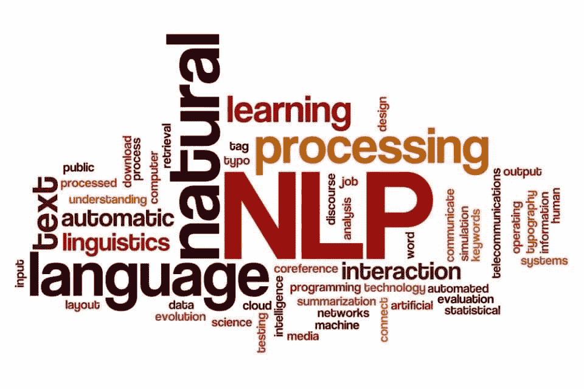

通过**将许多算法结合在一起**，您可以提取有用的数据，这些数据可用于广泛的场景，例如:

*   欺诈检测
*   [风险情报](https://aylien.com/solutions/risk-intelligence)
*   电子邮件分类
*   [情绪分析](https://pythonspot.com/python-sentiment-analysis/)

# 常见 NLP 任务

你大概听说过**花在 [**机器学习**](https://en.wikipedia.org/wiki/Machine_learning) 的时间 80%** 是**数据准备**:数据清洗、[数据角力](https://en.wikipedia.org/wiki/Data_wrangling)，特征工程等。对于 NLP 来说尤其如此，因为我们的主要目标是将文本转换成计算机可以使用的数字。

## 数据准备

这些任务包括初始准备，如加载文本数据，删除停用词，小写字母，删除页眉和页脚或任何其他无用的文本；还有更多。

[**熊猫**](https://pandas.pydata.org/) 是这个探索阶段的必备工具，因为它允许你轻松地**实验**数据，并与其他团队成员和利益相关者分享你的见解和成果。

[**记号化**](https://en.wikipedia.org/wiki/Lexical_analysis#Tokenization) 是另一个重要的任务，有很多记号化器可用，它的配置将取决于你要实现的目标。这个想法是将文本分割成单词，这些单词以后可以被量化并表示为数字。除了将文本拆分成单词之外，您可能还想将它们拆分成元组。**句子分割**是一个类似的过程，但目标是将文本分割成完整的句子。

**词法分析**是自然语言处理中的一项重要任务，目标是将单词还原为其基本形式。有两种方法可以做到这一点:

*   [](https://en.wikipedia.org/wiki/Stemming)****词干化是将单词还原为基本形式的过程(*如*)，“close”将是“closed”、“closing”、“close”、“closer”等的词根。).我这样做是基于规则，而不是字典。换句话说，结果可能是也可能不是一个真正的单词，它更像是一个前缀。****
*   ****[**引理化**](https://en.wikipedia.org/wiki/Lemmatisation) 的任务是仅移除屈折词尾，并返回单词的基本字典形式，也称为**引理**。换句话说，它从字典中产生一个真实的单词。****

****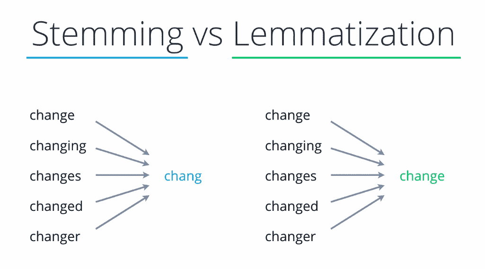****

****词干化和词汇化的区别****

****注意，根据你想要达到的目标**，每种方法都有自己的优点和缺点**。如果你不在乎单词的意思，而只想对文本进行分类，那么词干提取会更快更容易。****

****一旦你已经阅读了文本数据，删除不必要的内容，删除停用词，小写的文本，标记的文本和减少单词的词条；您已经准备好应用 NLP 算法。请注意，根据您的任务和您计划使用的算法，数据准备会有所不同，一些任务(如词条化或小写字母)可能不需要和/或不推荐使用文本。****

## ****特征提取和文本分类****

****在机器学习中，给你一组列或**特征**，你用它们来预测一些结果。NLP 的棘手之处在于能够从非结构化的文本中提取有意义的特征。这就是**特征提取**的目标；完成这些之后，您可以应用其他 ML 算法进行文本分类。****

****在 NLP 中，你还有[有监督的](https://en.wikipedia.org/wiki/Supervised_learning)和[无监督的](https://en.wikipedia.org/wiki/Unsupervised_learning)算法；简而言之，**监督的**算法需要**标记的数据**而非监督的不需要。我们将在本文后面讨论标记数据，但为了简单起见；让我们用一个简单的例子来解释这个过程:你想要检测 SPAN 邮件的图像。您已经标记了[数据](https://www.kaggle.com/balaka18/email-spam-classification-dataset-csv)，其中包含邮件正文以及邮件是否是 span。****

****在机器学习中，你通常会有一个列的列表(**特征**)和一个**目标** (Span/NotSpan)。例如，如果您试图预测一所房子的价格，您将拥有诸如卧室数量、大小、到学校的距离等列。这些都是可以转换成数字的数字或类别；并且可以容易地输入到机器学习算法中。但是我们如何用自然语言做到这一点呢？****

******NLP 特征提取**算法用于将单词转换成包含足够信息的数字表示，以便将其输入到统计模型中。为此，我们将文本转换成一种称为**特征向量**的数字表示。 [**袋词模型**](https://en.wikipedia.org/wiki/Bag-of-words_model) 是实现这一点的简单方法。在这种情况下，我们只是将每个单词转换成一个数字，即该单词在语料库中出现的次数。例如，如果我们有:****

```
**'All my cats in a row',
'When my cat sits down, she looks like a Furby toy!',**
```

****这将被转换为:****

```
**{'all': 0, 'cat': 1, 'cats': 2, 'down': 3, 'furby': 4, 'in': 5, 'like': 6, 'looks': 7, 'my': 8, 'row': 9, 'she': 10, 'sits': 11, 'toy': 12, 'when': 13 }**
```

****现在我们有数字了！每个单词将是高维向量中的一列，该向量可以被馈送给[神经网络](https://en.wikipedia.org/wiki/Neural_network)或任何其他算法，并用于分类/回归。我们还可以[归一化](https://iq.opengenus.org/normalization-in-detail/)这些值，以便为某些算法获得更好的结果。****

****在我们的 *Span* 示例中，机器算法可以“学习”如果某个词(如“buy ”)的数量很大，那么它将被 Span。为了做到这一点，我们真的需要删除经常出现的停用词，并将词减少到其引理，这样它们就不会被计算在内，而是单独的特征。**这就是数据准备如此重要的原因。******

****然而，词频是非常基本的，大多数时候，你会对出现在你的输入文本中但不在一般语料库中的词感兴趣。此时 [**TF-IDF**](https://en.wikipedia.org/wiki/Tf%E2%80%93idf) 前来救援，定义如下:****

> ****TF-IDF 中的高权重通过该术语在整个文档集合中的高术语频率(在给定文档中)和低文档频率来实现。****

****它结合了两种算法:****

******词频******

```
****TF(t) = (Number of times term t appears in a document) / (Total number of terms in the document)****
```

******逆文档频率******

```
****IDF(t) = log_e(Total number of documents / Number of documents with term t in it)****
```

****将文本转换为矢量的另一种技术是 [**单词嵌入**](https://en.wikipedia.org/wiki/Word_embedding) ，它将单词转换为 n 维矢量。像“汽车”和“车辆”这样的相关单词将映射到相似的 n 维向量，而像“狗”和“箭头”这样的单词在向量空间中将是遥远的。****

****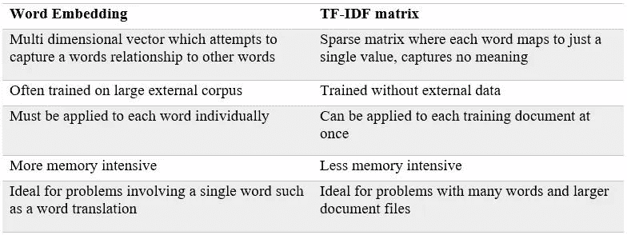****

****自然语言处理中两种主要特征工程技术综述****

****总之，**我们使用 NLP 中的特征提取从文本中提取特征，**因此它们可以被馈送到监督机器学习模型中用于**文本分类**。使用这些技术的一些例子是跨度检测或[情感分析](https://en.wikipedia.org/wiki/Sentiment_analysis)。稍后，我们将看到一些简化文本分类过程的库。****

## ****词性标注****

****[**词性标注**](https://en.wikipedia.org/wiki/Part-of-speech_tagging) ( **POS** )是将句子中的词标注为名词、形容词、动词等的过程。这些算法自动用正确的标签标记文本数据的内容，其他算法可以使用输出来检测主题、相似性等。****

****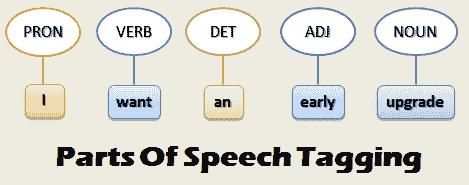****

****[SVM](https://en.wikipedia.org/wiki/Support_vector_machine) 、[最大熵分类器](https://en.wikipedia.org/wiki/Maximum_entropy_classifier)、[最近邻法](https://en.wikipedia.org/wiki/K-nearest_neighbor_algorithm)等机器学习算法可以用于 **POS** ，大部分可以达到 95%以上的准确率。****

## ****命名实体识别(NER)****

****[](https://en.wikipedia.org/wiki/Named-entity_recognition)**是一种**监督**技术，用于将[非结构化文本](https://en.wikipedia.org/wiki/Unstructured_data)中提到的实体分类成预定义的类别，如人名、组织、地点、[医疗代码](https://en.wikipedia.org/wiki/Medical_classification)、时间表达式、数量、货币值、百分比等。目标是**检测你的文本中的类别，这样你就可以提取关于文本内容的见解**或者它是否在谈论某个主题。这对于**风险检测**、分类、欺诈检测等非常有用。******

****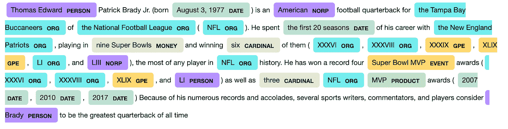****

****NER 在行动中检测人员，日期，组织…****

****在这篇 [**文章**](/nlp-named-entity-recognition-ner-with-spacy-and-python-dabaf843cab2) 中，我给出了一个完整的 **NER** 的端到端例子。****

## ****主题建模****

****[**主题建模**](https://en.wikipedia.org/wiki/Topic_model) 是一种**无监督**方法，用于发现文档集合中出现的抽象“主题”。它可以用于文本挖掘或发现隐藏的语义结构。主题建模技术产生的“主题”是一组相似的单词。****

****[**LDA**](https://en.wikipedia.org/wiki/Latent_Dirichlet_allocation) 算法常用于主题建模。像其他非监督算法一样，你需要预先选择你想要提取多少主题。****

# ****NLP 工具****

****到目前为止，我们似乎可以获取原始文本数据，加载它，清理它，标记它，最后执行特征工程，将文本转换为数字，以便它可以用于实体提取或分类。现在，我们将回顾 Python 中可用的一些工具，**我们将从更通用/低级的工具开始，然后转向更专业和更高级别的库和工具。******

## ****sci kit-学习****

****[Scikit-learn](https://scikit-learn.org/) 是一个著名的**Python 通用 ML 库**。它广泛用于各种各样的机器学习任务，如[分类](https://scikit-learn.org/stable/supervised_learning.html#supervised-learning)、[回归](https://scikit-learn.org/stable/supervised_learning.html#supervised-learning)或[聚类](https://scikit-learn.org/stable/modules/clustering.html#clustering)。还可以通过连接多个模型来构建管道。****

****为了**安装**和 [Scikit-learn](https://scikit-learn.org/) 运行:****

```
**pip install -U scikit-learn**
```

****[Scikit-learn](https://scikit-learn.org/) 附带了许多 [**NLP 特性**](https://scikit-learn.org/stable/tutorial/text_analytics/working_with_text_data.html) 包括分词器、词袋、词频、分类器等等。例如，要处理文本、标记化、删除停用词并使用词袋构建特征向量，我们可以使用`[**CountVectorizer**](https://scikit-learn.org/stable/modules/generated/sklearn.feature_extraction.text.CountVectorizer.html#sklearn.feature_extraction.text.CountVectorizer)`来一气呵成地完成所有这些工作:****

```
****from** **sklearn.feature_extraction.text** **import** CountVectorizer
count_vect = CountVectorizer()
X_train_counts = count_vect.fit_transform(email.data)**
```

****结果是一个带有文本数据数字表示的向量，可以用作分类器的输入。`email.data`包含邮件正文。****

****它还带有`[**TfidfTransformer**](https://scikit-learn.org/stable/modules/generated/sklearn.feature_extraction.text.TfidfTransformer.html#sklearn.feature_extraction.text.TfidfTransformer)` ，使用 **tf-idf** 算法实现相同的方法:****

```
****from** **sklearn.feature_extraction.text** **import** TfidfTransformer
X_train_tfidf = tfidf_transformer.fit_transform(X_train_counts)**
```

****现在，我们可以很容易地训练一个模型来进行预测。首先，我们训练一个模型，例如**多项式******

```
****from** **sklearn.naive_bayes** **import** MultinomialNB
clf = MultinomialNB().fit(X_train_tfidf, email_span.target)**
```

****目标列包含电子邮件是否是 Span。上面的代码训练我们的模型。现在我们可以预测:****

```
**emails_test = ['Buy this', 'OpenGL on the GPU is fast']
X_new_counts = count_vect.transform(emails_test)
X_new_tfidf = tfidf_transformer.transform(X_new_counts)
predicted = clf.predict(X_new_tfidf)**
```

****Scikit-learn 是一个非常著名且易于使用的库，是你工具箱中的必备工具。我推荐这个库，因为你已经用它来完成其他的 ML 任务，并且你想增加一些 NLP 功能。然而，还有其他更专业的自然语言处理库。****

## ****NLTK****

****[**NLTK**](https://www.nltk.org/) 是著名的 NLP 库。它不仅仅是一个库，它是一个平台，不仅提供库，还提供简单易用的接口来连接超过 50 个语料库和词汇资源。****

****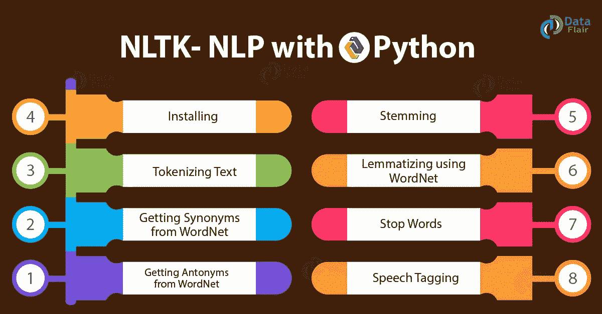****

****NLTK 功能****

****它拥有用于分类、标记化、词干化、标记、解析和语义推理的文本处理库，用于工业级自然语言处理库的包装器，以及一个活跃的论坛。****

****要安装 NLTK 运行:****

```
**pip install --user -U nltk**
```

****建议您也下载一些语料库来运行:****

```
****import** **nltk**
nltk.download()**
```

****应该会打开一个新窗口，显示 NLTK 下载程序。您可以选择并下载许多易于导入的数据集。****

****得益于大量的**语料库数据**，NLTK 在**学术界**中非常**受欢迎**，因为你可以很容易地迭代并使用容易访问的数据集处理你的模型。它还提供了许多工具和算法，例如，要显示一个词汇树，你可以简单地运行:****

```
****from** **nltk.corpus** **import** treebank
t = treebank.parsed_sents('wsj_0001.mrg')[0]
t.draw()**
```

****它还支持词干/词汇化和[词性标注](https://pythonprogramming.net/part-of-speech-tagging-nltk-tutorial/)。查看[这篇](https://likegeeks.com/nlp-tutorial-using-python-nltk/) [文章](https://likegeeks.com/nlp-tutorial-using-python-nltk/)以了解有关 NLTK 功能的更多信息。我向那些想学习和尝试自然语言处理的人推荐这个库，但是它不是我生产就绪自然语言处理的首选。****

## ****空间****

****[Spacy是我最喜欢的**NLP**库。它是一个开源的库，致力于使执行任何 NLP 任务变得非常容易。不像](https://spacy.io/) [NLTK](https://en.wikipedia.org/wiki/Natural_Language_Toolkit) 用在学术上； **Spacy 是为现实世界的使用**而构建的，这得益于其出色的**性能**，大量的**优化**和**易于使用的**API。****

****它支持许多自然的 [**语言**](https://spacy.io/usage/models#languages) 开箱即用，它提供许多 [**训练好的管道**](https://spacy.io/usage/models#download) 随时可以用作你的起点。它提供了一个很棒的[标记器](https://spacy.io/usage/linguistic-features#tokenization)和许多 [**语言特性**](https://spacy.io/usage/linguistic-features) ，比如[词性标注](https://spacy.io/usage/linguistic-features#pos-tagging)、词汇化、[实体链接](https://spacy.io/usage/linguistic-features#entity-linking)、依存解析等等！****

****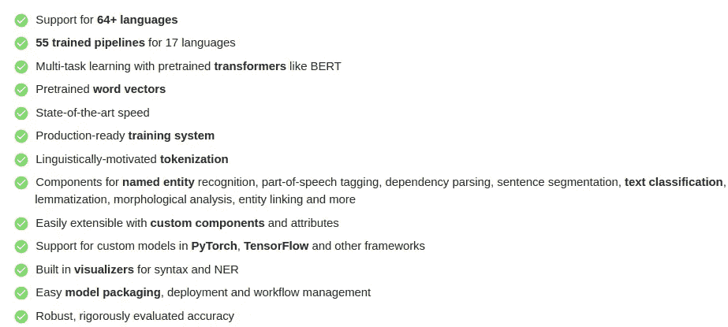****

****空间特征:[https://spacy.io/usage/facts-figures](https://spacy.io/usage/facts-figures)****

******SpaCy** 支持 [**深度学习**](https://en.wikipedia.org/wiki/Deep_learning) 工作流，你可以在其中训练和部署神经网络模型，或者将由流行的[机器学习](https://en.wikipedia.org/wiki/Machine_learning)库训练的外部模型，如 [TensorFlow](https://en.wikipedia.org/wiki/TensorFlow) 或 [PyTorch](https://en.wikipedia.org/wiki/PyTorch) 插入到你的管道中。****

****我真正喜欢 SpaCy 的是它的入门如此简单！****

******安装空间******

****有关基于您的平台的详细 [**安装说明**](https://spacy.io/usage) ，请参考文档。使用画中画时，只需:****

```
**pip install -U pip setuptools wheel
pip install -U spacy
python -m spacy download en_core_web_sm**
```

****由于**预训练管道**是使用大型文本语料库训练的，所以很容易开始。首先，你需要导入 Spacy，然后你可以加载一个预先训练好的模型，有 [**不同尺寸**](https://spacy.io/models/en) 可供选择；然后你可以创建你的 ***nlp*** 对象包含你的原始数据:****

```
**import spacynlp = spacy.load("en_core_web_sm")
doc = nlp("Apple is looking at buying U.K. startup for $1 billion")**
```

******SpaCy** 为您处理所有的数据准备和标记化，这是在您调用 ***nlp*** 对象时完成和计算的，该对象接受一个文本字符串，并返回一个包含标记化文本、POS 注释、命名实体等等的已处理的`Doc`。即使对一个`Doc`进行了处理(拆分成单个单词并进行注释),它仍然保存着**原始文本的所有信息。******

****我们可以很容易地遍历令牌:****

```
**for token in doc:
    print(token.text)**
```

****这将打印令牌列表。****

******位置标记******

****[**POS tagging**](https://en.wikipedia.org/wiki/Part-of-speech_tagging) 也是为你计算的:****

```
**for token in doc:
    print(token.text, token.pos_, token.dep_)**
```

****这将打印:****

```
**Apple PROPN nsubj
is AUX aux
looking VERB ROOT
at ADP prep
buying VERB pcomp
U.K. PROPN dobj
startup NOUN advcl
for ADP prep
$ SYM quantmod
1 NUM compound
billion NUM pobj**
```

******词向量相似度******

****相似度是通过比较“[](https://en.wikipedia.org/wiki/Word_embedding)**”词语嵌入量来确定的。可以使用像 [word2vec](https://en.wikipedia.org/wiki/Word2vec) 这样的算法生成单词向量。大多数 SpaCy 管道包都带有内置的单词向量，使它们可以作为`[Token.vector](https://spacy.io/api/token#vector)`属性使用。例如给出下面的句子:******

```
****tokens = nlp("dog cat banana afskfsd")for token in tokens:
    print(token.text, token.has_vector, token.vector_norm)****
```

******我们得到这样的输出:******

```
****dog True 7.0336733 False
cat True 6.6808186 False
banana True 6.700014 False
afskfsd False 0.0 True****
```

******预测相似性对于建立推荐系统或者标记重复是有用的。******

********命名实体识别(NER)********

****使用 SpaCy 提取实体非常简单:****

```
**nlp = spacy.load("en_core_web_sm")
doc = nlp("Apple is looking at buying U.K. startup for $1 billion")for ent in doc.ents:
    print(ent.text, ent.start_char, ent.end_char, ent.label_)**
```

****这将输出:****

```
**Apple 0 5 ORG
U.K. 27 31 GPE
$1 billion 44 54 MONEY**
```

****如您所见，SpaCy 提供了一个非常简单的 API 和**强大的预训练管道**，允许开发人员轻松构建生产就绪的 NLP 解决方案。****

****但是我如何训练模型来检测其他实体呢？我在这篇文章[](/nlp-named-entity-recognition-ner-with-spacy-and-python-dabaf843cab2)****中解释了这个过程，但是基本上你需要做的就是**使用一些将在下一节介绍的工具给数据**加标签，**训练模型**，最后像使用预训练模型一样使用。这是代码:********

```
**import spacy
import random
import jsonnlp = spacy.blank("en")
ner = nlp.create_pipe("ner")
nlp.add_pipe(ner)
ner.add_label("OIL")# Start the training
nlp.begin_training()# Loop for 40 iterations
for itn in range(40):
    # Shuffle the training data
    random.shuffle(TRAINING_DATA)
    losses = {} # Batch the examples and iterate over them
    for batch in spacy.util.minibatch(TRAINING_DATA, size=2):
        texts = [text for text, entities in batch]
        annotations = [entities for text, entities in batch] # Update the model
        nlp.update(texts, annotations, losses=losses, drop=0.3)
    print(losses)**
```

****在这个例子中，我们使用 *TRAINING_DATA* 对象作为输入，该对象包含带有训练数据的句子，其中标注了与 *OIL* 相关的单词。然后，我们使用深度学习算法(神经网络)通过几次迭代来训练模型。现在我们可以将模型保存到磁盘:****

```
**nlp.to_disk("oil.model")**
```

****并像其他模型一样加载它。我们可以像使用预训练模型一样使用它:****

```
**for ent in doc.ents:
    print(ent.text, ent.start_char, ent.end_char, ent.label_)**
```

****或者使用 [**显示**](https://explosion.ai/demos/displacy) 库获得更好的可视化效果:****

****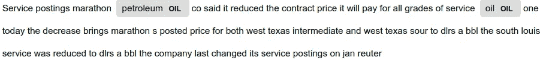****

******模式匹配******

******Spacy** 还提供了**匹配器**，可以很容易地用来查找特定的子字符串、数字等。我们还可以根据词性标签设置规则。****

****这是代码:****

```
**import spacy# Import the Matcher
from spacy.matcher import Matchernlp = spacy.load("en_core_web_sm")
doc = nlp(example)# Initialize the Matcher with the shared vocabulary
matcher = Matcher(nlp.vocab)# Add the pattern to the matcher
matcher.add("OIL_PATTERN", None, [{"LOWER": "oil"}], [{"LOWER": "petroleum"}])# Use the matcher on the doc
matches = matcher(doc)
print("Matches:", [doc[start:end].text for match_id, start, end in matches])**
```

****你应该会看到印在笔记本上的火柴。****

```
**Matches: ['petroleum', 'oil']**
```

## ****根西姆****

****[**根思**](https://radimrehurek.com/gensim/) **m** 是一个强大的专注于 [**主题** **造型**](https://en.wikipedia.org/wiki/Topic_model) 的库。它提供了许多算法，如 [LDA](https://towardsdatascience.com/nlp-with-lda-latent-dirichlet-allocation-and-text-clustering-to-improve-classification-97688c23d98) 记忆，它是一个**无监督**算法。****

********

****https://radimrehurek.com/gensim/的例子****

****`gensim`的核心概念是:****

*   ****[文件](https://radimrehurek.com/gensim/auto_examples/core/run_core_concepts.html#core-concepts-document):输入文本。****
*   ****[文集](https://radimrehurek.com/gensim/auto_examples/core/run_core_concepts.html#core-concepts-corpus):文件的集合。****
*   ****[Vector](https://radimrehurek.com/gensim/auto_examples/core/run_core_concepts.html#core-concepts-vector) :文档的数学上的方便表示。****
*   ****[模型](https://radimrehurek.com/gensim/auto_examples/core/run_core_concepts.html#core-concepts-model):将向量从一种表示转换成另一种表示的算法。****

****这是我们已经看过的核心概念。为了使用 **LDA** 进行主题建模，首先我们需要从数据中创建一个**字典**，然后将其转换为[单词袋](https://en.wikipedia.org/wiki/Bag-of-words_model)模型:****

```
**from gensim import corporadictionary = corpora.Dictionary(input_text)
corpus = [dictionary.doc2bow(text) for text in input_text]**
```

****然后我们可以使用 LDA:****

```
**import gensim
NUM_TOPICS = 2 # how many topic we want to extractldamodel = gensim.models.ldamodel.LdaModel(corpus, num_topics = NUM_TOPICS, id2word=dictionary, passes=12)topics = ldamodel.print_topics(num_words=5)
for topic in topics:
    print(topic)**
```

****正如我们前面提到的，我们需要事先选择要提取多少主题，然后我们可以使用前面创建的语料库和字典来创建模型。代码将打印两个主题，每个主题有 5 个示例单词。****

****我们可以使用 [**pyLDAvis**](https://pypi.python.org/pypi/pyLDAvis/2.1.1) 这个神奇的库来可视化结果:****

```
**import pyLDAvis.gensimlda_display = pyLDAvis.gensim.prepare(lda, corpus, dictionary, sort_topics=False)pyLDAvis.display(lda_display)**
```

****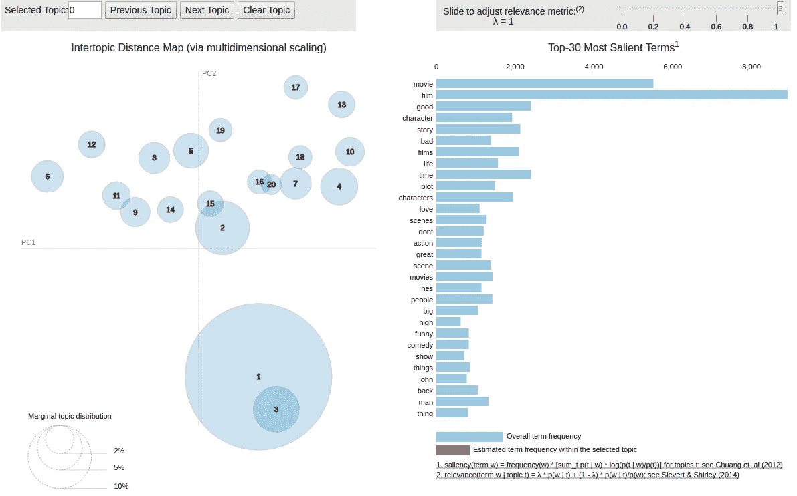****

****检查一下这个 [**笔记本**](https://nbviewer.jupyter.org/github/bmabey/pyLDAvis/blob/master/notebooks/pyLDAvis_overview.ipynb#topic=0&lambda=1&term=) 上的[演示](https://nbviewer.jupyter.org/github/bmabey/pyLDAvis/blob/master/notebooks/pyLDAvis_overview.ipynb#topic=0&lambda=1&term=) [**pyLDAvis**](https://pypi.python.org/pypi/pyLDAvis/2.1.1) 功能。****

# ****数据标记****

******对于文本分类或 NER 等监督算法，您需要标记您的文本数据。你将需要一些工具来帮助你完成这项任务。*让我们回顾一下这些工具……*******

## ****多卡诺****

****[**Doccano**](https://doccano.herokuapp.com/) 是一款基于 web、**开源的**注释工具。Doccano 使您能够让它自托管，这提供了更多的控制以及根据您的需要修改代码的能力。它支持不同的团队，并且非常容易使用。你可以试试这里的 一个**演示** [**。**](https://doccano.herokuapp.com/demo/named-entity-recognition/)****

****查看我之前的 [**文章**](/nlp-named-entity-recognition-ner-with-spacy-and-python-dabaf843cab2) 了解更多关于 Doccano 的细节。你可以按照 [**Doccano**](https://doccano.github.io/doccano/tutorial/) 的说明来安装这个开源工具。****

****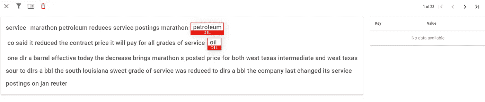****

****用 Doccano 标记数据****

## ****奇迹ˌ奇事****

****[**神童**](https://prodi.gy/) 由 [**SpaCy**](https://spacy.io/) 背后的同一个团队打造。它是一个现代的注释工具，用于为机器学习模型创建训练和评估数据。****

****它由 [**主动学习**](https://en.wikipedia.org/wiki/Active_learning_(machine_learning)) 提供动力，这意味着它提供**半自动化**。您可以从标记几个样本开始，主动学习模型将尝试为您学习和标记其余的数据集，因此您只能指出样本是否正确。此外，它会根据信息增益建议最佳样本，因此您不会在不会改进模型预测的样本上浪费时间。可以在这里 **查看一个现场 **demo** [**。**](https://prodi.gy/demo)******

**使用 Prodigy，您可以在快速和**迭代过程中标记和训练模型**消除大量手工工作。它合并了标记和训练过程，因此专家可以用有用和有意义的方式标记数据，而不是外包标记过程，浪费大量时间来标记不必要的文本样本。这样你可以很快尝试新想法。**

**Prodigy 可以用来标记命名实体为 **NER** ，文本为分类，甚至图像，视频和声音！。它附带了许多" [**配方**](https://prodi.gy/docs/recipes) "这些都是执行某个任务的工作流程，查看这个 [**流程图**](https://prodi.gy/prodigy_flowchart_ner-36f76cffd9cb4ef653a21ee78659d366.pdf) 来检查它们。**

****简单地说过程如下:****

*   **首先，您需要获得您的示例文本数据 JSONL，其中每行包含一个条目，这是一个[示例](https://raw.githubusercontent.com/explosion/prodigy-recipes/master/example-datasets/news_headlines.jsonl)。**
*   **下一步是开始手动注释，例如对于 NER，您将在命令行中运行:**

```
prodigy ner.manual ner_news_headlines blank:en ./news_headlines.jsonl --label PERSON,ORG,PRODUCT,LOCATION
```

*   **这将启动`ner.manual` Prodigy recipe 以便您可以开始贴标，这将打开一个 web 服务器，其 Web UI 位于:[*http://localhost:8080*](http://localhost:8080)**
*   **现在，您可以开始添加注释了:**

**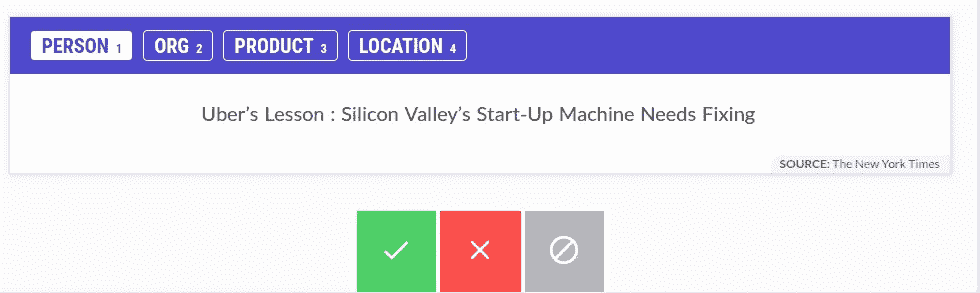**

*   **在注释了一些示例后，您可以训练模型:**

```
prodigy train ner ner_news_headlines en_vectors_web_lg
```

*   **第一个参数定义了要训练的组件:在本例中是`ner`。您还需要传入数据集的名称、要从中训练的注释以及要开始的基本模型。在这个例子中，最后一个参数是使用一个大的`[en_vectors_web_lg](https://spacy.io/models/en#en_vectors_web_lg)` [模型](https://spacy.io/models/en#en_vectors_web_lg)作为基础模型。向量将在训练中用作特征，这可以大大提高准确性。如果你还没有安装矢量包，你可以通过`spacy download en_vectors_web_lg`下载**
*   **根据结果指标，如**准确度或** [**f 值**](https://en.wikipedia.org/wiki/F-score) ，你可以决定下一步该怎么做。Prodigy 有许多[方法](https://prodi.gy/prodigy_flowchart_ner-36f76cffd9cb4ef653a21ee78659d366.pdf)来帮助你，一些可以用来检测标记更多的数据是否会改善你的模型，其他的会尝试为你标记，所以你只需要接受或拒绝，其他的会从你的数据集中检测最有意义的例子，等等。查看此[图表](https://prodi.gy/prodigy_flowchart_ner-36f76cffd9cb4ef653a21ee78659d366.pdf)了解更多详情。**

**如你所见，Prodigy**非常强大**并且**与 SpaCy** 有很好的兼容性。这两个工具允许您为您的组织实现**完整的端到端 NLP 解决方案**。注意 **Prodigy 不是开源的**，你需要获得一个许可，这样你就可以下载并在你的环境中安装它。**

## **其他工具**

*   **[**TagTog**](https://www.tagtog.net/)**:**基于 web 的文本标注工具，无需安装。它提供云产品。支持团队的组注释。它还具有机器学习能力:从以前的注释中学习，并自动生成类似的注释。**
*   **[**乳臭未干**](https://brat.nlplab.org/) **:开源**免费注释工具。**

# **结论**

**我们可以尝试总结 NLP，说**它结合了一套工具和技术，将复杂的自然语言转换成机器可读的数据。****

****特征工程**和提取是**自然语言处理**中的关键步骤。像 **TF-IDF** 和单词嵌入这样的技术被用来将单词转换成数字，这些数字可以被统计模型用于文本分类。**命名实体提取(NER)** 是一个非常有用的算法，允许我们从文本数据中提取类别和其他见解。文本分类和 NER 都是**监督的**算法，你需要提供标签数据。对于文本分类，您将在目标列旁边提供文本字符串，例如 Span/NoSpan。对于 NER，您需要使用 Prodigy 等工具来标记标签。**

****主题建模**可用于聚集文章内的相关主题，例如创建实时[新闻内容主题集群](https://aylien.com/blog/getting-started-with-real-time-topic-clustering)。这是一个**无监督**算法。**

**如你所见，像任何机器学习任务一样，**大部分工作都是准备和标记数据**，这一部分不仅耗时，而且**至关重要**。对于自然语言处理来说，正确标记数据并对其进行适当的预处理是获得好结果的最重要的因素。**

**许多组织花费大量资源建立复杂的模型来改善结果，而不是关注数据。好的**数据准备和特征工程**可以比任何 ML 算法更快更好的提升模型性能。**

**如果你喜欢这篇文章，记得鼓掌，并关注我的更多更新！**

**我希望你喜欢这篇文章。欢迎发表评论或分享这篇文章。跟随[***me***](https://twitter.com/JavierRamosRod)**进行未来岗位。****