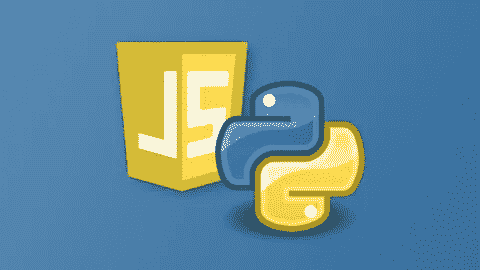
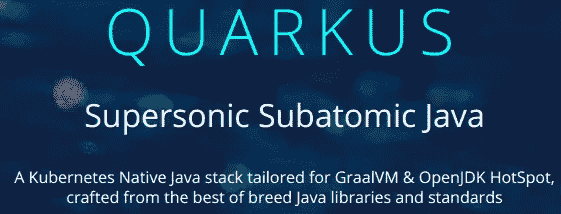
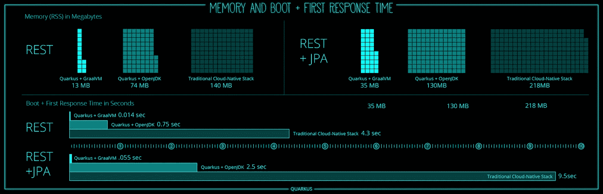
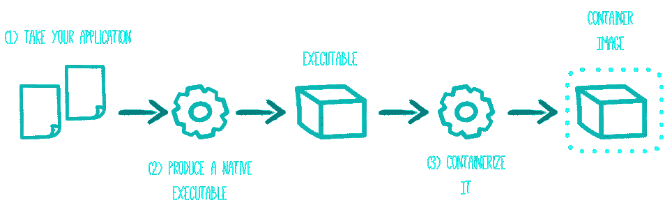
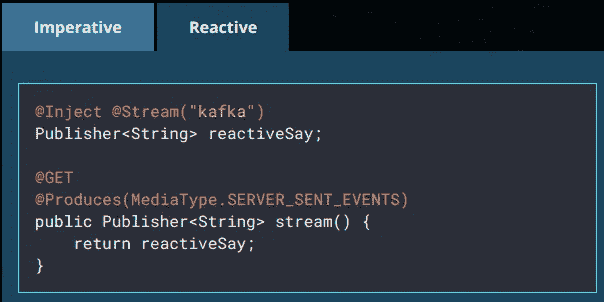
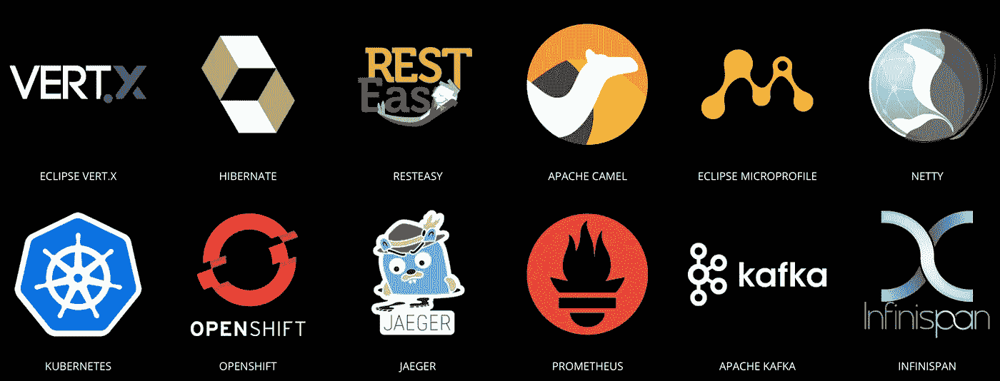

# Quarkus 简介:云原生 Java 应用

> 原文：<https://itnext.io/introduction-to-quarkus-cloud-native-java-apps-e205ae702762?source=collection_archive---------0----------------------->

Java 和 JVM 仍然是最受欢迎的编程语言，但对于无服务器和云原生微服务来说，由于短寿命容器所需的大量内存占用和缓慢的启动时间，其使用正在下降；这就要改拜 [***夸尔库斯***](https://quarkus.io) *了。*

# 介绍

随着我对 DevOps、容器和无服务器的了解越来越多；我发现自己用 Python 或 JavaScript 在轻量级容器或 FaaS 中编写容器化的代码。 **Java 启动太慢**无法在无服务器框架中使用，对于微服务，JavaScript 或 Python 比 Java 启动时间更快，容器更小，因此效率更高。



Python 和 JavaScript 是云原生微服务的最佳语言

**爪哇**比**T21 多 20 岁，他们身后的世界与现在大不相同。JVM 解决了一个巨大的问题，允许我们编写一次代码，并在多个平台和操作系统中运行。有了容器，我们现在可以将我们的应用程序、库和操作系统资源打包到一个可以在任何地方运行的容器中。JVM 的可移植性现在变得不那么重要了。过去，额外的开销是我们愿意为可移植性支付的成本，但现在不再是了。现在，我们希望**快速、低延迟和反应式应用始终可用**。像 [**Kubernetes**](https://kubernetes.io) 这样的容器和容器编排工具独立于编程语言提供了这一点。**

随着公司迁移到微服务，他们把他们的 [**Spring**](https://spring.io/) Java 服务打包到一个大罐子里，添加 **JDK** 并在基于 Linux 的容器中运行。这种解决方案是可行的，但是您必须管理 500MB 的大重量容器，并且需要 10 到 30 秒才可用；这是一个问题。许多公司在迁移之后，他们慢慢地转向 Python 或 Java 来提供他们的后端服务；最终，到了 [FaaS](https://en.wikipedia.org/wiki/Function_as_a_service) 。无服务器和 FaaS 现在非常流行，因为它们让我们可以专注于编写函数，而不用担心基础设施。它们仍然在容器中运行，但是云提供商管理它的生命周期。有趣的是，在一定时间后，云提供商将完全终止容器，并在下一次调用时再次启动它，因此您只需为使用付费。第一次调用一个函数可能需要更长的时间，这就是著名的**冷启动**。这是因为容器需要启动。对于 Python 或 JavaScript，这不是一个大问题，但对于 Java，这可能是 10-15 秒，这是一个交易破坏者，也是 Java 下降的原因。现在**我们需要能够运行的代码，完成它的工作，然后停止**。我们不想要多线程或长时间运行的进程，我们想要能够快速启动的**短命进程**。

# 介绍夸库

如果你阅读科技博客或关注新闻，你可能会认为 [**无服务器**](https://aws.amazon.com/serverless/) 正在吞噬世界，每个人对此都非常兴奋。创业公司现在可以使用 JavaScript 在云中编写功能作为服务，并扩展它们以支持数百万用户，而不必管理任何基础设施。然后，你有真正的词，在硅谷之外；金融机构、政府、零售和许多其他行业都有数百万行用 Java 编写的代码，他们负担不起重写代码的费用，所以他们接受了这样一个事实，即他们需要忍受沉重的容器。



[**GraalVM**](https://graalvm.org/) 特别是 **Substrate VM** 现在为 Java 语言打开了一扇光明而漫长的未来之门。GraalVM 是一个**通用虚拟机**，用于运行用 JavaScript、Python、Ruby、R、基于 JVM 的语言编写的应用程序，如 Java、Scala 或 Kotlin。酷的是 **GraalVM 允许你提前(AOT)将你的程序编译成本地可执行文件**。这意味着，你可以把你的 Java 代码直接编译成机器专用的代码。生成的程序不在 Java HotSpot VM 上运行，而是使用必要的组件，如内存管理、来自不同虚拟机实现的线程调度，称为**底层 VM。**底层 VM 用 Java 编写，编译成本机可执行文件。与 Java VM 相比，生成的程序具有更快的启动时间和更低的运行时内存开销。这很好，但你可能会想，AOT？这违背了拥有 JVM 的整个想法，这是我不能在任何地方运行的 Java 代码！，*这太疯狂了！！！*。但是想想看，我们现在有容器，我们不需要 JVM。基于普通**容器的 Spring boot 应用有一个** **额外的抽象层次，这在 Kubernetes** 的世界中是完全不必要的。你有一个在 JVM 上运行的 Java 应用程序在一个容器中，这个容器永远不会改变，因为现在的交付物是容器而不是应用程序，你打包容器而不再是战争。所以，在容器内的 JVM 中运行应用程序的所有开销都是无用的，所以如果你打算把你的应用程序打包在容器中，AOT 是完全有意义的。

然而，Java 的动态特性受到 AOT 编译(运行时的类加载、反射、代理等)的严重限制。实际上，这意味着 90%的 Java 生态系统没有变化就无法工作。所以 Java 生态系统必须适应。好消息是我们可以在构建时完成大部分任务！

这就是**夸尔库斯**的力量。它使用 GraalVM 并提供一个在构建时支持 AOT 的生态系统，因此您可以使用 Java 创建本地二进制文件。Quarkus 让 Java 开发人员可以使用 GraalVM！

# Quarkus 入门

如上所述，Quarkus 为 Java 应用程序提供了提前编译，创建了一个超音速亚原子 Java 生态系统，具有极小的尺寸和超快的启动时间，将 Java 带回了云原生开发的游戏中。多年来，我从未对一项新技术如此兴奋过，而且我不是唯一一个 T2。

试试 [**入门指南**](https://quarkus.io/guides/getting-started-guide) 自己看吧。按照 3 个指南，看看 Quarkus 的力量，并测量启动时间。仍然有成千上万的公司使用 Java+JPA，在一个容器中，这可能需要 15 秒才能启动，**在 Quarkus 0.005 中！**



夸库斯统计

您使用的 IDE 和工具与您在 Spring Boot 世界中使用的相同。您使用 Maven 或 Gradle 来构建您的项目。你可以直接在 IDE 中运行它，最重要的是，你可以热实时重新加载任何更改，无需重启应用程序。Quarkus 不是 Spring ，所以如果你正在使用 Spring Boot，你将需要移植 Spring 特定的代码，幸运的是，Quarkus 附带了一个 [Spring DI 兼容层](https://quarkus.io/guides/spring-di-guide)使得这变得非常容易。Quarkus 框架是基于标准的，这意味着代码将是可移植的，易于维护。

## Quarkus 开发流程

Quarkus 可以在类似 Spring Boot 的开发模式下运行，你也可以将你的项目打包到 fat jars 中。这对于测试你的代码和调试非常有用，因为它支持实时重载；但是对于提前生产，需要编译。下图显示了这一过程:



*   首先，你在你最喜欢的 IDE 中构建你的应用程序，你可以在开发模式下运行它，使用:" *mvnw compile quarkus:dev* "像一个 Spring Boot 应用程序一样，你也可以打包成一个大罐子。
*   一旦你满意了，你就可以创建一个 Java 二进制文件了！，只需运行:" *mvnw package -Pnative* "，这将需要一些时间，因为正在提前编译创建本机代码！，一旦完成，你将有一个超级小和快速的二进制文件，但只能在你的平台/OS 上运行，所以它是不可移植的！但这没关系，因为我们可以把它放在一个容器里，这样它就可以随身携带了！。使用:`./mvnw package -Pnative -Dnative-image.docker-build=true`从 Docker 容器中生成一个可执行文件，这意味着我们在一个容器中进行本地构建并创建二进制文件，如果您没有与目标容器相同的平台(如 Quarkus 在项目创建期间生成的 Docker 文件中所指定的),这可能无法在您的笔记本电脑上运行。
*   然后，一旦我们有了二进制文件，我们只需要从 docker 文件创建映像。`docker build -f src/main/docker/Dockerfile.native -t quarkus-quickstart/quickstart .`
*   最后你可以在 Docker 或者 Kubernetes 中运行它:`docker run -i --rm -p 8080:8080 quarkus-quickstart/quickstart`

# 夸库特征

Quarkus 有更多的特性，不仅仅是本地 Java 代码。

*   [统一命令式和反应式](https://quarkus.io/vision/continuum):在开发应用时，将大家熟悉的命令式代码和非阻塞反应式风格结合起来，这样就可以使用反应式编程或者经典命令式。



反应终点

*   [开发者喜悦](https://quarkus.io/vision/developer-joy):统一配置，零配置，眨眼之间即可实时重新加载，80%常见用法的简化代码，20%的灵活代码，轻松生成本地可执行文件，实时编码。
*   惊人的快速启动时间，难以置信的低 RSS 内存(不仅仅是堆大小！)在 Kubernetes 等容器编排平台中提供近乎即时的规模扩大和高密度内存利用。[了解更多](https://quarkus.io/vision/container-first)。
*   Quarkus 通过利用您喜爱并在标准主干网上使用的同类最佳库，带来了一个内聚的、有趣的全栈框架。[了解更多](https://quarkus.io/vision/standards)。
*   它支持 Hibernate、JPA、REST、JWT 等库。
*   支持 [**Kubernetes**](https://kubernetes.io) 和 [**OpenShift**](https://www.openshift.com/) 部署
*   使用 [Jaeger](https://www.jaegertracing.io/) 打开追踪
*   [**科特林**](https://quarkus.io/guides/kotlin) 支持
*   使用 **Kafka** 、Camel 发送消息…
*   还有更多， [**查看扩展列表！**](https://quarkus.io/extensions/)



夸库斯生态系统

简而言之，**现在，您可以在任何环境(云环境或本地环境)中的超快速轻量级容器中运行传统的 JPA/JTA 事务服务。**

# Quarkus 示例

在本节中，让我们简化[入门指南](https://quarkus.io/guides/getting-started-guide)来了解 Quarkus 的威力。


创建新的 Quarkus 项目最简单的方法是打开一个终端并运行以下命令:

```
mvn io.quarkus:quarkus-maven-plugin:0.12.0:create \
    -DprojectGroupId=org.acme \
    -DprojectArtifactId=getting-started \
    -DclassName="org.acme.quickstart.GreetingResource" \
    -Dpath="/hello"
```

它生成一个 Maven 项目，带有一个 greeting suce exposure/hello 端点。它还为本机和 jvm(fat jar 传统映像)docker 映像生成 docker 文件。代码非常简洁明了:

```
@Path("/hello")
public class GreetingResource { @GET
    @Produces(MediaType.TEXT_PLAIN)
    public String hello() {
        return "hello";
    }
}
```

来运行我们的应用程序。用途:`./mvnw compile quarkus:dev`

应用程序使用`./mvnw package`打包。它产生 2 个 jar 文件:

*   `getting-started-1.0-SNAPSHOT.jar`——只包含项目的类和资源，它是由 Maven build 产生的常规工件；
*   `getting-started-1.0-SNAPSHOT-runner.jar` -成为可执行的 *jar* 。请注意，它不是一个*的 ber-jar* ，因为依赖项被复制到了`target/lib`目录中。

您可以使用`java -jar target/getting-started-1.0-SNAPSHOT-runner.jar`运行应用程序

然后，您需要[下载](http://www.graalvm.org/downloads/)并安装 GraalVM 并设置`GRAALVM_HOME`环境变量。

现在您可以使用`./mvnw package -Pnative -Dnative-image.docker-build=true`创建一个本地可执行文件。

创建 Docker 图像:`docker build -f src/main/docker/Dockerfile.native -t quarkus-quickstart/quickstart .`

现在您可以在任何容器或业务引擎中运行它，如果您使用 [**minishift**](https://github.com/minishift/minishift) :

```
kubectl run quarkus-quickstart --image=quarkus-quickstart/quickstart:latest --port=8080 --image-pull-policy=IfNotPresent
kubectl expose deployment quarkus-quickstart --type=NodePort
```

就是这样！；**您有一个包含 Java REST 服务的容器，它在 0.004 秒内启动！**

# 结论

我真的对 [**Quarkus**](https://quarkus.io/) 感到兴奋，它得到了**红帽**的支持，自一周前发布以来受到了很多关注。我相信这将改变 Java 的前景，并使普通企业真正迁移到 cloid 成为可能。

**Kubernetes+**[**kna tive**](https://cloud.google.com/knative/)**+quar kus 是云原生开发的游戏改变者，也是任何 Java 开发者的喜悦。**

**结账** [**这个 GIT**](https://github.com/quarkusio/quarkus-quickstarts) **回购有很多例子！**

我希望你喜欢这篇文章。欢迎发表评论或分享这篇文章。跟随[***me***](https://twitter.com/JavierRamosRod7)*进行未来岗位。*