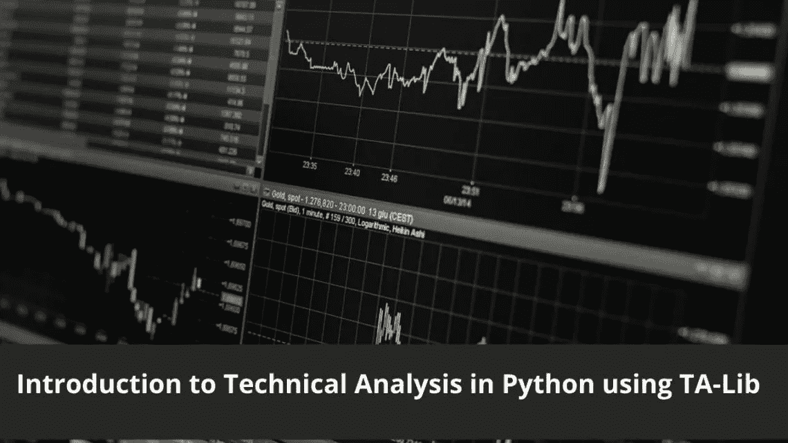
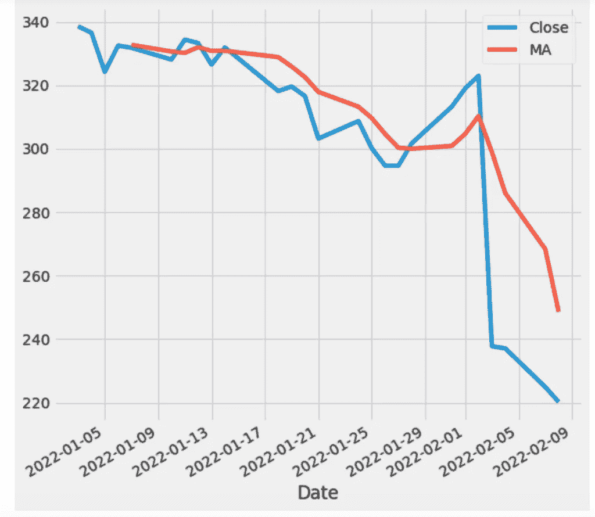
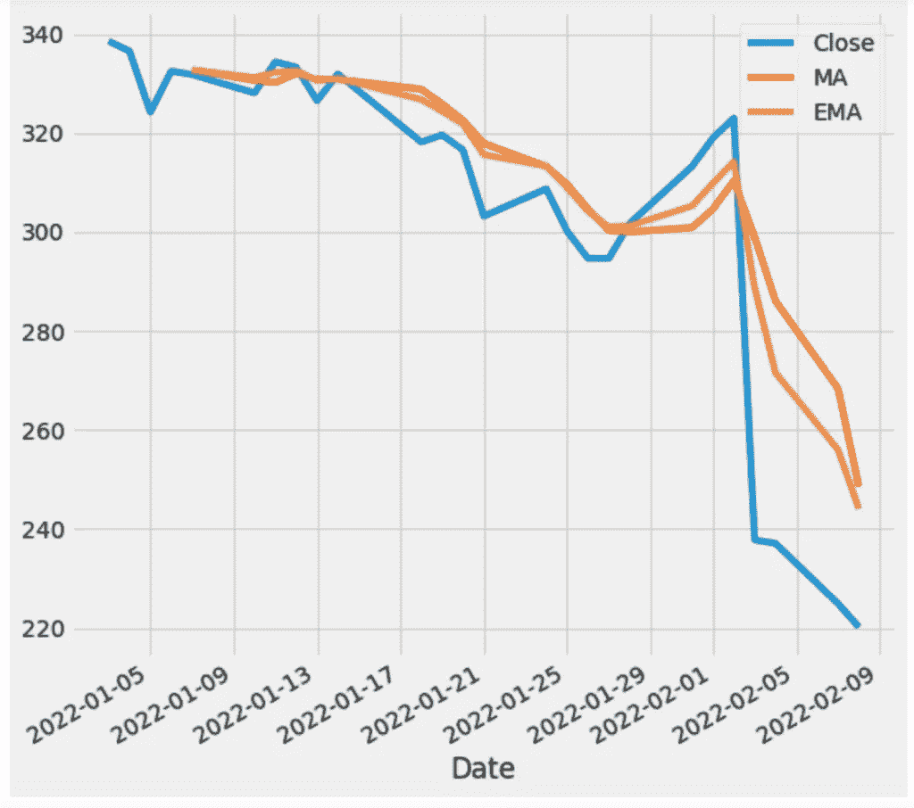
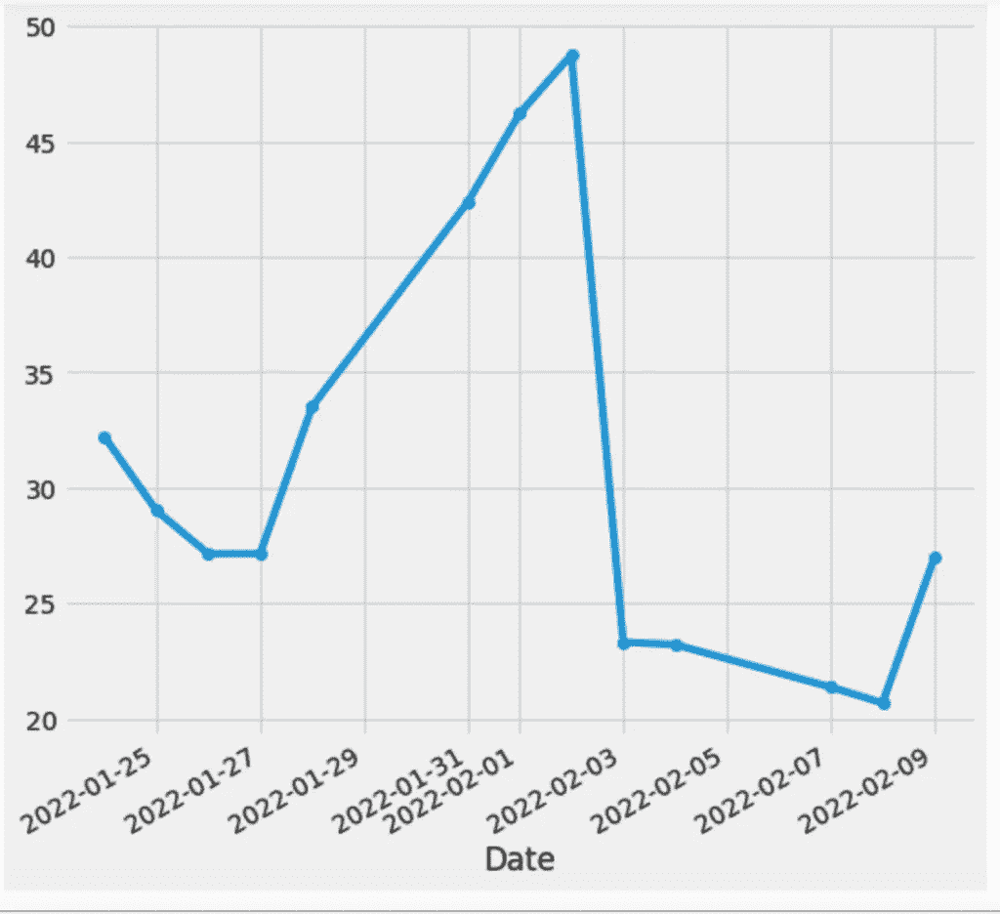

# 使用 TA-Lib 介绍 Python 中的技术分析

> 原文：<https://itnext.io/introduction-to-technical-analysis-in-python-using-ta-lib-ac1562849b1e?source=collection_archive---------2----------------------->



在本教程中，我将讨论 TA-Lib，这是一个用于 Python 应用程序的技术分析库。在我继续讨论如何用 Python 进行技术分析之前，请允许我讨论一下什么是技术分析，以及它如何帮助你决定是购买、出售还是持有一项资产。

# 什么是技术分析

来自 [Investopedia](https://www.investopedia.com/terms/t/technicalanalysis.asp) :

> 技术分析是一门交易学科，通过分析从交易活动中收集的统计趋势(如价格变动和交易量)来评估投资和识别交易机会。

简而言之，它是对过去和当前数据的研究，并试图找出接下来会发生什么。你使用指标，并试图找出不同的模式，以帮助决策。

另一方面，*基本面分析*就是根据公司的财务状况做出决策，比如年度/季度利润、市盈率等。

# 开发设置

安装 TA-Lib python 包装器相当容易。所有人都需要执行`pip`命令:

`pip install TA-Lib`

您必须安装 TA-Lib 库本身，以便可以在您的应用程序中使用它。在 macOS 上，您可以通过自制软件安装:

`brew install ta-lib`

如果你使用的是 Linux 或 Windows，那么你可以在这里得到详细信息。

我还安装了雅虎财务库来获取我们需要的数据:

`pip install yfinance`

好吧！所以一切都准备好了。现在，在我们开始使用这个库之前，我们必须了解一些技术分析的基础知识，以及 TA-Lib 如何帮助我们实现目标。

对于本教程，我将使用雅虎财经和***Jupyter Notebook***来获取数据，因为它们使编写交互式代码变得容易。使用`jupyter notebook`命令启动 IDE 并创建一个新文件 **Analysis Intro.ipynb** 。

我要做的第一件事就是导入所有需要的库:

```
# All Imports
import yfinance as yf
import talib as ta
import pandas as pd
```

我们将分析已经下跌了 25%的脸书股票，正如文章所说，最近几天有数百万用户退出了 FB。

我们要检查的第一件事是这张纸的*简单移动平均线(SMA)* 。

## 什么是移动平均线

如果你注意到一个股票价格的图表，你会发现它波动很大。这种波动可能导致产生错误信号。移动平均线(MA)有助于从随机的价格变动中过滤出噪音，并使其平滑，以便看到平均值。MAs 用于确定趋势和反转。当价格高于均线时，我们说这是一个*上升趋势*，否则是一个*下降趋势*。它们也用于识别*支撑*和*阻力*的区域。MAs 基于过去的价格，也被称为*滞后指标*。当价格穿过 MA 时，是买入的信号，当价格向下穿过 MA 时，是卖出的信号。MAs 有两种类型:简单型和指数型

*   **简单移动平均线:-** 简单移动平均线(SMA)是一种计算方法，采用过去特定天数内一组给定(*收盘*)价格的算术平均值；例如，在过去的 15、30、100 或 200 天内(*来源:Investopedia* )。
*   **指数移动平均线:-** 指数移动平均线(EMA)是一种加权平均线，对最近几天的股票价格给予更大的重视，使其成为对新信息更敏感的指标(*来源:Investopedia* )。

如果你在图上画均线和均线，你会发现均线比均线更接近实际的图表，因为均线比均线反应更快。这就是 SMA 被认为是滞后指标的原因。MAs 可用于不同的时间段:10、20、500、100、200。10–20 代表短期趋势，50 代表中期趋势，200 代表长期趋势。

马背景讨论够了，我们来写点代码吧！

首先，我将从年初至今获取 FB 股票价格数据。

```
# Facebook Historial Data
fb = yf.Ticker("FB")
df = fb.history(start="2022-01-03")
df
```

数据现在可以在 pandas 数据框架中获得，让我们绘制一个图表，显示收盘价和收盘价的 SMA 数据

```
plt.style.use('fivethirtyeight')
df['MA'] = ta.SMA(df['Close'],timeperiod=5)
df[['Close','MA']].plot(figsize=(8,8))
plt.show()
```

当我执行笔记本中的代码时，它会生成以下内容:



如你所见，与收盘图不同，SMA 图更平滑。让我们给它添加一个均线图。

```
plt.style.use('fivethirtyeight')
df['MA'] = ta.SMA(df['Close'],timeperiod=5)
df['EMA'] = ta.EMA(df['Close'], timeperiod = 5)
df[['Close','MA','EMA']].plot(figsize=(8,8))
plt.show()
```

当我运行这段代码时，图表如下所示:



你可以注意到，均线图比均线图反应慢，它决定下跌趋势比均线图慢。

## 什么是相对强度指数(RSI)

RSI 是一个动量指标，有助于了解某个股票是超买还是超卖。其值介于 0-100 之间。如果在 *30* 以下，说明超卖，有机会买入。如果价格高于 *70* ，意味着超买，这是抛售股票的好机会。让我们计算并绘制 FB/Meta 股票的 RSI。我们来查一下 FB 的 RSI。

```
# RSI
df['RSI'] = ta.RSI(df['Close'],14)
df['RSI'].plot(figsize=(8,8),marker='o')
df.tail(10)
```

它会产生。14 是计算它的默认期间。



正如你所看到的，在 2 月 1 日和 2 日之间有一个大的反弹，然后在 2 月 3 日到 9 日之间被严重抛售，看起来它试图再次恢复。

# 结论

在本教程中，我们学习了如何使用 TA-Lib 和图表来计算你的下一个交易策略。这篇文章不可能涵盖与 TA-Lib 相关的所有内容，但我希望它能让你知道下一步该做什么。您可以创建一个机器人来检查 RSI 值并定期发出信号。像往常一样，这些代码可以在 Github 上找到。

*原载于 2022 年 2 月 16 日*[*http://blog . adnansiddiqi . me*](http://blog.adnansiddiqi.me/introduction-to-technical-analysis-in-python-using-ta-lib/)*。*