# 介绍性推送通知

> 原文：<https://itnext.io/introductory-push-notifications-fa6f68ace251?source=collection_archive---------2----------------------->

推送通知利用 iOS 系统来获得用户对我们应用的参与。尽管从用户的角度来看，这似乎很容易，但是对于开发者来说，这里面有很多东西。这里我将实现实践中最常用的特性。

[演示项目可以在这里找到](https://github.com/ji3g4kami/PushTest)。

## 安装

*   若要使用推送通知，您需要有一个付费的 Apple 开发者帐户。
*   下载[推送通知](https://github.com/onmyway133/PushNotifications/releases)和[生成您的. p8 证书](https://github.com/onmyway133/PushNotifications#ios-provider-certificate)供以后使用。

[](https://github.com/onmyway133/PushNotifications) [## onmyway 133/推送通知

### https://gum.co/rsjU·❤️·❤️支持我的工作 push notifications 是一款用于测试 iOS 和…

github.com](https://github.com/onmyway133/PushNotifications) 

> 注意: [Pusher](https://github.com/noodlewerk/NWPusher) 也是一个很棒的工具但是只支持. p12PushNotification 同时支持. p8 和. p12。

*   推送通知在模拟器上不起作用，所以您需要一个真实的设备来执行它。
*   在“功能”选项卡中打开项目的推送通知；它应该会为您生成一个. entitlements。

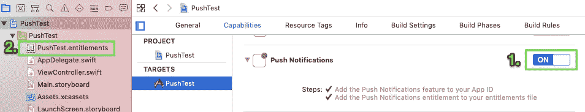

## 请求许可

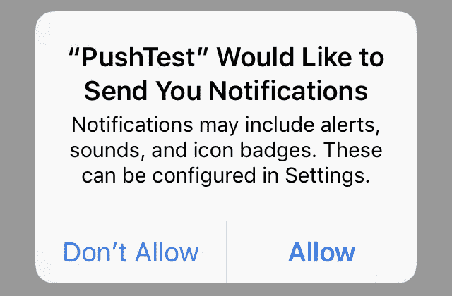

## 获取设备令牌

在以下情况下，令牌可能会更改:

*   该应用程序会在新设备上恢复
*   用户卸载/重新安装应用程序
*   用户清除应用程序数据

如果您想要向多个设备发送通知，您可以向您的提供商服务器更新令牌。

## 发送推送通知

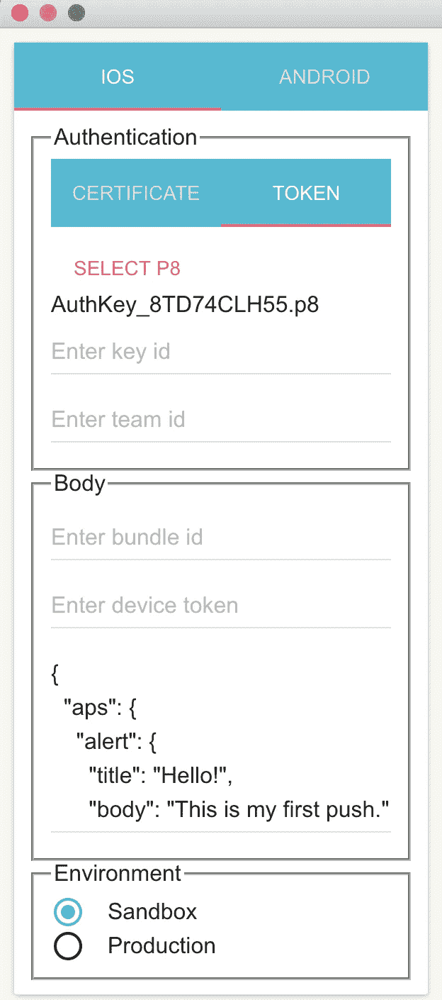

打开推送通知，并在令牌段下的中填写所需信息:

密钥 id 与. p8 文件中的 10 位数字相同，在本例中为 8TD74CLH55。

团队 ID 可以在你的苹果开发者账号里找到。

捆绑包 id 是项目的捆绑包 id。

设备令牌是从上一节获得的。

然后，您可以编辑 JSON 格式的推送通知消息:

```
{
  "aps": {
    "alert": {
      "title": "Hello!",
      "body": "This is my first push."
    }
  }
}
```

默认情况下，推送通知只在应用程序外有效。将您的应用程序留在后台，按“发送”进行测试！

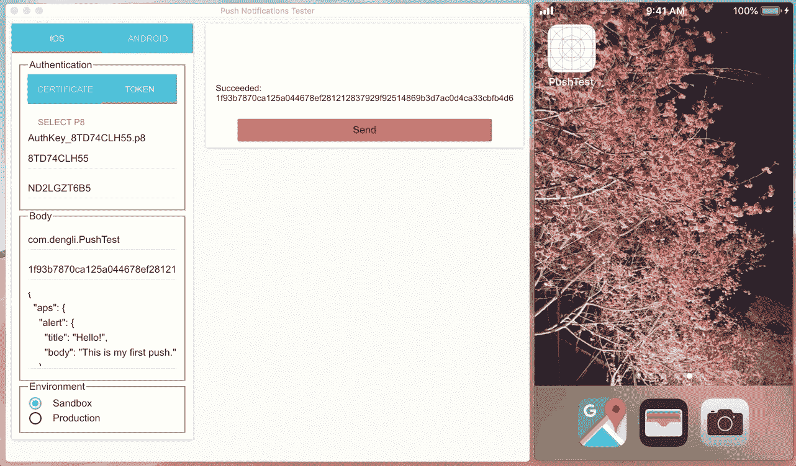

按发送

## 前台推送

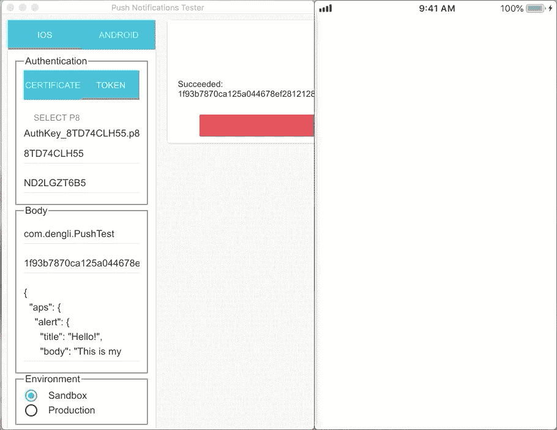

前台实现推送通知的关键是符合`UNUserNotificationCenterDelegate`协议。不要忘记为`UNUserNotificationCenter.current()`设置代理人。

## 转到某个视图控制器

在我们的演示中，我们还有两个页面，`PresentViewController`和`NavViewController`。它们仅仅意味着达到我们想要的视图控制器的两种不同的方法。

通过定制有效负载的力量，发送到 APNs 的 JSON，我们可以获得所需的属性并导航到我们想要的视图控制器。

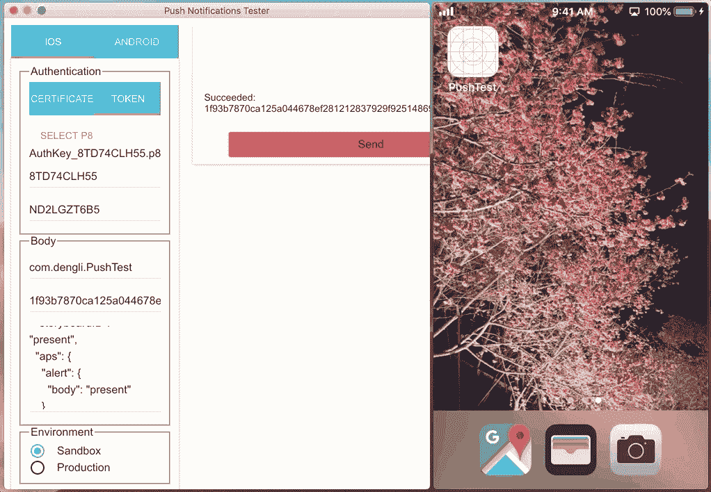

礼物

```
{
  "storyboardID": "present",
  "aps": {
    "alert": {
      "body": "present"
    }
  }
}
```


航行

```
{
  "storyboardID": "navigation",
  "aps": {
    "alert": {
      "body": "Navigation"
    }
  }
}
```

处理定制负载的代码在`userNotificationCenter(_:didReceive:withCompletionHandler:)`中实现

## 无声推送

静默推送可以在用户不点击的情况下执行操作。在这里，我将在 ViewController 中静默推送一个自定义图像。

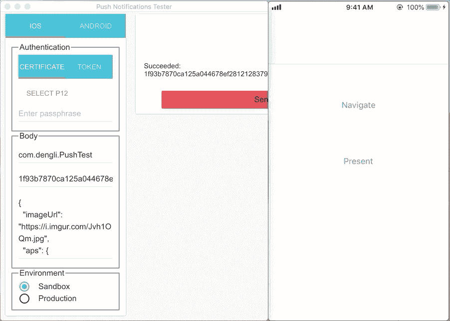

记得在功能里打开后台模式→远程通知。

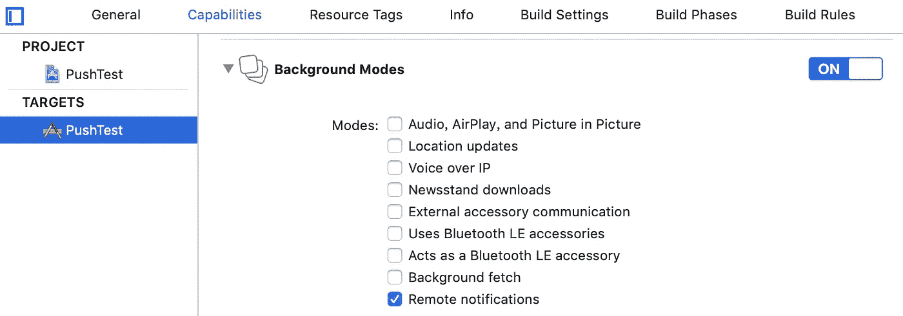

否则你会得到:

```
**You've implemented -[<UIApplicationDelegate> application:didReceiveRemoteNotification:fetchCompletionHandler:], but you still need to add "remote-notification" to the list of your supported UIBackgroundModes in your Info.plist.**
```

`"content-available": 1`在净荷中也是静默推送所必需的。

```
{
  "imageUrl": "[https://i.imgur.com/Jvh1OQm.jpg](https://i.imgur.com/Jvh1OQm.jpg)",
  "aps": {
    "content-available": 1
  }
} 
```

## [Firebase 云消息](https://firebase.google.com/docs/cloud-messaging/ios/first-message)

这里我使用 FCM 通过 firebase 发送之前的导航推送通知。

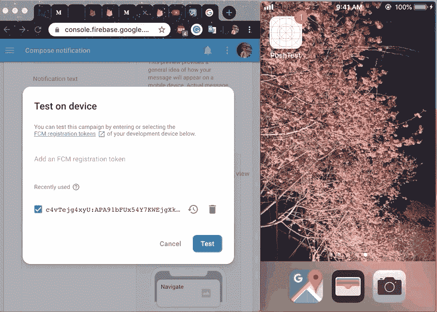

和通知一样，你需要在 Firebase 的项目设置中上传. p8 文件，或者. p12 和证书。

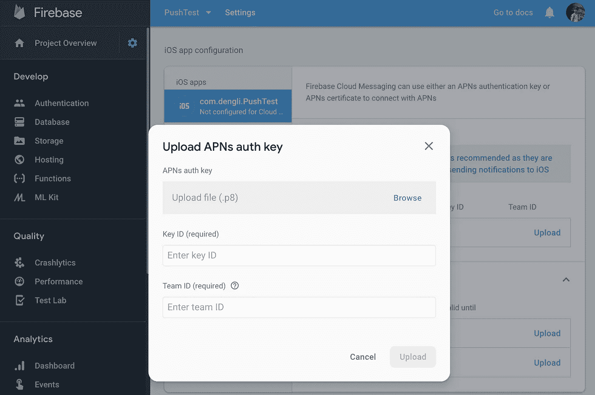

我已经发送了我的自定义有效载荷`storyboardID`，如下所示:

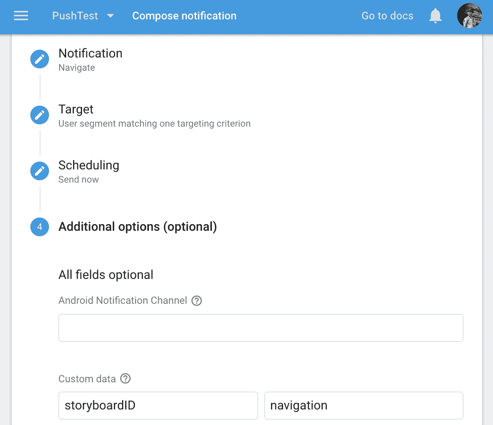

整个配置有一堆步骤。我建议你阅读我在 FCM 分支的[演示项目中的](https://github.com/ji3g4kami/PushTest/tree/FCM)[文档](https://firebase.google.com/docs/cloud-messaging/ios/receive?authuser=0)。

## 从这里去哪里

在本文中，我们学习了如何发送前台、后台、静默推送通知以及 Firebase 云消息的基础知识。这些是组织间最常用的功能。诚然，如果你真的想深入研究，还有很多东西要学。在这里，我将为您提供一些链接:

*   [iOS 远程推送通知概述](https://medium.com/flawless-app-stories/ios-remote-push-notifications-in-a-nutshell-d05f5ccac252)
*   [iOS 中推送通知的多种场景](https://medium.com/fantageek/push-notification-in-ios-46d979e5f7ec)
*   [设置远程通知服务器](https://developer.apple.com/documentation/usernotifications/setting_up_a_remote_notification_server)
*   [使用 Swift 和 Firebase 的静默远程通知](http://swiftdeveloperblog.com/silent-remote-notifications-with-swift-and-firebase/)