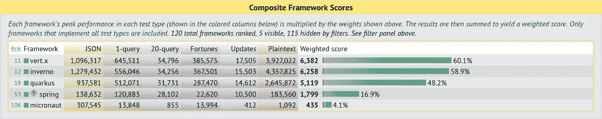
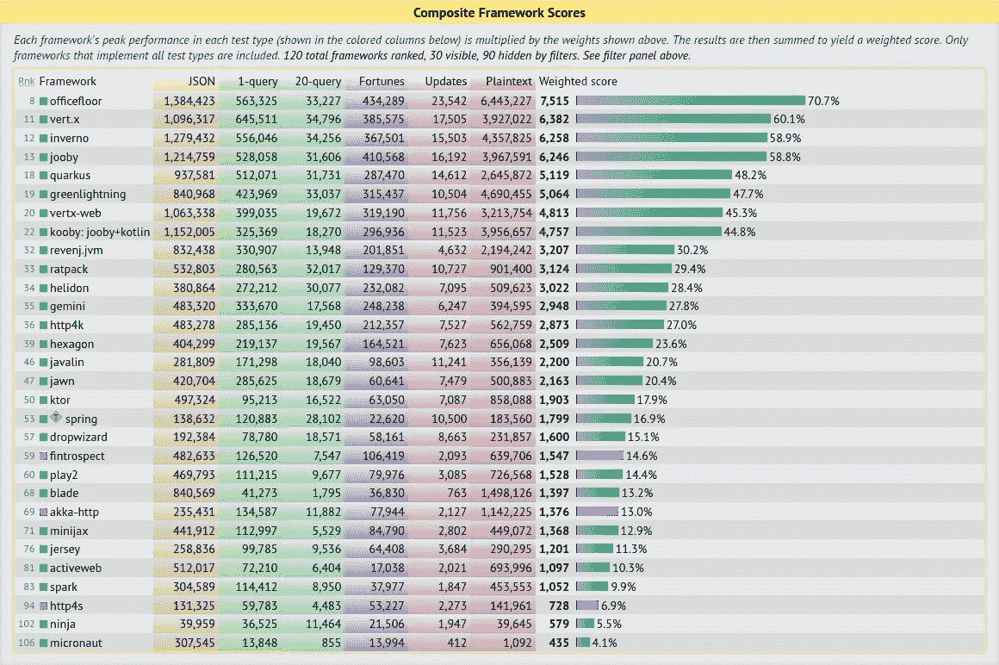
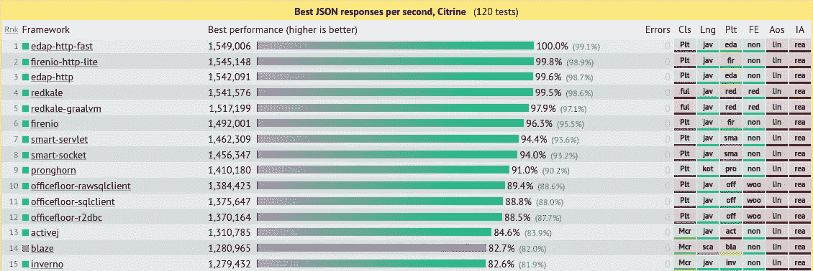
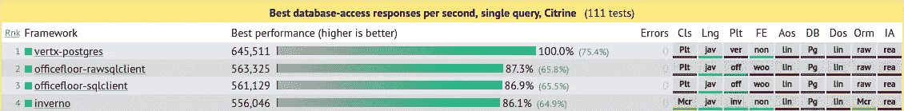
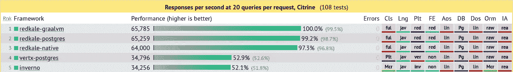
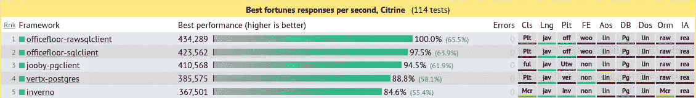
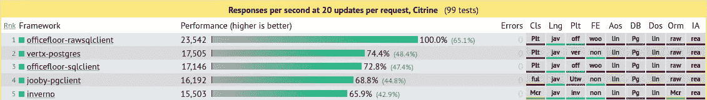
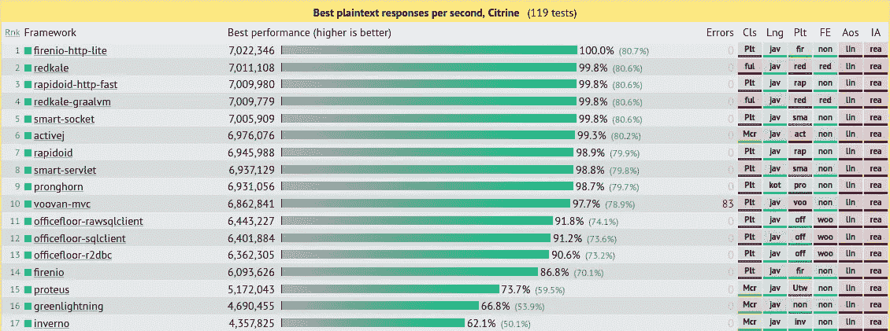
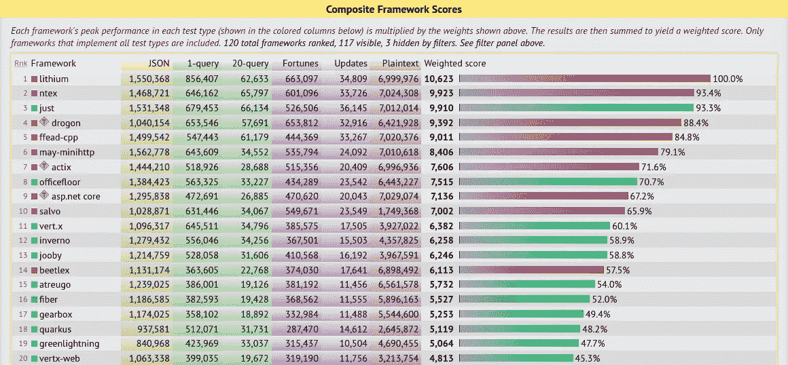

# Inverno 框架性能基准

> 原文：<https://itnext.io/inverno-framework-performance-benchmark-e3210c1a60d7?source=collection_archive---------2----------------------->

在我对 [Inverno 框架](https://inverno.io)的[介绍](https://invernoframework.medium.com/introducing-the-inverno-framework-6ade9d84b0c3)中，我讨论了随着云转型，性能如何变得越来越重要。事实上，为了降低运营成本，现代应用程序必须能够支持非常高的吞吐量，同时优化硬件资源的使用。

第一个开发阶段包括 IoC/DI、配置模块、HTTP 服务器模块、Web 开发模块和 RDBMS 客户端模块等核心功能，在此阶段结束后，我将 Inverno Framework 提交给[tech empower Framework Benchmarks](https://www.techempower.com/benchmarks)，以便了解 Inverno 与其他 Web 应用程序框架相比处于什么位置。结果还不是官方的，应该会出现在下一轮，但我们已经可以分析非官方的结果。

Inverno Framework 的目标一直是为现代 Java 应用程序开发提供尽可能好的平台，因此，在评估性能时牢记这一点非常重要。我通常说，性能是一个多方面的话题，不能简化为单一的原始性能。如果速度是唯一的标准，我们都将驾驶火箭车，这将忽视实用性、安全性、环境以及不是每个人都可以或应该驾驶这种车的事实。因此，在分析原始性能时，正确看待事物是很重要的。尤其是因为基准测试规则允许许多优化，而这些优化在开发实际应用程序时有时是不合适的。

因此，让我们看看截至[2022–02–21](https://www.techempower.com/benchmarks/#section=test&runid=79350aca-3138-4f06-9f2a-d9ca470028f6)的基准测试，看看 Inverno 框架与竞争对手相比如何。

我将首先考虑直接的主要竞争对手，它们都是基于 Java 的、业内公认的参与者，然后我将把分析扩展到所有基于 JVM 的框架，最后扩展到所有框架，而不考虑底层技术。

我认为以下框架是 Inverno Framework 的主要竞争对手:

*   在过去的 15 年里，Spring Framework 已经成为企业应用程序开发的事实标准。
*   这是红帽对 Spring Boot 在 JEE 终结后的回应。
*   Micronaut 是现代应用开发中一个新兴的应用框架。
*   [Vert.x](https://vertx.io) 这已经成为 Java 性能领域的参考。
*   [Netty](https://netty.io) 它实际上并不是一个应用框架，但包括 Inverno 和 Vertx 在内的许多框架都基于它，用于底层 I/O 和线程模型。

以下是综合结果:

Inverno 框架主要竞争对手

请注意，Netty 没有出现在该列表中，因为它没有实现 DB 测试。它在 JSON 和明文测试中的成绩分别是 1，094，575tps 和 4，028，882tps。

根据这些结果，我们可以确定两个组:第一组由 Vert.x、Inverno 和 Quarkus(和 Netty)组成，第二组由 Spring 和 Micronaut 组成。这两个群体之间的差异是巨大的，Spring 和 Micronaut 都无法抗拒与其他群体的比较。例如，考虑原始 HTTP 性能，Inverno 比 Spring 好 2274%。

我们应该注意，这些测试中使用的 Spring boot 应用程序没有使用 Spring WebFlux，这可能会提高性能，但可能不足以赶上原始 HTTP 性能和数据库访问性能，因为 Spring 仍然依赖于 JDBC，它没有使用非阻塞 I/O，也没有利用管道。

在第一组中，我们可以看到 Inverno 和 Vert.x 之间的差异很小，Vert.x 具有更好的 DB 访问性能，而 Inverno 具有更好的原始 HTTP 性能。夸库斯以略低的表现完成了这个三重奏。考虑到 Vert.x 和 Inverno 都基于 Netty 进行低级网络 I/O，Inverno 依赖 Vert.x SQL 客户端进行数据库访问，Quarkus 使用 Vert.x 进行 HTTP 服务器和数据库访问，这些结果并不令人惊讶。Inverno 和 Vert.x 在 DB 访问性能上的差异可以用 Vert.x SQL 客户端的集成所带来的开销来解释，这是为了使其具有反应性并与框架的其余部分保持一致。

有趣的是，Inverno 的 HTTP 服务器性能非常好，比 Vert.x 好 11%,甚至比 Netty 更好。

现在让我们扩大范围，考虑所有基于 JVM 的框架，包括 Java、Kotlin 和 Scala。

基于 JVM 的框架

因弗诺出现在 Vert.x 和 [Officefloor](https://officefloor.net/) 之后的第三位， [Jooby](https://jooby.io) 出现在第四位，我们发现 Quarkus 在第五位。在列表的更下方，差距有所扩大，但我们仍然有相当高性能的框架，如 [Greenlightning](https://github.com/oci-pronghorn/GreenLightning) ，它像 Officefloor 一样，实现了自己的网络堆栈。

Officefloor 似乎是性能最高的，其原始 HTTP 性能和数据库访问性能令人印象深刻，可与 Vert.x 相媲美，这是合理的，因为它使用 Vert.x PgClient 进行数据库访问。然而，如果我们看一下基准测试应用程序本身，每次测试中用于获得这些结果的优化和特定配置的数量要比其他测试高得多。它也没有使用模板引擎，这允许更好的优化，并可以解释在财富测试中的好成绩。因此，我不确定我们是否会用常规应用程序得到相同的结果，即使它们应该保持很高。最后，为了获得这样的原始 HTTP 性能，它使用自己的 HTTP 服务器，该服务器似乎不支持 HTTP/2 协议，这在开发实际的 Web 应用程序时并不理想。

如前所述，Vert.x、Inverno 和 Jooby 之间的差距非常小，这是可以理解的，因为这些框架都是基于反应式线程模型(使用 Netty 或 Undertow)并使用 Vert.x PgClient 进行数据库访问。Quarkus 落后于较低的原始 HTTP 性能，可能是由于 Vert.x 集成开销。如果我们现在看代码，我们可以看到所有基准测试项目都使用了合理的优化，并且接近我们在常规应用程序中看到的情况。为了完全公平，我必须承认，与 Jooby 和 Quarkus 不同，Vert.x 和 Inverno 都是使用简单的开关来路由请求。这是一个诚实的优化，这些框架的架构提供了可插拔的网络路由器。所有这些框架都支持 HTTP 压缩、HTTP/2 协议，并提供特定的特性来创建 REST APIs，使它们有资格进行 Web 应用程序开发。

一些框架没有出现在综合框架得分中，因为它们没有实现所有的测试，但是它们表现得非常好，也应该被考虑。让我们来看看 Inverno 在单独考虑每项测试时的表现:

基于 JVM 的框架:JSON 测试(满分 120 分)

基于 JVM 的框架:单一查询测试(共 111 项)

基于 JVM 的框架:多重查询测试(满分 108 分)

基于 JVM 的框架:运气测试(满分 114 分)

基于 JVM 的框架:更新测试(共 99 个)

基于 JVM 的框架:明文测试(满分 119 分)

我们可以看到，在所有的 DB 访问测试中，Inverno 都是前 5 名。有趣的是，前五名中的所有框架都使用 Vert.x PgClient。考虑到原始 HTTP 性能，Inverno 出现在前 15 名(删除重复项后)。前面的框架都不是基于 Netty 的，这使得 Inverno 成为最快的基于 Netty 的 HTTP 服务器。我们还可以注意到，这其中，似乎只有基于[暗流](https://undertow.io/)的 [Proteus](https://github.com/noboomu/proteus) 支持 HTTP/2。也就是说，像 [Redkale](https://github.com/redkale/redkale) 、 [Activej](https://activej.io/) 或 [Rapidoid](https://github.com/rapidoid/rapidoid) 这样的框架的 HTTP 性能仍然令人印象深刻。

最后，让我们看看不考虑技术的复合框架分数。

所有框架

Inverno 总体排名第 12 位(满分 120 分),仅次于 Vert.x。不出所料，我们发现大多数基于 C/C++和 Rust 的框架位于顶部。

# 减去

凭借与 Vert.x 相当的全局性能， [Inverno Framework](https://inverno.io) 正是我想要的，它是世界上性能最好的 Java Web 应用程序框架之一，超过了 Spring 或 Quarkus 等行业标准。

选择 Netty 作为网络 I/O 框架使得创建高性能和稳定的 HTTP 服务器成为可能，该服务器支持 HTTP 压缩、HTTP/1.1 和 HTTP/2 协议，并有助于集成其他基于 Netty 的库，如 Vert.x SQL client 或[莴苣](https://lettuce.io)。Inverno 框架看起来是性能最好的基于 Netty 的 HTTP 服务器，然而，当涉及到原始 HTTP 性能时，基于特定网络 I/O 库的框架可能性能更好，这表明 Netty 可能还有改进的空间。

还需要指出的是，性能虽然至关重要，但并不是专为现代应用程序开发而设计的 Inverno 框架的主要目标。它包含了反应式和模块化编程，并提供了一些功能，如编译时 IoC/DI、高级配置、编程式和声明式 Web 路由定义、RDBMS 和 Redis 客户端、反应式模板引擎以及用于构建和打包云应用程序的构建工具。所有这些共同产生了一种流畅而高效的开发体验，以创建快速的模块化可维护的云原生应用程序。