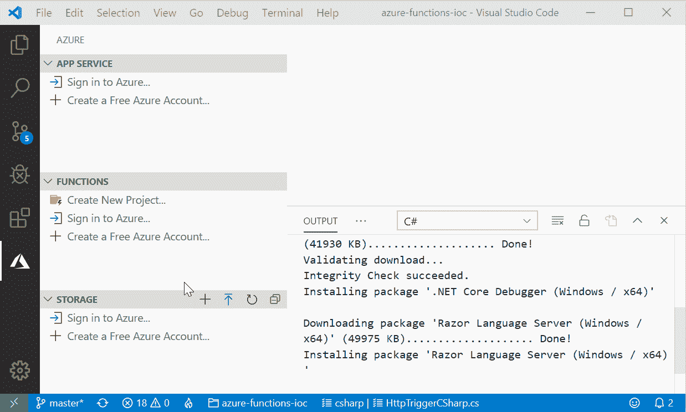
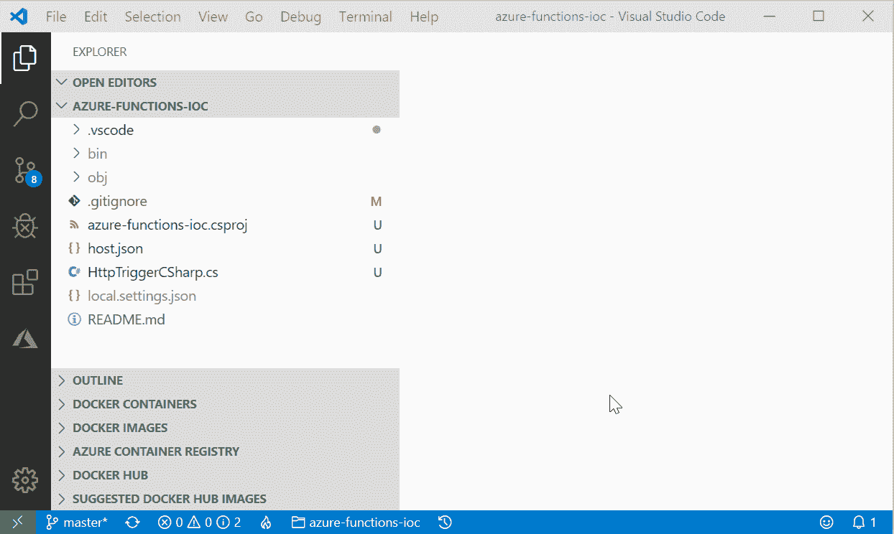
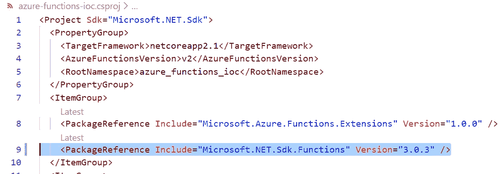
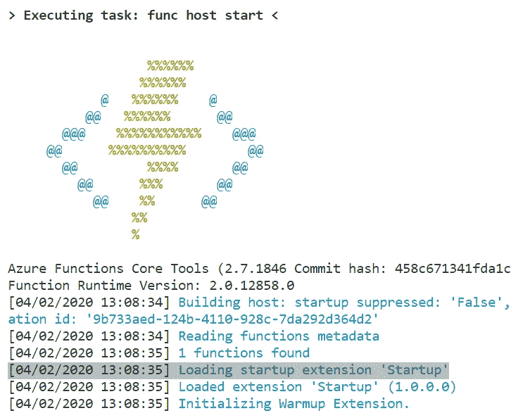
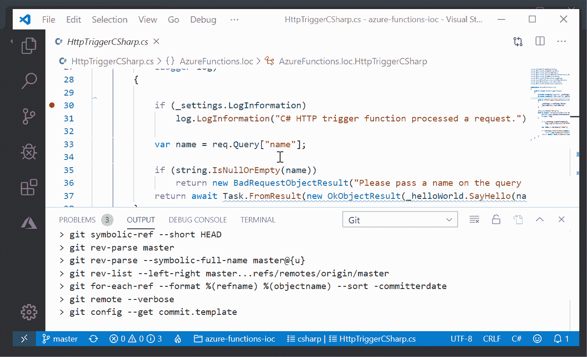

# Azure 函数中的控制反转(IoC)

> 原文：<https://itnext.io/inversion-of-control-ioc-in-azure-functions-110393662c61?source=collection_archive---------1----------------------->

无服务器计算和使用 Azure 函数不仅仅是写一个方法；在现实世界中，它还包括逻辑和架构。

Azure Functions 是微软 Azure 提供的无服务器计算服务之一。它们[易于扩展](https://docs.microsoft.com/en-us/azure/azure-functions/functions-scale)，此外，它们支持[各种触发器、绑定](https://docs.microsoft.com/en-us/azure/azure-functions/functions-triggers-bindings#supported-bindings)，你不需要为消费它们而支付[大量金钱](https://azure.microsoft.com/en-us/pricing/details/functions/)。

为了编写合适的软件，我需要遵循[坚实的](https://en.wikipedia.org/wiki/SOLID)原则和许多其他最佳实践。可测试性、抽象和[依赖倒置](https://docs.microsoft.com/en-us/dotnet/architecture/modern-web-apps-azure/architectural-principles#dependency-inversion)是必不可少的。使用 Azure 函数的无服务器计算仍然是编写应用程序。

在本文中，我解释了如何在 Azure 函数中实现依赖注入来实现 IoC。

完整的例子可以在我的 Github 上找到。

## 开始之前

您不需要拥有 Azure 帐户。您可以在本地机器上测试和运行项目。只需安装 [VSCode](https://code.visualstudio.com/Download) 、[vs code](https://marketplace.visualstudio.com/items?itemName=ms-azuretools.vscode-azurefunctions)和[的 Azure 函数扩展。NET SDK](https://dotnet.microsoft.com/download) 。

## 创建 Azure 函数项目

首先，创建一个新文件夹，并在其中打开 VSCode。在 VSCode 中，转到 Azure function extensions，并按照以下说明操作:

*   点击**新建项目**，选择当前文件夹作为项目文件夹。
*   选择 C# 作为项目的语言。
*   你需要挑一个**模板**做脚手架。对于本文，我使用 **Http 触发器**。
*   输入函数的名称和项目的命名空间。
*   定义访问类型；我选择匿名。



创建新的 AzureFunctions 项目

为了检查您的项目是否创建正确，您可以通过按下 **F5** 或者从**调试**菜单中选择**开始调试**来运行它。



在 VSCode 中运行 Azure 函数

要实现 IoC，安装[微软。带有 NuGet 的 Azure.Functions.Extensions](https://www.nuget.org/packages/Microsoft.Azure.Functions.Extensions/) 包。在 VSCode 终端中输入以下命令:

```
dotnet add package Microsoft.Azure.Functions.Extensions
```

并确保[微软。项目上的. NET.Sdk.Functions 包](https://www.nuget.org/packages/Microsoft.NET.Sdk.Functions/)为 1.0.28 或更高版本。为此，您可以检查项目的 CSProj 文件。



## 实现 IoC 并注册类型和服务

Azure 函数中的依赖注入是建立在。NET 核心依赖注入特性。但是，在如何覆盖依赖项和如何使用消费计划上的 Azure 函数读取消费计划上的配置值之间存在差异。对依赖注入的支持始于 Azure Functions 2.x。

创建一个名为 **Startup** 的新类文件。Azure 函数将使用这个类来配置 IoC 和服务。这个类的内容应该如下例所示:

*   **Startup** 类应该继承 **FunctionsStartup** 类。
*   它应该覆盖 Configure 方法以便能够配置您的 IoC。
*   用`[assembly: FunctionsStartup(type of strtup class)]`你定义的这个类的属性是启动类。如果你不指定这个属性，Azure 函数将找不到启动类。

正如您在代码中看到的，我注释了几个如何在其中注册服务和类型的例子。

Azure 函数提供了与 ASP.NET 依赖注入相同的服务生命周期。对于函数应用程序，不同的服务生命周期表现如下:

*   **瞬态**:瞬态服务是根据服务的每个请求创建的。
*   **作用域**:作用域服务生存期与函数执行生存期相匹配。每次执行都会创建一次作用域服务。稍后在执行期间请求该服务时，重用现有的服务实例。
*   **Singleton**:Singleton 服务生存期与主机生存期相匹配，并在该实例的函数执行中重用。对于连接和客户端，推荐使用单体生命周期服务，例如`SqlConnection`或`HttpClient`实例。

> *依赖注入容器只保存显式注册的类型*。唯一可作为可注入类型的服务是在`*Configure*`方法中设置的服务。因此，像`*BindingContext*`和`*ExecutionContext*`这样的函数特定类型在设置过程中不可用，也不能作为可注入类型。

现在，重新运行项目；在输出窗口中，你可以看到 Azure 函数可以找到 Startup 类。



如果它找到了启动，您应该会看到这条消息。

## 使用选项和设置

每个应用程序至少需要一些选项和设置。在 Azure Functions app 中，这些设置保存在 **local.settings.json** 文件中。

```
{
    "IsEncrypted": false,
    "Values": {
        "AzureWebJobsStorage": "",
        "FUNCTIONS_WORKER_RUNTIME": "dotnet",

        "AppInfo:Title": "Hello World",
        "AppInfo:LogInformation": false
    }
}
```

比如在我的 app 里，我定义了两个选项: **Title** 和 **LogInformation** 。为了处理这些值，我只需要创建一个名为 **AppInfo** 的类，并为它创建这些属性。

```
namespace AzureFunctions.Ioc.Configurations
{
    public class AppInfo
    {
        public string Title { get; set; }
        public bool LogInformation { get; set; }
    }
}
```

*您可以随意更改类名，但是类名应该与 JSON 文件中的选项相同。*

在启动类中，在配置方法中，需要注册配置类。以下代码注册项目的“AppInfo”设置:

```
builder.Services.AddOptions<AppInfo>()
    .Configure<IConfiguration>((settings, configuration)
     => configuration.GetSection("AppInfo").Bind(settings));
```

我有一个叫 HelloWorld 的服务。它只有一种打招呼的方法。在配置方法中注册服务。

```
builder.Services.AddTransient<IHelloWorld, HelloWorld>();
```

用以下代码替换 Azure 函数文件的内容:

构造函数注入用于使依赖关系在函数中可用。你可以在上面的例子中看到。



运行和调试的最终结果

## **结论**

我们学习了如何创建一个新的 Azure 函数，如何使用 IoC 向函数注入服务或设置。下一步是什么？你可以在微软文档上阅读更多关于 Azure 功能的最佳实践。