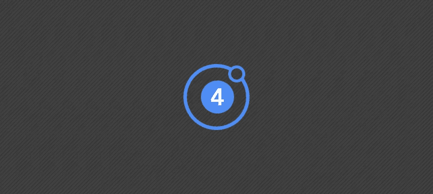
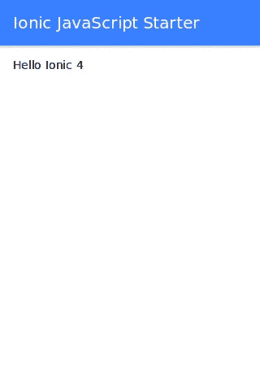
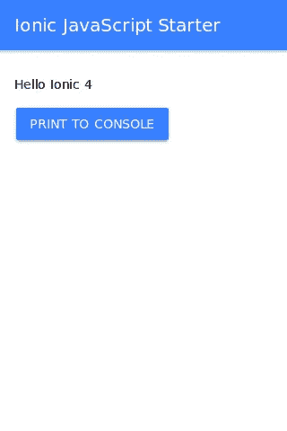
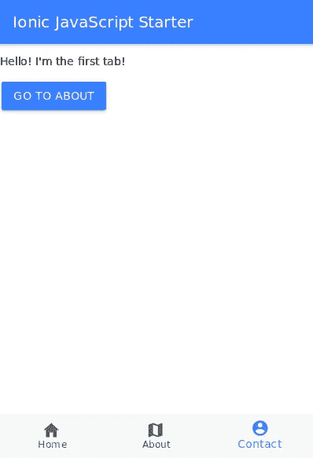

# Ionic 4 初学者教程:自定义元素，按钮，导航和标签

> 原文：<https://itnext.io/ionic-4-tutorial-for-beginners-custom-elements-buttons-navs-and-tabs-811fce159fe5?source=collection_archive---------4----------------------->



在本教程中，我们将学习如何使用最新版本的 Ionic——Ionic 4，现在是 alpha 版本。从 Ionic 4 开始，Ionic 是框架不可知的，这意味着你可以使用它与任何框架或根本没有人，即与普通 JavaScript 和现代网络浏览器支持的本地 web 组件(自定义元素)一起使用。

Ionic 4 组件现在正被移植到 web 组件上。你可以在任何支持 web 组件的地方使用它们，比如在所有主流的 web 浏览器中。

你可以使用 Ionic 4 和任何框架/语言(TypeScript，JavaScript，Stencil，Angular，React，Vue 或者 jQuery)。构建混合移动应用或者构建 PWAs(渐进式 Web 应用)是你的选择。

在本教程中，我们将使用普通 JavaScript 和 Ionic web 组件构建一个简单的应用程序，您可以通过添加基本的 PWA 功能将其作为 PWA，或者使用 Cordova 或 Capacitor(由 Ionic 团队构建的 Cordova 的现代替代产品)作为混合移动应用程序。

我们将专注于 Ionic web 组件，因此我们不会看到如何使用 Cordova 或 Capacitor，但您可以在完成本教程后继续学习这些教程:

*   [安古拉吉斯和科尔多瓦的爱奥尼亚 4 教程](https://www.techiediaries.com/ionic-angularjs/)
*   [带 Vue 的 Ionic 4 教程](https://www.techiediaries.com/ionic-vue/)
*   [使用带离子 3 的电容器](https://www.techiediaries.com/ionic-capacitor/)
*   [离子(离子 4+、PWAs、模板、电容器和电子)的再介绍](https://www.techiediaries.com/ionic-capacitor-stencil-pwa/)

现在，让我们开始第一步。让我们创建一个包含基本元素的 HTML 页面:

创建一个文件夹`ionic-javascript-template`，然后在其中创建文件`index.html`，并添加以下内容:

```
<html>

<head>
    <title>Ionic 4 JavaScript Template</title>
    <meta  name="viewport"  content="width=device-width, initial-scale=1.0, minimum-scale=1.0, maximum-scale=1.0, user-scalable=no">
</head>
<body>

    <script src="src/index.js"></script>
</body>
</html>
```

如果不想处理 Node.js，可以使用 [codesandbox.io](https://codesandbox.io/s/4wryq9xwl9) ，它为 JavaScript 和 Angular、React 等其他框架提供了一个在线代码环境。没有安装开发环境的麻烦。

你也可以用老方法使用普通的旧 JavaScript。为了 npm，我在这里使用 Node 来快速安装一些依赖项。

所以在你的项目文件夹中创建一个`package.json`，然后添加以下内容:

```
{
  "name": "ionic-javascript-template",
  "version": "1.0.0",
  "description": "Simple Ionic 4 Web Components Template",
  "main": "index.html",
  "scripts": {
    "start": "serve"
  },
  "dependencies": {},
  "devDependencies": {
    "serve": ""
  }
}
```

接下来运行以下命令来安装依赖项:

```
npm install
```

现在创建一个`src`文件夹，您可以在其中放置 JavaScript 文件。在它里面添加带有这个初始代码的`index.js`文件来打印著名的“hello world”消息。

```
document.body.innerHTML = `
<h1>Ionic 4 Web Components Template</h1>
<div>
  Hello World
</div>
`;
```

您有两个命令可以使用`npm start`和`npm build`。

所以打开一个终端窗口，运行`npm start`来打开一个开发服务器。然后，您可以在浏览器中打开`http://localhost:5000`，查看您的 JavaScript 应用程序启动并运行。

现在，让我们将重点放在实现 Ionic 4 web 组件上:

首先，您需要使用以下命令从 npm 安装`@ionic/core`包:

```
npm install --save @ionic/core
```

接下来，您需要在您的`index.html`文件中包含`node_modules/@ionic/core/dist/ionic.js`文件:

```
<script src='node_modules/@ionic/core/dist/ionic.js'></script>
```

现在让我们修改`src/index.js`以使用一些 Ionic 核心 web 组件:

```
document.getElementById("app").innerHTML  =  `

<ion-app>
    <ion-header>
        <ion-toolbar color='primary'>
        <ion-title>Ionic JavaScript Starter</ion-title>
        </ion-toolbar>
    </ion-header>
    <ion-content padding>
        Hello Ionic 4
    </ion-content>  
</ion-app>
`;
```

我们使用各种组件:

*   `<ion-app>` : App 是一个 Ionic 应用的容器元素。每个项目应该只有一个`<ion-app>`元素。一个应用程序可以有许多离子组件，包括菜单、页眉、内容和页脚。当叠加组件出现时，它们被附加到`<ion-app>`上。
*   `<ion-header>`
*   `<ion-toolbar>`
*   `<ion-title>`
*   `<ion-content>`

这是你应该得到的:



现在让我们添加一个按钮，并将其附加到某个操作:

对于按钮，您需要使用`<ion-button>`组件，因此在上一页`<ion-content>`中添加:

```
<ion-button id="printToConsole"> Print To Console </ion-button>
```

您的页面现在看起来是这样的:



现在，如何将一个动作附加到这个按钮上呢？您可以简单地使用事件监听器，但是首先您需要在 DOM 中查询 id 为 *printToConsole* 的按钮:

```
var printToConsoleBtn = document.querySelector("#printToConsole");
```

接下来使用`addEventListener()`将 click 事件附加到一个简单的处理程序，该处理程序打印到控制台。

```
printToConsoleBtn.addEventListener('click',(e)=>{   console.log("Button clicked!");
});
```

# 使用 Nav 组件添加导航

现在让我们看看如何实现一些稍微高级的东西，在多个页面之间导航。

我们首先需要创建一些页面作为 web 组件:

# 创建主页/Web 组件

打开`src/index.js`并添加以下代码:

```
customElements.define('app-home', class  extends  HTMLElement {
    constructor() {
        super();
    }
    connectedCallback() {

        this.innerHTML  =  `
            <ion-header>
            <ion-toolbar color='primary'>
                <ion-title>Ionic JavaScript Starter </ion-title>
            </ion-toolbar>
            </ion-header>
            <ion-content padding>
                <p>This is home!</p>
            </ion-content>
        `;
    }
});
```

# 创建一个关于网页/网页组件

在同一个文件`src/index.js`中使用以下代码定义*页面-关于* web 组件:

```
customElements.define('app-about', class  extends  HTMLElement {
    constructor() {
        super();
    }

    connectedCallback() {

        this.innerHTML  =  `
            <ion-header>
            <ion-toolbar color='primary'>
            <ion-title>Ionic JavaScript Starter</ion-title>
            </ion-toolbar>
            </ion-header>
            <ion-content>
            <p>
            Welcome to the Ionic JavaScript Starter.
            You can use this starter to build Mobile/PWA applications with
            web components using JavaScript and ionic/core!
            </p>
            <ion-button id="backBtn">Go Back</ion-button>
            </ion-content>
        `;
        }
    });
```

现在我们已经创建了组件。让我们在它们之间创建导航。我们将使用`<ion-nav>`组件。

```
document.body.innerHTML  =  `

<ion-app>
    <ion-nav></ion-nav>
</ion-app>
`;
```

我们需要设置一个根组件作为导航堆栈的第一个组件来加载，因为堆栈不能为空。为此，我们需要首先等待导航组件准备就绪，因此我们将在 *onload* 事件中执行以下代码。

```
document.body.onload = init();
```

现在让我们定义`init()`函数:

```
async  function  init() {
    const  nav  =  document.querySelector('ion-nav');
    await  nav.componentOnReady();
    nav.root  =  'app-home';
}
```

我们将函数*设为异步*，这样我们就可以使用 *await* 关键字来等待返回承诺的 *componentOnReady()* 方法。当组件准备就绪时，我们将`<ion-nav>`组件的*根*(我们使用 *querySelector()* DOM API 获取的)设置到 *app-home* web 组件。

现在，让我们向主页添加一个按钮，以便能够导航到 about 页面

```
<ion-nav-push id="navPush" component="">
    <ion-button class="next">Go to About</ion-button>
</ion-nav-push>
```

我们需要等待组件准备就绪，然后再设置要推送的组件，因此在 *connectedCallback()* 方法中添加以下代码

```
const  navPush  =  this.querySelector('#navPush');
await  navPush.componentOnReady();
navPush.component  =  "app-about";
```

我们正在使用 *await* 关键字，因此请确保在 *connectedCallback()* 之前添加 *async* 。

接下来，让我们在 *app-about* 方法中添加一个返回按钮，返回到主页:

```
<ion-nav-pop>
    <ion-button>Go Back</ion-button>
</ion-nav-pop>
```

概括地说，我们使用各种 Ionic 核心组件来实现一个简单的导航系统:

*   `<ion-nav>`:导航的主要部件。它代表一个导航栈。这个组件需要一个根组件作为第一个组件来加载。
*   `<ion-nav-push>`:该组件推送导航栈中的一个组件。
*   `<ion-nav-pop>`:该组件从导航栈中弹出一个组件。
*   组件有一个`componentOnReady()`方法，当组件准备好时发出信号。
*   Ionic 组件只能与 web 组件一起工作，所以你需要使用现代浏览器上可用的`customElements.define()`方法来创建任何新页面。

# 使用选项卡组件

在上一节中，我们实现了一个带有根/推/弹出操作的简单导航模式。现在让我们使用选项卡进行更高级的导航。

首先，我们创建一个名为`app-tabs`的定制元素:

```
customElements.define('app-tabs',class  TabsPage  extends  HTMLElement {

    async  connectedCallback() {
        this.innerHTML  =  ``;
    }
}
```

接下来，创建选项卡容器组件

```
<ion-tabs></ion-tabs>
```

在其中，您可以使用`<ion-tab>`添加多个选项卡。让我们创建三个选项卡

```
<ion-tab label='Home' icon='home'>
<!-- tab content here -->
</ion-tab>
<ion-tab label='About' icon='map'>
<!-- tab content here -->
</ion-tab>
<ion-tab label='Contact' icon='contact'>
<!-- tab content here -->
</ion-tab>
```

对于每个选项卡，我们可以指定标签和图标。对于内容，您可以添加内联内容，或者使用`<ion-nav>`组件加载另一个组件/页面作为根。

对于前两个选项卡，我们加载“主页”和“关于”组件。把这段 HTML 代码

```
<ion-tab label='Home' icon='home'>
    <ion-nav class="tab-one-nav"></ion-nav>
</ion-tab>

<ion-tab label='About' icon='map'>
    <ion-nav class="tab-two-nav"></ion-nav>
</ion-tab>
```

接下来，让我们为每个选项卡导航堆栈设置根组件:

```
async  connectedCallback() {

    this.innerHTML  =  ``;

    const  navOne  =  this.querySelector('.tab-one-nav');
    await  navOne.componentOnReady();
    await  navOne.setRoot('app-home');
    const  navTwo  =  this.querySelector('.tab-two-nav');
    await  navTwo.componentOnReady();
    await  navTwo.setRoot('app-about');
}
```

对于最后一个选项卡，我们使用内嵌内容来创建选项卡的布局:

```
<ion-tab label='Contact' icon='contact'>
    <ion-header>
        <ion-toolbar color='primary'>
        <ion-title>Ionic JavaScript Starter</ion-title>
    </ion-toolbar>
    </ion-header>
    <ion-content>
        <p>Hello! I'm the third tab!</p>
    </ion-content>
</ion-tab>
```

然后，您可以将`app-tabs`组件设置为主导航组件的根，而不是主组件的根:

```
async  function  init() {
    const  nav  =  document.querySelector('ion-nav');
    await  nav.componentOnReady();
    nav.root  =  'app-tabs';
}
```



# 结论

在本教程中，我们已经了解了如何使用各种 Ionic 4/Core 组件，如标签、导航和按钮。在接下来的教程中，我们将关注其他组件，如菜单和离子路由器。您可以在这个[库](https://github.com/techiediaries/ionic-javascript-starter)中找到源代码。

*最初发表于*[](https://www.techiediaries.com/ionic-4-tutorial/)**。**