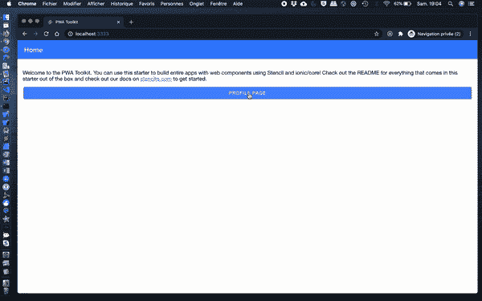
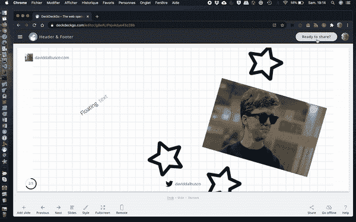
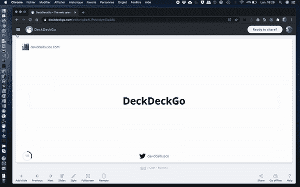
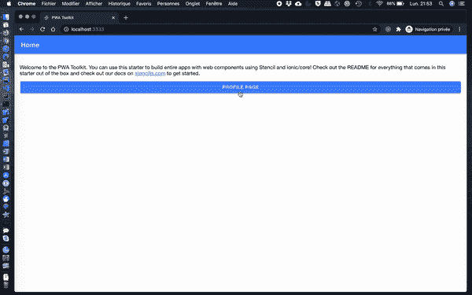

# Ionic:全屏模式和菜单弹出窗口

> 原文：<https://itnext.io/ionic-fullscreen-modal-menu-popover-545c66d8e17b?source=collection_archive---------2----------------------->

## 如何让离子模式变成全屏，弹出窗口充当菜单


在 [Unsplash](https://unsplash.com/?utm_source=unsplash&utm_medium=referral&utm_content=creditCopyText) 上由 [Dino Reichmuth](https://unsplash.com/@dinoreichmuth?utm_source=unsplash&utm_medium=referral&utm_content=creditCopyText) 拍摄的照片

Ionic 不仅是一款为移动设备打造的令人惊叹的设计系统，在桌面上也能发挥出色的作用。因为这个原因，我们在 DeckDeckGo 使用它。

当我们开发我们的演示编辑器时，我们实现了下面两个技巧，我将与你分享，我希望有一天对你也有用。

# 全屏模式

开箱即用，无论应用哪个平台的风格，只要你的浏览器达到 768x600 像素的大小，离子模态就不再全屏显示，而是作为一个居中的弹出窗口。



虽然这可能适合几乎所有的用例，但可能有一个用例需要全屏模式。事实上，您可能希望向用户显示多个信息，因此需要空间，但可能不希望在历史堆栈中添加页面。

例如，使用我们的编辑器编辑幻灯片的用户可以将幻灯片作为渐进式网络应用程序发布。根据要求，我们将他们的演示文稿打包到 PWAs 中，并在网上发布。因为这是一个用户必须明确触发的过程，所以我们决定用模态而不是导航来呈现所有信息，避免可能的来回错误😇。



假设你不想让所有的模态都全屏显示，而只是一些模态，我建议我们在 CSS 类选择器的帮助下设置模态样式，我们可以应用 CSS 类选择器，如[文档](https://ionicframework.com/docs/api/modal)所示。

角度:

```
async presentModal() {
  const modal = await this.modalController.create({
    component: ModalPage,
    cssClass: 'fullscreen'
  });
  await modal.present();
}
```

模具:

```
async presentModal() {
  const modal = await modalController.create({
    component: 'app-page-modal',
    cssClass: 'fullscreen'
  });
  await modal.present();
}
```

反应:

```
<IonModal isOpen={showModal} cssClass="fullscreen">
 <PageModal></PageModal>
</IonModal>
```

Vue:

```
<script>
import Modal from './modal.vue'

export default {
  methods: {
    openModal() {
      return this.$ionic.modalController
        .create({
          component: Modal,
          cssClass: 'fullscreen'
        })
        .then(m => m.present())
    },
  },
}
</script>
```

样式`.fullscreen`应该在应用程序级别定义，并且在层次结构中不能高于`ion-app`，因为模态将被注入到 DOM 中的`ion-modal`元素中，这些元素是应用程序容器的直接后代。例如，在我们的模板应用程序中，我在`app.css`中定义了它，或者在 React 应用程序中，我在`App.tsx`中导入的样式表中定义了它。

它应包含应用全屏尺寸(宽度/高度)的信息，并指示不应使用圆角显示模态。

```
ion-modal.fullscreen {
  --width: 100%;
  --height: 100%;
  --border-radius: 0;
}
```

就这样，不多不少😄。

# 弹出式菜单

不确定其他人是否真的会有下面的需求，但是你可能需要一个菜单，就像我们在 DeckDeckGo 中做的那样，这个菜单不依赖于导航，也不依赖于`ion-menu`。

例如，当用户编辑幻灯片时，我们必须找到一个显示选项而不隐藏所有内容的解决方案。尽管我们可以为此开发一个自定义弹出窗口，但我们认为重用 Ionic popover 会更好。我是说，看看开场时引发的流汗动画🤩。



正如上一章关于模态的内容一样，我假设我们可能只想在应用程序的特定 popovers 上应用这种效果，这就是我们再次使用 CSS 样式类的原因。此外，我们还想明确地使用模式`md`来给弹出窗口一个“平面”风格，并避免显示背景。这最后一点不是强制性的，但是如果你希望你的用户仍然能够清楚地看到“弹出菜单”旁边的内容，这一点是有意义的。

角度:

```
async presentPopover() {
  const popover = await this.popoverController.create({
    component: PopoverPage,
    cssClass: 'menu',
    mode: 'md',
    showBackdrop: false
  });
  await popover.present();
}
```

模具:

```
async presentPopover() {
  const popover = await popoverController.create({
    component: 'app-page-popover',
    cssClass: 'menu',
    mode: 'md',
    showBackdrop: false
  });
  await popover.present();
}
```

反应:

```
<IonPopover
    isOpen={showPopover}
    cssClass="menu"
    mode="md"
    showBackdrop={false}>
 <PagePopover></PagePopover>
</IonPopover>
```

Vue:

```
<script>
import Popover from './popover.vue'export default {
  methods: {
    openPopover() {
      return this.$ionic.popoverController
        .create({
          component: Popover,
          cssClass: 'menu',
          mode: 'md',
          showBackdrop: true
        })
        .then(m => m.present())
    },
  },
}
</script>
```

我们在应用程序的根级别定义样式，因为`ion-popover`元素是作为主`ion-app`元素的直接子元素添加的。

我们设置一个宽度，例如`540px`，和一个最大值，因为我们也想适合更小的设备。

```
ion-popover.menu {
  --width: 540px;
  --max-width: 100%;
}
```

由于这个定义，我们能够改变弹出窗口的宽度，但是，我们还不能设置正确的位置，屏幕的右侧，并指定一个覆盖所有窗口的高度。



尽管我们将要实现我们的目标，但我不得不说，不幸的是，这只有在臭名昭著的`!important`选择器的帮助下才有可能。不久前，我打开了一个关于它的[功能请求](https://github.com/ionic-team/ionic-framework/issues/15036)，这是很少使用的建议之一，解决方案应该来自社区，在我看来是有意义的。不幸的是，我还没有时间提供一个拉请求，也许有一天。

同时，让我们使用下面的样式。首先，我们将 popover 设置在右上方，我们还变换了它的原点来匹配这个位置。此外，我们将默认高度设置为`100%`以匹配屏幕，并添加一些严格的样式，如定义背景和灯箱阴影。

```
ion-popover.menu div.popover-content {
  top: 0 **!important**;
  left: inherit **!important**;
  right: 0;

  transform-origin: right top **!important**;

  --min-height: 100%;

  background: white;

  box-shadow: -8px 0 16px rgba(0, 0, 0, 0.12);
  border-radius: 0;
}
```

就是这样，我们的 popover 可以作为一个菜单😃。


# 结论

为您的下一个演示尝试一下 [DeckDeckGo](https://deckdeckgo.com) ，如果您准备改进这些风格或有任何其他建议，请与我们在 [GitHub](https://github.com/deckgo/deckdeckgo/) 的项目合作，我们欢迎任何贡献和想法。

到无限和更远的地方！

大卫