# WWDC 2021 iOS 15-UISheetPresentationController 上的搞笑把戏

> 原文：<https://itnext.io/ios-15-uisheetpresentationcontroller-d469d144a520?source=collection_archive---------1----------------------->

## 带有两个制动器的新型演示控制器

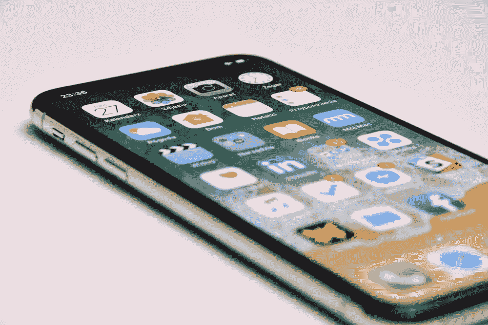

在 2021 年 WWDC 奥运会上，苹果公司发布了许多 iOS 和 Swift 编程语言的新更新。其中一个引人注目的 UI 增强是`UISheetPresentationController`。它为展示一个`UIViewController`提供了一种全新的方式。它可以以半屏或全屏模式显示。您还可以自定义圆角半径、抓取器可见性和紧凑模式下显示的 UI 等。

在测试新的`UISheetPresentationController`的过程中，我遇到了关于`UIViewController`的**生命周期**和**背景**的两个有趣棘手的部分，我将在这篇博文中与你分享。让我们开始吧。

# 简单设置

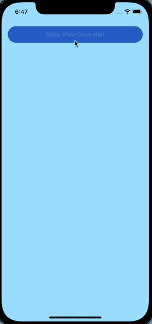

简单 UISheetPresentationController

对于一个`UISheetPresentationController`来说，最简单的设置就是配置它的`detents`属性来支持`medium`属性。见第 7 行。

默认情况下，`UISheetPresentationController`只配置一个卡位— `large`一个。这意味着呈现的`UIViewController`将会像 iOS 14 或之前版本中呈现的一样呈现。它几乎占据了所有的屏幕高度。

为了以半屏方式显示所呈现的`UIViewController`，我们必须在`UISheetPresentationController`的`detents`参数中添加另一个`detent` — `medium`。`detents`中的第一个元件是`UISheetPresentationController`的默认卡位。

# 棘手的部分 1)怪异的 UIViewController 生命周期

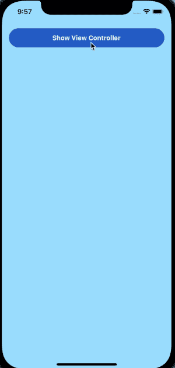

展示所展示的`UIViewController`生命周期的动画

正如上面的 gif 动画中突出显示的，当出现的`UIViewController`处于`medium`卡位时，一旦用户向下拖动抓取器，就会触发`[viewWillDisappear](https://developer.apple.com/documentation/uikit/uiviewcontroller/1621485-viewwilldisappear)`回调。然而，当用户松开他/她的手指时，`[viewDidAppear](https://developer.apple.com/documentation/uikit/uiviewcontroller/1621423-viewdidappear)`回调被触发，呈现的`UIViewController`返回到其`medium` 卡位。

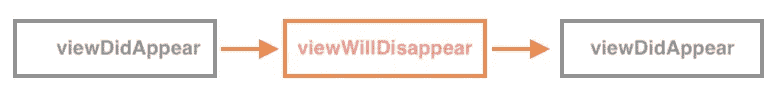

换句话说，你必须记住在`[viewDidAppear](https://developer.apple.com/documentation/uikit/uiviewcontroller/1621423-viewdidappear)`回调中是否包含任何逻辑，因为它可以在一个演示中被多次**触发。**

> *根据苹果官方文档*:
> 
> `[*viewWillDisappear*](https://developer.apple.com/documentation/uikit/uiviewcontroller/1621485-viewwilldisappear)`被调用以响应从视图层次结构中删除的视图。在实际移除视图和配置任何动画之前，调用此方法。
> 
> `[*viewDidAppear*](https://developer.apple.com/documentation/uikit/uiviewcontroller/1621423-viewdidappear)` *通知*视图控制器它的视图被添加到了一个视图层次中。

# 添加一个抓取器

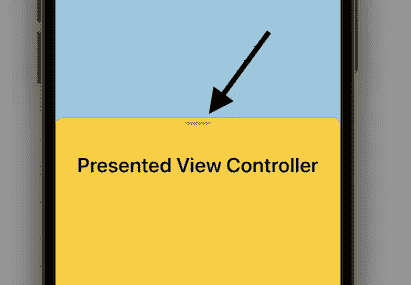

强夺者

抓取器是一个小的灰色圆形`UIView`，位于显示的`UIViewController`的顶部(在上面的截图中突出显示)，告诉用户这是一个可拖动的工作表。在我看来，当`medium`和`large`制动器都被设置时，这是一个很好的小部件，这意味着有半展开和完全展开的状态。

然而，苹果不允许开发者定制抓取器的颜色和尺寸。它必须是灰色的。

# 在嵌入式 UIScrollView 视图中启用滚动

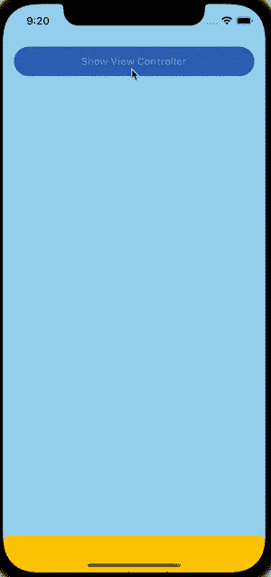

当你在呈现的`UIViewController`中增加一个竖线`UIScrollView`时，你会发现当`UISheetPresentationController`处于`medium`卡位时，`UIScrollView`处的滚动动作会被`UISheetPresentationController`拦截。换句话说，`UIScrollView`只有在`UISheetPresentationController`处于`large`卡位时才可以滚动。

因此，我们必须将`prefersScrollingExpandsWhenScrolledToEdge`设置为`true`，以使用户能够在`medium`卡位处使用`UIScrollView`。

# 用户与呈现的 UIViewController 的交互

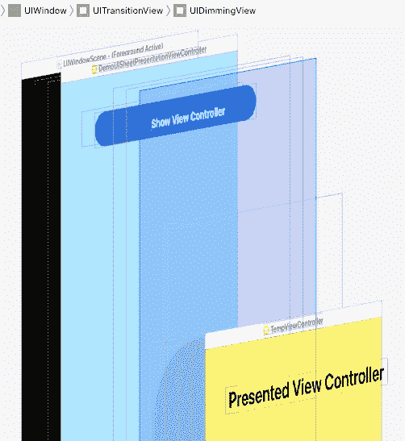

UIDimmingView 被添加到视图层次结构中

默认情况下，当呈送`UISheetPresentationController`处于`middle`卡位时，呈送`UIViewController`将被`UIDimmingView`包裹。当用户点击`UIDimmingView`时，所显示的`UIViewController`将同时消失。

但是，当您想要移除此`UIDimmingView`并允许用户在呈现`UIViewController`时与小部件交互时，您可以将`largestUndimmedDetentIdentifier`设置为`medium`。

# 刀尖圆弧半径

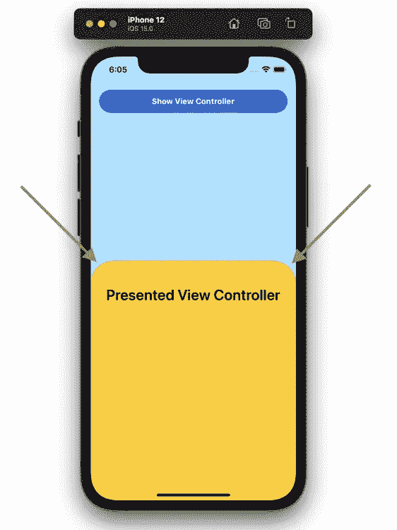

拐角半径设置是指所呈现的`UIViewController`的左上角和右上角。默认值是`10.0`点。设置这个属性是不言而喻的，但是当背景颜色包含透明度时，底层的 UI 变化可能会在呈现的`UIViewController`上引起一个棘手的问题。见下文。

## 棘手的部分 2)在一个水滴视图中的怪异阴影？

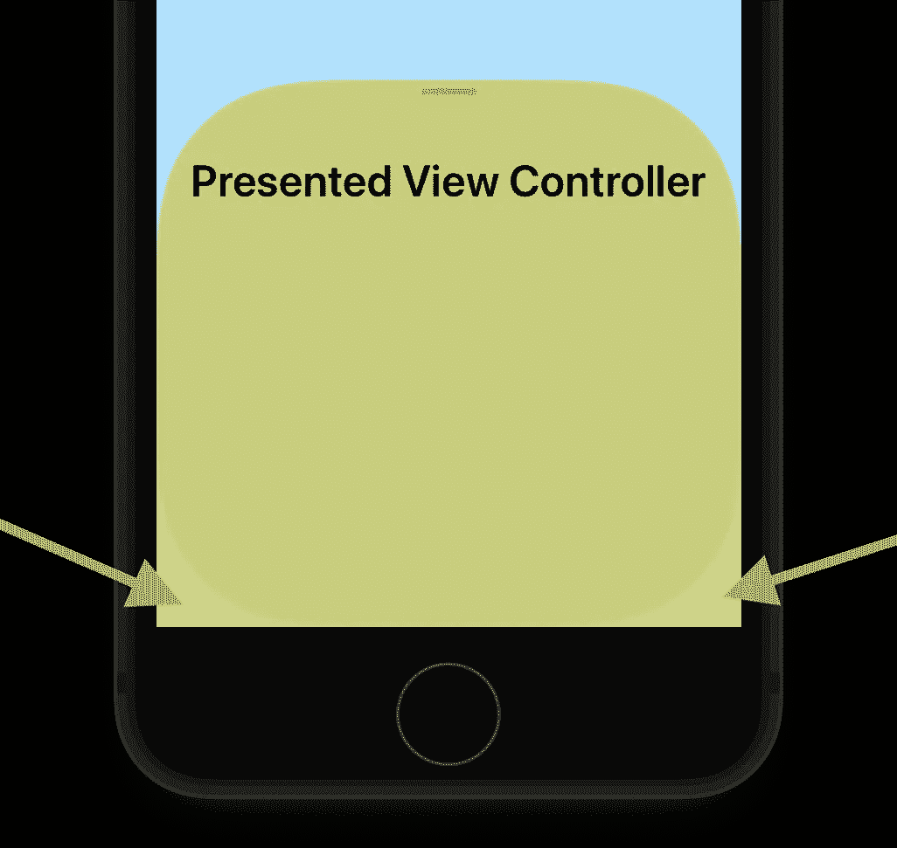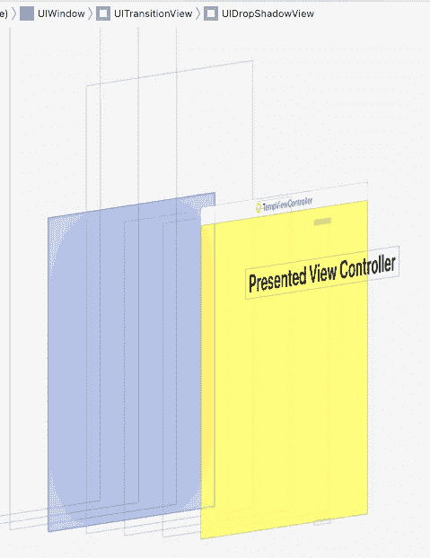

在显示的`UIViewController`下方有一个`UIDropView`，默认为灰色。如果你自定义拐角半径，它也改变了`UIDropView`的拐角半径，并因此导致异常明亮的左下角和右下角，在上图中用绿色箭头突出显示。由于`UIDropView`在 iOS SDK 中是私有的，所以没有用于配置它的公共 API。我希望苹果能解决这个问题，或者在未来发布一个新的 API 来设置它😉！

# 用漂亮的动画改变选定的棘爪

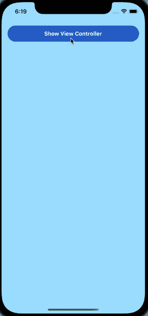

默认情况下，`UISheetPresentationController`配置的所有变化不会产生任何动画。例如，改变`selectedDetentIdentifier`只会导致呈现的`UIViewController`立即改变其大小。见 gif 左边部分。

为了提供更好的用户体验，我们应该将更改配置的代码包装在`animateChanges`回调中。iOS 将为我们处理动画。

# iPhone 紧凑型(水平)模式下的操作

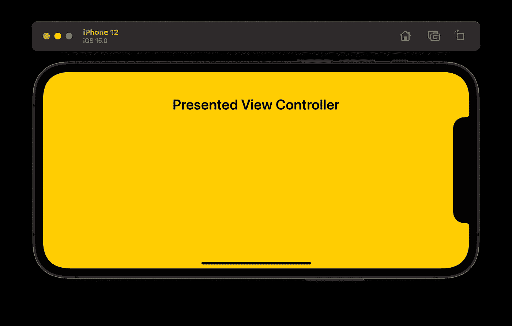

prefersegeattachindcompactheight = false

iPhone compat 模式下会发生什么？没有`middle`卡位，呈现的`UIViewController`将以全屏模式呈现。见上图。即使用户在`UIViewController`区域内向下滚动，也不会被拖动或取消。建议在显示的`UIViewController`上增加一个解除按钮。

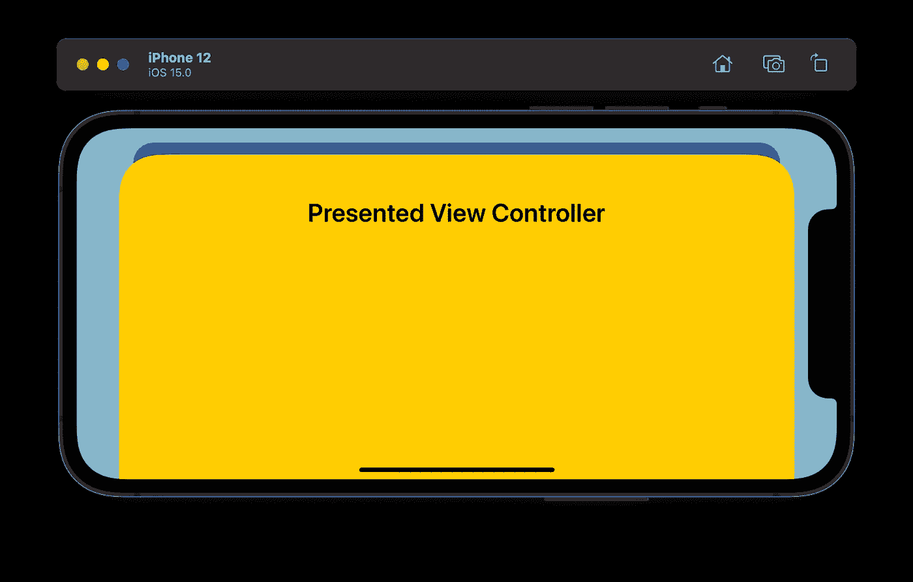

prefersegeattachindcompactheight = true

那么，如果我们想为用户提供一个拖放功能来提供更好的用户体验呢？我们可以简单地启用`prefersEdgeAttachedInCompactHeight`属性，呈现的`UIViewController`将被放置在安全区域内。见上面截图。

# uisheetepresentationcontrollerdelegate

我们如何管理用户选择的当前卡位？你想在不同的卡位模式下显示不同的部件吗？苹果为应用程序提供了`UISheetPresentationControllerDelegate`来获得通知。

> 根据苹果[官方文档](https://developer.apple.com/documentation/uikit/uisheetpresentationcontrollerdelegate/3801914-sheetpresentationcontrollerdidch):
> 
> 在工作表的[selectedDetentIdentifier](https://developer.apple.com/documentation/uikit/uisheetpresentationcontroller/3801908-selecteddetentidentifier)响应用户交互而改变后，系统调用该方法。在您以编程方式更改了`selectedDetentIdentifier`之后，系统不会调用这个函数。

❗️Be 意识到处理的情况下，选定的卡位是改变了应用程序，而不是用户！

# 摘要

`UISheetPresentationController`是一种新型的`UIPresentationController`，用于将`UIViewController`以片状呈现。以下是属性:

1.  两个受支持的制动器—中型和大型
2.  抓取能见度
3.  启用/禁用中等卡位的可滚动`UIScrollView`
4.  将`UIViewController`呈现在中间卡位时的用户交互
5.  刀尖圆弧半径
6.  改变`UISheetPresentationController`配置时的动画
7.  紧凑模式下的用户界面

在使用`UISheetPresentationController`时发现了两个棘手的部分:

1.  `viewDidAppear`在单个演示文稿中可以多次调用回调
2.  一个`UIDropView`放置在所展示的`UIViewController`下方。当定制拐角半径时，`UIDropView`的拐角会在所显示的`UIViewController`的背景上出现异常阴影。

# 参考

 [## 在 ui kit-wwdc 21-Videos-Apple Developer 中自定义和调整表单大小

### 了解如何在 UIKit 中创建分层和定制的表单体验。我们将探索如何构建一个…

developer.apple.com](https://developer.apple.com/videos/play/wwdc2021/10063/)  [## UISheetPresentationController—Apple 开发者文档

developer.apple.com](https://developer.apple.com/documentation/uikit/uisheetpresentationcontroller)