# iOS —带有 UIPageViewController 的自定义 UIPageControl

> 原文：<https://itnext.io/ios-custom-uipagecontrol-with-uipageviewcontroller-2d02db5ab090?source=collection_archive---------0----------------------->

## UIPageControl 通常与 UIPageViewController 或分页 UIScrollView 一起使用。比如 Instagram。我们能把它定制得尽可能优雅吗？😉

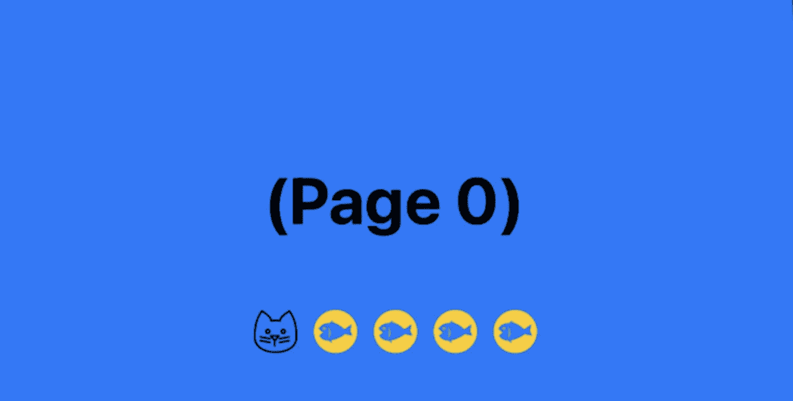

具有自定义色调颜色和图像源的 UIPageControl

U IPageControl 是一个显示一系列水平点的控件，每个点对应于应用程序文档或其他数据模型实体中的一个页面。它通常与一个`UIPageViewController`或一个分页`UIScrollView`一起工作。默认的`UIPageControl`只将页面指示器显示为不同不透明度的白色圆圈。

默认 UIPageControl 布局

iOS 框架为我们定制`UIPageControl`提供了不同的参数。它们包括当前页面和其他页面的指示器色调颜色和图像。

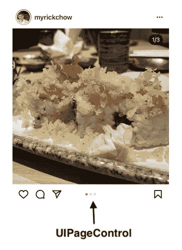

iOS Instagram 应用程序中的 UIPageControl

我们需要添加一个自定义协议来连接一个`UIPageControl`和一个`UIPageViewController`。这有点棘手，我将在这里分享一步一步的指示！

# 先决条件

UIPageViewController 的基本实现

由于这个故事的长度，一个基本的`UIPageViewController`的实现将不在本文中讨论。欢迎您先阅读[我的文章](https://myrickchow.medium.com/ios-uipageviewcontroller-easy-dd559c51ffa)中关于`UIPageViewController`的内容，对工作流程有一个基本的了解。

 [## iOS UIPageViewController —简单！！！

### UIPageViewController 是当今许多现代应用程序中常用的小部件。一个著名的例子是应用程序列表页面，位于…

myrickchow.medium.com](https://myrickchow.medium.com/ios-uipageviewcontroller-easy-dd559c51ffa) 

# 循序渐进的教程

## **步骤 1)** 将`UIPageControl`小工具添加到您的`UIViewController`并连接到`IBOutlet`

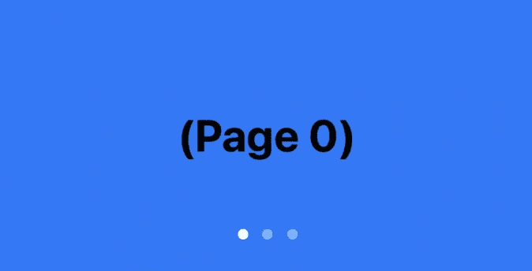

向用户界面添加 UIPageControl 小部件

## **步骤 2)** 设置自定义指标图片

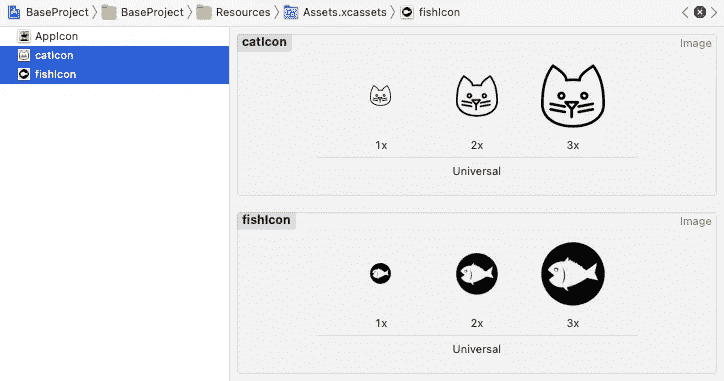

页面指示器的两组图标

我们可以为指示器图像添加两组图像——一组用于当前页面，一组用于其他页面。

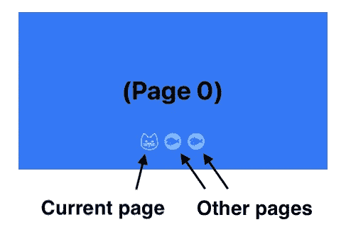

设置指标图像来源后的用户界面

> 提示:确保图标图像有一个透明的背景，因为那些不透明的 **像素**会被加上一点颜色。

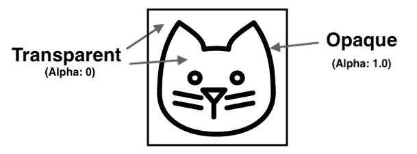

猫脸和背景都是透明的；轮廓是不透明的，并受到色调的影响

## **第 3 步)**将浅色应用于指示器图像

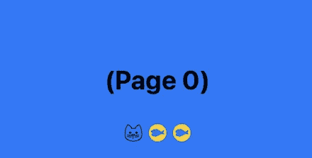

应用浅色后的用户界面

## **步骤 4)** 从`UIPageViewController`到`UIPageControl`的通过事件

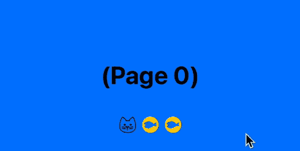

UIPageControl 无法响应 UIPageViewController 事件

此时，`UIPageControl`无法对`UIPageViewController`中页面的变化做出反应。正如你在上面的 gif 中看到的，即使`UIPageViewController`已经换到另一页，黑猫图标仍然停留在首页的指示器上。

我们需要用自定义协议将它们连接起来，以便将事件从`UIPageViewController`传递到`UIPageControl`。

`CustomPageViewControllerDelegate`中有两个功能:

1.  `numberOfPage`:通知`DemoViewController`在`UIPageViewController`显示的`UIViewController`(页面)的编号已经更新，因此`UIPageControl`也要相应更新。

> 确保`*customDelegate*`被标记为`*weak*`以防止自动引用计数(ARC)问题，即`*MainViewController*`实例和`*CustomPageViewController*`实例都存储另一个实例的引用，并且实例不能从内存中释放。

2.`pageChangedTo`:通知`DemoViewController`可见的`UIViewController`(页面)变为另一个。应该更新`UIPageControl`的`currentPage`属性。

## **步骤 5)** 在`DemoViewController`执行`CustomPageViewControllerDelegate`

我们需要做的第一件事是通过`prepareForSegue`回调获取`CustomPageViewController`实例，同时设置`customDelegate`。

之后，我们需要更新`UIPageControl`实例的`numberOfPages`和`currentPage`属性。

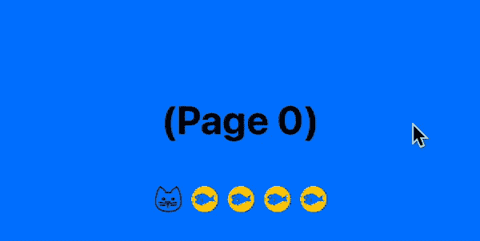

UIPageControl 现在可以对 UIPageViewController 事件做出反应

## **步骤 6)** 修复当前页面指示器图像

正如您在上面的 gif 中所看到的，您可以看到当前页面指示器被正确地高亮显示，但图像源没有。因此，一旦页面发生变化，我们需要再次调用`setIndicatorImage`:

> 确保您同时重置了页面指示器的色调，以防止 UI。此外，在设置指示器图像源之前，必须设置色调。
> 参考: [iOS 14 UIPageControl 未选中的页面被视为当前页面—堆栈溢出](https://stackoverflow.com/questions/64998704/ios-14-uipagecontrol-unselected-page-are-treated-as-currentpage)

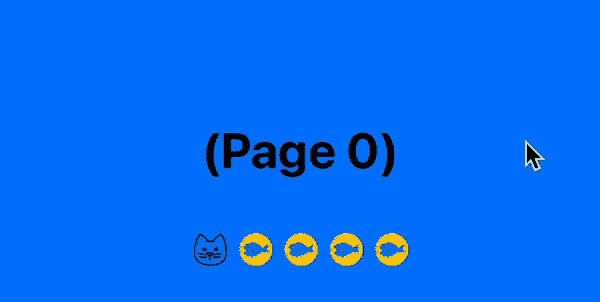

根据 UIPageViewController 中更新的页面索引，更新每个指示器的色调和图像来源

## **步骤 7)** 处理`UIPageControl`上的点击拖动动作

苹果从 iOS 14 开始更新`UIPageControl`。它现在可以:

1.  可点击，并根据点击是在框架的左半部分还是右半部分来切换当前页面。

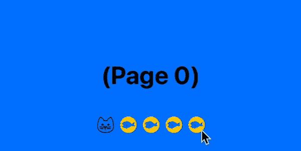

UIPageControl 是可点击的，当前指示器相应地改变

> App 可以通过将`UIPageControl`的`isUserInteractionEnabled`属性设置为`false`来禁用点击功能

2.长按并显示一个突出的弹出窗口，用户可以通过在框架上滑动来改变页面。

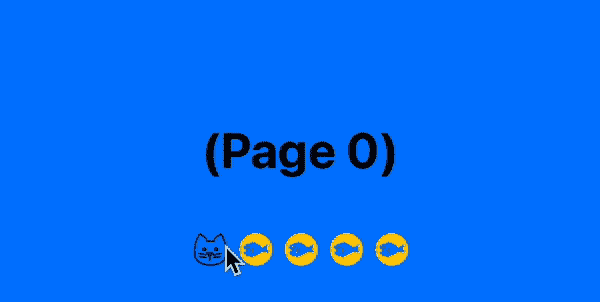

长按后会显示一个突出的弹出窗口；用户可以通过拖动来更新所选页面

> App 可以通过将`UIPageControl`的`backgroundStyle`设置为`minimal`来禁用突出弹出功能。

因此，我们需要为`UIPageControl`添加一个`ValueChanged`连接，并通知`UIPageViewController`用户想要改变当前可见的页面。

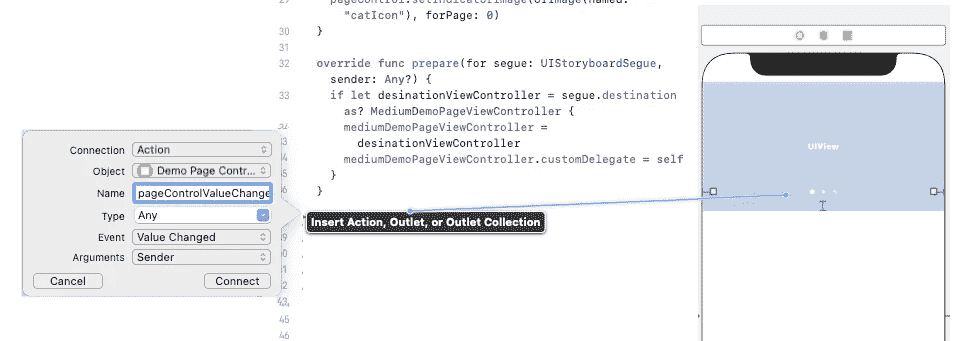

在 UIPageControl 和 UIViewController 之间添加一个`ValueChanged`连接

最后，我们可以在`CustomPageViewController`创建一个函数来相应地更新可见页面。

耶！！！我们已经完成了一个自定义`UIPageControl`的实现！

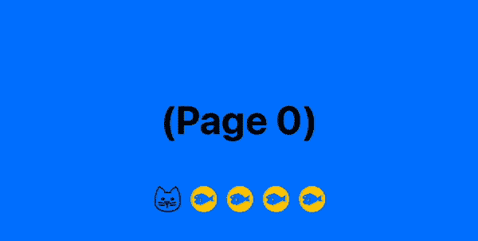

一个完美的 UIPageControl 的最终结果

# 摘要

`UIPageControl`是一个可爱的小部件，用于显示`UIPageViewController`或分页`UIScrollView`的页面信息。将它们联系在一起需要:

1.  从`UIPageViewController`到`UIPageControl`传递当前页面的页数和索引的自定义协议
2.  一个`ValueChanged`到`UIPageControl`的连接，通知`UIPageViewController`用户想要更新当前可见的页面

如果`UIPageControl`的突出弹出窗口不符合你的 UI/UX 需求，开发者可以手动禁用它。

# 阅读更多—资源和参考

 [## iOS UIPageViewController —简单！！！

### UIPageViewController 是当今许多现代应用程序中常用的小部件。著名的例子是应用程序列表页面…

myrickchow.medium.com](https://myrickchow.medium.com/ios-uipageviewcontroller-easy-dd559c51ffa)  [## UIPageControl | Apple 开发者文档

### 显示一系列水平点的控件，每个点对应于应用程序文档或其他数据模型实体中的一个页面

developer.apple.com](https://developer.apple.com/documentation/uikit/uipagecontrol) 

感谢您阅读这篇文章。希望你觉得有趣和有用！
欢迎您关注我，并通过以下渠道与我联系:

1.  [Twitter @ myrik _ chow](https://twitter.com/myrick_chow)
2.  [YouTube @ myrick show](https://www.youtube.com/channel/UC_UEqZPDms3rtX5W-m9hgxg)
3.  [LinkedIn @ myrik Chow](https://www.linkedin.com/in/myrick-chow-720b34118/)