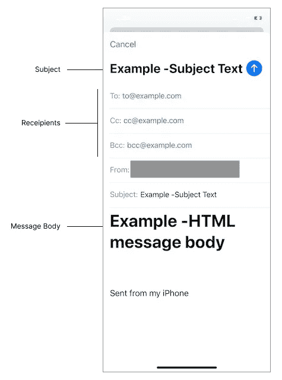
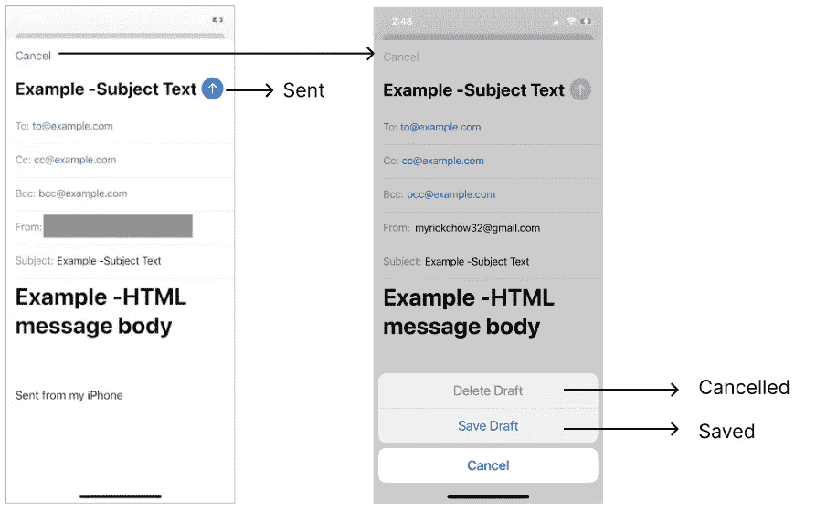
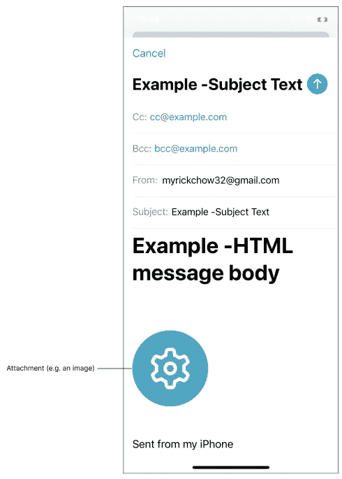
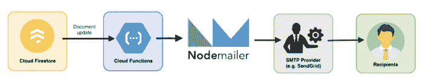

# iOS 开发—发送电子邮件📤

> 原文：<https://itnext.io/ios-dev-send-email-a24716e25337?source=collection_archive---------0----------------------->


电子邮件是 21 世纪最好的沟通渠道之一。信息可以在几秒钟内传递给一群接收者。你有没有想过把电子邮件功能集成到你的应用程序中？

苹果为开发者提供了一个简单易用的框架— `[MessageUI](https://developer.apple.com/documentation/messageui)`。我们可以配置以下属性:

1.  收件人列表
2.  科目
3.  消息正文
4.  附件

不过，还有一个我在之前的 app 开发中遇到过的有趣的招数。是关于[MFMailComposeViewControllerDelegate](https://developer.apple.com/documentation/messageui/mfmailcomposeviewcontrollerdelegate)的`sent`的定义。即使 iOS 设备处于飞机模式，代理也会返回`sent`结果。有了这个有趣的发现，我想在这篇文章中与你分享。😉

# 逐步程序

## 步骤 1)检查设备是否可以发送电子邮件

```
import MessageUI

// Confirm the user can send email
guard MFMailComposeViewController.canSendMail() else { return }
```

> 在两种情况下，应用程序用户可能无法发送电子邮件:
> 
> 1.应用程序用户尚未在系统邮件应用程序中设置其电子邮件帐户
> 
> 2.iOS MDM 配置文件已禁用邮件功能，参考此 [StackOverflow](https://stackoverflow.com/a/33179037/3891330) 回答。

## 步骤 2)配置 MFMailComposeViewController 实例

```
// Construct the `MFMailComposeViewController` instance
let mfMailComposeViewController = MFMailComposeViewController()

// To set the recipients list, including the to, cc and bcc fields
mfMailComposeViewController.setToRecipients(["to@example.com"])
mfMailComposeViewController.setCcRecipients(["cc@example.com"])
mfMailComposeViewController.setBccRecipients(["bcc@example.com"])

// To set the email subject
mfMailComposeViewController.setSubject("Example - Subject Text")

// To set the email message body; It can be either plain text or HTML message
mfMailComposeViewController.setMessageBody("<h1>Example - HTML message body </h1>", isHTML: true)

// Presenet the `MFMailComposeViewController` to the app user
present(mfMailComposeViewController, animated: true)
```

我们必须构建`[MFMailComposeViewController](https://developer.apple.com/documentation/messageui/mfmailcomposeviewcontroller)`，它控制撰写的电子邮件的所有预填充信息。它允许我们设置基本参数:

1.  领用单，包括`to`、`cc`、&、`bcc`
2.  主题字段
3.  纯文本或 **HTML 消息**中的消息正文



您现在可以运行应用程序，系统邮件应用程序会显示预填充的信息。但是，当你点击发送按钮时，你会发现邮件是**而不是**发出的。这是因为你必须事先实现`[MFMailComposeViewControllerDelegate](https://developer.apple.com/documentation/messageui/mfmailcomposeviewcontrollerdelegate)`。

## 步骤 3)手动关闭 MFMailComposeViewController

```
// We must implement the `MFMailComposeViewControllerDelegate` in order to handle the user's action on the mail compo
mfMailComposeViewController.mailComposeDelegate = self

extension DemoViewController: MFMailComposeViewControllerDelegate {

  // This is the only callback from the Mail composer to notify the app that the user has carried out certain action
    func mailComposeController(_ controller: MFMailComposeViewController, didFinishWith result: MFMailComposeResult, error: Error?) {
        switch result {
        case .cancelled:
            print("The user has dismissed the mail composer and deleted the email draft.")

        case .saved:
            print("The user has dismissed the mail composer and saved the email draft.")

        case .sent:
            // The email request is queued in the user's mail app
            // There is no guarantee that the email is actually sent out!!!
            print("The user has \"sent\" the email out.")

        case .failed:
            print("The user cannot send out the email")
            print("Error of sending out the email: \(error.debugDescription)")

        }
        controller.dismiss(animated: true)
    }
}
```

默认情况下,`[MessageUI](https://developer.apple.com/documentation/messageui)`框架不会关闭`[MFMailComposeViewController](https://developer.apple.com/documentation/messageui/mfmailcomposeviewcontroller)`。关闭它是开发者的责任。我们必须首先实现`[MFMailComposeViewControllerDelegate](https://developer.apple.com/documentation/messageui/mfmailcomposeviewcontrollerdelegate)`，并在`[didFinishWith](https://medium.com/r?url=https%3A%2F%2Fdeveloper.apple.com%2Fdocumentation%2Fmessageui%2Fmfmailcomposeviewcontrollerdelegate%2F1616880-mailcomposecontroller)`回调时解散`[MFMailComposeViewController](https://developer.apple.com/documentation/messageui/mfmailcomposeviewcontroller)`。

还有一个`result`属性显示用户的动作，包括:

1.  `[cancelled](https://developer.apple.com/documentation/messageui/mfmailcomposeresult/cancelled)` —用户点击“取消”按钮，删除邮件草稿
2.  `[saved](https://developer.apple.com/documentation/messageui/mfmailcomposeresult/saved)` —用户点击“取消”按钮，然后保存邮件草稿
3.  `[sent](https://developer.apple.com/documentation/messageui/mfmailcomposeresult/sent)` —用户已经*发送*了电子邮件
4.  `[fail](https://developer.apple.com/documentation/messageui/mfmailcomposeresult/failed)` —将电子邮件排队到邮件应用程序时出错



嘣！电子邮件功能已经实现。您现在可以成功发送电子邮件了。


# 技巧—当“已发送”结果返回时，电子邮件真的发出去了吗？

您是否尝试在没有网络连接的情况下发送电子邮件，例如在飞机模式下？哦**不**！`[MFMailComposeViewControllerDelegate](https://developer.apple.com/documentation/messageui/mfmailcomposeviewcontrollerdelegate)`的`[didFinishWith](https://medium.com/r?url=https%3A%2F%2Fdeveloper.apple.com%2Fdocumentation%2Fmessageui%2Fmfmailcomposeviewcontrollerdelegate%2F1616880-mailcomposecontroller)`回调实际上返回了一个`[sent](https://developer.apple.com/documentation/messageui/mfmailcomposeresult/sent)`结果！！！

**这是什么意思？**

根据下面的苹果文档，`[MFMailComposeViewController](https://developer.apple.com/documentation/messageui/mfmailcomposeviewcontroller)`只向系统邮件程序发送请求来排队邮件，而不是发送出去！！！换句话说，应用程序无法**知道电子邮件是否成功发送给了收件人。**

> [苹果官方文档](https://developer.apple.com/documentation/messageui/mfmailcomposeviewcontrollerdelegate/1616880-mailcomposecontroller)—mail compose controller(_:did finish with:error:):
> 
> 如果用户选择发送由该接口创建的电子邮件，**在调用该方法时，该电子邮件应该在用户的邮件程序中排队**。如果在对电子邮件消息进行排队时出现错误，`*error*`参数包含一个错误对象，该对象指示出现的故障类型。
> 
> 参考:[链接](https://developer.apple.com/documentation/messageui/mfmailcomposeviewcontrollerdelegate/1616880-mailcomposecontroller)

# 高级功能-在电子邮件中添加附件

在大多数用例中，发送附件是一个罕见的功能。但是，`[MFMailComposeViewController](https://developer.apple.com/documentation/messageui/mfmailcomposeviewcontroller)`允许我们在撰写的电子邮件中附加任何文件格式的附件列表。

```
// Attach an image to the composed email
let attachmentImageData = UIImage(named: "example_image_name")!.pngData()!
mfMailComposeViewController.addAttachmentData(attachmentImageData, mimeType: "image/png", fileName: "example_file_name")
```

我们必须首先提取`Data`格式的数据，并用`addAttachmentData`函数将其添加到电子邮件中。确保选择匹配的`MIME`类型，以便成功预览邮件中的附件。下面是在电子邮件中附加图像的屏幕截图:



# 了解更多信息



发送电子邮件的方式还有很多。 [Firebase 扩展触发器](https://extensions.dev/extensions/firebase/firestore-send-email)电子邮件提供了一个易于使用的工具，通过创建具有特定预定义字段的 Firestore 文档来帮助开发人员发送电子邮件。下面是我的另一个关于触发邮件扩展的博客。如果你想了解更多，欢迎阅读。

[](https://medium.com/firebase-developers/firebase-extension-trigger-email-5802800bb9ea) [## Firebase 扩展—触发电子邮件

### 发送电子邮件是一种常见的数字营销技术。Firebase 提供了一个简单易用的扩展-触发电子邮件…

medium.com](https://medium.com/firebase-developers/firebase-extension-trigger-email-5802800bb9ea) 

# 你可能会喜欢我的其他文章

[](https://myrickchow.medium.com/ios-sharing-send-sms-6bf8c5050a26) [## iOS 共享—发送短信

### 发送短信的 3 个步骤

myrickchow.medium.com](https://myrickchow.medium.com/ios-sharing-send-sms-6bf8c5050a26) [](/ios-proximity-sensor-as-simple-as-possible-a473df883dc9) [## iOS 接近传感器尽可能简单

### 接近传感器是一个小部件，可以检测大约 10 厘米的短距离。我们如何观察信号…

itnext.io](/ios-proximity-sensor-as-simple-as-possible-a473df883dc9) [](/ios-custom-uipagecontrol-with-uipageviewcontroller-2d02db5ab090) [## iOS —带有 UIPageViewController 的自定义 UIPageControl

### 我们如何尽可能优雅地定制 UIPageControl？色调和图像来源？点击查看更多！

itnext.io](/ios-custom-uipagecontrol-with-uipageviewcontroller-2d02db5ab090) 

# 结论

苹果提供了一个易于使用的`[MessageUI](https://developer.apple.com/documentation/messageui)`框架，通过将工作委托给系统邮件应用来帮助应用发送电子邮件。该应用程序可以设置收件人列表、主题、消息正文和附件列表。一旦用户有任何动作，`[MFMailComposeViewControllerDelegate](https://developer.apple.com/documentation/messageui/mfmailcomposeviewcontrollerdelegate)`将结果发回，应用程序必须手动关闭`[MFMailComposeViewController](https://developer.apple.com/documentation/messageui/mfmailcomposeviewcontroller)`。

请记住，来自`[MFMailComposeViewControllerDelegate](https://developer.apple.com/documentation/messageui/mfmailcomposeviewcontrollerdelegate)`的`[sent](https://developer.apple.com/documentation/messageui/mfmailcomposeresult/sent)`结果并不真正意味着电子邮件已经发出。邮件请求只在系统邮件 app 排队！

希望你会喜欢这个博客，并有一个美好的一天！