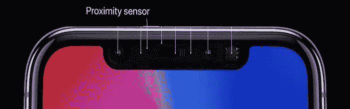
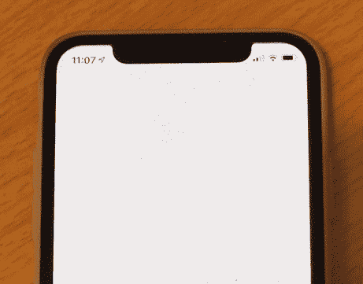
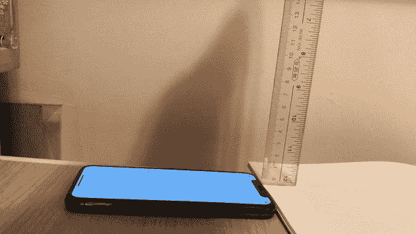
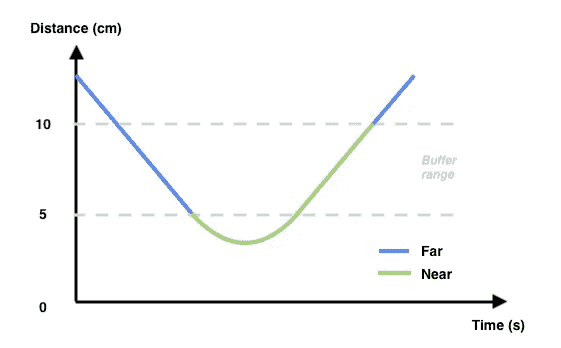
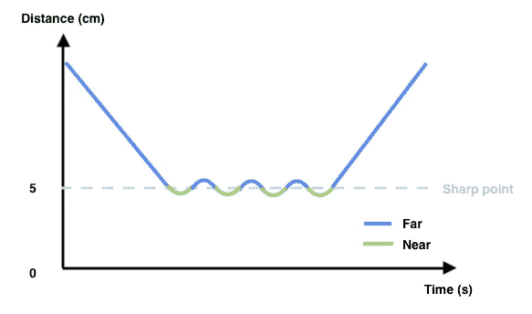

# iOS 接近传感器尽可能简单

> 原文：<https://itnext.io/ios-proximity-sensor-as-simple-as-possible-a473df883dc9?source=collection_archive---------2----------------------->

P 近距离传感器是一个小部件，可以探测 10 厘米左右的短距离。在 iPhone 和 iPad 中，这个传感器被放置在屏幕的顶部。它通常用于在用户接听电话时调暗屏幕以节省电池电量。开发人员还可以检测邻近状态的变化，并定制相应的行动。

我们开始吧！

# 循序渐进的指导

## 步骤 1:启用邻近监控

## 步骤 2:观察邻近状态的系统通知

## 步骤 3:检索邻近状态

# 近程传感器的技巧

根据[官方文档](https://developer.apple.com/documentation/uikit/uidevice/1620058-proximitystate)，从`proximityState`返回的接近状态是一个布尔值，表示接近传感器是否靠近用户(`true`)或者是否靠近(`false`)。然而，大多数开发人员**误解了接近传感器的实际行为**。在靠近的**和远离**的**之间没有明显的分界点(cm)，而是有一个缓冲范围。**

左)带缓冲范围的接近传感器的实际行为；右)锐分辨点附近的信号波动

在自然界中，每一个检测到的信号中都存在噪声。一个清晰的识别点附近的信号波动会导致`proximityState`频繁切换，见右图。换句话说，屏幕会频繁闪烁，用户会感到烦躁。

因此，苹果引入了缓冲范围来稳定信号。在左图中，一旦信号为“远”，信号必须**低于 5 cm** 才能变为“近”。另一方面，信号必须**高于 10 cm** 才能从“近”变为“远”。

# 您可能会喜欢下面的文章:

 [## Android 接近传感器尽可能清晰

### 近程传感器可以检测短距离(约 5 厘米)。检索和观察邻近数据非常简单。3 个步骤…

itnext.io](/android-proximity-sensor-as-clear-as-possible-593774d90dd2) 

# 摘要

1.  接近传感器是一个简单的组件，用于检测设备中的障碍物。最远的距离只有 10cm。
2.  当邻近状态发生任何变化时，我们可以从 iOS 获得通知。然而，我们**必须首先启用邻近监控**以接收通知。
3.  在接近信号中引入缓冲范围，以便在噪声环境中稳定它。从“远”到“近”必须达到 5 厘米，反之则为 10 厘米。

# 参考

1.  [苹果 UIDevice 官方文档](https://developer.apple.com/documentation/uikit/uidevice)
2.  [苹果 proximityStateDidChangeNotification 官方文档](https://developer.apple.com/documentation/uikit/uidevice/1620046-proximitystatedidchangenotificat)
3.  [苹果 proximityState 官方文档](https://developer.apple.com/documentation/uikit/uidevice/1620058-proximitystate)

欢迎您关注我，在[Twitter @ my rik _ chow](https://twitter.com/myrick_chow)获取更多信息和文章。感谢您阅读这篇文章。祝您愉快！😄