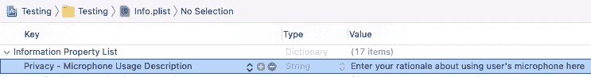

# iOS —录制和播放音频剪辑

> 原文：<https://itnext.io/ios-record-play-an-audio-clip-1ba8004543ee?source=collection_archive---------1----------------------->

## AVFoundation 框架为开发人员提供了许多处理音频数据的功能。


I OS app 可以接入用户的麦克风，对音频输入进行编码。例如，WhatsApp 记录用户的语音，以向他人发送语音消息。苹果提供了一个很棒的框架——`[AVFoundation](https://developer.apple.com/av-foundation/)`框架，帮助应用程序轻松地请求麦克风许可、编码音频输入和播放录制的剪辑等。

在本教程中，我将介绍录制音频剪辑并在系统编码后播放它的步骤。开始吧！

# 录制音频剪辑


**1。添加使用用户麦克风的理由**
如果一个应用程序可以访问用户的麦克风，甚至知道用户说了什么，这就是一个重要的隐私问题。因此，苹果强制应用程序提供合理的理由来告诉用户为什么应用程序想要访问麦克风。首先，让我们在`info.plist`处添加`NSMicrophoneUsageDescription`。



## **2。运行时请求麦克风许可**

您可以使用`[AVAudioSession](https://developer.apple.com/documentation/avfaudio/avaudiosession)`的共享实例来请求使用用户的麦克风。在完成处理程序中将返回一个`boolean`。

在实际情况下，如果用户之前拒绝了权限，权限对话框将不会再次显示。因此，你可以参考上面的第 10-11 行，向用户进一步展示使用他/她的话筒的理由。之后，您可以将用户重定向到应用程序设置页面，让他/她手动授予权限**。**

## **3.设置`AVAudioSession`**

**`[AVAudioSession](https://developer.apple.com/documentation/avfaudio/avaudiosession)`是一个向系统传达您打算如何在应用中使用音频的对象。**

**您必须将`[AVAudioSession](https://developer.apple.com/documentation/avfaudio/avaudiosession)`类别设置为`[.playAndRecord](https://developer.apple.com/documentation/avfaudio/avaudiosession/category/1616568-playandrecord)`或`[.record](https://developer.apple.com/documentation/avfaudio/avaudiosession/category/1616451-record)`，以便记录来自麦克风的音频输入。我选择使用`[.playAndRecord](https://developer.apple.com/documentation/avfaudio/avaudiosession/category/1616568-playandrecord)`,因为一旦音频剪辑被录制，我将播放它。**

**之后，你必须激活`[AVAudioSession](https://developer.apple.com/documentation/avfaudio/avaudiosession)`，这样系统就知道你的应用程序正在使用麦克风。这个函数可能会抛出错误。例如，当用户使用正在使用麦克风的系统电话应用程序拨打或接听电话时。错误如下所示:**

```
The operation couldn’t be completed. (OSStatus error 561017449.)
```

## **4.获取保存录制的音频文件的磁盘位置**

**iOS 为每个应用提供了一个目录来存储应用文件，该目录由`[FileManager](https://developer.apple.com/documentation/foundation/filemanager)`控制。您可以通过下面的函数获得一个:**

## **5.设置 AVAudioRecorder**

**然后，您可以使用生成的文件 URL 来初始化负责对录制的音频片段进行编码的`[AVAudioRecorder](https://developer.apple.com/documentation/avfaudio/avaudiorecorder)`。**

**你也可以给它分配一个`delegate`,以便在`[AVAudioRecorder](https://developer.apple.com/documentation/avfaudio/avaudiorecorder)`完成记录和音频输入编码过程中出现任何错误时监听事件。**

## **6.开始和结束录制**

**最后的步骤是“开始”和“停止”记录音频输入。上面的代码不言自明。构建并运行 app，可以发现`[AVAudioRecorder](https://developer.apple.com/documentation/avfaudio/avaudiorecorder)`停止后`[audioRecorderDidFinishRecording](https://developer.apple.com/documentation/avfaudio/avaudiorecorderdelegate/1388688-audiorecorderdidfinishrecording)`被触发。**

# **播放音频剪辑**

****

**在录制完音频剪辑后，您可能想听听这个剪辑。回放音频剪辑非常简单。**

**首先，你必须将`[AVAudioSession](https://developer.apple.com/documentation/avfaudio/avaudiosession)`的类别设置为除`[.record](https://developer.apple.com/documentation/avfaudio/avaudiosession/category/1616451-record)`模式之外的任何播放模式。**

> **如果在上一节中已经将类别设置为`[.playAndRecord](https://developer.apple.com/documentation/avfaudio/avaudiosession/category/1616568-playandrecord)`，则不需要重新设置。**

**然后，您可以用音频剪辑的文件`url`初始化`[AVAudioPlayer](https://developer.apple.com/documentation/avfaudio/avaudioplayer)`，然后调用`[play()](https://developer.apple.com/documentation/avfaudio/avaudioplayer/1387388-play)`。**

# **摘要**

**iOS 为应用程序提供了访问用户麦克风的功能。但是，它要求用户首先授予应用程序权限。**

**苹果为控制 iOS 中的音频和视频内容提供了`[AVFoundation](https://developer.apple.com/av-foundation/)`框架。您可以使用`[AVAudioRecorder](https://developer.apple.com/documentation/avfaudio/avaudiorecorder)`记录音频输入，并将其保存到本地文件中，该文件的目录由`[FileManager](https://developer.apple.com/documentation/foundation/filemanager)`提供。**

**在`[AVAudioPlayer](https://developer.apple.com/documentation/avfaudio/avaudioplayer)`类的帮助下，回放一个音频片段很容易。**

# **你可能也喜欢**

**[](/ios-proximity-sensor-as-simple-as-possible-a473df883dc9) [## iOS 接近传感器尽可能简单

### 接近传感器是一个小部件，可以检测大约 10 厘米的短距离。我们如何观察信号…

itnext.io](/ios-proximity-sensor-as-simple-as-possible-a473df883dc9) [](/swift-ios-cllocationmanager-all-in-one-b786ffd37e4a) [## Swift iOS CLLocationManager 一体化

### 如何在 iOS 中获取用户位置？CoreLocation 为您提供了多少配置？让我们点击阅读更多！

itnext.io](/swift-ios-cllocationmanager-all-in-one-b786ffd37e4a) [](/swift-local-notification-all-in-one-ee6027ea6e3) [## Swift 本地通知一体化

### 通知是一个非常优雅的工具，用来通知用户新的信息和警告。想看看关于…的提示和技巧吗

itnext.io](/swift-local-notification-all-in-one-ee6027ea6e3)**