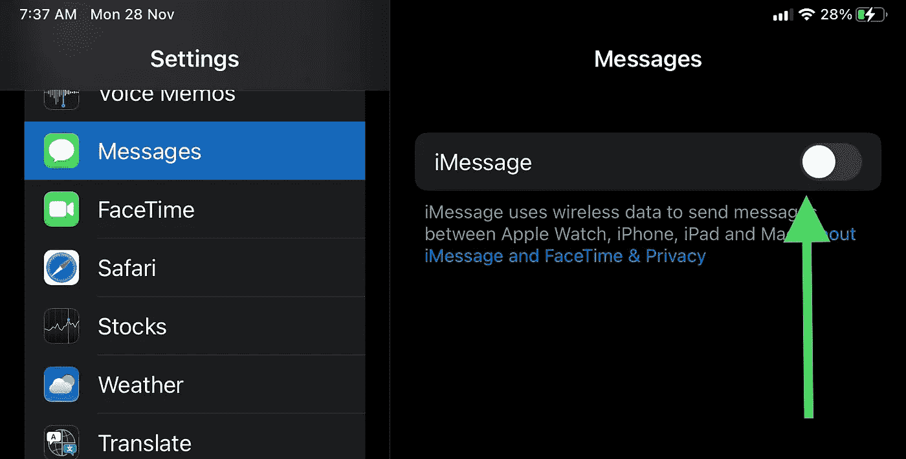
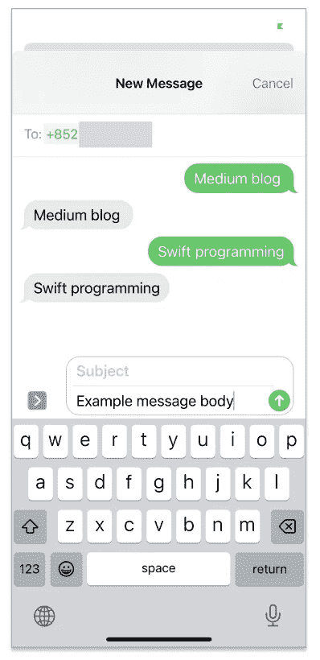
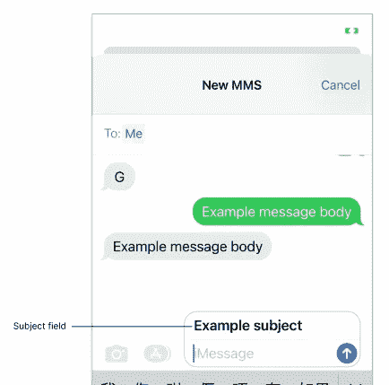
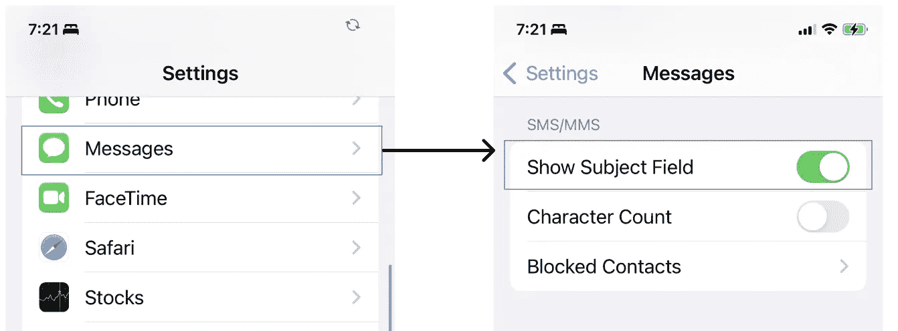
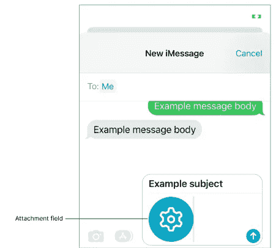

# iOS 共享—发送短信

> 原文：<https://itnext.io/ios-sharing-send-sms-6bf8c5050a26?source=collection_archive---------2----------------------->

## 发送短信的 3 个步骤


MS 可能是所有电话用户中最容易到达的通信服务。不需要安装任何第三方应用程序来支持发送和接收 SMS 消息。苹果为 iOS 用户提供了默认的“信息”应用。


iOS“信息”应用程序

开发者可以通过使用`[MessageUI](https://developer.apple.com/documentation/messageui)`框架将短信发送功能实现到自己的 app 上。这是超级容易的，只需要 3 个步骤来设置。所有的任务都由`[MFMessageComposeViewController](https://developer.apple.com/documentation/messageui/mfmessagecomposeviewcontroller)`处理，开发者只需要在用户完成他的动作后手动关闭它。

# 逐步设置

## 步骤 1)确认设备是否可以发送短信

```
import MessageUI

// Confirm the device can send a text message through the system Message app
guard MFMessageComposeViewController.canSendText() else { return }
```

我们需要确认用户是否已经将 iOS 设备配置为发送文本消息。`[canSendText()](https://developer.apple.com/documentation/messageui/mfmessagecomposeviewcontroller/1614072-cansendtext)`在禁用 iMessage 的 iPad 上运行时返回 false。设置页面截图见下图。



iPad 上的设置

## 步骤 2)配置 MFMessageComposeViewController 实例

```
// Construct the `MFMessageComposeViewController` instance
let mfMessageComposeViewController = MFMessageComposeViewController()

// Configure the fields of the interface.
mfMessageComposeViewController.recipients = ["+852 6123 4567"]
mfMessageComposeViewController.body = "Example message body"

// Present the view controller modally.
present(mfMessageComposeViewController, animated: true)
```

然后，我们需要构建`[MFMessageComposeViewController](https://developer.apple.com/documentation/messageui/mfmessagecomposeviewcontroller)`实例，并配置 SMS 消息的必要字段。

1.  收件人列表—接收短信
    *的电话号码列表最好包含国家代码，例如，香港的“+852”
2.  消息正文—一个简单的纯文本

运行该应用程序，您可以看到消息编辑器在屏幕上弹出。

> 你可以直接发送短信，但在用户发出短信后，它不会立即被取消。我们需要在`[MFMessageComposeViewControllerDelegate](https://developer.apple.com/documentation/messageui/mfmessagecomposeviewcontrollerdelegate)`亲自处理。



## 步骤 3)实现 MFMessageComposeViewControllerDelegate

```
 // Assigning the delegate to the `MFMessageComposeViewController` instance
mfMessageComposeViewController.messageComposeDelegate = self

extension SMSComposerViewController: MFMessageComposeViewControllerDelegate {

    // This is the only callback from the Mail composer to notify the app that the user has carried out certain action
    func messageComposeViewController(_ controller: MFMessageComposeViewController, didFinishWith result: MessageComposeResult) {
        switch result {
        case .cancelled:
            print("The user has dismissed the Message composer.")

        case .sent:
            // The SMS / MMS send request is queued in the user's Messages app
            // There is no guarantee that the message is actually sent out!!!
            print("The user has sent out the message")

        case .failed:
            print("The user cannot send out the message")

        }

        controller.dismiss(animated: true)
    }
}
```

默认情况下，iOS 不会关闭`[MFMessageComposeViewController](https://developer.apple.com/documentation/messageui/mfmessagecomposeviewcontroller)`。关闭它是开发者的责任。我们首先需要实现`[MFMessageComposeViewControllerDelegate](https://developer.apple.com/documentation/messageui/mfmessagecomposeviewcontrollerdelegate)`，然后在 didFinishWith callback 的末尾调用`dismiss()`函数。


# 技巧—当“已发送”结果返回时，消息真的发出去了吗？

当**没有信号连接**时，例如飞机模式，您是否尝试发送信息？哦**不**！`[MFMessageComposeViewControllerDelegate](https://developer.apple.com/documentation/messageui/mfmessagecomposeviewcontrollerdelegate)`的`[didFinishWith](https://medium.com/r?url=https%3A%2F%2Fdeveloper.apple.com%2Fdocumentation%2Fmessageui%2Fmfmailcomposeviewcontrollerdelegate%2F1616880-mailcomposecontroller)`回调实际上返回了一个`[sent](https://developer.apple.com/documentation/messageui/mfmailcomposeresult/sent)`结果！！！

**这是什么意思？**

根据下面的苹果文档，MessageUI 框架只会向系统发送一个队列请求。**不保证**消息是否成功发送给收件人。

> ***苹果官方文档—messagecomposeresult . sent***
> 
> 用户成功排队或发送了邮件。
> 
> 参考:[链接](https://developer.apple.com/documentation/messageui/messagecomposeresult/sent)

# 高级功能

## 添加主题字段



```
// Check if the Message app supports to add a subject to the message
guard MFMessageComposeViewController.canSendSubject() else { return }

mfMessageComposeViewController.subject = "Example subject"
```

iOS 邮件支持纯文本主题栏。但是，我们需要先用`canSendSubject()`检查 iOS 设备是否配置为支持主题字段。默认情况下，此主题功能被禁用。我们需要首先在设置中手动打开它。路径见下文。



# 添加附件



```
 // Check if the Message app supports to add an attachment
guard MFMessageComposeViewController.canSendAttachments() else { return }

// Attach an image to the composed MMS
let attachmentImageData = UIImage(named: "btnAiSetting")!.pngData()!

// !!! Add the file extension name to the end of the file name to preview it at the Message Composer
let filenameWithExtension = "example_file_name.png"
mfMessageComposeViewController.addAttachmentData(attachmentImageData, typeIdentifier: "image/png", filename: filenameWithExtension) 
```

`[MessageUI](https://developer.apple.com/documentation/messageui)`框架还支持向 MMS ( [多媒体消息服务](https://en.wikipedia.org/wiki/Multimedia_Messaging_Service))消息添加附件。与其他字段类似，我们还必须检查设备是否配置为使用`[canSendAttachments()canSendAttachments()](https://developer.apple.com/documentation/messageui/mfmessagecomposeviewcontroller/1614076-cansendattachments)`功能发送附件。

然后，我们需要从附件源中提取出`Data`，并将其传递给`addAttachmentData()`函数。记得将文件扩展名添加到`filename`字段，否则文件不能在消息编辑器中预览。

# 你可能会喜欢我的其他文章

[](/ios-dev-send-email-a24716e25337) [## iOS 开发—发送电子邮件📤

### 电子邮件是 21 世纪最好的沟通渠道之一。信息可以传递给一群…

itnext.io](/ios-dev-send-email-a24716e25337) [](/swift-ios-cllocationmanager-all-in-one-b786ffd37e4a) [## Swift iOS CLLocationManager 一体化

### 如何在 iOS 中获取用户位置？CoreLocation 为您提供了多少配置？让我们点击阅读更多！

itnext.io](/swift-ios-cllocationmanager-all-in-one-b786ffd37e4a) [](/4-steps-to-ios-text-qr-code-recognition-ffb29d1d6c03) [## iOS 文本和二维码识别的 4 个步骤

### 如何以最小的努力扫描文本和条形码？WWDC 2022，苹果提供这款 DataScannerViewController 给…

itnext.io](/4-steps-to-ios-text-qr-code-recognition-ffb29d1d6c03) 

# 结论

SMS 是在一组用户之间轻松传递信息的一种非常方便的方式。苹果的伟大框架`[MessageUI](https://developer.apple.com/documentation/messageui)`为我们提供了一个简单易用的 API 来实现任何 iOS 应用程序的短信发送功能。

我们需要用不同的字段构造`[MFMessageComposeViewController](https://developer.apple.com/documentation/messageui/mfmessagecomposeviewcontroller)`，如果 iOS 设备支持发送这种信息，应该逐个检查:

1.  `[canSendText()](https://developer.apple.com/documentation/messageui/mfmessagecomposeviewcontroller/1614072-cansendtext)` —确认设备可以发送短信
2.  `[canSendSubject()](https://developer.apple.com/documentation/messageui/mfmessagecomposeviewcontroller/1614065-cansendsubject)` —确保可以添加主题字段
3.  `[canSendAttachments()](https://developer.apple.com/documentation/messageui/mfmessagecomposeviewcontroller/1614076-cansendattachments)` [](https://developer.apple.com/documentation/messageui/mfmessagecomposeviewcontroller/1614076-cansendattachments)—确认是否允许在消息中添加附件

最后，我们需要明白，iOS 只是将用户的动作返回到 app 端。`[sent](https://developer.apple.com/documentation/messageui/messagecomposeresult/sent)`结果不能保证 SMS 消息真的被发送到接收者。


感谢您阅读这篇文章。希望你觉得有趣和有用！欢迎您关注我，并通过以下渠道与我联系:

1.  [推特@ myrik _ chow](https://twitter.com/myrick_chow)
2.  [YouTube @ myrick show](https://www.youtube.com/channel/UC_UEqZPDms3rtX5W-m9hgxg)
3.  [LinkedIn @ myrik Chow](https://www.linkedin.com/in/myrick-chow-720b34118/)