# 如何在 iOS 中使用堆栈视图

> 原文：<https://itnext.io/ios-stack-views-making-ui-development-easy-f81e0f00c193?source=collection_archive---------1----------------------->

我知道堆栈视图从 iOS 9 开始就可用了，但我还是想写一篇关于它的文章。我真的很感激他们让设计过程变得如此简单。

照片来自 [Unsplash](https://unsplash.com/photos/rS1GogPLVHk)

在 iOS UI 开发的早期，有 Struts 和 Springs，它们以各种费力和紧张的方式来组织视图。你将不得不使用自动调整大小蒙版，有时甚至求助于代码来获得由你的团队中的花式设计师提供的复杂视图。

为了取代这种可怕的现象，iOS 6 中出现了自动布局。就 UI 开发而言，这是一个巨大的进步。您可以在同级视图之间提供约束，或者添加相对于超级视图的约束。可以相对容易地创建复杂的视图。但是自动布局有它自己的问题。尽管它减少了设计复杂问题的工作量，但仍需要添加许多约束。我们将在下面看到一个例子。

UI 的另一个主要改进是 iOS 9 对堆栈视图的支持。顾名思义，你将视图添加到一个堆栈视图中，它将水平或垂直地堆叠它们。这比听起来要灵活得多。在内部，虽然堆栈视图使用自动布局。

我们将看看本文中的一个例子，它将向我们展示堆栈视图的强大功能。

# 示例:带有堆栈视图的纵向和横向矩形

我们将重新创建[这个](https://www.raywenderlich.com/811496-auto-layout-tutorial-in-ios-getting-started)教程的屏幕。这是最终的结果。使用自动布局时，最少使用 25–30 个约束，而使用堆栈视图时，仅使用 4 个约束。**是的！只有 4 个约束。**

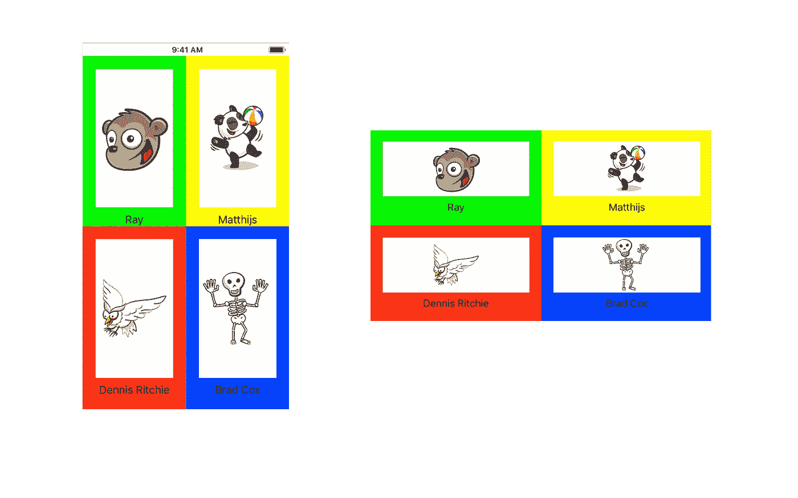

最终横向和纵向屏幕

首先，在你的视图控制器中添加一个垂直堆栈视图，并在所有边上指定 20 作为该堆栈视图的最近邻的间距。让我们称之为**父**堆栈视图。

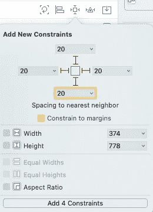

唯一需要的 4 个约束

**注意:**这是我们将添加的仅有的 4 个约束。

其次，到属性检查器，设置分布为“平均填充”。这是必要的，这样当我们添加子视图时，它们具有相同的高度。

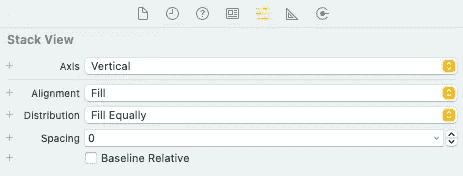

将分配设置为“平均填充”

接下来，在主垂直堆栈视图中添加一个水平堆栈视图(姑且称之为**行**)，并将其分布标记为“均匀填充”。顾名思义**行**在**父**中包含一行。

接下来，在**行**中添加一个垂直堆栈视图。我们可以将这个垂直堆栈视图命名为**容器。**一个单独的**容器**里面会有一个图像和一个标签，还有它自己单独的颜色。为了区分**容器**,设置背景颜色为系统紫色或任何你喜欢的颜色。稍后我们将添加更多的容器。

最后，向**容器添加一个图像和一个标签。在我们接下来要解决的约束中，你可能会遇到一些冲突。我们不希望标签被垂直拉伸，而是图像应该被拉伸。要实现这一点，选择标签的大小检查器，并标记*垂直内容拥抱优先级*为必需或高于图像的优先级，如下所示。所有的冲突现在都应该解决了**

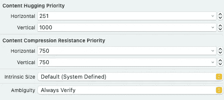

垂直内容拥抱优先级

在“属性”检查器中，将您喜欢的任何图像设定为图像视图，并将内容模式设定为图像的中心。

您的视图控制器将如下所示:

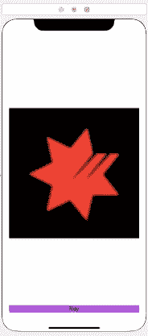

视图控制器

主要是缺了一些间距和边距。选择**容器**堆栈视图并在属性检查器中将间距设置为 20。我们还想给**容器**添加一些填充，这样图像和标签就不会粘在边框上。转到尺寸检查器，从下拉菜单中设置布局边距为固定。将左、右&上边距设置为 20°，下边距设置为 30°。您可以根据自己的喜好更改这些内容。

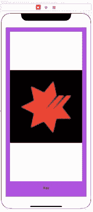

设置边距和间距后查看控制器

您的视图控制器结构应该如下所示

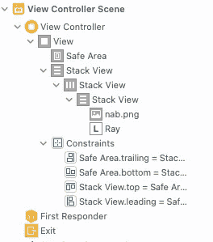

视图控制器结构

是时候复制粘贴东西了。这就是栈视图的妙处。因为没有约束，你可以复制过去的视图，而不用担心冲突、警告或者 UI 错误。

选择**容器**并复制粘贴。您将获得以下结果:

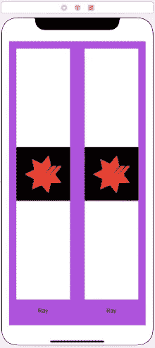

复制了容器

最后复制**行**并粘贴。我们离最终结果如此之近。

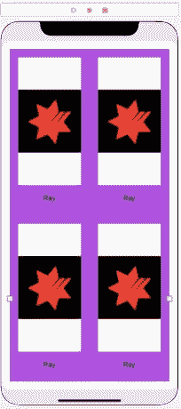

改变每个**容器**的背景颜色，以获得更漂亮的视图。

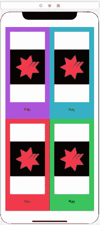

每个容器有不同的背景颜色

当你在横向模式下旋转它时，你会得到这个很好的缩放屏幕。要润色本页，请根据需要更改图像和标签。

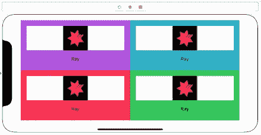

我怎么强调堆栈视图让我的生活变得如此简单都不为过。

# **优点**

正如我们所见，当视图需要堆叠时，堆叠视图非常有用。

*   使用堆栈视图的一个主要优点是，除了父堆栈视图之外，无需设置约束就可以复制粘贴它。
*   堆栈视图也非常容易集成到滚动视图中。只需要设置父堆栈视图的约束。
*   如果您从堆栈视图中间移除一个视图，其他视图会自动排列。与约束相比，这是一个巨大的优势。

# 不足之处

就我个人而言，我没有发现使用堆栈视图的任何主要缺点或劣势。我唯一不使用堆栈视图的时候是在视图或屏幕中有太多重叠元素的时候。在这种情况下，堆栈视图没有帮助。

# 结论

总之，我喜欢堆栈视图，并且一直在用它来设计我 99%的视图。与自动布局甚至 Swift UI 相比，它们使用起来非常简单灵活，非常直观。苹果这么晚才推出，我有点生气。

PS:堆栈视图在 Android 中是以 LinearLayout 的形式出现的。

你可以在苹果官方网站[这里](https://developer.apple.com/documentation/uikit/uistackview)找到关于 UIStackView 的更多细节。