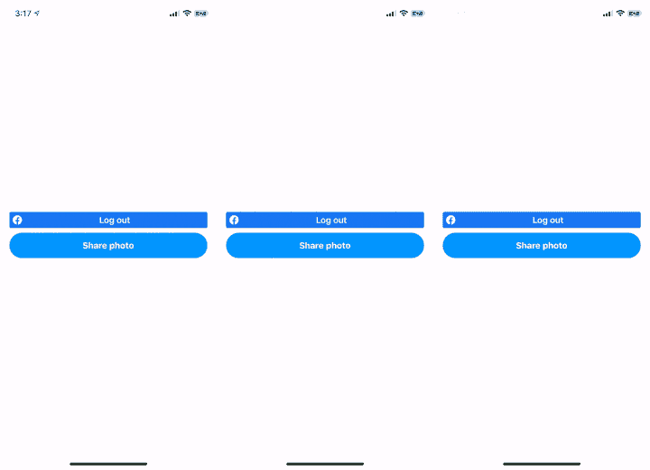
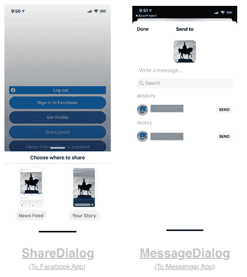
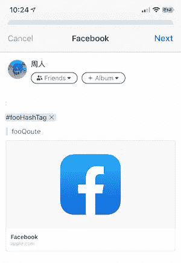

# iOS Swift 脸书共享

> 原文：<https://itnext.io/ios-swift-facebook-sharing-e473e6b2fc48?source=collection_archive---------2----------------------->


acebook Sharing SDK 是一款用户友好的工具，可以通过您的应用程序轻松共享照片、视频和链接。用户可以将媒体作为新闻源或故事分享给脸书应用程序，或者作为直接消息发送给 Messenger 应用程序中的朋友。



作为新闻源发布(左)&作为故事发布(中)&作为直接消息发布(右)

共享代码简短明了。以下是通过 Messenger 应用程序将图片作为直接消息分享给朋友的一组代码。它只有 10 行长！

然而，每个共享媒体都有一些限制(文件大小和最大文件数量)和提供更好的 UI/UX 的技巧。这些都将在本文中涉及。

# 开始前

[](/swift-facebook-ios-login-sdk-dada412d8341) [## Swift —脸书 iOS 登录 SDK

### 脸书 SDK 允许用户登录并授予应用程序权限，以便从脸书检索个人信息…

itnext.io](/swift-facebook-ios-login-sdk-dada412d8341) 

1.  请实现[脸书登录 SDK](https://developers.facebook.com/docs/facebook-login/ios?sdk=cocoapods) 并通过脸书登录，以便通过脸书共享 SDK 获得有效的访问令牌进行共享。
2.  请在真实设备而不是模拟器中运行您的应用程序，因为脸书应用程序和信使应用程序不能安装在模拟器中

# 添加脸书共享工具包依赖项

将下面一行添加到`Podfile`中，并通过运行`pod install`安装依赖项

```
pod ‘FBSDKShareKit’
```

# 共享内容


有 3 种类型的媒体可以通过脸书共享，每种媒体都有不同的限制:

## 照片

1.  每个单独的图像必须小于 12MB

## 录像

1.  每个视频必须小于 50MB

## 带视频的照片

1.  用户每次最多只能上传 1 个包含 29 张或 30 张照片的视频。换句话说，上传的媒体文件总数不能超过 30 个。

# 共享频道



脸书 SDK 提供了两种通过脸书共享媒体的方式:

1.  共享对话—媒体共享给用户的新闻源或故事。
    *多媒体文件(如多张照片)只能共享到新闻订阅源。
2.  MessageDialog —媒体通过私人频道直接发送给用户的朋友

# 共享材料的准备

请参考下面的媒体文章，从用户的设备或摄像机源中选择图像和视频:

[](/swift-uiimagepickercontroller-e37ece745740) [## Swift UIImagePickerController

### 想从用户设备中选择一幅图像或一段视频进行个人资料定制和后期制作…

itnext.io](/swift-uiimagepickercontroller-e37ece745740) 

## 照片


对于所有共享的照片，它必须被嵌入到`SharePhotoContent`中的`SharePhoto`对象包裹。然后`SharePhotoContent`将在下一个会话的`ShareDialog`和`MessageDialog`中使用。

## 录像

类似于分享照片的方式，视频数据由嵌入到`ShareVideoContent`中的`ShareVideo`包装。

# 环



链接是最简单的一个，开发者只需要定义网址。

# 通过 ShareDialog 共享


在第 10 行，用将呈现对话框的`UIViewController`实例和在前一个会话中定义的`photoContent`创建了一个`ShareDialog`。在第 11 行，可以通过调用`show()`函数简单地显示出来。代表`ShareDelegate`将在以后的会议中讨论。

# 通过 Messenger 共享


与`ShareDialog`不同的是，`MessageDialog`是通过直接启动并委托给`Messaging` app 来展示的。因此，在其构造函数中不需要一个`UIViewController`实例。显示`MessageDialog`的功能与显示`ShareDialog`的功能相同，即`show()`。

# 共享代理

脸书 SDK 提供了 3 个通过脸书分享的回调。

`didCompleteWithResults`用户刚刚通过脸书 SDK 成功分享时触发。

`didFailWithError`在共享过程中出现错误时触发。例如，`com.facebook.sdk.share error 2`表示连接超时。

`sharerDidCancel`在用户取消分享时触发。

# 检查是否安装了脸书和信使

为了提供更好的用户界面/ UX，有必要隐藏“分享到脸书”按钮，并选择性地重定向用户到应用程序商店，当脸书或信使应用程序没有安装。上面的代码提供了一个简单易用的函数来检查这两个应用程序是否存在。


位于 info.plist 的 LSApplicationQueriesSchemes

> 确保`info.plist`中的`LSApplicationQueriesSchemes`必须包含`fb` & `fb-messenger`，以便检查 app 是否存在。

# 摘要

1.  脸书提供了一个易于使用的 SDK 来通过脸书共享媒体。
2.  用户可以通过 SDK 以新闻提要、故事和直接消息的形式共享链接、照片和视频。
3.  照片不能大于 12MB，视频不能大于 50MB。
4.  一批中最多 30 张带视频的照片。
5.  HashTag 可以随意添加到每一种共享内容中。
6.  `SharingDelegate`提供监控共享过程的回调。
7.  为了提供更好的用户界面/UX，请在没有安装脸书或信使时隐藏共享部件。

# 你可能会喜欢

[](/swift-facebook-ios-login-sdk-dada412d8341) [## Swift —脸书 iOS 登录 SDK

### 脸书 SDK 允许用户登录并授予应用程序权限，以便从脸书检索个人信息…

itnext.io](/swift-facebook-ios-login-sdk-dada412d8341) [](https://medium.com/@myrickchow/firebase-authentication-facebook-i-93aaf489839d) [## 基于防火墙的认证—脸书一号

### 如今脸书登录闻名而 Firebase 提供认证工具通过脸书访问令牌创建用户…

medium.com](https://medium.com/@myrickchow/firebase-authentication-facebook-i-93aaf489839d) 

# 进一步阅读和参考

1.  关于共享的脸书开发者网站

[](https://developers.facebook.com/docs/sharing/ios) [## iOS -共享-文档-开发者脸书

### 本指南详细介绍了如何从您的 iOS 应用程序共享到脸书。当有人从你的应用程序共享时，他们的…

developers.facebook.com](https://developers.facebook.com/docs/sharing/ios) 

2.StackOverflow —关于如何检查某个应用程序的存在

[](https://stackoverflow.com/a/32713709/3891330) [## 检查用户是否安装了 Facebook Messenger

### 感谢贡献一个堆栈溢出的答案！请务必回答问题。提供详细信息并分享…

stackoverflow.com](https://stackoverflow.com/a/32713709/3891330) 

欢迎您关注我，在[Twitter @ myrik _ chow](https://twitter.com/myrick_chow)获取更多信息和文章。感谢您阅读这篇文章。祝您愉快！😄