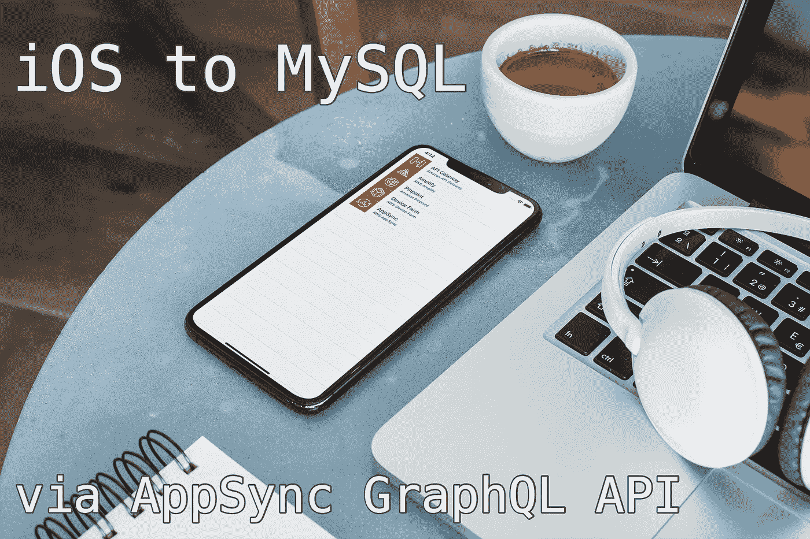
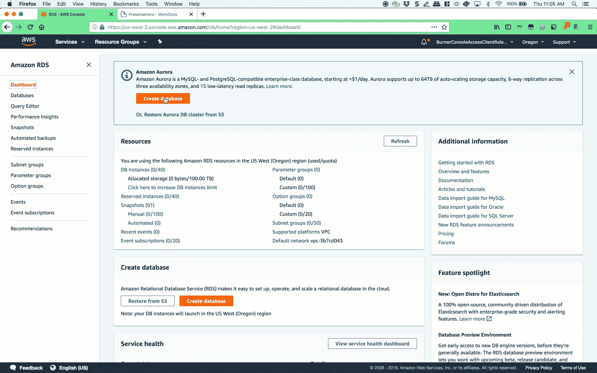
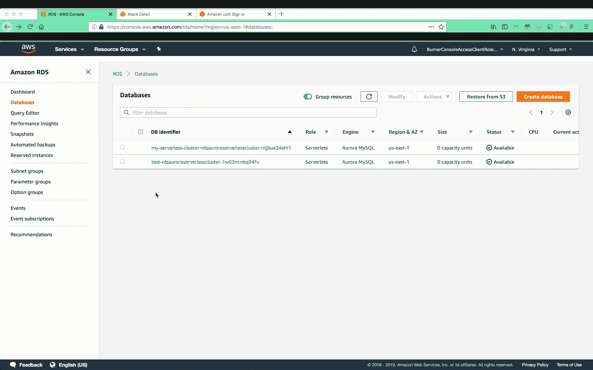
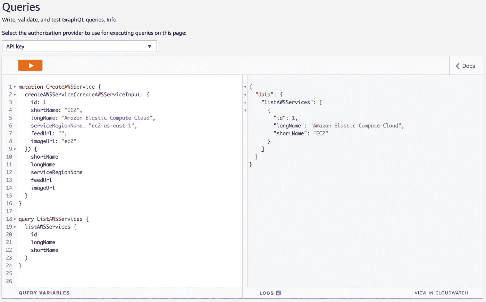
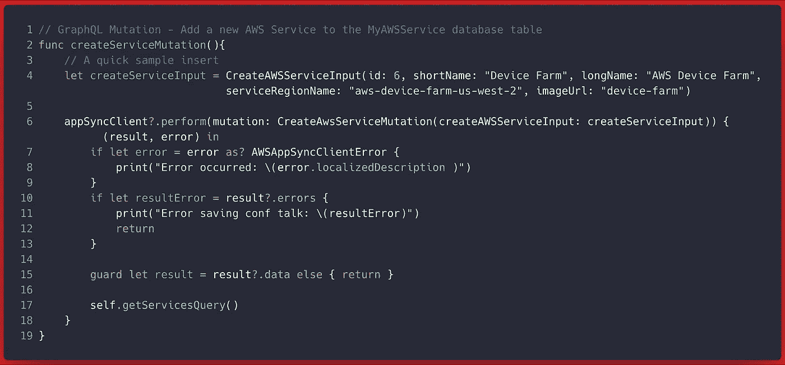
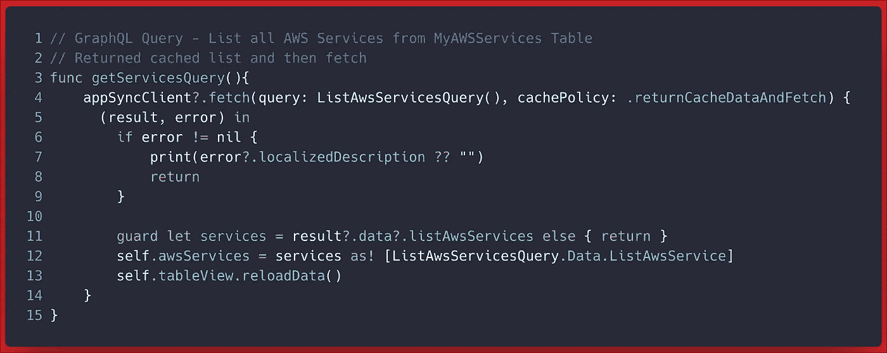
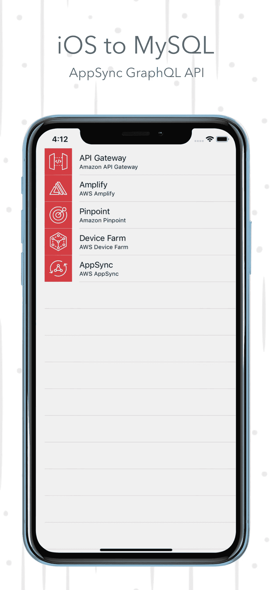

# iOS 到 MySQL:使用 GraphQL API

> 原文：<https://itnext.io/ios-to-mysql-via-aurora-serverless-cluster-part-1-graphql-api-57cd547d631d?source=collection_archive---------1----------------------->



在本文中，我们将展示用于 [Aurora 无服务器](https://docs.aws.amazon.com/en_pv/AmazonRDS/latest/AuroraUserGuide/aurora-serverless.html) MySQL 数据库的全新[内置数据 API](https://docs.aws.amazon.com/AmazonRDS/latest/AuroraUserGuide/data-api.html) 特性。使用这个 API，你可以通过带有[亚马逊 API 网关](https://aws.amazon.com/api-gateway/) + [AWS Lambda](https://aws.amazon.com/lambda/) 的 REST API，或者带有 [AWS AppSync](https://aws.amazon.com/appsync/) 的 GraphQL API，访问基于 web 服务的应用程序 Aurora Serverless。

让我们回顾一下**为什么**您希望将数据 API 用于 Aurora 无服务器集群…

> 在 Aurora MySQL 数据库上启用数据 API 后，客户端不再需要**保持与数据库集群的持久连接**，它**提供了安全的 HTTP 端点**以及与 AWS SDKs 的集成。您可以使用端点来执行 SQL 语句，就像您使用 MySQL 本地协议一样，但是不需要管理连接。数据 API 有点像杰里米·戴利和其他人在这个 [GitHub repo](https://github.com/jeremydaly/serverless-mysql) 中解决的那样，适用于无服务器和有服务器集群。

在本文中，我们将使用 AWS AppSync 通过 GraphQL API 将 iOS 应用程序连接到无服务器 MySQL 数据库。

> 注意:这是一个全面的博客，提供了从数据库创建到客户机实现的几乎每个步骤。如果这个解决方案对您不起作用，请告诉我，我会解决它。

在我之前的[文章](https://read.acloud.guru/getting-started-with-the-amazon-aurora-serverless-data-api-6b84e466b109)和[视频](https://youtu.be/b_BzV1G1iRs)中，我介绍了**使用数据 API 创建**Aurora 无服务器 MySQL 数据库的三种方法和**将**连接到无服务器 MySQL 数据库的四种方法。对于本文，我们将使用 Amazon RDS 控制台来创建数据库，启用数据 API，并使用查询编辑器来定义表和执行一些基本的 crud 操作。

这是我们将要建造的:

> 启用了数据 API 的 Amazon Aurora 无服务器集群和 **MySQL 数据库**
> 
> 带有 AWS AppSync 的新 **GraphQL API** 与上述数据库接口
> 
> 一个 **iOS Swift 应用**通过 GraphQL API 以“API_Key 模式”与我们的无服务器 MySQL 数据库进行交互。

# 开始—步骤 1

## 创建集群

RDS 控制台是部署资源的快捷方式，按照以下说明只需几分钟即可完成:

**通过 RDS 控制台**创建新的 Aurora 无服务器集群:

1.  启动亚马逊 RDS 控制台。
2.  选择**创建数据库**。
3.  选择**简易创建。**
4.  选择引擎类型:**亚马逊极光。**
5.  精选版:兼容 MySQL 5.6 的亚马逊 Aurora。
6.  选择数据库实例大小:**无服务器**
7.  保留所有默认值并选择**创建数据库。**



通过 RDS 控制台创建 Aurora 无服务器集群的屏幕截图

创建新的 Aurora 无服务器 MySQL 数据库时，应该已经启用了数据 API。如果没有，或者如果您想验证，请按照以下步骤操作。

**验证数据库已启用数据 API**

我们将验证新创建的 Aurora 无服务器数据库的数据 API 是否已启用。

1.  启动 [RDS 管理控制台](https://console.aws.amazon.com/rds/home?region=us-east-1#databases:)
2.  **从左侧面板中选择数据库**。
3.  在数据库标识符下选择您的数据库。
4.  选择右上角的**修改**按钮。
5.  **网络&安全部分下的数据 API** 应显示一个复选标记，表明该数据库的数据 API 已启用。
6.  选择**继续**。
7.  如有变更，选择修改计划下的**立即应用**。
8.  选择**修改集群**单选按钮。



# 准备数据

我们将使用 RDS 控制台中的[查询编辑器](https://docs.aws.amazon.com/AmazonRDS/latest/AuroraUserGuide/query-editor.html#query-editor.running)来创建我们的数据库、表，并插入一些数据来开始。第一次使用查询编辑器时，它会要求您提供主用户和密码形式的集群凭证。作为对提供这些凭证的响应，RDS 将创建一个新的 **AWS 机密**来存储这些凭证，并在您通过查询编辑器连接到数据库时检索这些主用户/通行证。

> 注意: [AWS Secrets Manager](https://aws.amazon.com/secrets-manager/) 是从 AWS CLI、SDK、AppSync 和其他基于 web 的应用程序连接到支持 Data API 的无服务器集群的一个必要条件。这是防止将连接字符串传递给每个 sql 语句的好方法。

## 创建数据库和表格

*   启动亚马逊 [RDS 管理控制台](https://console.aws.amazon.com/rds/home?region=us-east-1)
*   选择**查询编辑器**
*   在**连接数据库**窗口中，选择您的集群，提供您的主用户、主密码和数据库名称(可选)。
*   选择**连接到数据库。**

在查询编辑器窗口中，运行以下命令:

**创建一个名为 *AWSAlerts* 的新数据库**。

```
CREATE DATABASE AWSAlerts;
```

创建一个名为 My*AWS service*的**新表。我添加了“My ”,因为名称 AWSService 作为保留名称在某处发生了冲突。**

```
USE AWSAlerts;
CREATE TABLE MyAWSService (
    id MEDIUMINT NOT NULL PRIMARY KEY,
    shortName varchar(50),
    longName varchar(50),
    description TEXT,
    serviceRegionName varchar(50) NOT NULL,
    feedUrl varchar(50),
    imageUrl varchar(50)
);
```

> 什么是 AWSAlerts？这是我正在做的一个附带项目，它监视 AWS 服务健康仪表板，并通知订户所有 AWS 服务或网络事件的新的、更新的或已解决的仪表板事件。MyAWSService 表将存储每个唯一服务和地区的属性，以及它们的 RSS 提要 URL、服务图标和关于该服务的其他详细信息。

# 下载演示 iOS 项目

```
$ git clone [https://github.com/mobilequickie/iOS-RDS-Demo.git](https://github.com/mobilequickie/iOS-RDS-Demo.git)$ cd iOS-RDS-Demo/
```

# 创建 GraphQL API

现在我们有了一个数据库、一个 *AWSService* 表和一个基本示例 iOS 应用程序，让我们使用 AWS Amplify CLI 创建一个 GraphQL API。

Amplify CLI —安装 CLI
如果您之前没有安装 AWS Amplify CLI，请在继续下一步之前运行以下两个命令来安装和配置 CLI。如果您已经安装了 **AWS CLI** 并配置了配置文件，Amplify CLI 将使用这些凭证，因此只需安装 CLI，不需要 *amplify configure* 。

```
$ npm install -g @aws-amplify/cli
$ amplify configure
```

**Amplify CLI — Init** 在您刚才克隆的 iOS 项目文件夹的根目录下启动 Mac 终端，并将其 cd 到您的 Xcode 项目根目录下:

```
$ cd iOS-RDS-Demo/
```

我们将从本地项目根文件夹开始工作，以便 Amplify CLI 可以在提供后端资源时更新 iOS 项目。CLI 将创建我们的 API，授予 iOS 应用程序调用 API 的权限，并配置我们的 iOS 客户端通过 iOS 的 AWS SDK 连接到这些后端资源。

**放大 CLI—初始化**

从项目根文件夹中，运行:

```
$ amplify init
```

**放大 CLI —添加 API**

```
$ amplify add api
? Please select from one of the below mentioned services **GraphQL**
? Provide API name: **iosdemo**
? Choose an authorization type for the API **API key**
? Do you have an annotated GraphQL schema? **No**
? Do you want a guided schema creation? **Yes**
? What best describes your project: **Single object with fields (e.g., “Todo” with ID, name, description)**
? Do you want to edit the schema now? **Yes**
Please edit the file in your editor: **/Users/denhills/Desktop/iOS-RDS-Demo/amplify/backend/api/iosdemo/schema.graphql**
```

粘贴以下定义，因为这是创建 GraphQL 模式的最低要求。我们不想设置更多的东西，因为我们将使用一个插件来构建基于 MySQL 表列定义的模式。

```
schema {
 query: Query
}
```

保存模式并返回到终端，然后按 enter 键继续。

```
? Press enter to continue
```

**放大 CLI —添加 MySQL 数据库作为 GraphQL 数据源**

这就是我们将 Aurora 无服务器 MySQL 数据库‘AWS alerts’作为数据源添加到 GraphQL API 的地方。Amplify CLI 提供了一个插件，它将基于您的**数据库表列定义**生成 GraphQL 模式、解析器、变异、查询和订阅。让我们现在运行这个插件。

```
$ amplify api add-graphql-datasource
? Provide the region in which your cluster is located: **us-east-1**
? Select the Aurora Serverless cluster that will be used as the data source for your API: **my-serverless-cluster-rdsauroraserverlesscluster-SAMPLE**
✔ Fetched Aurora Serverless cluster.
? Select the database to use as the datasource: **AWSAlerts**
Successfully added the Aurora Serverless datasource locally
```

放大 CLI —推送

```
$ amplify push
? Do you want to generate code for your newly created GraphQL API **Yes**
? Enter the file name pattern of graphql queries, mutations and subscriptions **graphql/**/*.graphql**
? Do you want to generate/update all possible GraphQL operations - queries, mutations and subscriptions **Yes**
? Enter maximum statement depth [increase from default if your schema is deeply nested] **2**
? Enter the file name for the generated code **API.swift**
⠏ Updating resources in the cloud. This may take a few minutes...
```

现在我们已经将 API 连接到数据库，我们可以从 AWS AppSync 控制台尝试一些 CRUD 操作，以确保在转移到 iOS 客户端之前一切正常。

> 1.启动 [AppSync 控制台](https://console.aws.amazon.com/appsync/home)。
> 
> 2.选择左侧的**查询**功能。
> 
> 3.粘贴以下 GraphQL **突变**以在 AWSAlerts 数据库的 MyAWSService 表中创建一个新的 AWS 服务。选择 play 按钮，您应该会看到字段列表和返回的 id。

```
mutation CreateAWSService {
  createAWSService(createAWSServiceInput: {
    id: 1
    shortName: "EC2",
    longName: "Amazon Elastic Compute Cloud",
    serviceRegionName: "ec2-us-east-1",
    feedUrl: "",
    imageUrl: "ec2"
  }) {
    shortName
    longName
    serviceRegionName
    feedUrl
    imageUrl
  }
}
```

> 4.通过在突变的正下方粘贴以下内容来添加一个查询。选择 play 并选择这个查询，您应该看到为您在前面的变化中创建的至少一个服务返回的 id、longName 和 shortName。

```
query ListAWSServices {
  listAWSServices {
    id
    longName
    shortName
  }
}
```



AppSync 控制台中的变异和查询测试如下所示

现在，我们已经将模式、突变、查询、订阅和解析器连接到我们的无服务器 Aurora 数据库，作为 GraphQL API 的数据源，我们现在可以开始使用我们的移动客户端和生成的 API.swift 代码来与这个结构化数据进行交互！

# iOS 客户端

在您的 Xcode 项目文件夹中，您现在应该有一个在您添加类别时由 Amplify CLI 自动生成的`awsconfiguration.json`文件。此外，CLI *codegen* 特性创建了一个 *API.swift* 文件，该文件定义了 GraphQL 突变、查询和订阅，以便我们直接从 iOS 应用程序中调用它们。首先，我们需要为 iOS 安装 AWS SDK。

## iOS 客户端—第 1 部分

为 iOS 添加 AWS SDK(cocoa pods)

为了配置应用程序，我们将使用 [Cocoapods](https://cocoapods.org/) 来安装用于 iOS 和 AWS AppSync 客户端依赖项的 AWS SDK。在根项目文件夹中，运行以下命令来初始化 Cocoapods。

```
pod init
```

这将创建一个新的`Podfile`。在您喜欢的编辑器中打开`Podfile`,并为 AWSAppSync SDK 添加以下依赖项:

```
target 'RDSDemo' do
  use_frameworks! # Pods for ios-amplify-app
  pod 'AWSAppSync', ' ~> 2.10.0'

end
```

通过运行以下命令安装 AppSync iOS SDK:

```
$ pod install --repo-update
```

## iOS 客户端—第 2 部分

将`awsconfiguration.json`和`API.swift`文件集成到 Xcode 项目中。

我们需要配置我们的 iOS Swift 应用程序，以了解我们的新 AWS Amplify 项目。我们通过引用 Xcode 项目文件夹根目录下自动生成的`awsconfiguration.json`和`API.Swift`文件来实现这一点。

使用启动 Xcode。xcworkspace 从现在开始，因为我们使用 Cocoapods。

```
$ open RDSDemo.xcworkspace**/**
```

在 Xcode 中，右击项目文件夹，选择`"Add Files to ..."`，将`awsconfiguration.json`和`API.swift`文件添加到项目中。当出现“选项”对话框时，请执行以下操作:

*   清除“需要时复制项目”复选框。
*   选择创建组，然后选择下一步。

构建项目(Command-B)以确保我们没有任何编译错误。

## iOS 客户端—第 3 部分

实现*awsapsync 客户端。*这是使用“API_Key 授权”时的基本客户端配置。这对于连接到 AWS 服务的 iOS 应用程序来说并不常见。对于演示来说，这是最简单的方法。通常，您会通过 Amazon Cognito 用户池或其他社交身份提供者添加 auth，甚至通过 Amazon Cognito 身份池添加未经认证的访问。

将以下四个编号的代码片段添加到您的*awsservicestableviewcontroller . swift*类:

## iOS 客户端—第 4 部分

添加 GraphQL **突变** —在 MyAWSService 表中创建一个新的 AWS 服务

1.  将以下突变函数添加到您的*awsservicestableviewcontroller . swift*类中:



[https://gist . github . com/mobile quickie/AC 74137 DCF 60 ab 6569804d 205 ef 38 a 93](https://gist.github.com/mobilequickie/ac74137dcf60ab6569804d205ef38a93)

2.在 *viewDidLoad()* 中添加对 createServiceMutation()的调用

```
createServiceMutation()
```

## iOS 客户端—第 5 部分

添加一个 GraphQL **查询** —列出 MyAWSService 表中的所有 AWS 服务

1.  向您的*awsservicestableviewcontroller . swift*类添加以下查询函数:



[https://gist . github . com/mobile quickie/9 F8 b 74d 399540d 5264 f 71d 45 b 315 C5 ba](https://gist.github.com/mobilequickie/9f8b74d399540d5264f71d45b315c5ba)

2.在 *viewDidLoad()* 中添加对 getServicesQuery()的调用，并注释掉变异

```
getServicesQuery()
```

3.将 **awsServices** 类变量添加到 AWSServicesTableViewController

```
**//** class level variablevar awsServices: [ListAwsServicesQuery.Data.ListAwsService] = []
```

4.注释掉硬编码的 *var awsServices = […]* ，因为我们现在从查询结果中动态加载这个变量。

## iOS 客户端—第 6 部分

构建并运行应用程序。

您之前克隆的 starter iOS 应用程序选择了几个服务图标(如下所示)。table 视图将显示您添加到 MyAWSService 表中的 AWS 服务的完整列表。客户端被设置为首先显示缓存的列表，然后从服务器获取最新的列表。您可以启动应用程序，查看结果，然后通过 AppSync 控制台或 RDS 控制台返回以更新表格，然后再次启动应用程序。你会看到应用程序立即显示缓存的结果，然后一秒钟后，视图将更新最新提取的数据。



# 最后的想法

在本文中，我们创建了一个 Aurora 无服务器 MySQL 数据库，并启用了 Data API 特性，这样我们就可以通过 GraphQL API 从 iOS 应用程序与我们的数据库进行交互。您可能会想，支持数据 API 的数据库有什么好处呢？好吧，下面是我对数据 API 的三大好处: **1** 。您不再需要创建连接池或使用特定于语言的驱动程序来建立连接、进行身份验证和调用 SQL 语句。 **2** 。sql 语句的响应总是 JSON ( **mysql** 查询输出以表格形式显示为行和列) **3** 。对数据库的调用是通过 HTTPS 的直接 sql 语句，而不是包装/复杂的请求。

支持数据 API 的无服务器 MySQL 数据库现在是一个“数据层”抽象，其中底层的 NoSQL 或 SQL 引擎是不相关的。就像 **Parse** 对**核心数据**和 [MongoDB](https://www.mongodb.com/) 的抽象一样。我敢打赌，我们很快就会看到内置的数据浏览器，你可以在其中以基于网络的表格格式处理数据。我对此非常兴奋，但是请让我知道你的想法。