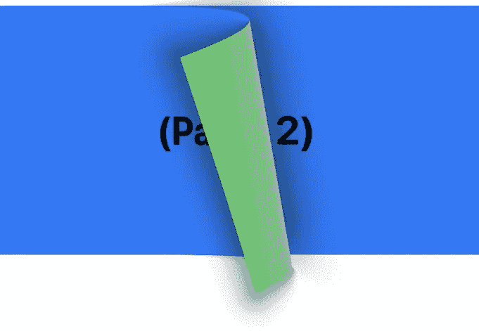
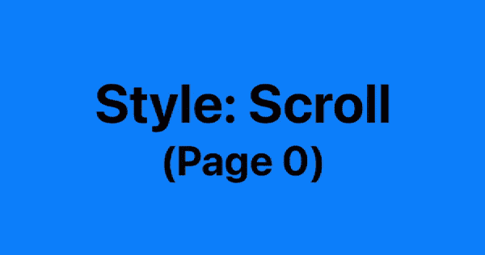
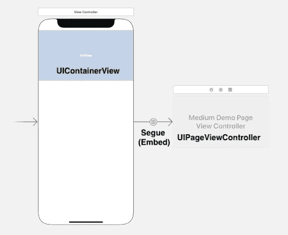
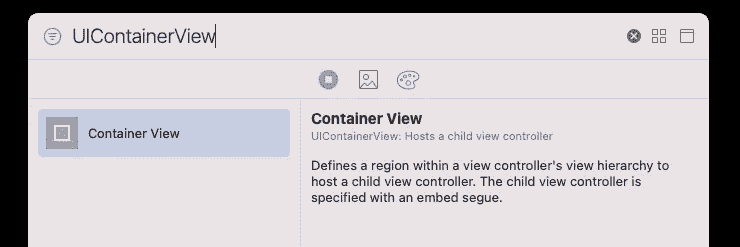
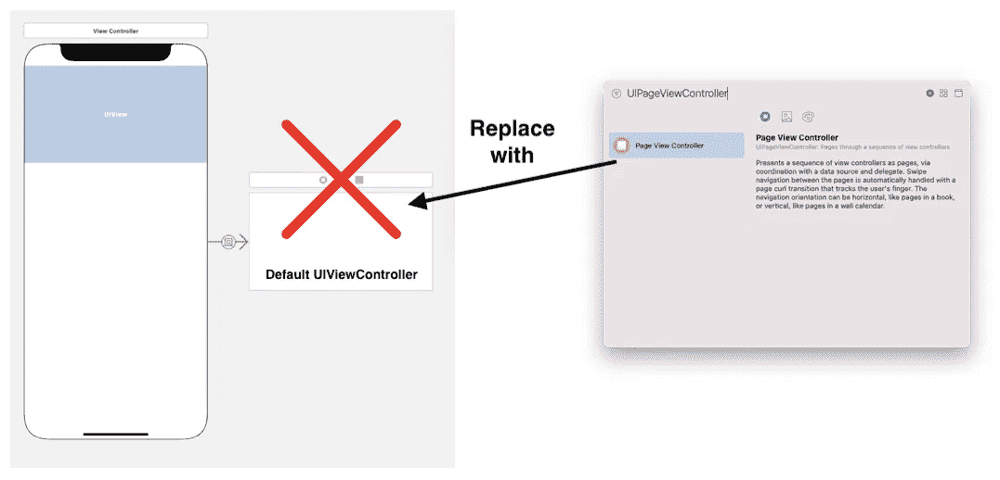
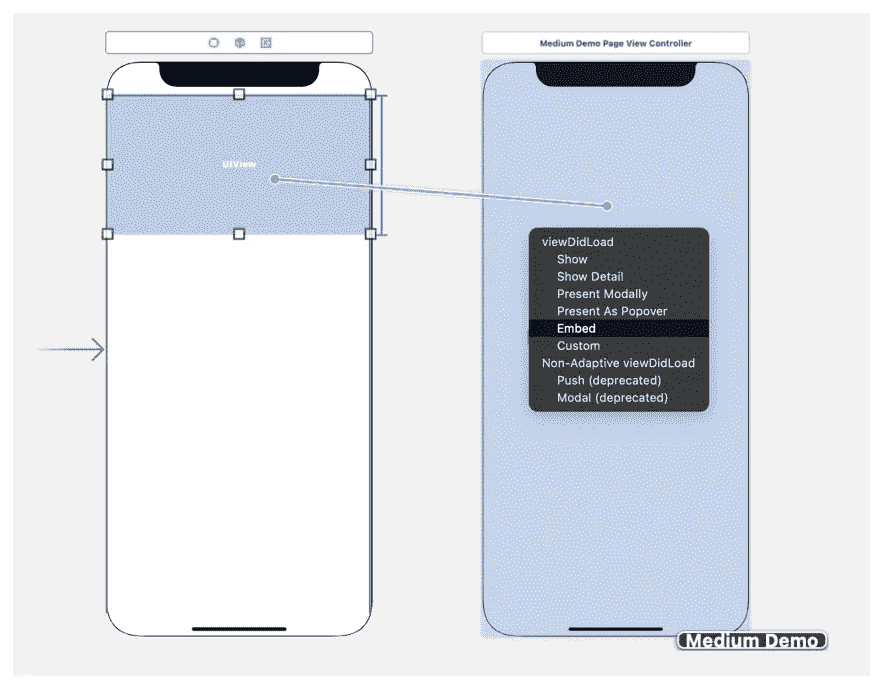
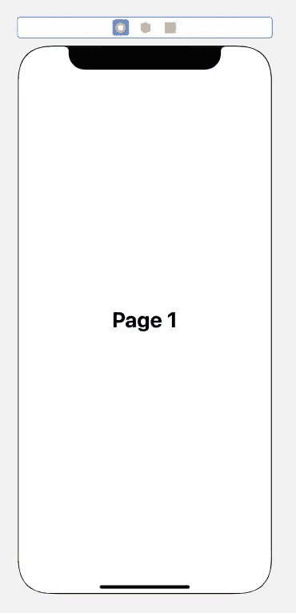
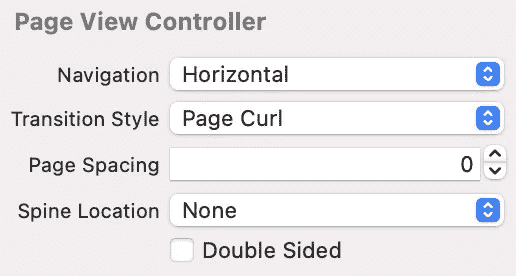
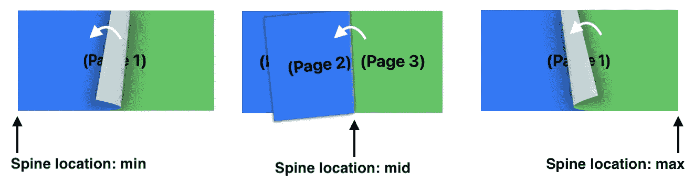
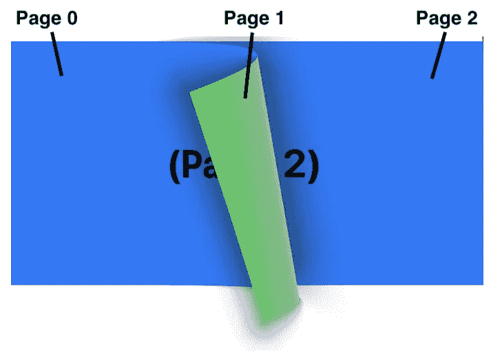

# iOS UIPageViewController —简单！！！

> 原文：<https://itnext.io/ios-uipageviewcontroller-easy-dd559c51ffa?source=collection_archive---------1----------------------->

## UIPageViewController 对于用很棒的动画显示一系列 UIViewControllers 中的信息很有用。你可以在任何地方看到这个小工具，例如 App Store、WhatsApp 和 Album app。

UIPageViewController 是当今许多现代应用程序中常用的小部件。当用户在它上面滑动时，它可以显示一系列单独的 UIViewController。一个著名的例子是 App Store 应用中的应用列表页面:

有两种类型的`UIPageViewController`——“卷页”和“滚动”。“页面卷曲”一个看起来像一本真正的书，有书脊，用户可以用可爱的动画翻页。“Scroll”one 就像一个带有分页功能的`UIScrollView`。

# 循序渐进的教程

## **步骤 1)** 给一个`UIViewController`增加一个`UIContainerView`

## **步骤 2)** 用`UIPageViewController`替换默认的`UIViewController`

## **步骤 3)** 用`Embed`关系将`UIContainerView`与`UIPageViewController`连接

## 为每个单独的页面创建一个简单的`UIViewController`(例如`DemoIndividualPageViewController`)

## **步骤 5)** 编码上`CustomPageViewController`

在第 8–13 行，我们创建了一个`UIViewController`列表来存储所有的单个页面。

在第 15 行，我们将`CustomPageViewController`的起始页初始化为`UIViewController`列表的第一个元素。

> 初始`UIViewController`的数量因不同的脊线位置属性而异。如果使用`mid`，则在`setViewControllers`功能处必须使用两个`UIViewController`。我们将在下节课讨论。

## **步骤 6)** 执行`UIPageViewControllerDataSource`定义上一页和下一页

## **第 7 步)**完成！让我们构建并运行应用程序吧！

# UIPageViewController 的不同配置

1.  **导航**:可以是水平的，也可以是垂直的，两者都是不言自明的
2.  **过渡风格**:**页面卷曲**或**滚动**

3.**页面间距**

4.**书脊位置**:可以是`none`、`min`、`mid`或`max`中的一种

你可以想象在`page curl`模式下的`UIPageViewController`就像一本书在不同的页面之间翻动。每本书都有一个故事。

此外，当书脊位置设置为`mid`时，必须有**和**同时显示 2 页。我们需要确保`UIViewController`列表的长度是偶数，并用两个**`UIViewController`的列表初始化`UIPageViewController`。否则，将会出现运行时错误。**

> ***当过渡样式设置为`Scroll`时，没有关于脊线位置的概念。因此，在这种情况下，脊线位置始终是`none`。**

**5.**双面**:**

****

**该属性决定了`UIPageViewController`(或一本书)中的页面是否应该双面打印。在我看来，只有当书脊位置和过渡样式被设置为`mid`和`page curl`时，该属性才应该被设置为`true`，否则偶数页将从用户界面中消失(见上图中的绿色页面 1)！**

> **由于`scroll` UIPageViewController 没有翻转功能，因此`double sided`属性不会产生任何影响。**

# **摘要**

**`UIPageViewController`可以用动画显示一系列`UIViewController`。页面卷曲模式可以像书脊位置不同的书一样显示`UIViewController` s。如果书脊位置设置为`mid`，请确保`UIViewController`的数量必须是偶数，并且用两个**`UIViewController`s 初始化`UIPageViewController`！****

# ****阅读更多参考资料****

**** [## iOS —带有 UIPageViewController 的自定义 UIPageControl

### 我们如何尽可能优雅地定制 UIPageControl？色调和图像来源？点击查看更多！

myrickchow.medium.com](https://myrickchow.medium.com/ios-custom-uipagecontrol-with-uipageviewcontroller-2d02db5ab090)  [## UIPageViewController | Apple 开发者文档

developer.apple.com](https://developer.apple.com/documentation/uikit/uipageviewcontroller)  [## uipageviewcontrolerdatasource | Apple 开发者文档

developer.apple.com](https://developer.apple.com/documentation/uikit/uipageviewcontrollerdatasource)  [## UIPageViewControllerDelegate | Apple 开发者文档

developer.apple.com](https://developer.apple.com/documentation/uikit/uipageviewcontrollerdelegate)**** ****************

****感谢您阅读这篇文章。希望你觉得有趣和有用！欢迎您关注我，并通过以下渠道与我联系:****

1.  ****[Twitter @ myrik _ chow](https://twitter.com/myrick_chow)****
2.  ****[YouTube @ myrick show](https://www.youtube.com/channel/UC_UEqZPDms3rtX5W-m9hgxg)****
3.  ****[LinkedIn @ myrik Chow](https://www.linkedin.com/in/myrick-chow-720b34118/)****