# GTM 堆栈:边缘的物联网数据分析

> 原文：<https://itnext.io/iot-data-analytics-at-the-edge-d116b6681d7b?source=collection_archive---------1----------------------->

## 利用基于 ARM 架构的 Grafana、Mosquitto 和 TimescaleDB 探索边缘物联网数据分析

*在接下来的文章中，我们将探讨几个开源软件应用程序的集成，以构建一个物联网边缘分析堆栈，旨在基于 ARM 的边缘节点上运行。我们将使用堆栈来收集、分析和可视化物联网数据，而无需首先将数据传输到云或其他外部系统。*

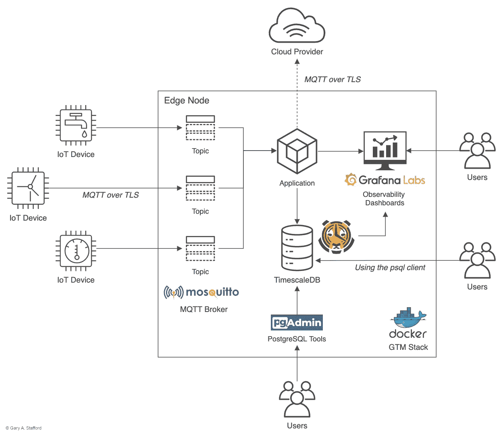

GMT 物联网边缘分析堆栈架构(I *作者*的图像)

# 边缘

边缘计算是一种快速发展的技术趋势，它涉及到将计算能力推向*边缘*。[维基百科](https://en.wikipedia.org/wiki/Edge_computing)将边缘计算描述为一种分布式计算范式，它将计算和数据存储带到更靠近所需位置的地方，以缩短响应时间并节省带宽。术语*边缘*通常是指网络边缘的计算节点(*边缘设备*)，位于数据源附近，在数据源和外部系统(如云)之间。

在他最近的文章[边缘计算的 3 个优点(和 1 个缺点)](https://www.linkedin.com/pulse/3-advantages-1-disadvantage-edge-computing-bernard-marr/)中，著名的未来学家 Bernard Marr 认为降低带宽需求、减少延迟、增强安全性和隐私性是边缘计算的三个主要优点。Marr 建议，由于数据下采样等技术，边缘计算的一个潜在缺点是，在寻求节省带宽和减少延迟的过程中，重要数据可能会被忽略和丢弃。

Quiss Technology PLC 的营销主管 David Ricketts 在他的帖子[云计算和边缘计算——2018 年你需要知道的统计数据](https://www.linkedin.com/pulse/cloud-edge-computing-stats-you-need-know-2018-david-ricketts/)中估计，到 2022 年，全球边缘计算市场预计将达到 67.2 亿美元，年复合增长率高达 35.4%。意识到市场潜力，许多主要的云提供商、边缘设备制造商和集成商正在快速扩展他们的边缘计算能力。例如，[AWS 目前在边缘计算领域提供了](https://aws.amazon.com/edge/)十几项服务。

# 物联网

边缘计算经常与物联网(IoT)联系在一起。物联网设备、工业设备和传感器生成数据，这些数据通常通过边缘节点(如物联网网关)传输到其他内部和外部系统。物联网设备通常会生成时序数据。根据维基百科的说法，时间序列是一组按时间顺序排列的数据点——在连续的等距时间点上拍摄的序列。物联网设备通常会生成持续的高容量时序数据流，通常每秒钟数百万个数据点。物联网数据特征要求物联网平台最低限度地支持时态准确性、大容量摄取和处理、高效的数据压缩和下采样以及实时查询功能。

物联网设备和边缘设备，如物联网网关，将物联网数据从这些设备聚合并传输到外部系统，通常功耗较低，处理器、内存和存储能力有限。因此，物联网平台必须满足物联网数据的所有要求，同时支持资源受限的环境。

# 边缘的物联网分析

领先的云提供商 AWS、Azure、谷歌云、IBM 云、甲骨文云和阿里云都提供物联网服务。许多公司提供具有边缘计算能力的物联网服务。AWS 提供 [AWS 物联网绿草](https://aws.amazon.com/greengrass/)。Greengrass 为边缘设备提供本地计算、消息传递、数据管理、同步和 ML 推理功能。Azure 提供 [Azure IoT Edge](https://azure.microsoft.com/en-us/services/iot-edge/) 。Azure IoT Edge 提供了在使用标准容器的边缘设备上运行 AI、Azure 和第三方服务以及自定义业务逻辑的能力。谷歌云提供[边缘 TPU](https://cloud.google.com/edge-tpu) 。Edge TPU(张量处理单元)是谷歌专门打造的专用集成电路(ASIC)，旨在边缘运行人工智能。

## 物联网分析

许多云提供商也提供物联网分析作为其物联网服务套件的一部分，尽管不是在边缘。AWS 提供 [AWS 物联网分析](https://aws.amazon.com/iot-analytics)，而 Azure 拥有 [Azure 时序洞察](https://azure.microsoft.com/en-us/services/time-series-insights/#features)。谷歌通过[下游分析系统](https://cloud.google.com/solutions/iot)和使用[谷歌 BigQuery](https://cloud.google.com/bigquery) 的特别分析或使用[云机器学习引擎](https://cloud.google.com/ml-engine)的高级分析和机器学习，间接地提供物联网分析。这些服务通常都需要将数据传输到云中进行分析。

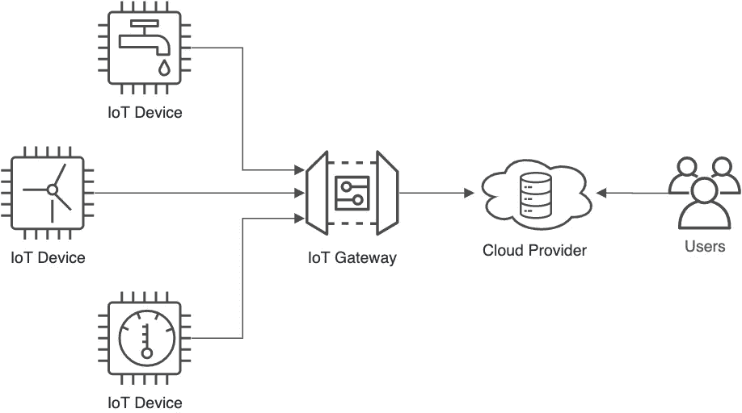

以云为中心的物联网平台数据流(作者的图片)

随着数据实时流动，在边缘分析物联网数据的能力对于快速反馈循环至关重要。物联网边缘分析可以加快异常检测，提高预测性维护能力，并加快主动库存补充。

# 物联网边缘分析堆栈

在我看来，理想的物联网边缘分析堆栈由轻量级、专门构建、易于部署和管理、平台和编程语言无关的开源软件组件组成。最小的物联网边缘分析堆栈应该包括一个轻量级消息代理、一个时序数据库、一个 ANSI 标准的特别查询引擎和一个数据可视化工具。每个组件都应为物联网量身打造。

## 轻量级消息代理

我们将使用[Eclipse mosquito](https://mosquitto.org/)作为我们的消息代理。根据该项目的描述，Mosquitto 是一个开源的消息代理，它实现了[消息队列遥测传输](https://en.wikipedia.org/wiki/MQTT) (MQTT)协议版本 5.0、3.1.1 和 3.1。Mosquitto 是轻量级的，适用于从低功耗单板计算机(SBC)到全服务器的所有设备。

## MQTT 客户端库

我们将使用 [Eclipse Paho](https://www.eclipse.org/paho/) 与 Mosquitto 进行交互。根据该项目，Eclipse Paho 项目提供了开源的、主要是客户端的 MQTT 和 MQTT-SN 的各种编程语言的实现。传感器网络的 MQTT 和[MQTT](https://www.u-blox.com/en/blogs/insights/mqtt-sn)(MQTT-SN)分别是 TCP/IP 和 UDP 等无连接协议的轻量级发布/订阅消息传输。

我们将使用泛美卫生组织的 Python 客户端。 [Paho Python 客户端](https://www.eclipse.org/paho/index.php?page=clients/python/index.php)提供了一个客户端类，支持 Python 2.7 或 3.x 上的 MQTT v3.1 和 v3.1.1。该客户端还提供了助手函数，使向 MQTT 服务器发布消息变得简单明了。

## 时间序列数据库

时序数据库最适合存储物联网数据。[据领先的时间序列数据库制造商 InfluxData](https://www.influxdata.com/time-series-database/) 称， [InfluxDB](https://www.influxdata.com/products/influxdb-overview/) 是一个时间序列数据库(TSDB)，是一个为时间戳或时间序列数据优化的数据库。时间序列数据只是随着时间的推移而被跟踪、监控、缩减采样和聚合的测量值或事件。阿里云的焦贤就时序数据库生态系统撰写了一篇颇有见地的文章，[什么是时序数据库？](https://www.alibabacloud.com/blog/what-are-time-series-databases_595165#)一些领先的云提供商提供专门构建的时间序列数据库，尽管它们在边缘不可用。AWS 提供[亚马逊时间流](https://aws.amazon.com/timestream)阿里云提供[时间序列数据库](https://www.alibabacloud.com/product/hitsdb)。

InfluxDB 是时序数据库的绝佳选择。在开发这个堆栈时，它是我的第一选择，还有 TimescaleDB。然而， [InfluxDB](https://www.influxdata.com/) Flux 与一些基于 ARM 的架构明显不兼容，因此排除了将其包含在本文的堆栈中。

我们将使用[时标数据库](https://www.timescale.com/)作为我们的时间序列数据库。TimescaleDB 是领先的时序数据开源关系数据库。TimescaleDB 被描述为“时间序列的 PostgreSQL”，它基于 PostgreSQL，提供完整的 ANSI SQL、坚如磐石的可靠性和庞大的生态系统。TimescaleDB 声称其查询速度比 PostgreSQL、InfluxDB 和 MongoDB 快 10 到 100 倍，并针对时序分析进行了本机优化。

TimescaleDB 设计用于执行分析查询，通过其对 PostgreSQL 的全部 SQL 功能的本机支持，以及 TimescaleDB 本机的[附加函数](https://docs.timescale.com/latest/using-timescaledb/reading-data#advanced-analytics)。这些时序优化函数包括中位数/百分位数、累积和、移动平均、增长率、比率、增量、时段、直方图和差距填充。

## 特定数据查询引擎

我们可以选择使用基于终端的 PostgreSQL 前端`psql`，对 TimescaleDB 执行特定查询。`psql`前端使您能够交互式地输入查询，将它们发送给 PostgreSQL，并查看查询结果。

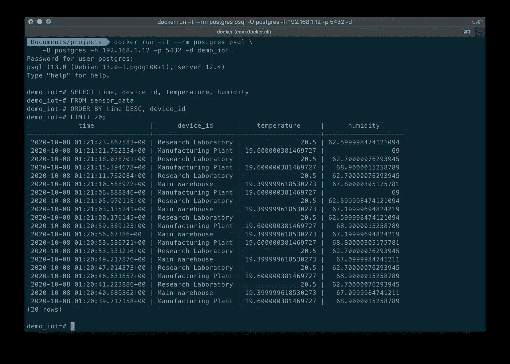

用于查询 TimescaleDB 数据库的基于 psql 终端的界面视图

我们还可以选择使用 [pgAdmin](https://www.pgadmin.org/) ，特别是 [biarms/pgadmin4](https://hub.docker.com/r/biarms/pgadmin4) Docker 版本，来执行特定查询和大多数其他数据库任务。pgAdmin 是 PostgreSQL 最流行的开源管理和开发平台。虽然几个流行的 Docker 版本的 [pgAdmin](https://www.pgadmin.org/) 只支持 Linux AMD64 架构，但是 [biarms/pgadmin4](https://hub.docker.com/r/biarms/pgadmin4) Docker 版本支持基于 ARM 的设备。

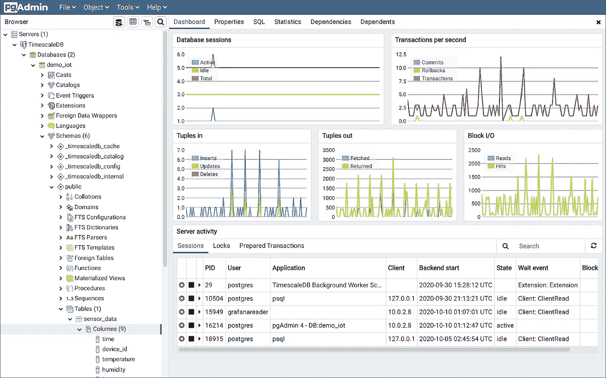

pgAdmin UI 中 TimescaleDB 数据库的仪表板视图

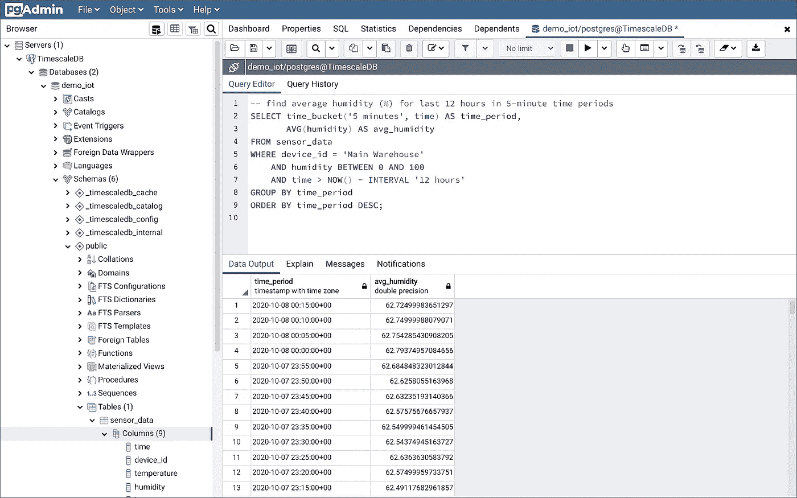

使用 pgAdmin 的查询工具对 TimescaleDB 数据库执行查询

## 数据可视化

对于数据可视化，我们将使用 Grafana。 [Grafana](https://grafana.com/) 允许您查询、可视化、提醒和理解指标，无论它们存储在哪里。借助 Grafana，您可以创建、探索和共享仪表板，培养数据驱动的文化。Grafana 允许您直观地定义阈值，并通过 Slack、PagerDuty 等得到通知。Grafana 支持[几十种](https://grafana.com/grafana/plugins?type=datasource)数据源，包括 MySQL、PostgreSQL、Elasticsearch、InfluxDB、TimescaleDB、Graphite、Prometheus、Google BigQuery、GraphQL 和 Oracle。Grafana 可通过一个[大型插件集合](https://grafana.com/grafana/plugins)进行扩展。

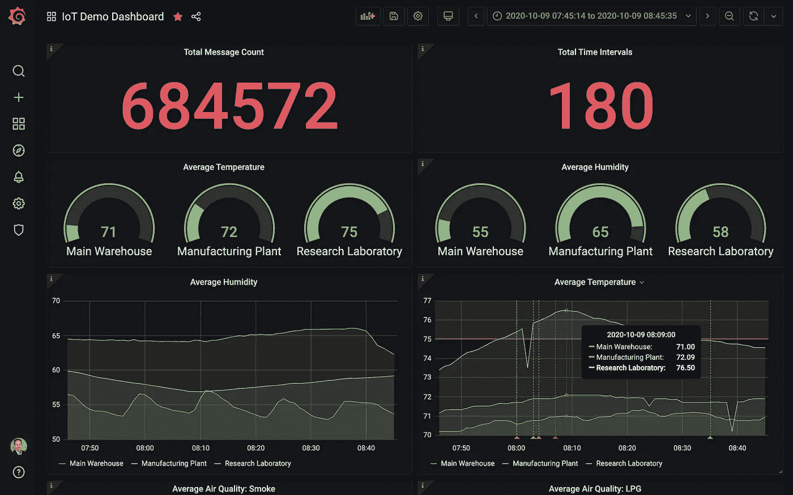

显示邮报物联网传感器数据的 Grafana 仪表板示例

## 边缘部署和管理平台

Docker 在 2013 年推出了集装箱的现行行业标准。Docker [containers](https://www.docker.com/resources/what-container) 是一个标准化的软件单元，允许开发人员将应用程序与他们的环境隔离开来。我们将使用 Docker 将物联网边缘分析堆栈(这里称为 GTM 堆栈)部署到基于 ARM 的边缘节点，该堆栈由 Eclipse **M** osquitto、 **T** imescaleDB 和 **G** rafana 以及 pgAdmin 的容器化版本组成。缩写 GTM 来自于组成这个堆栈的三个主要的 OSS 项目。这个首字母缩写词还暗示了**G**reenwich**M**ean**T**ime，与物联网数据的精确时序性质有关。


GMT 物联网边缘分析堆栈架构(作者为我*的图片*

在 swarm 模式下运行 Docker 引擎，我们可以使用 Docker 将完整的物联网边缘分析堆栈部署到 swarm，运行在边缘节点上。deploy 命令接受 Docker Compose 文件形式的堆栈描述，Docker Compose 文件是用于配置应用程序服务的 YAML 文件。只需一个命令，我们就可以从配置文件中创建并启动所有服务。

# 源代码

这篇文章的所有源代码可以在 [GitHub](https://github.com/garystafford/iot-analytics-at-the-edge) 上找到。使用下面的命令来`git clone`项目的本地副本。

# 物联网设备

在这篇文章中，我部署了三个基于 Linux ARM 的物联网设备，每个设备都连接到一个传感器阵列。每个传感器阵列包含多个模拟和数字传感器。传感器记录温度、湿度、空气质量(液化石油气(LPG)、一氧化碳(CO)和烟雾)、光线和运动。有关物联网设备和传感器硬件的更多信息，请参见我以前的帖子。

[](https://towardsdatascience.com/getting-started-with-iot-analytics-on-aws-5f2093bcf704) [## AWS 物联网分析入门

### 借助 AWS 物联网分析，近乎实时地分析来自物联网设备的环境传感器数据

towardsdatascience.com](https://towardsdatascience.com/getting-started-with-iot-analytics-on-aws-5f2093bcf704) 

每个基于 ARM 的物联网设备都运行一个基于 Python3 的小脚本，[sensor _ data _ to _ mosquitto . py](https://github.com/garystafford/iot-analytics-at-the-edge/blob/main/scripts/sensor_data_to_mosquitto.py)，如下所示。

物联网设备的脚本实现了 [Eclipse Paho](http://eclipse.org/paho/) MQTT Python 客户端库。包含来自每个传感器的同步读数的 MQTT 消息以可配置的频率发送到边缘节点上的 Mosquitto 主题。

# 物联网边缘节点

在这篇文章中，我部署了一个基于 Linux ARM 的边缘节点。这三个包含传感器阵列的物联网设备通过 Wi-Fi 与边缘节点通信。物联网设备可以轻松使用替代通信协议，如 BLE、LoRaWAN 或以太网。想了解更多关于 BLE 和劳拉旺的信息，请看我以前的一些帖子。

[](/lora-for-iot-1f91085c5917) [## 面向物联网的 LoRa 和 LoRaWAN

### 面向物联网低功耗广域网的 LoRa 和 LoRaWAN 协议入门

itnext.io](/lora-for-iot-1f91085c5917) [](/ble-and-gatt-for-iot-2ae658baafd5) [## BLE 与关贸总协定的物联网

### 物联网蓝牙低能耗(BLE)和通用属性配置文件(GATT)规范入门

itnext.io](/ble-and-gatt-for-iot-2ae658baafd5) 

边缘节点还运行一个基于 Python3 的小脚本，[mosquitto _ to _ timescaledb . py](https://github.com/garystafford/iot-analytics-at-the-edge/blob/main/scripts/mosquitto_to_timescaledb.py)，如下所示。

与物联网设备类似，边缘节点的脚本实现了 [Eclipse Paho](http://eclipse.org/paho/) MQTT Python 客户端库。该脚本从 Mosquitto 主题中提取 MQTT 消息，将消息负载序列化为 JSON，并将负载数据写入 TimescaleDB 数据库。edge 节点的脚本接受几个参数，这些参数允许您配置必要的 Mosquitto 和 TimescaleDB 变量。

## 为什么不用 Telegraf？

Telegraf 是一个插件驱动的代理，它收集、处理、聚合和编写指标。有一个 Telegraf 输出插件，TimescaleDB 出品的 Telegraf 的 [PostgreSQL 和 TimescaleDB 输出插件。该插件可以取代管理和维护上述脚本的需要。然而，我选择不使用它，因为它还不是官方的 Telegraf 插件。如果这个插件包含在 Telegraf 版本中，我当然会鼓励使用它。](https://docs.timescale.com/latest/tutorials/telegraf-output-plugin)

## 脚本管理

基于 Linux 的物联网设备和边缘节点都运行`[systemd](https://www.freedesktop.org/wiki/Software/systemd/)`系统和服务管理器。为了确保 Python 脚本在系统重启的情况下继续运行，我们定义了一个`systemd`单元。单元是`systemd`知道如何管理的对象。这基本上是系统资源的标准化表示，可以由守护进程套件管理，并由提供的实用程序操作。每个脚本都有一个`systemd`单元文件。下面，我们看到的是`gtm_stack_mosquitto`单元文件，[GTM _ stack _ mosquitto . service](https://github.com/garystafford/iot-analytics-at-the-edge/blob/main/systemctl/gtm_stack_mosquitto.service)。

`gtm_stack_mosq_to_tmscl`单元文件[GTM _ stack _ mosq _ to _ TMS cl . service](https://github.com/garystafford/iot-analytics-at-the-edge/blob/main/systemctl/gtm_stack_mosq_to_tmscl.service)几乎相同。

要在每个物联网设备上安装`gtm_stack_mosquitto.service` `systemd`单元文件，请使用以下命令:

在边缘节点上安装`gtm_stack_mosq_to_tmscl.service`单元文件几乎是相同的。

# 码头栈

边缘节点在[群](https://docs.docker.com/engine/swarm/)中运行 GTM Docker 栈 [stack.yml](https://github.com/garystafford/iot-analytics-at-the-edge/blob/main/docker/stack.yml) 。如前所述，堆栈包含四个容器:Eclipse Mosquitto、TimescaleDB 和 Grafana，以及 pgAdmin。Mosquitto、TimescaleDB 和 Grafana 容器在容器内有路径，绑定到边缘设备上的目录。使用绑定装载，如果容器被删除并重新创建，容器的数据将会持续存在。这些容器运行在它们自己隔离的[覆盖网络](https://docs.docker.com/network/overlay/)上。

使用以下命令在边缘节点上安装 GTM Docker 堆栈。对于这篇文章，我们将假设 Docker 和 git 预安装在边缘节点上。

首先，我们在边缘设备上创建适当的本地目录，它将用于绑定到容器的目录。下面，我们看到了绑定挂载的本地目录，其中存储了最终容器的内容。

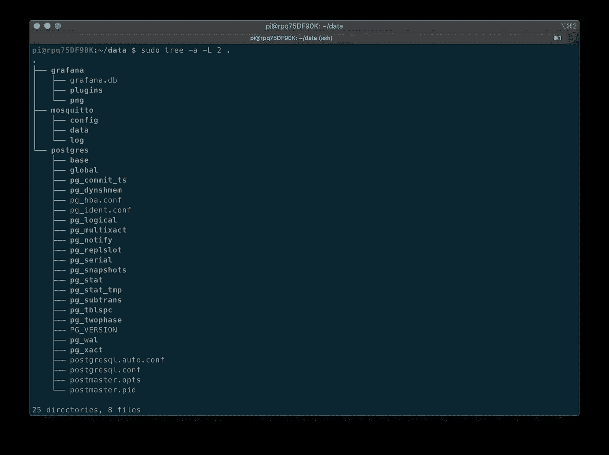

堆栈中边缘设备上绑定装载的本地目录

接下来，我们将项目中包含的自定义 Mosquitto 配置文件 [mosquitto.conf](https://github.com/garystafford/iot-analytics-at-the-edge/blob/main/docker/mosquitto.conf) 复制到边缘设备上的正确位置。最后，我们初始化 Docker swarm 并部署堆栈。

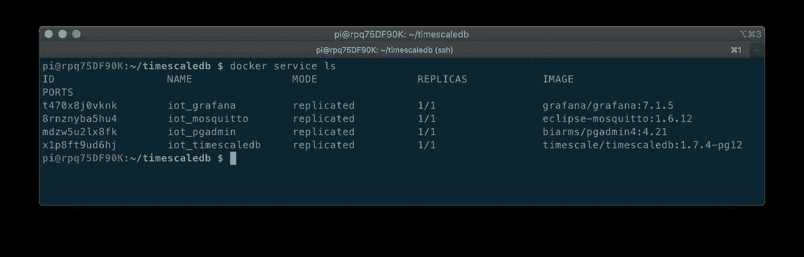

'`docker container ls'`命令的输出，显示正在运行的 GTM 堆栈容器

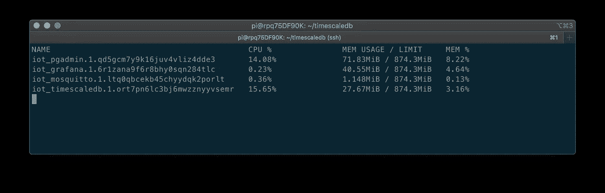

“docker stats”命令的输出，显示 GTM 堆栈容器的资源消耗

# 时标 DB 设置

随着 GTM 堆栈的运行，我们需要在 TimescaleDB `demo_iot`数据库中创建一个单独的时间刻度[超级表](https://docs.timescale.com/latest/using-timescaledb/hypertables)、`sensor_data`，以保存传入的物联网传感器数据。根据 TimescaleDB 的说法，Hypertables 被设计成易于管理，其行为类似于标准的 PostgreSQL 表。超表由许多相互链接的“块”表组成。对超表发出的命令自动将改变向下传播到属于该超表的所有块。

我建议使用`psql`来执行所需的 DDL 语句，这将创建超表，以及后续的视图和数据库用户权限。所有 SQL 语句都包含在项目的 [statements.sql](https://github.com/garystafford/iot-analytics-at-the-edge/blob/main/sql/statements.sql) 文件中。使用`psql`的一种方法是将其安装在本地工作站上，然后使用`psql`连接到远程边缘节点。我更喜欢实例化一个运行`psql`的本地 PostgreSQL Docker 容器实例。然后，我使用本地容器的`psql`客户端连接到边缘节点的 TimescaleDB 数据库。例如，在我的本地机器上，我运行下面的`docker run`命令来连接到位于本地`192.168.1.12`的 edge 节点上的 TimescaleDB 数据库。

虽然并不总是可行，但也可以使用下面的`docker exec`命令从运行在实际边缘节点上的 TimescaleDB Docker 容器中访问`psql`:

## 时标 b 连续聚合

对于这篇文章的演示，我们需要创建四个 TimescaleDB 数据库视图[和](https://www.postgresqltutorial.com/postgresql-views/)，这些视图将从 Grafana 仪表板中查询。视图是时标 DB [连续集合](https://docs.timescale.com/latest/using-timescaledb/continuous-aggregates)。根据时间尺度，触及大量时间序列数据的聚合查询可能需要很长时间来计算，因为系统需要在每次查询执行时扫描大量数据。TimescaleDB 连续聚合在后台自动计算查询结果，并将结果具体化。

例如，在这篇文章中，我们每五秒钟从三个物联网设备生成一次传感器数据。当在 Grafana 中可视化一个 24 小时周期时，使用间隔为一分钟的连续聚合，我们将查询的数据总量从大约 51，840 行减少到大约 4，320 行，减少了 91%以上。被分析的物联网设备的时间段或数量越大，这些节省对查询性能的积极影响就越大。

所有连续聚集视图都需要 hypertable 的时间分区列上的`time_bucket`。在这种情况下，`time_bucket`功能的铲斗宽度(*间隔*)为 1 分钟。间隔是可配置的。

## 限制 Grafana 对物联网数据的访问

遵循数据库用户权限的 [Grafana 建议](https://grafana.com/docs/grafana/latest/features/datasources/postgres/#database-user-permissions-important)，我们创建一个`grafanareader`PostgreSQL 用户，并限制该用户对`sensor_data`表和我们创建的四个视图的访问。Grafana 将使用这个用户的凭证从 TimescaleDB `demo_iot`数据库中执行`SELECT`查询。

# Grafana 仪表板

使用我们创建的 TimescaleDB 连续聚合，我们可以在 Grafana 中快速构建功能丰富的仪表板。下面我们看到了一个典型的物联网仪表板，你可以构建它来近乎实时地监控邮报的物联网传感器数据。GitHub 项目中包含一个导出版本[dashboard _ external _ export . JSON](https://github.com/garystafford/iot-analytics-at-the-edge/blob/main/dashboard/dashboard_external_export.json)。


显示邮报物联网传感器数据的 Grafana 仪表板示例

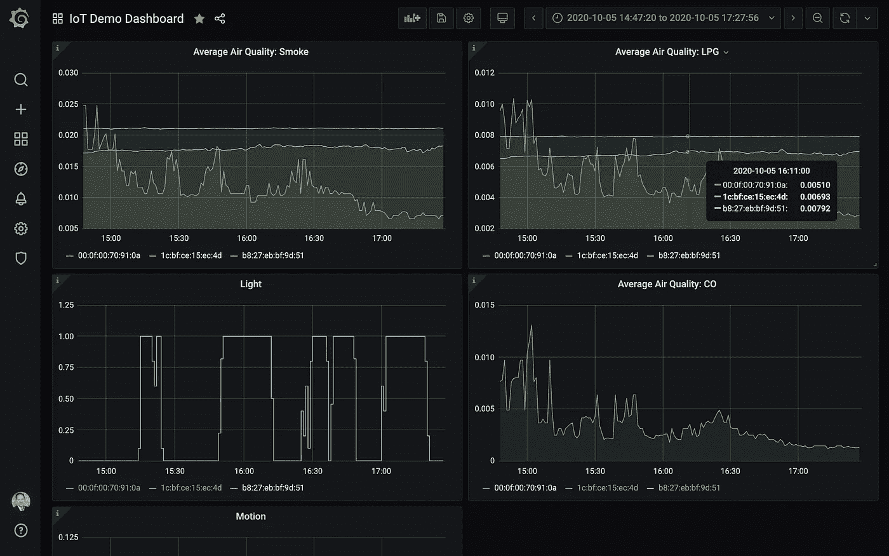

显示传感器数据的 Grafana 物联网演示仪表板示例

Grafana 的文档包括一套关于在 Grafana 中使用 PostgreSQL[的完整说明。为了从 Grafana 连接到 TimescaleDB 数据库，我们使用 PostgreSQL 数据源。](https://grafana.com/docs/grafana/latest/features/datasources/postgres/)

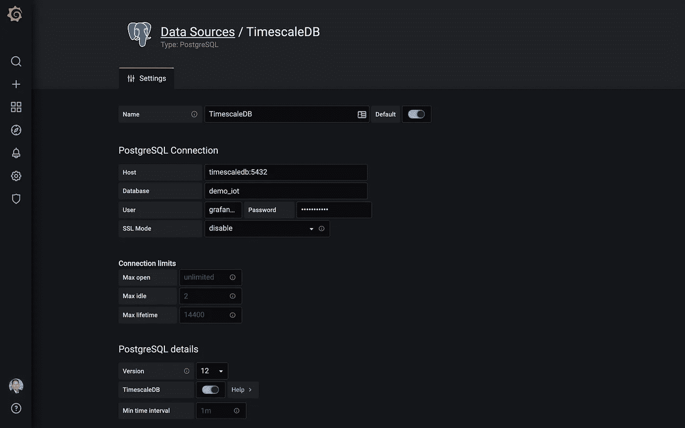

在 Grafana 中配置 TimescaleDB 数据库连接

Grafana 仪表板中每个面板中显示的数据都基于 SQL 查询。例如,“平均温度”面板可能会使用类似于以下示例的查询。这个特定的查询还将摄氏温度转换为华氏温度。注意 Grafana [宏](https://grafana.com/docs/grafana/latest/features/datasources/postgres/#macros)的使用(例如`$__time()`、`$__timeFilter()`)。可以在查询中使用宏来简化语法并允许动态部分。

```
SELECT
  $__time(bucket),
  device_id AS metric,
  ((avg_temp * 1.9) + 32) AS avg_temp
FROM temperature_humidity_summary_minute
WHERE
  $__timeFilter(bucket)
ORDER BY 1,2
```

下面，我们看到平均湿度面板的另一个例子。在这个特定的查询中，我们可能选择验证湿度数据在 0%–100%的可接受范围内。

```
SELECT
  $__time(bucket),
  device_id AS metric,
  avg_humidity
FROM temperature_humidity_summary_minute
WHERE
  $__timeFilter(bucket)
  AND avg_humidity >= 0.0
  AND avg_humidity <= 100.0
ORDER BY 1,2
```

## 移动友好

Grafana 仪表板是移动友好的。下面我们看到了仪表盘的两个视图，使用的是苹果 iPhone 上的 Chrome 移动浏览器。

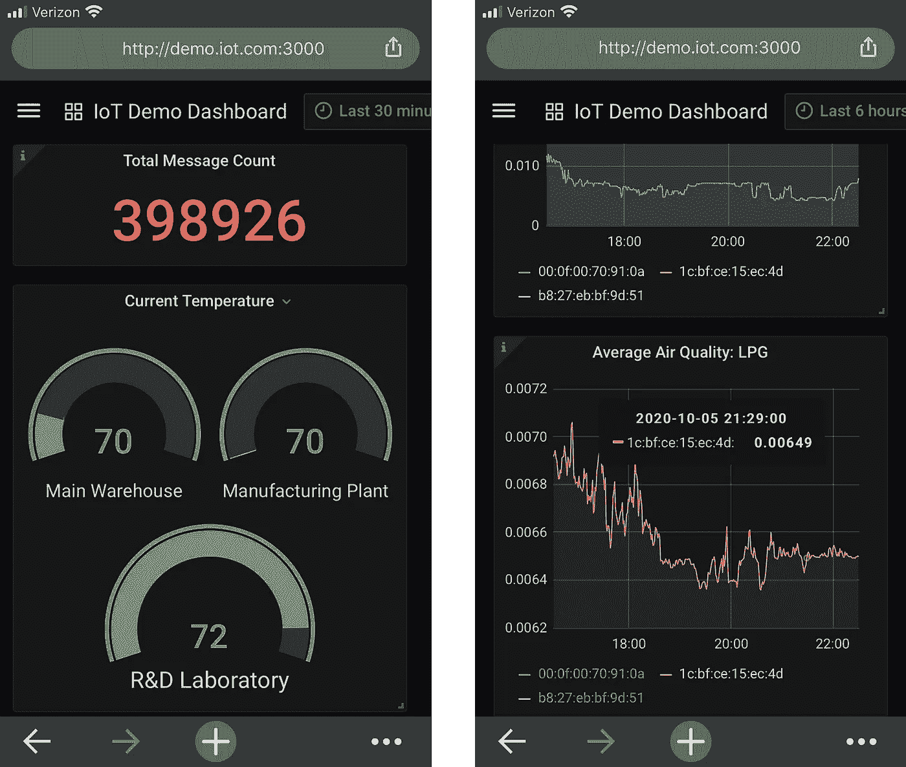

## Grafana 警报

Grafana 允许根据您在每个面板中定义的规则创建[警报](https://grafana.com/docs/grafana/latest/alerting/)。如果数据值符合您预先定义的规则条件，例如温度读数在设定的时间内高于特定阈值，则会向您选择的目的地发送警报。根据下面显示的规则，如果平均温度超过 75°F 达 5 分钟，就会发出警报。

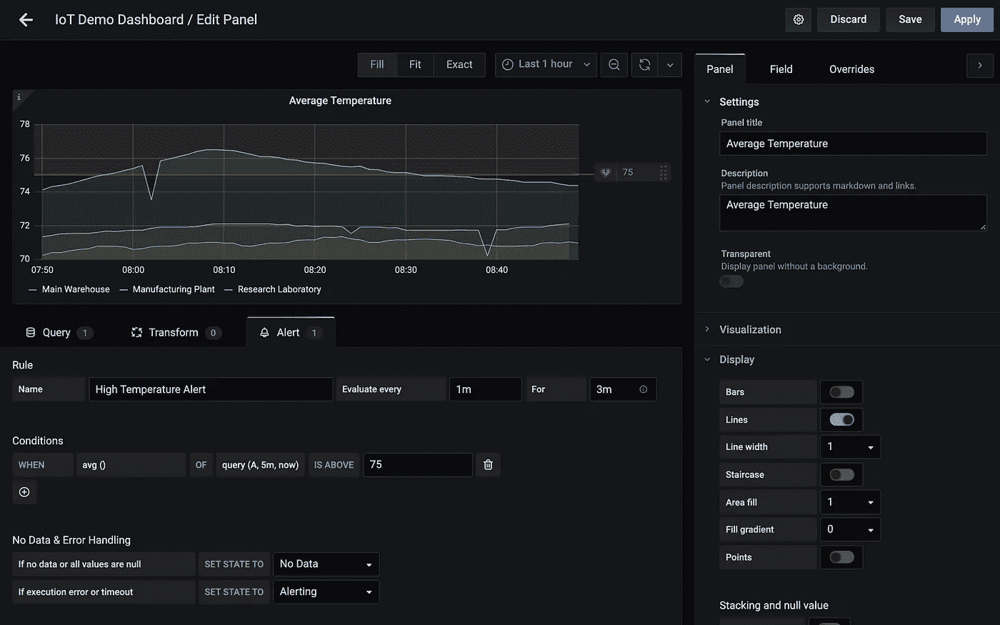

高温规则配置

如下所示，当实验室温度开始超过 75°F 时，警报进入“未决”状态。如果温度在预定的 5 分钟内超过 75°F，警报状态将变为“警报”,并将发出警报。当温度在预定的 5 分钟内降至 75°F 以下时，警报状态从“警报”变为“正常”,并发出后续通知。

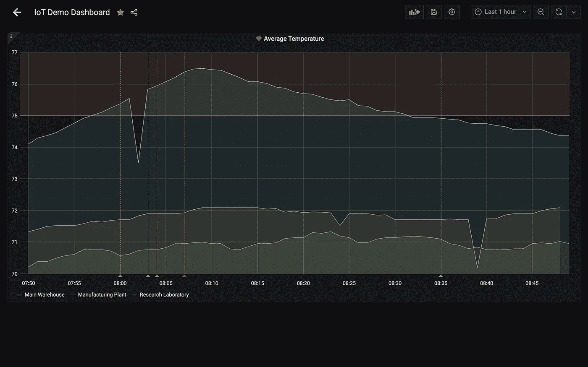

显示各种警报状态变化的平均温度图

目前 Grafana 有 18 个现成的目的地，包括 [Slack](https://slack.com/) 、email、PagerDuty、webhooks、HipChat 和微软团队。如果根据数据检测到问题，我们可以使用 Grafana Alerts 近乎实时地通知适当的资源。下面，我们看到了 Grafana 向 Slack 频道发送的一系列实际的高温警报，随后是温度恢复正常时的后续通知。

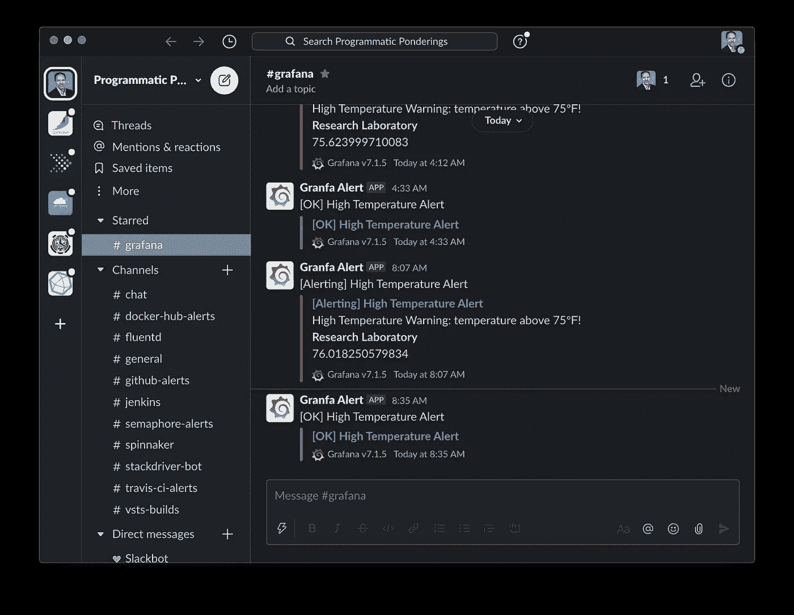

空闲频道中的 Grafana 警报通知

# 即席查询

对时序物联网数据执行即席查询的能力是物联网边缘分析堆栈的一项基本功能。我们可以使用`psql`或 pgAdmin 对 TimescaleDB 数据库执行特定查询。下面是我们可能对物联网传感器数据执行的典型即席查询的示例。这些示例查询展示了 TimescaleDB 处理时间序列数据的高级分析能力，包括[移动平均值](https://docs.timescale.com/latest/using-timescaledb/reading-data#moving-average)、[增量](https://docs.timescale.com/latest/using-timescaledb/reading-data#delta)、[时段](https://docs.timescale.com/latest/using-timescaledb/reading-data#time-bucket)和[直方图](https://docs.timescale.com/latest/using-timescaledb/reading-data#histogram)。

# 结论

在本文中，我们探讨了物联网边缘分析堆栈的开发，该堆栈由轻量级、专门构建、易于部署和管理、平台和编程语言无关的开源软件组件组成。这些组件包括 Eclipse Mosquitto、TimescaleDB、Grafana 和 pgAdmin 的 Docker 容器化版本，称为 GTM 栈。使用 GTM 堆栈，我们收集、分析和可视化了物联网数据，而无需首先将数据传输到云或其他外部系统。

这篇博客代表我自己的观点，而不是我的雇主亚马逊网络服务公司的观点。所有产品名称、徽标和品牌都是其各自所有者的财产。