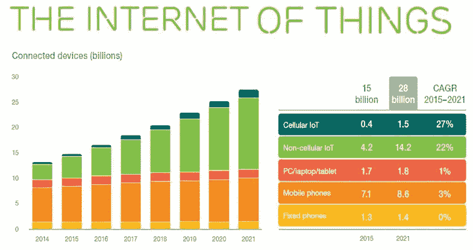

# 物联网设备将在 2018 年超过手机

> 原文：<https://itnext.io/iot-devices-will-surpass-mobile-phones-in-2018-5fe89dd93137?source=collection_archive---------6----------------------->

在爱立信最近发布的一份[移动性报告](https://www.ericsson.com/res/docs/2016/ericsson-mobility-report-2016.pdf)中，分享了关于我们数字社会发展的有趣事实。据爱立信称，物联网正在迅速改变移动领域，预计将在 2018 年超过手机，成为最大的互联设备类别。该报告中分享的见解似乎证实了物联网的预期增长潜力。鉴于 [Gartner](http://www.gartner.com/newsroom/id/3165317) 预测 2020 年物联网设备数量将达到 200 亿，爱立信估计将接近 160 亿。

## **关键发现**

报告中关于物联网的主要发现包括:

*   在不同类别的联网设备中，蜂窝物联网预计将有最高的增长，到 2021 年将达到 15 亿；
*   物联网传感器和设备预计将在 2018 年超过手机成为最大的互联设备类别(包括互联汽车、机器、公用事业仪表、远程计量和消费电子产品)；
*   物联网设备预计将以 23%的复合年增长率增长(CAGR)2015 年至 2021 年，西欧将增加最多的连接；
*   到 2021 年，全球总共将有大约 280 万台联网设备，其中近 160 万台与物联网相关。

下图比较了从 2015 年到 2021 年蜂窝物联网、非蜂窝物联网、PC/笔记本电脑/平板电脑、移动电话和固定电话连接设备的增长情况。

*爱立信利用各种内部和外部来源的历史数据进行了这项研究。趋势分析也通过使用他们的规划模型得到了验证。未来发展是根据宏观经济趋势、用户趋势、市场成熟度、技术发展预期以及内部假设和分析进行估计的。关于方法论的附加细节，可以在第 30 页的* [*研究*](https://www.ericsson.com/res/docs/2016/ericsson-mobility-report-2016.pdf) *中找到。*