# 使用谷歌协议缓冲区、谷歌云功能、云发布/订阅和 MongoDB Atlas 进行物联网遥测收集

> 原文：<https://itnext.io/iot-telemetry-collection-using-google-protocol-buffers-cloud-functions-pub-sub-and-mongodb-atlas-d5e4ff7ef50e?source=collection_archive---------1----------------------->


*使用 Google Protocol Buffers 的序列化二进制格式通过 HTTPS、无服务器 Google Cloud Functions、Google Cloud Pub/Sub 和 GCP 的 MongoDB Atlas 收集物联网传感器遥测数据，作为集成云物联网平台和标准物联网协议的替代方案。使用 MongoDB Compass、Jupyter Notebooks 和 Google 的 AI 平台笔记本等工具聚合、分析和构建机器学习模型。*

# 介绍

大多数占主导地位的云提供商都提供物联网(物联网)和 [IIotT](https://en.wikipedia.org/wiki/Industrial_Internet_of_Things) (工业物联网)集成服务。亚马逊拥有 [AWS 物联网](https://aws.amazon.com/iot/)，微软 Azure 拥有包括[物联网中心](https://azure.microsoft.com/en-us/services/iot-central/)在内的多种产品，IBM 的产品包括 [IBM Watson 物联网平台](https://www.ibm.com/cloud/internet-of-things)，阿里云拥有针对不同垂直市场的多种[物联网/IIoT 解决方案](https://www.alibabacloud.com/solutions/IoT)，谷歌提供[谷歌云物联网](https://cloud.google.com/solutions/iot/)平台。所有这些解决方案都作为工业级、高性能、可扩展的技术堆栈进行销售。它们能够扩展到成千上万的物联网设备或更多设备，以及海量的流遥测。

在现实中，并不是每个人都需要完全集成的物联网解决方案。学术机构、研究实验室、科技初创企业和许多商业企业希望将云用于物联网应用，但可能尚未准备好完全集成的物联网平台，或者抵制云供应商平台锁定。

同样，根据性能要求和应用类型，组织可能不需要或不想使用物联网/IIOT 行业标准数据和传输协议，如 [MQTT](http://mqtt.org/) (消息队列遥测传输)或 [CoAP](https://coap.technology/) (受限应用协议)，而不是 [UDP](https://en.wikipedia.org/wiki/User_Datagram_Protocol) (用户数据报协议)。他们可能更喜欢使用 TCP 通过 HTTP 传输遥测数据，或者安全地使用 [HTTPS](https://en.wikipedia.org/wiki/HTTPS) (HTTP over TLS)。

# 示范

在本次演示中，我们将从大量物联网设备传感器收集环境传感器数据，并通过互联网将遥测数据传输到谷歌云。每个物联网设备安装在不同的物理位置。这些设备包含各种常见的传感器，包括湿度和温度、运动和光强。

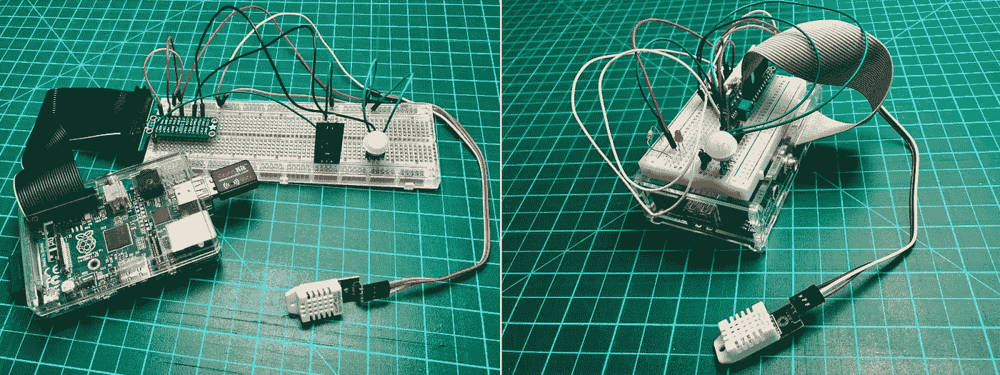

本次演示中使用的原型物联网设备

我们将通过 HTTP 将传感器遥测数据作为 JSON 传输到无服务器的谷歌云功能 HTTPS 端点。然后，我们将转而使用 Google 的协议缓冲区通过 HTTP 传输二进制数据。当我们从 JSON 迁移到 Protobuf 时，我们应该观察到请求负载中包含的消息大小有所减少，这应该会减少系统延迟和成本。

云函数通过 HTTP 接收的数据将异步发布到 Google Cloud Pub/Sub。第二个云功能将响应所有发布的事件，并将消息推送到 GCP 上的 MongoDB Atlas。一旦进入 Atlas，我们将使用 MongoDB Compass、Jupyter 笔记本和谷歌的 AI 平台笔记本等工具，对数据进行聚合、转换、分析和构建机器学习模型。

对于这个演示，HTTP 上的 JSON 的架构如下所示。所有传感器将数据传输到一个单一的云功能 HTTPS 端点。

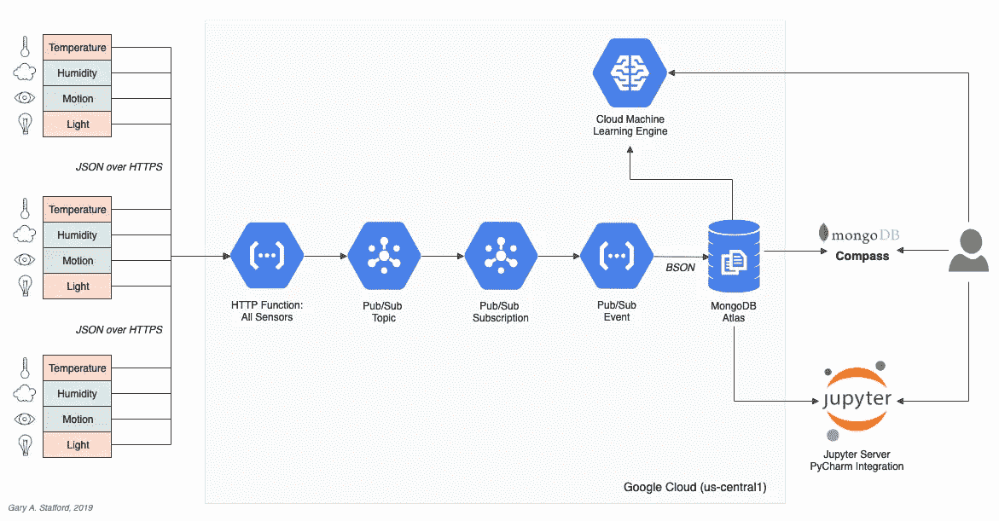

对于 HTTP 上的 Protobuf，该架构在演示中将如下所示。每种类型的传感器将数据传输到不同的云功能 HTTPS 端点。

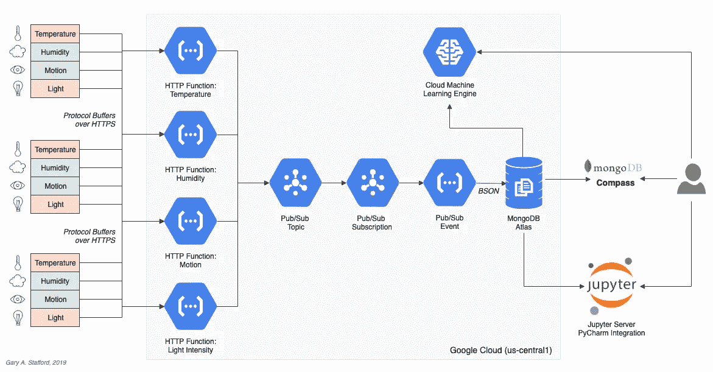

虽然云功能会自动水平扩展，以适应接收的遥测数据量所产生的额外负载，但也有其他选项来扩展系统。例如，我们可以为每种传感器类型创建单独的函数和主题/订阅管道。我们还可以根据传感器类型将遥测数据分割成多个 MongoDB Atlas 集合，而不是一个集合。在所有情况下，我们仍将受益于云功能的水平扩展能力。

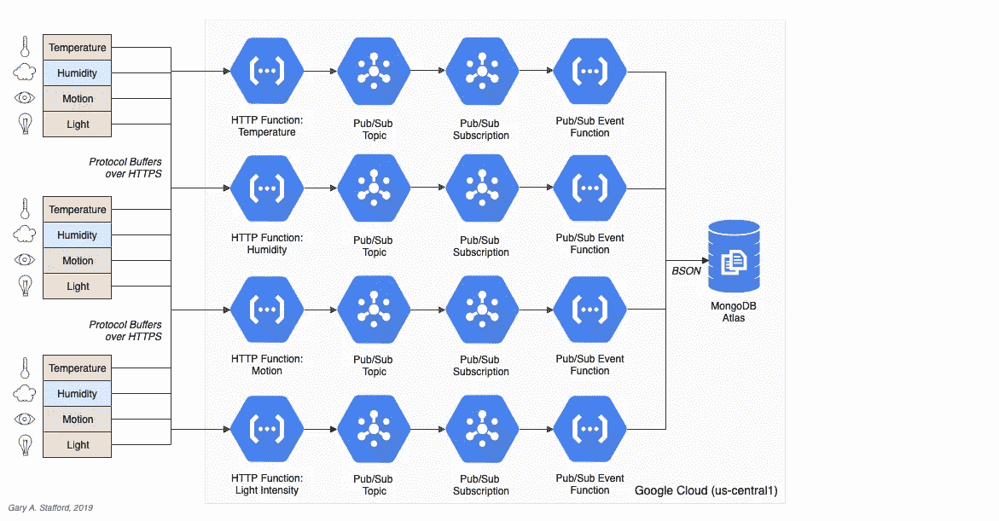

# 源代码

所有的源代码都可以在 GitHub 上找到。使用以下命令克隆项目。

```
git clone \
  --branch master --single-branch --depth 1 --no-tags \
  [https://github.com/garystafford/iot-protobuf-demo.git](https://github.com/garystafford/iot-protobuf-demo.git)
```

您需要调整项目的环境变量，以适应您自己的开发和云环境。这篇文章的所有源代码都是用 Python 写的。它是为 Python 3 解释器设计的，但是已经使用 Python 2 解释器进行了测试。该项目的 Jupyter 笔记本可以在 GitHub 上的项目中查看，或者使用免费的在线 Jupyter [nbviewer](https://nbviewer.jupyter.org/) 查看。

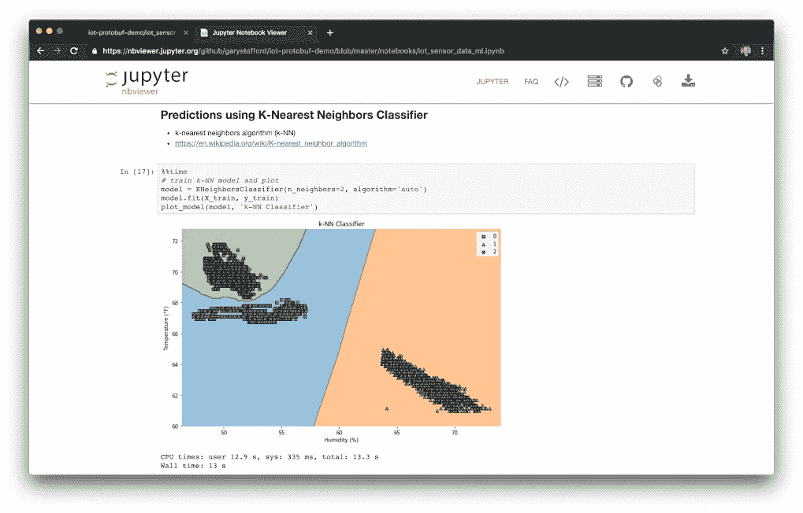

# 技术

## 协议缓冲区

根据 Google 的说法，[协议缓冲区](https://developers.google.com/protocol-buffers/) ( *又名 Protobuf* )是一种语言和平台中立的、高效的、可扩展的自动化机制，用于序列化结构化数据，以用于通信协议、数据存储等。协议缓冲区比 XML 小 3 到 10 倍，快 20 到 100 倍。

每个协议缓冲区消息都是一个小的信息逻辑记录，包含一系列强类型的名称-值对。一旦您定义了消息，您就可以在您的`.proto`文件上运行针对您的应用程序语言的[协议缓冲编译器](https://developers.google.com/protocol-buffers/docs/encoding)来生成数据访问类。

## 谷歌云功能

据谷歌称，[云功能](https://cloud.google.com/functions/features/)是谷歌的事件驱动、无服务器计算平台。云功能的关键特性包括自动扩展、高可用性、容错、
无需供应、管理、修补或更新服务器，只需
在代码运行时付费，并且它们可以轻松连接和扩展其他云服务。云功能本身支持多种事件类型，包括 HTTP、云发布/订阅、云存储和 Firebase。目前的语言支持包括 Python、Go 和 Node。

## 谷歌云发布/订阅

根据 Google 的说法， [Cloud Pub/Sub](https://cloud.google.com/pubsub/docs/overview) 是一个面向云的企业消息中间件。这是一个可扩展的、持久的事件接收和交付系统。通过提供多对多的异步消息传递，使发送方和接收方分离，它允许独立应用程序之间进行安全和高度可用的通信。云发布/订阅提供低延迟、持久的消息传递，与 Google 云平台和外部托管的系统集成。

## MongoDB 地图集

[MongoDB Atlas](https://www.mongodb.com/cloud/atlas) 是一个完全托管的 MongoDB 即服务，可在 AWS、Azure 和 GCP 上使用。Atlas 是一款成熟的 SaaS 产品，提供高可用性、正常运行时间服务级别协议、弹性可伸缩性、跨区域复制、企业级安全性、LDAP 集成、BI 连接器等等。

MongoDB Atlas 目前提供四种[定价方案](https://www.mongodb.com/cloud/atlas/pricing)，免费、基础、专业和企业。计划范围从最小的、免费的 M0 大小的 MongoDB 集群，具有共享 RAM 和 512 MB 存储，到大规模的 M400 MongoDB 集群，具有 488 GB 的 RAM 和 3 TB 的存储。

# 云功能的成本效益

在真正的 IIoT 规模上，谷歌云功能可能不是摄取遥测数据的最高效或最具成本效益的方法。根据谷歌的[定价模型](https://cloud.google.com/functions/pricing)，你每月可以获得 200 万次免费的函数调用，每增加 100 万次调用需要花费 0.40 美元。总成本还包括内存使用、总计算时间和出站数据传输。如果您的系统由数十或数百个物联网设备组成，云功能可能会证明具有成本效益。

然而，随着数以千计的设备或更多，每个设备每分钟传输数据多次，你可能很快就会超出谷歌功能的成本效益。在这种情况下，你可能会考虑谷歌的[谷歌云物联网](https://cloud.google.com/solutions/iot/)平台。或者，你可以用谷歌的产品，如 [Knative](https://knative.dev/) 来构建自己的平台，让你选择使用新发布的 [Cloud Run](https://cloud.google.com/run/) 来完全管理你的容器，或者在你的谷歌 Kubernetes 引擎集群中使用 GKE 上的 Cloud Run。

# 传感器脚本

对于每种传感器类型，我都开发了单独的 Python 脚本，在每种物联网设备上运行。每个脚本有两个版本，一个用于 HTTP 上的 JSON，一个用于 HTTP 上的 Protobuf。

# HTTPS 上空的 JSON

下面我们看到这个脚本， [dht_sensor_http_json.py](https://github.com/garystafford/iot-protobuf-demo/blob/master/sensor_scripts/dht_sensor_http_json.py) ，用于通过 JSON over HTTP 将湿度和温度数据传输到运行在 GCP 上的 Google Cloud 函数。JSON 请求有效载荷包含时间戳、物联网设备 ID、设备类型以及温度和湿度传感器读数。Google Cloud 功能的 URL 存储为环境变量，位于物联网设备的本地，并在部署脚本时设置。

```
import json
import logging
import os
import socket
import sys
import timeimport Adafruit_DHT
import requests**URL = os.environ.get('GCF_URL')** JWT = os.environ.get('JWT')
SENSOR = Adafruit_DHT.DHT22
TYPE = 'DHT22'
PIN = 18
FREQUENCY = 15 def main():
    if not URL or not JWT:
        sys.exit("Are the Environment Variables set?")
    get_sensor_data(socket.gethostname()) def get_sensor_data(device_id):
    while True:
        humidity, temperature = Adafruit_DHT.read_retry(SENSOR, PIN)
        payload = {'device': device_id,
                   'type': TYPE,
                   'timestamp': time.time(),
                   'data': {'temperature': temperature,
                            'humidity': humidity}}
        post_data(payload)
        time.sleep(FREQUENCY) def post_data(payload):
    payload = json.dumps(payload) headers = {
        'Content-Type': 'application/json; charset=utf-8',
        'Authorization': JWT
    } try:
        requests.post(URL, json=payload, headers=headers)
    except requests.exceptions.ConnectionError:
        logging.error('Error posting data to Cloud Function!')
    except requests.exceptions.MissingSchema:
        logging.error('Error posting data to Cloud Function! Are Environment Variables set?') if __name__ == '__main__':
    sys.exit(main())
```

## 遥测频带

尽管传感器能够每分钟产生多次数据，但在本次演示中，传感器遥测被有意限制为每 15 秒传输一次。在我看来，为了降低系统复杂性、潜在延迟、背压和成本，你应该只在你的要求所规定的频率下产生遥测数据。

## JSON Web 令牌

为了安全起见，除了 Google Cloud 函数暴露的 HTTPS 端点之外，我还使用了一个 [JSON Web 令牌](https://jwt.io/) (JWT)。JSON Web 令牌是一种开放的行业标准 RFC 7519 方法，用于安全地表示双方之间的声明。在这种情况下，JWT 用于验证向云功能发送遥测数据的传感器脚本的身份。JWT 包含 id、密码和有效期，所有这些都用密钥加密，每个云功能都知道该密钥，以便验证物联网设备的身份。如果没有在授权头中传递正确的 JWT，对云函数的请求将失败，HTTP 状态代码为 401 Unauthorized。下面是 JWT 有效载荷数据的一个例子。

```
{
  "sub": "IoT Protobuf Serverless Demo",
  "id": "iot-demo-key",
  "password": "t7J2gaQHCFcxMD6584XEpXyzWhZwRrNJ",
  "iat": 1557407124,
  "exp": 1564664724
}
```

在这个演示中，我使用 jwt.io 创建了一个临时 JWT。HTTP 函数使用的是`PyJWT`，这是一个 Python 库，允许您对 JWT 进行编码和解码。 [PyJWT](https://pyjwt.readthedocs.io/en/latest/) 库允许该函数从传入请求的授权头中解码并验证 JWT(承载令牌)。JWT 令牌存储为环境变量。部署说明包含在 GitHub [项目](https://github.com/garystafford/iot-protobuf-demo/blob/master/sensor_scripts/deployment_instructions.md)中。

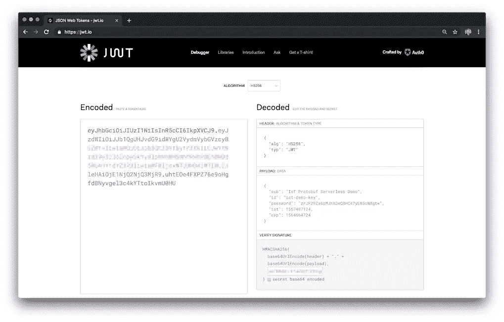

## JSON 有效负载

下面是一个典型的 JSON 请求有效负载(漂亮打印的)，包含 DHT 传感器数据。这一特定消息的大小为 148 字节。消息格式是有意为读者友好的。我们当然可以缩短消息的关键字段，以额外减少 15-20 个字节的有效载荷。

```
{
  "device": "rp829c7e0e",
  "type": "DHT22",
  "timestamp": 1557585090.476025,
  "data": {
    "temperature": 17.100000381469727,
    "humidity": 68.0999984741211
  }
}
```

# 协议缓冲区

为了演示，我构建了一个协议缓冲文件`[sensors.proto](https://github.com/garystafford/iot-protobuf-demo/blob/master/sensors_pb/sensors.proto)`，以支持三种传感器类型的数据输出:数字湿度和温度(DHT)[、无源红外传感器](https://en.wikipedia.org/wiki/Passive_infrared_sensor) (PIR)和数字光强(DLI)。我正在使用新的`[proto3](https://developers.google.com/protocol-buffers/docs/proto3)`版本的协议缓冲语言。我已经创建了一个通用的 Protobuf 传感器消息模式，在每种消息类型中，变量 sensor telemetry 存储在嵌套的`data`对象中。

> 协议缓冲区比 XML 小 3 到 10 倍，快 20 到 100 倍。

使用正确的 Protobuf [标量值类型](https://developers.google.com/protocol-buffers/docs/proto3#scalar)来保持编译语言的数值精度是很重要的。为了简单起见，我使用一个`double`来表示时间戳，以及湿度和温度的数字读数。或者，您可以选择 Google 的 Protobuf `WellKnownTypes`， [Timestamp](https://developers.google.com/protocol-buffers/docs/reference/csharp/class/google/protobuf/well-known-types/timestamp) 来存储时间戳。

```
syntax = "proto3";package sensors;// DHT22
message SensorDHT {
    string device = 1;
    string type = 2;
    double timestamp = 3;
    DataDHT data = 4;
}message DataDHT {
    double temperature = 1;
    double humidity = 2;
}// Onyehn_PIR
message SensorPIR {
    string device = 1;
    string type = 2;
    double timestamp = 3;
    DataPIR data = 4;
}message DataPIR {
    bool motion = 1;
}// Anmbest_MD46N
message SensorDLI {
    string device = 1;
    string type = 2;
    double timestamp = 3;
    DataDLI data = 4;
}message DataDLI {
    bool light = 1;
}
```

由于传感器数据将使用 Python 3 编写的脚本来捕获，因此为 Python 编译了协议缓冲文件，生成了文件`[sensors_pb2.py](https://github.com/garystafford/iot-protobuf-demo/blob/master/sensors_pb/sensors_pb2.py)`。

```
protoc --python_out=. sensors.proto
```

# HTTPS 上的协议缓冲区

下面我们看到另一个 DHT 传感器脚本， [dht_sensor_http_pb.py](https://github.com/garystafford/iot-protobuf-demo/blob/master/sensor_scripts/dht_sensor_http_pb.py) ，它通过 HTTPS 将一个基于协议缓冲区的二进制请求有效载荷传输到运行在 GCP 上的 Google Cloud 函数。请注意，请求的`Content-Type`标题已从`application/json`更改为`application/x-protobuf`。在这种情况下，相同的数据字段存储在 Protobuf 的`SensorDHT`消息类型(`sensors_pb2.SensorDHT()`)的实例中，而不是 JSON。注意`import sensors_pb2`语句。该语句导入编译后的协议缓冲文件，该文件存储在物联网设备的本地脚本中。

```
import logging
import os
import socket
import sys
import timeimport Adafruit_DHT
import requests
**import sensors_pb2**URL = os.environ.get('GCF_DHT_URL')
JWT = os.environ.get('JWT')
SENSOR = Adafruit_DHT.DHT22
TYPE = 'DHT22'
PIN = 18
FREQUENCY = 15 def main():
    if not URL or not JWT:
        sys.exit("Are the Environment Variables set?")
    get_sensor_data(socket.gethostname()) def get_sensor_data(device_id):
    while True:
        try:
            humidity, temperature = Adafruit_DHT.read_retry(SENSOR, PIN) **sensor_dht = sensors_pb2.SensorDHT()**
            sensor_dht.device = device_id
            sensor_dht.type = TYPE
            sensor_dht.timestamp = time.time()
            sensor_dht.data.temperature = temperature
            sensor_dht.data.humidity = humidity payload = sensor_dht.SerializeToString() post_data(payload)
            time.sleep(FREQUENCY)
        except TypeError:
            logging.error('Error getting sensor data!') def post_data(payload):
    headers = {
 **'Content-Type': 'application/x-protobuf',**
        'Authorization': JWT
    } try:
        requests.post(URL, data=payload, headers=headers)
    except requests.exceptions.ConnectionError:
        logging.error('Error posting data to Cloud Function!')
    except requests.exceptions.MissingSchema:
        logging.error('Error posting data to Cloud Function! Are Environment Variables set?') if __name__ == '__main__':
    sys.exit(main())
```

## Protobuf 二进制负载

为了理解基于二进制协议缓冲区的有效负载，我们可以将示例`SensorDHT`消息作为字节数组写入磁盘上的文件。

```
message = sensorDHT.SerializeToString()binary_file_output = open("./data_binary.txt", "wb")
file_byte_array = bytearray(message)
binary_file_output.write(file_byte_array)
```

然后，使用`hexdump`命令，我们可以查看二进制数据文件的表示。

```
> hexdump -C data_binary.txt
00000000  0a 08 38 32 39 63 37 65  30 65 12 05 44 48 54 32  |..829c7e0e..DHT2|
00000010  32 1d 05 a0 b9 4e 22 0a  0d ec 51 b2 41 15 cd cc  |2....N"...Q.A...|
00000020  38 42                                             |8B|
00000022
```

二进制数据文件在磁盘上的大小是 48 字节，相比之下，等效的 JSON 文件在磁盘上的大小是 148 字节(大小的 32%)。作为测试，我们可以将二进制数据文件作为 POST 的有效负载发送到云函数，如下所示使用 Postman。在传输之前，Postman 会将二进制数据文件的内容序列化为二进制字符串。

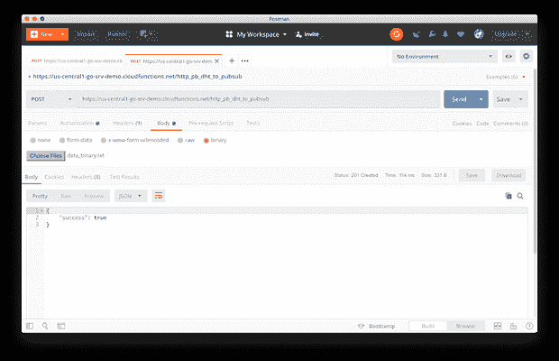

类似地，我们可以使用`SerializeToString`方法将相同的基于二进制协议缓冲区的`SensorDHT`消息序列化为二进制字符串。

```
message = sensorDHT.SerializeToString()
print(message)
```

生成的二进制字符串如下所示。

```
b'\n\nrp829c7e0e\x12\x05DHT22\x19c\xee\xbcg\xf5\x8e\xccA"\x12\t\x00\x00\x00\xa0\x99\x191@\x11\x00\x00\x00`f\x06Q@'
```

序列化消息的二进制字符串长度是 111 个字节，因此由 Postman 发送并由云函数接收的请求有效负载是 148 个字节，与之相比，JSON 有效负载的大小是 148 个字节(大小的 75%)。

## 验证 Protobuf 有效负载

为了验证 Protobuf 有效载荷中包含的数据是否与 JSON 有效载荷相同，我们可以使用 Protobuf `ParseFromString`方法从序列化的二进制字符串中解析有效载荷。然后我们使用 Protobuf `MessageToJson`方法将其转换成 JSON。

```
message = sensorDHT.SerializeToString() 
message_parsed = sensors_pb2.SensorDHT()
message_parsed.ParseFromString(message)
print(MessageToJson(message_parsed))
```

产生的 JSON 对象与前面演示中使用 JSON over HTTPS 发送的 JSON 有效负载相同。

```
{
  "device": "rp829c7e0e",
  "type": "DHT22",
  "timestamp": 1557585090.476025,
  "data": {
    "temperature": 17.100000381469727,
    "humidity": 68.0999984741211
  }
}
```

# 谷歌云功能

谷歌云有一系列功能，特别是四个 [HTTP 功能](https://cloud.google.com/functions/docs/writing/http)，通过 HTTP 从物联网设备接受传感器数据。每个函数公开一个 HTTPS 端点。根据 Google 的说法，当你想通过 HTTP(S)请求调用你的函数时，你可以使用 HTTP 函数。为了允许 HTTP 语义，HTTP 函数签名接受 HTTP 特定的参数。

下面，我部署了一个接受来自所有传感器类型的 JSON 传感器遥测的函数，以及 Protobuf 的三个函数，每个传感器类型一个:DHT、PIR 和 DLI。

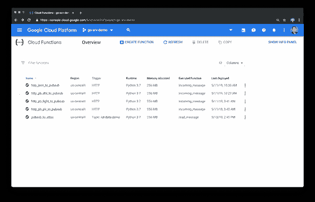

## JSON 消息处理

下面，我们看到云函数 [main.py](https://github.com/garystafford/iot-protobuf-demo/blob/master/cloud_functions/http_json_to_pubsub/main.py) ，它处理来自所有传感器类型的传入 JSON over HTTPS 有效载荷。一旦请求的 JWT 得到验证，JSON 消息有效负载就被序列化为一个字节字符串，并发送到一个常见的 Google Cloud 发布/订阅主题。请注意，JWT 密钥、id 和密码以及 Google Cloud 发布/订阅主题都作为环境变量存储在云函数的本地。在我的测试中，成功执行基于 JSON 的 HTTP 函数平均需要 9–18 毫秒。

```
import logging
import osimport jwt
from flask import make_response, jsonify
from flask_api import status
from google.cloud import pubsub_v1TOPIC = os.environ.get('TOPIC')
SECRET_KEY = os.getenv('SECRET_KEY')
ID = os.getenv('ID')
PASSWORD = os.getenv('PASSWORD') def incoming_message(request):
    if not validate_token(request):
        return make_response(jsonify({'success': False}),
                             status.HTTP_401_UNAUTHORIZED,
                             {'ContentType': 'application/json'}) request_json = request.get_json()
    if not request_json:
        return make_response(jsonify({'success': False}),
                             status.HTTP_400_BAD_REQUEST,
                             {'ContentType': 'application/json'}) send_message(request_json) return make_response(jsonify({'success': True}),
                         status.HTTP_201_CREATED,
                         {'ContentType': 'application/json'}) def validate_token(request):
    auth_header = request.headers.get('Authorization')
    if not auth_header:
        return False
    auth_token = auth_header.split(" ")[1] if not auth_token:
        return False
    try:
        payload = jwt.decode(auth_token, SECRET_KEY)
        if payload['id'] == ID and payload['password'] == PASSWORD:
            return True
    except jwt.ExpiredSignatureError:
        return False
    except jwt.InvalidTokenError:
        return False def send_message(message):
    publisher = pubsub_v1.PublisherClient()
    publisher.publish(topic=TOPIC, 
                      data=bytes(str(message), 'utf-8'))
```

使用`gcloud functions deploy` CLI 命令将云功能部署到 GCP(我使用 Jenkins 来自动化部署)。我已经将部署命令包装到 bash 脚本中。该脚本还复制了一个通用环境变量 YAML 文件，由云函数使用。每个功能都有一个[部署脚本](https://github.com/garystafford/iot-protobuf-demo/blob/master/cloud_functions/http_json_to_pubsub/deploy_function.sh)，包含在项目中。

```
# get latest env vars file
cp -f ./../env_vars_file/env.yaml .# deploy function
gcloud functions deploy http_json_to_pubsub \
  --runtime python37 \
  --trigger-http \
  --region us-central1 \
  --memory 256 \
  --entry-point incoming_message \
 **--env-vars-file env.yaml**
```

使用一个`[.gcloudignore](https://github.com/garystafford/iot-protobuf-demo/blob/master/cloud_functions/http_pb_dht_to_pubsub/.gcloudignore)`文件，`gcloud functions deploy` CLI 命令部署三个文件:云函数(`main.py`)、必需的 Python 包文件(`requirements.txt`)、环境变量文件(`env.yaml`)。Google 使用`[requirements.txt](https://github.com/garystafford/iot-protobuf-demo/blob/master/cloud_functions/http_pb_dht_to_pubsub/requirements.txt)`文件自动安装依赖项。

## Protobuf 消息处理

下面，我们看到云函数， [main.py](https://github.com/garystafford/iot-protobuf-demo/blob/master/cloud_functions/http_pb_dht_to_pubsub/main.py) ，它处理来自 DHT 传感器类型的传入 Protobuf over HTTPS 有效载荷。HTTP 函数收到传感器数据 Protobuf 消息有效负载后，会将其反序列化为 JSON，然后序列化为一个字节字符串。然后，该字节串被发送到 Google Cloud 发布/订阅主题。在我的测试中，基于 Protobuf 的 HTTP 函数平均需要 7-14 毫秒才能成功执行。

和以前一样，注意`import sensors_pb2`语句。该语句导入编译后的协议缓冲文件，该文件存储在物联网设备的本地脚本中。它用于将序列化的消息解析成其原始的 Protobuf 的`SensorDHT`消息类型。

```
import logging
import osimport jwt
**import sensors_pb2**
from flask import make_response, jsonify
from flask_api import status
from google.cloud import pubsub_v1
from google.protobuf.json_format import MessageToJsonTOPIC = os.environ.get('TOPIC')
SECRET_KEY = os.getenv('SECRET_KEY')
ID = os.getenv('ID')
PASSWORD = os.getenv('PASSWORD') def incoming_message(request):
    if not validate_token(request):
        return make_response(jsonify({'success': False}),
                             status.HTTP_401_UNAUTHORIZED,
                             {'ContentType': 'application/json'}) data = request.get_data()
    if not data:
        return make_response(jsonify({'success': False}),
                             status.HTTP_400_BAD_REQUEST,
                             {'ContentType': 'application/json'}) sensor_pb = sensors_pb2.SensorDHT()
    sensor_pb.ParseFromString(data)
    sensor_json = MessageToJson(sensor_pb)
    send_message(sensor_json) return make_response(jsonify({'success': True}),
                         status.HTTP_201_CREATED,
                         {'ContentType': 'application/json'}) def validate_token(request):
    auth_header = request.headers.get('Authorization')
    if not auth_header:
        return False
    auth_token = auth_header.split(" ")[1] if not auth_token:
        return False
    try:
        payload = jwt.decode(auth_token, SECRET_KEY)
        if payload['id'] == ID and payload['password'] == PASSWORD:
            return True
    except jwt.ExpiredSignatureError:
        return False
    except jwt.InvalidTokenError:
        return False def send_message(message):
    publisher = pubsub_v1.PublisherClient()
    publisher.publish(topic=TOPIC, data=bytes(message, 'utf-8'))
```

# 云发布/订阅功能

除了 HTTP 功能，演示还使用了由[谷歌云发布/订阅触发器](https://cloud.google.com/functions/docs/calling/pubsub)触发的功能。根据[谷歌](https://cloud.google.com/functions/docs/calling/pubsub)的说法，云功能可以由发布到与该功能相同的 GCP 项目中的云发布/订阅主题的消息触发。该函数自动订阅主题。下面我们看到该功能已经自动订阅了`iot-data-demo`云发布/订阅话题。

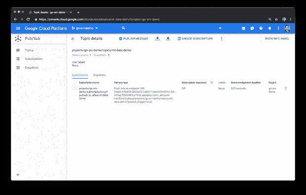

# 向 MongoDB Atlas 发送遥测数据

公共云函数由发布到 Cloud Pub/Sub 的消息触发，然后将消息发送到 MongoDB Atlas。将云发布/订阅消息重新格式化为 [BSON](http://bsonspec.org/) (二进制 JSON)只需要很少的清理工作。有趣的是，根据[bsonspec.org](http://bsonspec.org/)的说法，BSON 可以被比作垫子的内部变化，就像最初的垫子一样。BSON 比 Proto col Buf fers 更少模式，这使它在灵活性方面有优势，但在空间效率方面稍有劣势(BSON 在序列化数据中的字段名方面有优势)。

该函数使用 [PyMongo](https://api.mongodb.com/python/current/index.html#) 连接到 MongoDB Atlas。根据他们的网站，PyMongo 是一个 Python 发行版，包含了使用 MongoDB 的工具，是使用 Python 中的 MongoDB 的推荐方法。

```
import base64
import json
import logging
import os
**import pymongo**MONGODB_CONN = os.environ.get('MONGODB_CONN')
MONGODB_DB = os.environ.get('MONGODB_DB')
MONGODB_COL = os.environ.get('MONGODB_COL') def read_message(event, context):
    message = base64.b64decode(event['data']).decode('utf-8')
    message = message.replace("'", '"')
    message = message.replace('True', 'true')
    message = json.loads(message) client = pymongo.MongoClient(MONGODB_CONN)
    db = client[MONGODB_DB]
    col = db[MONGODB_COL]
    col.insert_one(message)
```

该函数响应发布的事件，并将消息发送到 MongoDB Atlas 集群，该集群运行在与云函数和发布/订阅主题相同的区域 us-central1 中。下面，我们看到了在配置 Atlas 集群时可用的当前选项。

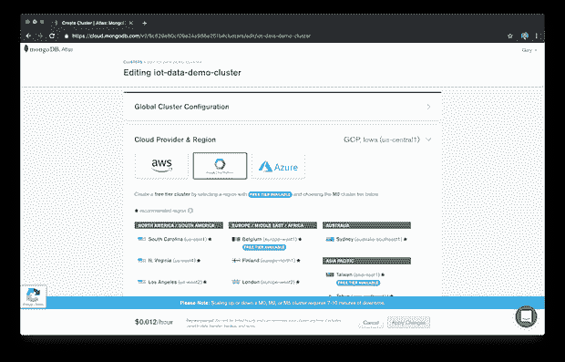

MongoDB Atlas 提供了一个丰富的基于 web 的 UI，用于管理和监控 MongoDB 集群、数据库、集合、安全性和性能。

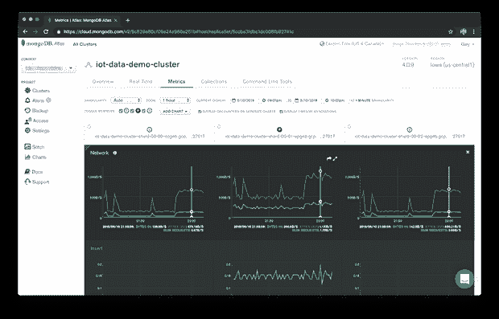

尽管云发布/订阅 Atlas 函数的执行时间比 HTTP 函数长，但通过将云发布/订阅主题、云函数和 MongoDB Atlas 集群放在同一个 GCP 区域中，延迟大大降低。跨区域执行时间高达 500-600 毫秒，而同区域执行时间平均为 200-225 毫秒。选择性能更高的 Atlas 集群可能会导致更低的函数执行时间。

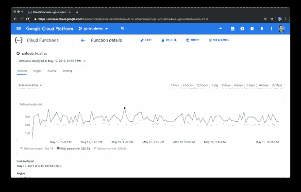

# 使用 MongoDB Compass 聚合数据

MongoDB Compass 是一个免费、方便的桌面应用程序，用于与您的 MongoDB 数据库进行交互。您可以查看收集的传感器数据，查看消息(文档)模式，管理索引，并构建复杂的 MongoDB [聚合](https://docs.mongodb.com/manual/aggregation/)。

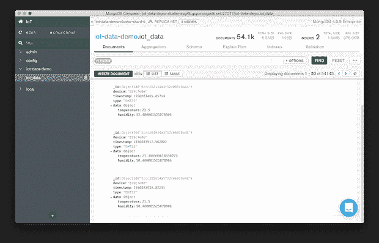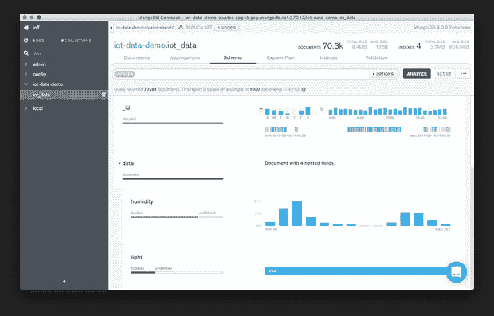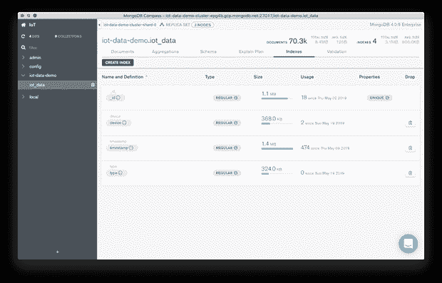

当执行分析或机器学习时，我主要使用 MongoDB Compass 来预览捕获的遥测数据，并构建[聚合管道](https://docs.mongodb.com/manual/aggregation/#aggregation-framework)。聚合操作处理数据记录并返回计算结果。这一功能节省了大量时间，过滤和准备数据以供进一步分析、可视化和使用 [Jupyter 笔记本](https://jupyter.org/)进行机器学习。

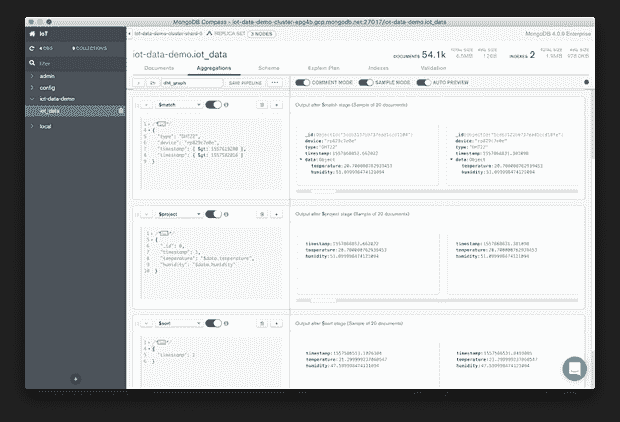

聚合管道可以直接导出到 Java、Node、C#和 Python 3。导出的聚合管道代码可以直接放入您的 Python 应用程序和 [Jupyter 笔记本](https://jupyter.org/)中。

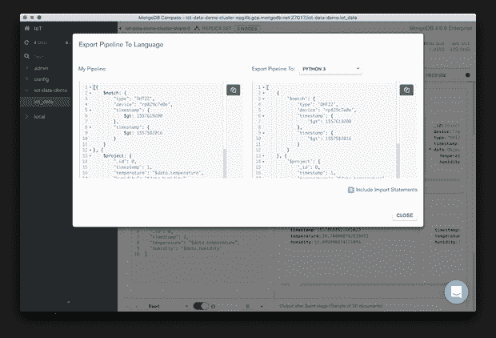

下面，从 MongoDB Compass 导出的聚合管道代码用于将结果集直接加载到一个 [Pandas DataFrame](https://pandas.pydata.org/pandas-docs/stable/reference/api/pandas.DataFrame.html) 中。这种特殊的聚合返回特定物联网设备在 72 小时内的时序 DHT 传感器数据。

```
DEVICE_1 = 'rp59adf374'
pipeline = [
    {
        '$match': {
            'type': 'DHT22', 
            'device': DEVICE_1, 
            'timestamp': {
                '$gt': 1557619200,
                '$lt': 1557792000
            }
        }
    }, {
        '$project': {
            '_id': 0,
            'timestamp': 1, 
            'temperature': '$data.temperature', 
            'humidity': '$data.humidity'
        }
    }, {
        '$sort': {
            'timestamp': 1
        }
    }
]
aggResult = iot_data.aggregate(pipeline)
df1 = pd.DataFrame(list(aggResult))
```

# MongoDB Atlas 性能

在这次演示中，我能够从基于 Python3 的 Jupyter 笔记本电脑上持续查询 MongoDB Atlas 集合中的近 70k 个文档，以获得包含 3 天(72 小时)数字温度和湿度数据的结果集，大约 10.2k 个文档，平均时间为 825 毫秒。这是从我的本地开发笔记本电脑到位于不同地理区域的 GCP 上运行的 MongoDB Atlas 的往返行程。

GCP 上的查询时间要快得多，比如在谷歌的人工智能平台上运行 JupyterLab 中的笔记本时，或者在 Atlas 上运行 PySpark 作业时。直接在谷歌的人工智能平台上运行相同的 Jupyter 笔记本，相同的 MongoDB Atlas 查询平均需要 450 毫秒，而不是 825 毫秒(快了 1.83 倍)。这是跨越两个不同的 GCP 地区；相同地区的时间应该更快。

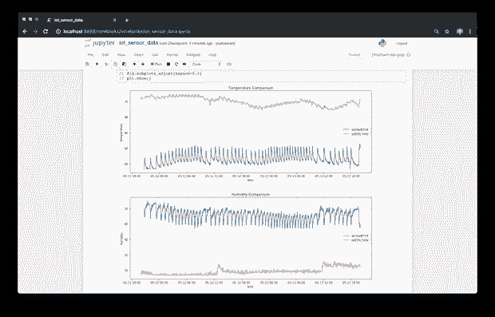

# GCP 可观测性

观察系统的 Google Cloud 功能有几个选择，Google Cloud Pub/Sub，MongoDB Atlas。如上所示，GCP 云函数界面可以让您看到各个函数在不同时间间隔内的执行情况、执行时间、内存使用情况和活动实例。

为了更详细地查看 Google Cloud Functions 和 Google Cloud Pub/Sub，我使用 [Stackdriver](https://cloud.google.com/stackdriver/) 构建了两个定制仪表板。根据谷歌的说法，Stackdriver 聚合了来自基础设施的指标、日志和事件，为开发者和运营商提供了一组丰富的可观察信号。我构建了一个定制的 Stackdriver 云功能仪表板(如下所示)和一个云发布/订阅主题和订阅仪表板。

对于函数，我选择显示执行时间、内存使用量、执行次数和网络出口，所有这些都显示在一个单一的窗格中，使用四个图表。下面，我使用第 95 百分位平均值进行监控。第 95 个百分位数表明，95%的时间里，观察值低于该数值，而其余 5%的时间里，观察值高于该数值。

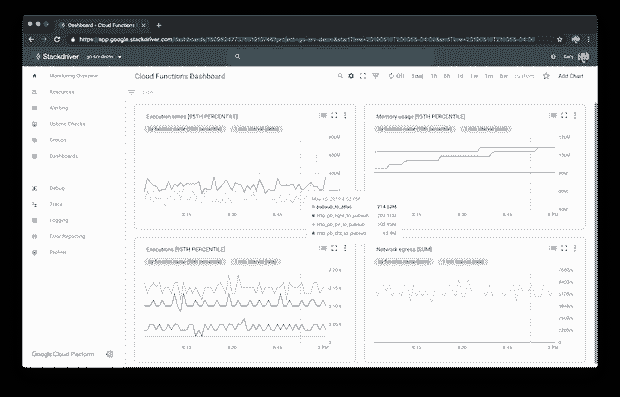

# 使用 Jupyter 笔记本进行数据分析

据 jupyter.org 的[称，Jupyter Notebook 是一个开源的网络应用程序，允许你创建和分享包含实时代码、方程式、可视化和叙述性文本的文档。用途包括数据清理和转换、数值模拟、统计建模、数据可视化、机器学习等等。Jupyter 笔记本的广泛使用显著增长，因为大数据、AI 和 ML 都经历了爆发式增长。](https://jupyter.org/)

## 皮查姆

JetBrains [PyCharm](https://www.jetbrains.com/pycharm) ，我最喜欢的 Python IDE，与 Jupyter 笔记本[直接集成。事实上，PyCharm 对专业版的最新更新极大地增强了这些集成。PyCharm 在 IDE 和](https://jupyter-notebook.readthedocs.io/en/stable/notebook.html#) [Jupyter Notebook](https://jupyter-notebook.readthedocs.io/en/stable/notebook.html#) web 浏览器界面中提供往返编辑。PyCharm 允许您运行和调试笔记本中的单个单元。PyCharm 自动为您打开的笔记本启动 [Jupyter 服务器](https://jupyter-notebook.readthedocs.io/en/stable/public_server.html)和相应的内核。我最喜欢的功能之一是 PyCharm 的变量查看器自动跟踪变量的当前值。

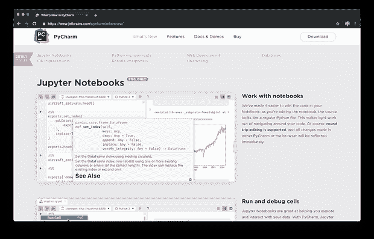

下面，我们看到示例分析笔记本，包含在演示的项目中，显示在 PyCharm 19.1.2(专业版)中。要在 PyCharm 中有效地使用笔记本电脑，确实需要全尺寸显示器。在使用 PyCharm 拥挤的笔记本 UI 的笔记本电脑上工作是可行的，但肯定不如在更大的显示器上工作有效。

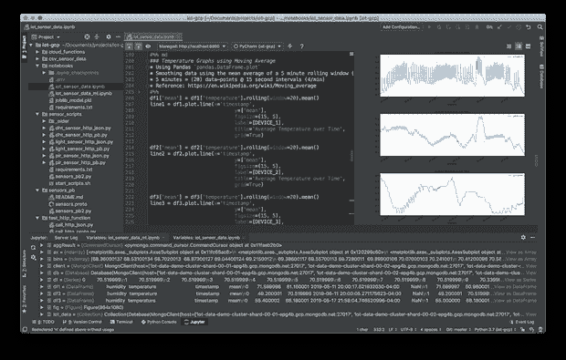

## Jupyter 笔记本服务器

下面，我们看到同样的分析笔记本，如上面 PyCharm 中所示，在 Jupyter Notebook Server 的基于 web 的客户端界面中打开，在开发工作站上本地运行。基于 web 浏览器的界面还为笔记本开发提供了丰富的功能。

在笔记本中，我们能够再次使用 [PyMongo](https://api.mongodb.com/python/current/index.html#) 查询 MongoDB Atlas 中的数据，并将结果集加载到 Panda DataFrames 中。对于笔记本，作为硬编码值和环境变量的替代，我使用了 [python-dotenv](https://pypi.org/project/python-dotenv/) Python 包。这个包允许我将环境变量放在一个公共的`.env`文件中，并从任何笔记本中引用它们。这个包有许多管理环境变量的选项。

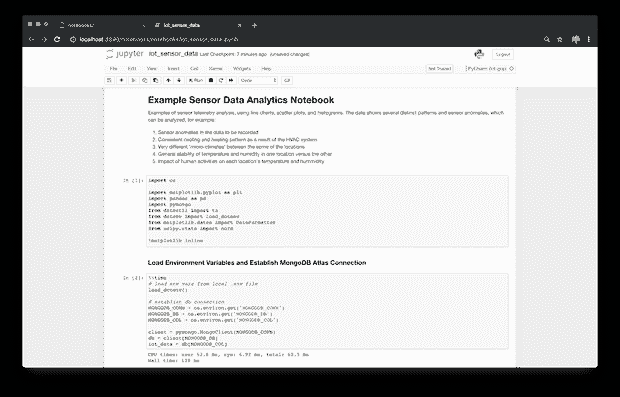

然后我们可以使用一些常见的框架来分析数据，包括 [Pandas](https://pandas.pydata.org/) 、 [Matplotlib](https://matplotlib.org/) 、 [SciPy](https://www.scipy.org/) 、 [PySpark](https://spark.apache.org/docs/latest/api/python/index.html) 和 [NumPy](https://www.numpy.org/) 等等。下面，我们看到来自同一物联网设备上四个不同传感器的时间序列数据。综合这些数据，我们可以研究一个环境变量对另一个环境变量的因果影响，例如光线对温度或湿度的影响。

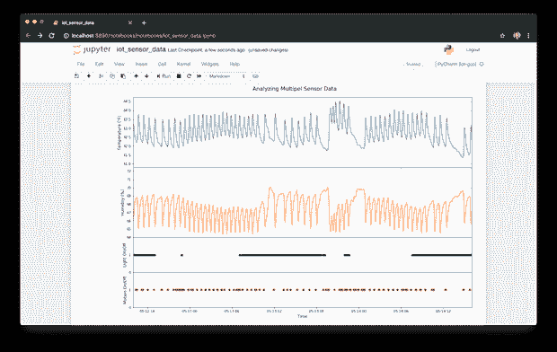

下面，我们可以使用直方图来显示给定器件位置在
时间间隔内的温度频率。

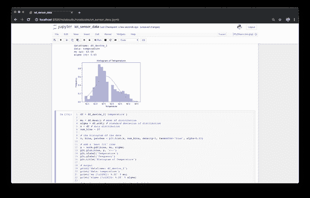

## 使用 Jupyter 笔记本的机器学习

除了数据分析，我们还可以将 Jupyter 笔记本与 [scikit-learn](https://scikit-learn.org/stable/) 等工具配合使用，以基于我们的传感器遥测技术构建机器学习模型。 [Scikit-learn](https://scikit-learn.org/stable/) 是一套 Python 中的机器学习工具，构建于 NumPy、SciPy 和 matplotlib 之上。下面，我在谷歌的[人工智能平台](https://cloud.google.com/ai-platform/)和 scikit-learn 上使用了 JupyterLab，根据传感器数据建立了几个模型。

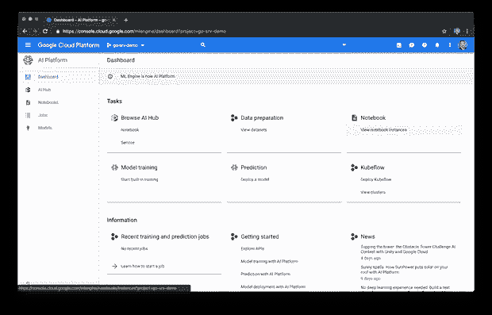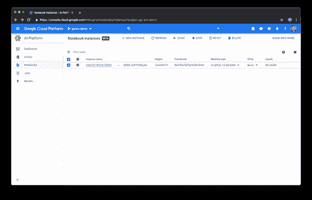

使用 scikit-learn，我们可以构建模型来预测诸如哪个物联网设备生成了特定的温度和湿度读数，或者在给定时间、设备位置和外部环境变量的情况下预测温度和湿度，或者发现传感器遥测中的异常。

Scikit-learn 可以使用来自多个物联网设备的数据轻松构建随机训练和测试数据集，从而构建模型，如下所示。

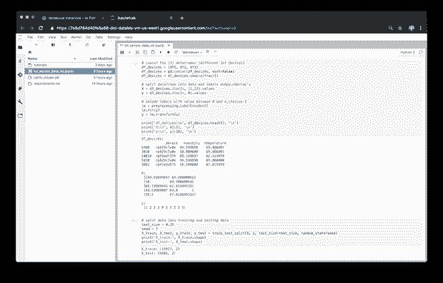

该项目包括一个 Jupyter 笔记本，演示如何使用传感器数据建立几个 ML 模型。在本演示中用于构建分类模型的监督学习算法的例子包括[支持向量机](https://en.wikipedia.org/wiki/Support-vector_machine)(SVM)[*k*-最近邻](https://en.wikipedia.org/wiki/K-nearest_neighbors_algorithm) ( *k* -NN)，以及[随机森林分类器](https://scikit-learn.org/stable/modules/generated/sklearn.ensemble.RandomForestClassifier.html)。

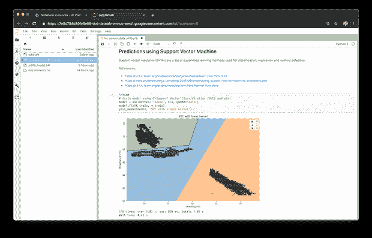

拥有来自多个传感器的数据，我们能够通过向我们的训练数据添加额外的分类(离散)特征来丰富 ML 模型。例如，我们可以观察光线、运动和一天中的时间对温度和湿度的影响。

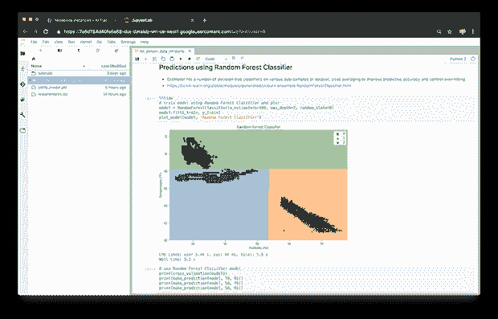

# 结论

希望这篇文章展示了如何在谷歌云平台上使用 HTTPS 上的谷歌协议缓冲区、无服务器谷歌云功能、云发布/订阅和 MongoDB Atlas 有效地收集物联网设备的遥测数据。一旦捕获到遥测数据，就可以使用 MongoDB Compass 和 Jupyter Notebooks 等常用工具轻松地对其进行汇总和分析。此外，我们使用这些数据和工具来构建用于预测和异常检测的机器学习模型。

*本文表达的所有观点都是我个人的观点，不一定代表我现在或过去的雇主或他们的客户的观点。*

*图片:* [*一切可能*](https://www.123rf.com/profile_everythingpossible)*123RF.com*