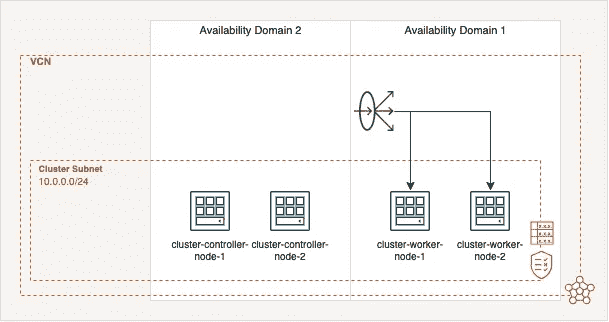
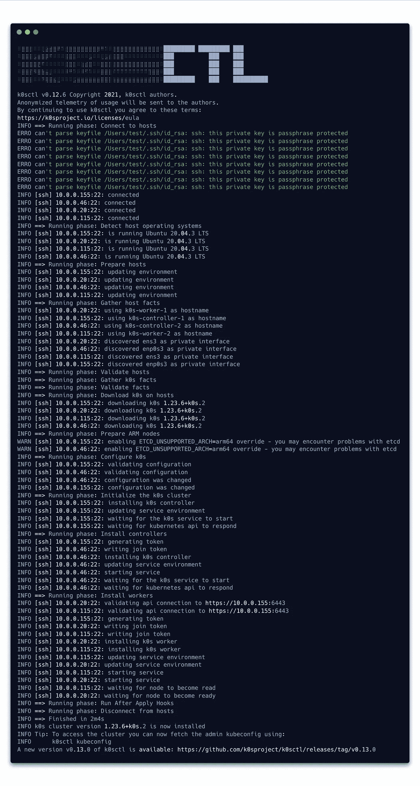

# K0s 作为 Oracle 云基础设施上的一个始终免费的 Kubernetes 集群，是 K3s 的替代方案吗

> 原文：<https://itnext.io/is-k0s-an-alternative-to-k3s-as-an-always-free-kubernetes-cluster-on-oracle-cloud-infrastructure-9d76ffe18d21?source=collection_archive---------0----------------------->


来自 [Pixabay](https://pixabay.com/de/photos/hafen-container-export-ladung-4602964/) 的 [postcardtrip](https://pixabay.com/de/users/postcardtrip-11490472/) 拍摄的照片

由于微服务在物联网和边缘领域的普及，提供轻量级 Kubernetes 集群的解决方案越来越受欢迎。由于这个原因，像 [K3s](https://k3s.io) 和 [k0s](https://k0sproject.io) 这样的解决方案变得越来越流行。

在我的上一篇文章中，我展示了如何在 Oracle 云基础设施(OCI) 上使用[始终免费资源自动部署 k3s 集群。我采用了这个部署思想，并在本文中使用它来创建一个基于 k0s 的 Kubernetes 集群。](/how-to-deploy-an-always-free-k3s-cluster-on-the-oracle-cloud-infrastructure-4aed6d6d8604)

# 体系结构

集群基础架构由四个节点、两个控制器和两个工作节点组成。所有系统都使用 Ubuntu 20.04 操作系统。还有一个负载平衡器，作为我们部署的服务的入口。控制器节点位于可用性域 2 (AD-2)中，工作节点在 AD-1 中创建。它们由 [Terraform](https://www.terraform.io/) 提供。第二步将通过 [k0sctl](https://github.com/k0sproject/k0sctl) cli 安装集群软件 k0s。集群使用存储解决方案 [Longhorn](https://longhorn.io/) ，该解决方案将使用 OCI 实例的块存储，并在它们之间共享 Kubernetes 卷。并且 [Traefik](https://traefik.io/) 将被用作入口控制器。下图给出了基础设施的概述。



# 配置

正如我在上一篇文章中所描述的，有必要设置以下环境变量，以便 Terraform 可以访问 OCI。

```
export TF_VAR_compartment_id="<COMPARTMENT_ID>"
export TF_VAR_region="<REGION_NAME>"
export TF_VAR_tenancy_ocid="<TENANCY_OICD>"
export TF_VAR_user_ocid="<USER_OICD>"
export TF_VAR_fingerprint="<RSA_FINGERPRINT>"
export TF_VAR_private_key_path="<PATH_TO_YOUR_PRIVATE_KEY>"
export TF_VAR_ssh_authorized_keys='["<SSH_PUBLIC_KEY>"]'
```

# 部署

部署基于两个步骤，第一步是通过 Terraform 部署基础设施，第二步是通过 k0sctl 部署集群。

首先，从 Terraform init 开始:

```
terraform init
```

其次，您必须通过以下命令创建一个地形平面图:

```
terraform plan -out .tfplan
```

最后应用计划:

```
terraform apply ".tfplan"
```

几分钟后，OCI 实例创建完毕，集群启动并运行。现在我们可以从 k0s 部署开始。Terraform 代码创建一个输出，该输出可用作自动 k0sctl 部署的配置。

```
terraform output -raw k0s_cluster | k0sctl apply --config -
```

K0sctl 显示了部署进度，如下所示。



现在，我们已经准备好通过下面的命令获得集群的“kubeconfig”。

```
terraform output -raw k0s_cluster | k0sctl kubeconfig --config - > ~/.kube/config
```

现在您可以使用`kubectl`来管理您的集群并检查节点:

```
kubectl get nodes
```

部署同时完成两项任务，首先安装 k0s，其次安装入口控制器 Traefik。Traefik 提供了一个可以通过端口转发访问的仪表板，并且需要以下命令。

```
kubectl port-forward deployment/traefik 9000:9000 -n traefik-system
```

要访问仪表板，您可以在浏览器中打开以下页面。

```
[http://localhost:9000/dashboard/](http://localhost:9000/dashboard/)
```

# 长角牛装置

在下一步中，您必须通过`kubectl`或`helm`方法的以下命令将 [Longhorn](https://longhorn.io/) 部署为分布式块存储提供者:

方法一通过`kubectl`:

```
kubectl apply -f [https://raw.githubusercontent.com/longhorn/longhorn/v1.2.4/deploy/longhorn.yaml](https://raw.githubusercontent.com/longhorn/longhorn/v1.2.3/deploy/longhorn.yaml)
```

`helm`方法二:

```
helm repo add longhorn [https://charts.longhorn.io](https://charts.longhorn.io)
helm repo update
kubectl create namespace longhorn-system
helm install longhorn longhorn/longhorn --namespace longhorn-system
```

几分钟后，所有 pod 应该都在运行，并且应该可以通过端口转发访问控制面板。不幸的是，事实并非如此，仪表盘没有显示任何数据，所以我开始寻找错误。

# 排除故障

调试表明，k0s、Traefik 和 Longhorn 的工作量对于工作节点来说太大了。他们没有足够的内存。出于这个原因，我创建了一个 cronjob 来定期清理缓存。不幸的是，这不足以用这两个组件稳定地运行集群。

调试表明，k0s、Traefik 和 Longhorn 的工作量对于工作节点来说太大了。他们没有足够的内存。出于这个原因，我创建了一个 cronjob 来定期清理缓存。不幸的是，这不足以用这两个组件稳定地运行集群。

为了验证这一点，我再次部署了没有两个组件 Traefik 和 Longhorn 的集群，以确定工作人员的空闲状态。这表明在 k0s 安装之后，worker 节点上平均有 220MB 的可用内存。如果没有 k0s，在部署基础架构后，平均有 650MB 的内存可用。

# 结论

工作节点 1GB 的内存限制对于所有 Kubernetes 集群部署来说都是一个挑战，对于许多人来说也是一个不可逾越的障碍。部署表明，与 K3s 相比，k0s 不一定适合使用 Traefik 和 Longhorn 的 OCI 上的始终自由集群。出于这个原因，我目前只能推荐 K3s 作为 Kubernetes 集群部署在 OCI，作为一个总是免费的解决方案。

# 链接

*Gitlab 资源库:*[https://github . com/r0 B2 G1 t/k0s-Oracle-cloud-infra structure-cluster](https://github.com/r0b2g1t/k0s-oracle-cloud-infrastructure-cluster)

*k0s:*[https://k0s project . io](https://k0sproject.io/)

*K3s:*https://K3s . io

*terra form:*[https://www . terra form . io](https://www.terraform.io/)