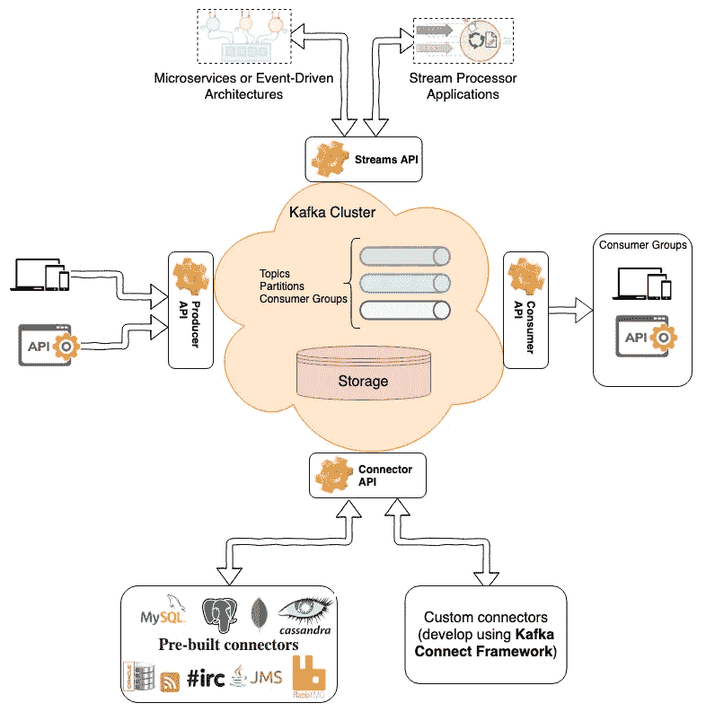
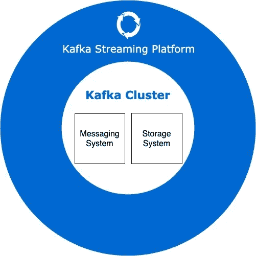

# 卡夫卡是消息队列还是流处理平台？

> 原文：<https://itnext.io/is-kafka-a-message-queue-or-a-stream-processing-platform-7decc3cf1cf?source=collection_archive---------1----------------------->

## Apache Kafka 作为流处理平台的简单介绍

Apache Kafka 作为一个流处理平台的大图

我们大多数人都知道， [Apache Kafka](https://kafka.apache.org) 最初是由 LinkedIn 开发的，作为一个流处理平台供内部使用，并开源和捐赠给 Apache 软件基金会。

最初，Kafka 被认为是一个消息队列，但今天我们知道 Kafka 是一个**分布式流媒体平台**，具有多种功能和组件。

# 卡夫卡是消息队列吗？

我们可以将 Kafka 用作消息队列或消息传递系统，但作为分布式流媒体平台，Kafka 还有其他几种用于流处理或存储数据的用途。我们可以用阿帕奇卡夫卡作为:

*   **消息系统**:高度可伸缩、容错的分布式发布/订阅消息系统。
*   **存储系统**:容错、持久、可复制的存储系统。
*   **流媒体平台**:实时处理到达的数据。

上述功能使 Apache Kafka 成为一个强大的分布式流媒体平台，其核心是**消息传递**和**存储**系统，在它们之上是**流媒体** API 层。

阿帕奇卡夫卡功能

# Kafka 核心 API

Kafka 有四个核心 API，通过使用这些 API，您可以利用 Kafka 的所有功能:

*   **生产者&消费者 API** :通过使用这两个 API，应用程序可以以发布/订阅的方式相互通信，并在 Kafka 平台之上发送或接收消息(或记录)。
*   **连接器 API** :应用程序可以通过这个 API 轻松地与其他系统集成，在 Kafka 平台之上发送或接收消息(或记录)。开发人员可以用标准化的方式创建可重用的连接器。连接器可以是生产者或消费者，或者两者都是，例如，关系数据库的连接器可以发布 Kafka 主题中的表的更改，或者将来自 Kafka 主题的消息存储到表中。有几个[现成的 Kafka 连接器](https://www.confluent.io/hub/)，可以轻松使用。
*   **Streams API** :通过使用这个 API，你可以很容易地开发一个使用流处理概念的应用程序，比如使用高级操作、数据并行、分布式协调和…(而不是使用生产者&消费者 API)来转换流

Kafka 核心 API(图片来自 [Kafka 官网](https://kafka.apache.org))

# 轻松开发流处理应用程序

传统上，在流处理领域，许多流处理系统(如 Apache Spark Streaming、Apache Flink 或 Apache Storm)都使用 Kafka 作为开发流处理应用程序的数据源，但现在 Kafka 拥有强大的流处理 API，允许开发人员消费、处理和生成 Kafka 的事件，并开发分布式流处理应用程序，而无需使用外部流处理框架。

通过使用 **Producer、Consumer、Connector 和 Streams API**,您拥有了一套完整的实用程序，可以在您现有的(或新的)Kafka 集群上开发任何类型的分布式流处理应用程序。

# 后续步骤

在[接下来的文章](/how-to-install-kafka-using-docker-a2b7c746cbdc?source=friends_link&sk=e72dc3c24eea67b8139403b666e70b7c)中，我将尝试描述更多关于 Apache Kafka 的这三个主要功能(消息传递、存储和流处理)。

 [## 如何使用 Docker 安装 Kafka

### 为测试和开发目的设置 Kafka 集群

itnext.io](/how-to-install-kafka-using-docker-a2b7c746cbdc)