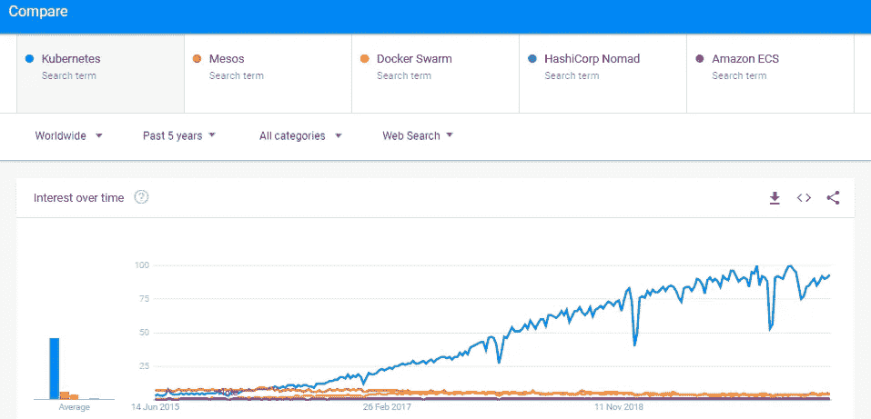
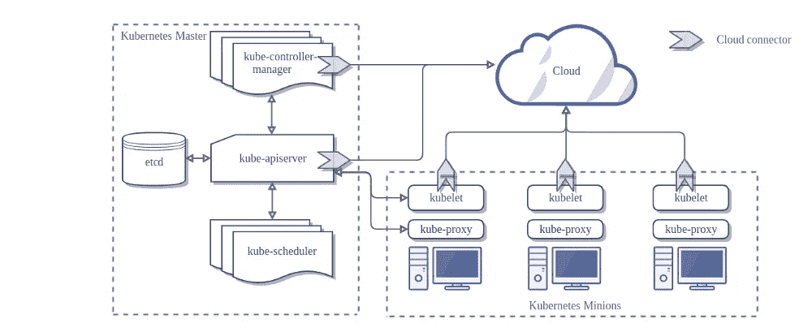
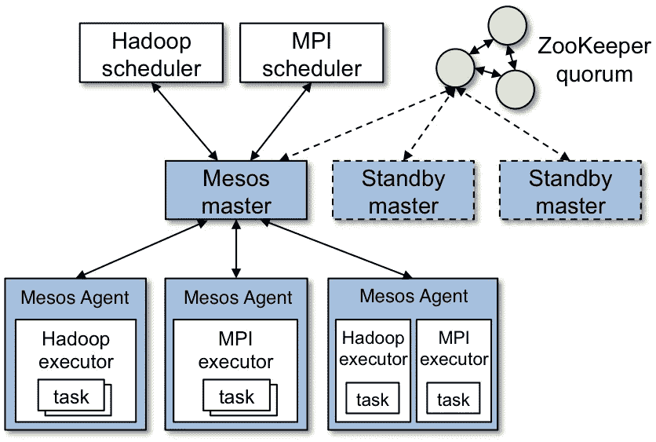
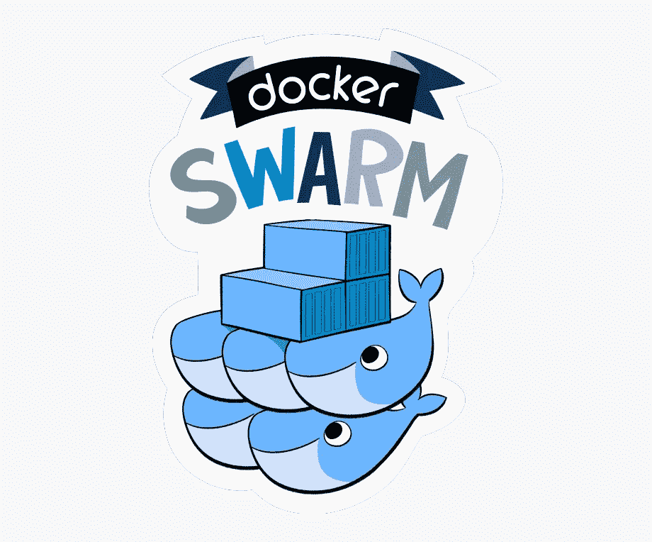
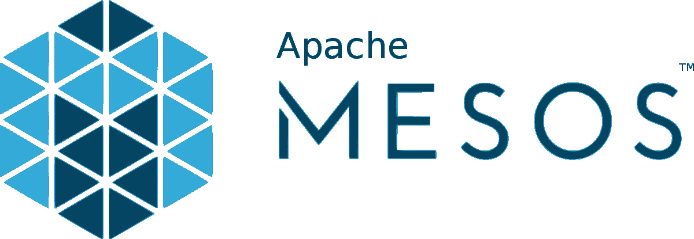
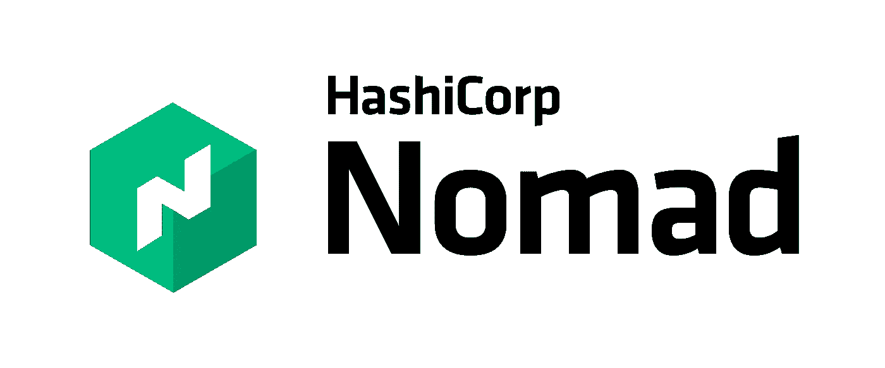
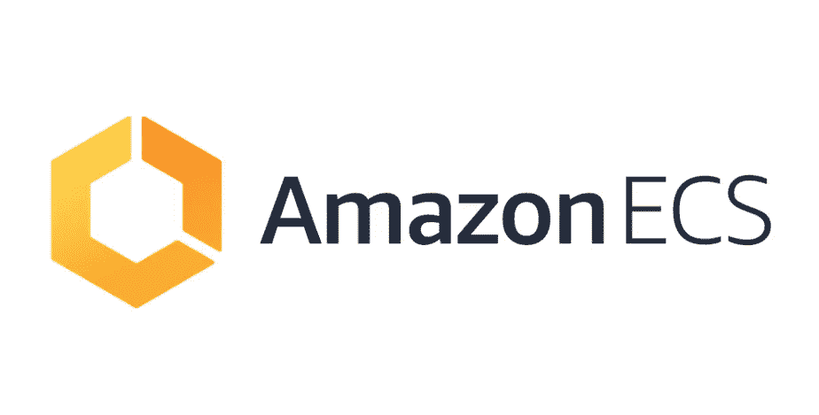
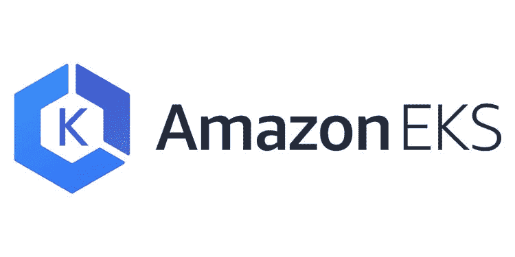
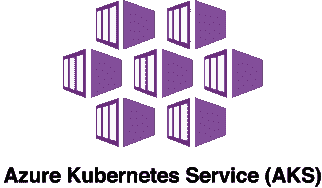
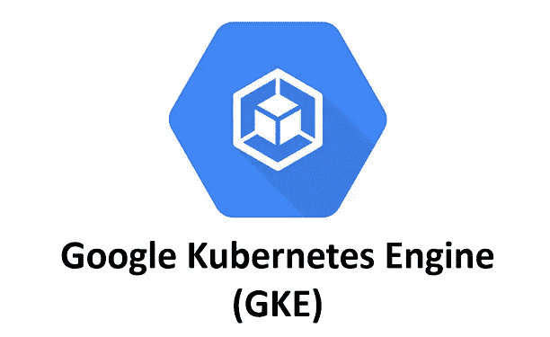

# Kubernetes 合适吗？

> 原文：<https://itnext.io/is-kubernetes-the-right-fit-d2523c96614?source=collection_archive---------4----------------------->

## 容器编排

## 一种尺寸不适合所有人。从 Kubernetes，Docker Swarm，Nomad，Amazon ECS，Apache Mesos + Marathon(或 DC/OS)等中挑选。

照片由 NeONBRAND 在 Unsplash 上拍摄

容器和容器编排已经成为几乎每个 IT 组织的云原生和微服务战略的关键部分。容器化已经改变了我们今天编写、部署和管理软件的方式。

尽管出现了几种容器编排产品和技术，但 Kubernetes 很快成为目前最流行的容器编排系统之一。

> 那么，是什么让 Kubernetes 受欢迎呢？而且，**它是解决您所有容器管理和编排问题的银弹吗？**

## 库伯内特的受欢迎程度

GitHub stars 或 forks 可能不是衡量 Kubernetes 受欢迎程度的正确标准，但考虑到这个项目在*排名前 50 位*的最受欢迎的 GitHub 资源库中，它肯定给出了其受欢迎程度的概念。在撰写本文时，请看下面来自 [Kubernetes GitHub 库](https://github.com/kubernetes/kubernetes)的数字。

来自[https://github.com/kubernetes/kubernetes](https://github.com/kubernetes/kubernetes)

下面是过去 5 年谷歌趋势中的搜索词。我们可以看到 Kubernetes 搜索词与其他一些流行的容器编排平台之间明显的利益差距。

来自谷歌趋势

Kubernetes 有什么独特之处？嗯，它是许多方面的结合，这里有几个— *历经多年开发和发展的经战斗考验的平台*， *it* r *运行于许多云提供商以及裸机*，*功能&，大型开源社区和企业支持*等等。

这种流行是否意味着我应该在 Kubernetes 上运行我所有的容器化应用程序？*未必。我们来看看为什么。*

在我们做出决定之前，让我们看看容器编排和管理的一些方面。

出于比较的目的，我会尝试介绍一些平台，但它们可能不是您的首选平台。此外，我们不会研究其他以 Kubernetes 为基础平台的产品和解决方案，如 [Anthos](https://cloud.google.com/anthos) 、 [Tanzu](https://tanzu.vmware.com/tanzu) 或 [OpenShift](https://www.openshift.com/) 。尽管如此，我希望这些说明会有所帮助。

# 结构

当谈到任何容器编排平台的架构时，复杂性将是重要的考虑因素之一。我们有越多可移动的部分，管理平台就越困难。

我们再来分别看看 [Kubernetes](https://kubernetes.io/) 、 [Apache Mesos](http://mesos.apache.org/) 、 [Docker Swarm](https://docs.docker.com/engine/swarm/) 和 [Nomad](https://www.nomadproject.io/) 的高层架构。虽然我在这里主要指的是 Apache Mesos+Marathon，但也建议研究一下 [Mesosphere DC/OS](https://dcos.io/) 。D2iQ(以前的中间层)称之为 DC 操作系统，它可以被认为是一个分布式操作系统。

**Kubernetes —**

高层次的库伯内特建筑。图片来源:[https://kubernetes.io/](https://kubernetes.io/)

Kubernetes 拥有许多跨越主节点和工作节点的核心组件— *kube-apiserver、etcd、kube-scheduler、kube-controller-manager、cloud-controller-manager、kubelet 和 kube-proxy。*上图并不代表主节点的高可用性架构。假设需要为生产集群配置主节点 HA。

所有受欢迎的云提供商都将 Kubernetes 作为托管服务提供，如亚马逊 EKS、谷歌的 GKE、Azure 的 AKS 等。，这降低了操作复杂性和开销。

**阿帕奇 Mesos+马拉松—**

高级 Apache Mesos 架构。图片来源:[http://mesos.apache.org/documentation/latest/architecture/](http://mesos.apache.org/documentation/latest/architecture/)

Apache Mesos 由 Mesos 主节点(主节点和备用节点)和 Mesos 从节点/代理组成。在某种程度上，这些可以与 Kubernetes 主节点和工作节点相媲美。此外，Mesos 使用[阿帕奇动物园管理员](https://zookeeper.apache.org/)作为法定人数和 Mesos 主人的领袖选举。像 Marathon 这样受支持的框架与 Mesos 一起使用来调度和编排工作负载的执行。

**码头工人群—**

高级 Docker 群体系结构。图片来源:[https://docs . docker . com/engine/swarm/how-swarm-mode-works/nodes/](https://docs.docker.com/engine/swarm/how-swarm-mode-works/nodes/)

Docker Swarm 是 Docker 引擎集成的容器编排引擎。不需要单独安装。它由多个以群集模式运行的 Docker 主机组成。默认情况下，这些 docker 主机可以是管理器和/或工作者节点*、*，这取决于守护程序是如何初始化的。经理领导选举通过 Raft 共识协议进行。不建议将管理器作为工作器运行，以避免资源争用问题。

**流浪者—**

高级游牧建筑。图片来源:【https://www.nomadproject.io/docs/internals/architecture/ 

Nomad 架构由 Nomad 服务器和客户端组成。Nomad 是一个*单二进制*安装。任何移动主机都可以作为服务器或客户端运行。从概念上讲，这看起来类似于 Docker swarm 与经理和工人的合作方式。与 Docker Swarm 类似，Nomad 也使用 Raft 进行首领选举。

如你所见，Kubernetes 和 Apache Mesos(以及 Apache Zookeeper 和各种调度程序，如 Marathon、Chronos 等。)架构可能会变得相当复杂。Docker Swarm 和 Nomad 具有相对简单的架构，这反过来简化了集群管理。但是，他们也有自己的陷阱。

**其他流行的平台** —值得一提的是，当涉及到一些托管服务，如[亚马逊 ECS](https://aws.amazon.com/ecs/) (弹性容器服务)时，您可能不会发现底层架构的细节，因为它是一个封闭的平台，由 AWS 维护。总的来说，Amazon ECS 有两个主要组件——控制平面和 EC2 工作实例。

另外， [AWS Fargate](https://aws.amazon.com/fargate/) for ECS 是运行容器工作负载的无服务器选项。GCP 有类似的基于 Knative 的无服务器平台 Cloud Run。或者，Azure 的[容器实例](https://azure.microsoft.com/en-us/services/container-instances/)。

# 支持的运行时和工作负载

受支持的容器运行时是在您的组织的应用程序现代化策略中扮演重要角色的另一个方面。让我们暂时忽略 appc 容器，因为它可以被认为是过时的，OCI 标准是容器社区的方向。

**Kubernetes** 可以支持 Docker、 [CRI-O](https://cri-o.io/) 、 [Containerd](https://containerd.io/) 、 [frakti](https://github.com/kubernetes/frakti) 等容器运行时。Kubernetes 不支持运行独立的应用程序，比如 runnable JAR。

**Mesos+Marathon** 可以使用 Docker 运行容器，甚至可以通过 Marathon 这样的调度器运行非容器化的应用程序和二进制文件。有趣的是，Kubernetes 可以在 Mesos 上运行，这反过来又可以作为 Mesos 的调度程序。Mesos 与工作负载无关。正如我前面提到的，探索 DC/操作系统来简化 Mesos 管理。

**Docker Swarm** 集成了 Docker 引擎，只能运行 Docker 容器。

**Nomad** 可以运行 Docker 容器、独立的 Java 应用程序或其他二进制文件。

**亚马逊 ECS** 支持 Docker 运行时，不能用于运行独立应用。

# 安全性—访问、网络、数据

所有流行的容器编排平台都通过零信任模型提供了健壮和成熟的安全控制。有各种访问控制机制和基于策略的控制可应用于这些平台，以保护环境免受恶意活动的侵害。集装箱安全是各种安全和扫描工具可以提供帮助的另一个领域，如 [Twistlock](https://www.twistlock.com/) 、 [Clair](https://coreos.com/clair/docs/latest/) 、 [Snyk](https://snyk.io/) 、 [Aqua](https://www.aquasec.com/) 、 [Qualys](https://www.qualys.com/apps/container-security/) 等。

尽管可以有不同的方法来实现安全性。例如，Docker Swarm 直接依赖原生 Docker 的安全控制，而 Kubernetes 通过规范文件抽象配置。或者，Docker Swarm 网络加密不适用于 Windows 主机。

Kubernetes 使用各种对象和方法，如服务帐户、角色、角色绑定、TLS 证书、名称空间、网络策略、资源限制、秘密等。用于集群中和跨服务的身份验证和授权。

**Mesos+Marathon** 安全性需要在集群级别和调度程序框架级别解决。DC 操作系统改进了许多安全控制。它还支持各种机制，如 TLS、资源限制、秘密、ACL(访问控制列表)、服务和用户的 RBAC(基于角色的访问控制)等。

**Docker Swarm** 使用 Docker 守护程序提供的选项进行安全控制。此外，不可能建立复杂的网络策略来控制 docker 群中的流量。

**Nomad** 开源版通过访问控制系统、TLS 证书等提供基本的安全控制。它与 HashiCorp 的其他产品(如 Consul 和 Vault)进行了很好的集成，以加强一些安全控制。Nomad 企业版通过 [Sentinel](https://www.hashicorp.com/sentinel/) 提供策略执行、名称空间和资源配额方面的高级控制。

**Amazon ECS** 安全控制可以通过与 AWS IAM 策略和角色、KMS、AWS Secrets Manager、TLS 证书的集成来实施。

# 网络管理

**Kubernetes & Mesos 集群**通常配置有各种第三方网络解决方案，如 *Calico、法兰绒、Weave Net* 等。用于覆盖网络和容器通信。 *CoreDNS* 作为 Kubernetes 的附加组件运行，用于基于 DNS 的服务发现。类似地， *Mesos-DNS* 可以用于 Mesos。像 *Istio、AWS AppMesh* (如果你在 AWS 上)这样的服务网格解决方案也可以在这些集群之上运行。

Docker Swarm 在 Docker 主机上只使用*覆盖*网络模式。它不支持网络策略，就像 Kubernetes 或 Nomad 那样。仅支持有限的[网络插件](https://hub.docker.com/search?category=network&q=&type=plugin)。此外，没有直接的服务网格集成(据我所知)，使用诸如 HAProxy、Envoy 等代理来构建这样的解决方案并不容易。

**Nomad** 支持*主机、*和*无*网络模式进行任务组通信。它与 [Consul Connect](https://www.nomadproject.io/docs/integrations/consul-connect/) 集成以实现服务网格功能。在容器的上下文中，将任务视为容器。

**亚马逊 ECS** 支持*无、桥、awsvpc、*和*主机*网络模式。“awsvpc”模式特定于 ECS，如果使用 Fargate，则需要该模式。从 VPC 网络的角度来看，这种模式具有一些优势。虽然像 Weave Net 这样的解决方案可以与 ECS 一起使用，但由于 ECS 不支持覆盖网络，因此优势会因所使用的网络模式而异。

# 存储支持

**Kubernetes、Mesos、Docker Swarm、Nomad** 支持各种 [CSI](https://github.com/container-storage-interface/spec) 驱动程序与各种外部块和文件存储解决方案集成。

**亚马逊 ECS** 支持 AWS 特定存储解决方案亚马逊 EBS(弹性块存储)和亚马逊 EFS(弹性文件系统)。

这是运行有状态工作负载的关键部分。

# 集群管理

正如您从上面的架构图中已经意识到的那样，管理一个 **Kubernetes** 或 **Mesos** 集群会很快变得复杂，并且会带来很高的运营开销，尤其是在涉及到高可用性配置时。它也有一个相当陡峭的学习曲线。

*云提供商管理的 Kubernetes 服务可以提取大量集群管理开销。不幸的是，据我所知，目前还没有来自云提供商的托管 Mesos 服务。*

相对而言，集群管理相当简单，但在功能方面有其局限性。

Nomad 集群管理也相当简单，因为它只需要一个二进制安装。状态管理和调度器是一个包。但是，当 Consul Connect 和 Vault 集成在一起时，情况会变得有点复杂。

**Amazon ECS** 集群管理可能并不复杂，因为控制平面由 AWS 管理。对于传统的 ECS 集群，必须管理工作 EC2 实例，但是无服务器 ECS Fargate 类型帮助我们摆脱了各种集群管理活动。

# 社区支持和整合

谈到社区支持以及与各种工具和平台的集成，Kubernetes 不会出错。

虽然其他容器编排产品也有很好的集成，但 Kubernetes 本身已经发展成为一个生态系统。大型开源社区的支持，以及为 Kubernetes 的开发和采用做出贡献的企业，是其成功的主要因素。

# 那么，我们选哪一个？

让我们来看看这些平台的闪光点。根据您的优先级，您将能够选择适合您需求的工具。

## **Kubernetes:**

**优点:**

*   成熟的功能集和大型社区支持。
*   与网络、存储、监控、日志、应用程序开发、CI/CD 等相关的各种工具和技术的良好集成支持。
*   支持各种容器运行时。
*   它可以运行在云或裸机服务器上。
*   所有流行的云提供商都将 Kubernetes 作为托管服务提供。
*   混合和多云平台可用，如 OpenShift、Anthos、Tanzu 等。这些更多地被认为是基于 Kubernetes 的产品和平台，因此在制定战略决策时将它们分开考虑是很重要的。
*   像 [k3s](https://k3s.io/) 这样的轻量级版本可以在物联网边缘设备上运行，这将计算的力量带到了边缘。

**缺点:**

*   更高的操作复杂性。
*   几乎就像一个新的工具和技术生态系统，需要通过高技能的努力来采用。
*   不支持非容器化的工作负载。

## 码头工人群:

**优点:**

*   如果只考虑 Docker 运行时和生态系统的话，可以是一个不错的选择。
*   架构简单，容易上手。
*   大型码头社区支持。
*   集群管理开销低。

**缺点:**

*   与 Kubernetes 相比，它的特性和功能有限，即使是在仅支持 Docker 的环境中。
*   仅支持基于 Docker 的工作负载。

## 阿帕奇 Mesos +马拉松:

**优点:**

*   另一个成熟的平台，拥有多年的开发成果和各种企业中久经考验的生产工作负载。
*   可以运行各种类型的工作负载—容器、独立二进制文件、Java 应用程序等。因此，应用程序平台可以现代化，而无需将应用程序容器化。
*   它可以安装在云或非云环境中。
*   DC 操作系统由一家专门的公司 D2iQ 提供支持，该公司的前身是 Mesosphere。
*   DC/操作系统简化了集群管理，它建立在 Apache Mesos、Marathon、Zookeeper 以及支持在 Mesos 上运行工作负载的框架之上。

**缺点:**

*   复杂的体系结构和集群管理具有很高的操作复杂性和开销。
*   没有可以帮助降低运营开销的云托管服务。
*   更高的技能提升努力。
*   社区支持没有 Kubernetes 或 Docker 那么大。

## 游牧者:

**优点:**

*   架构简单，容易上手。
*   它可以运行各种类型的工作负载——容器、独立二进制文件、Java 应用程序等。因此，应用程序平台可以现代化，而无需将应用程序容器化。
*   轻量级和低集群管理开销。
*   由 HashiCorp 维护和支持。

**缺点:**

*   根据您的需求，Nomad 可能需要与 Consul 集成以实现服务发现，并与 Vault 集成以实现机密依赖。
*   不像 Kubernetes 那样功能丰富。

## 亚马逊 ECS:

**优点:**

*   与其他 AWS 服务无缝集成。
*   该平台不像 Kubernetes 或 Mesos 那样复杂。
*   Amazon ECS Fargate 消除了服务器管理开销。这种无服务器模式使它成为一个有趣的选择。
*   由 AWS 维护和支持。

**缺点:**

*   封闭平台。
*   功能开发完全依赖于 AWS。
*   仅支持 Docker 运行时。

## 其他基于 Kubernetes 的云服务:

这里值得一提的是，所有流行的云提供商都至少有一个基于 Kubernetes 的托管服务，像亚马逊 EKS、谷歌 Kubernetes 引擎(GKE)、Azure Kubernetes 服务(AKS)等。

像亚马逊 EKS Fargate，GCP 云运行(基于 Knative)，Azure 容器实例等无服务器选项。使 Kubernetes 的采用更加容易和有吸引力。

如果您正在考虑公共云服务，云提供商管理的 Kubernetes 服务是最受欢迎的途径之一。

而且，如果你在考虑混合模式，像 OpenShift、Anthos、Tanzu 等产品。对你来说可能是个更好的选择。这些更多地被认为是基于 Kubernetes 的产品和平台，侧重于混合和多云功能。因此，根据您的容器平台策略，此类平台在制定策略决策时可能需要单独考虑。

> 到目前为止，你应该已经正确地猜到，在大多数情况下，Kubernetes 不会出错。尽管如此，根据您特定的战略、业务和技术原因，您可能希望在从众之前仔细评估您的选择。根据您的具体需求对各种平台进行详细的功能比较是明智的。

# 参考资料:

 [## 生产级容器编排

### Kubernetes (K8s)是一个开源系统，用于自动化部署、扩展和管理容器化的…

kubernetes.io](https://kubernetes.io/)  [## 群体模式概述

### 预计阅读时间:3 分钟在 swarm 模式下使用 Docker，安装 Docker。请参阅所有安装说明…

docs.docker.com](https://docs.docker.com/engine/swarm/)  [## Amazon ECS -在生产中运行容器化的应用程序

### 高度安全、可靠和可伸缩的容器运行方式亚马逊弹性容器服务(Amazon ECS)是一个完全…

aws.amazon.com](https://aws.amazon.com/ecs/)  [## 阿帕奇 Mesos

### 线性可扩展性行业证明可以轻松扩展到 10，000 个节点。高可用性容错复制…

mesos.apache.org](http://mesos.apache.org/)  [## 哈希公司的游牧者

### Nomad 是一个高度可用的分布式数据中心感知集群和应用程序调度程序，旨在支持…

www.nomadproject.io](https://www.nomadproject.io/)  [## 开放集装箱倡议

### 今天，我们很高兴地宣布，我们已经开源了 OCI 图标集，允许更广泛的社区轻松…

opencontainers.org](https://opencontainers.org/)  [## 集群网络

### 网络是 Kubernetes 的一个核心部分，但是要准确理解它是如何工作的是一个挑战…

kubernetes.io](https://kubernetes.io/docs/concepts/cluster-administration/networking/) 

*关注我上* [*LinkedIn*](https://www.linkedin.com/in/bideep/) *，*[*Twitter*](https://twitter.com/bbideep)*。*

[*在*](https://bbideep.medium.com/subscribe) *媒体上订阅更多此类帖子。*