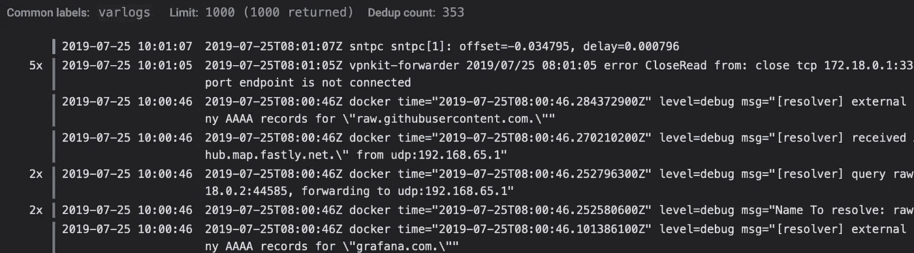
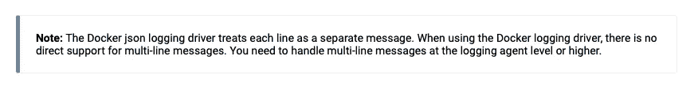
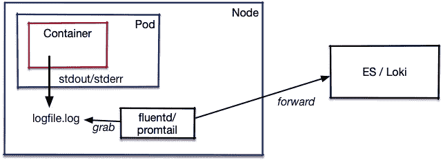

# 日志真的是可观察性的第三支柱吗？

> 原文：<https://itnext.io/is-logging-really-the-3rd-pillar-of-observability-d63f87f72fd5?source=collection_archive---------8----------------------->

当人们谈论可观察性时，他们通常会列出以下三个支柱

*   遥测/度量
*   (分布式)跟踪
*   记录



日志文件摘录

传统上，使用单个服务器设置，可以很容易地登录到服务器并在日志文件上运行 grep。现在，随着云服务、容器或功能的快速启动和关闭，情况发生了变化。当然，日志通常由 logstash 或 kibana 捕获，然后发送到 Elasticsearch 进行后处理和内容搜索。这创造了一个很难设置和保持运行的庞然大物(它使用了大量的资源，如存储、网络带宽和 I/O，以及用于索引的 cpu 能力)。

很明显，我们需要一种更加云原生的做事方式:

左边这条由爱丽丝·戈德福斯(Alice Goldfuss)发布的推文经常被用来激励比埃尔克/EKF 堆栈更精益的解决方案，例如[洛基](https://grafana.com/oss/loki)。
但是，即使该解决方案通过不索引厨房水槽而更加精简，它仍然存在问题，例如堆栈跟踪可能会在许多单独的行中结束，或者被不同线程的输出所交错。
此外，这些日志条目仍然由附加器从需要获取它们的地方写入磁盘上的文件，或者从 fluentd/promtail 等获取它们的地方写入标准输出。

传统日志还有另一个问题:日志条目中的数据通常是非结构化的(见左边 Chartiy 的推文)。这意味着很难找到一个条目的各个部分的意义，也很难将它们与系统上的其他可观察性信号相关联，这些信号可能有助于您进一步了解系统的行为。或者，如果您登录了多行，很难让机器理解哪些日志行属于同一行；当多线程服务中的几个日志源在输出中交错时，情况会更糟，这实际上是将条目与单个源分开



从[库伯内特斯](https://kubernetes.io/docs/concepts/cluster-administration/logging/#logging-at-the-node-level)伐木

当你沿着那个[线程](https://twitter.com/mipsytipsy/status/1151793157454983168)走下去的时候，你会发现为什么传统的日志记录不符合云原生挑战的更多论据。

另一个固有的问题是，为了能够理解分布式系统中一个服务的日志，您还需要查看它周围的其他系统，并将日志条目与指标、来自分布式跟踪的数据或其他信号(如线程或堆转储)相关联。
对于基于请求的交互，*请求 id* 可以在跟踪中使用和交付(作为跟踪 id 的一部分？)并且对于日志来说，*请求 id* 或*跟踪 id* 也将是日志条目中的一个条目。
不幸的是，没有太多的日志库可以开箱即用，所以最终只能通过时间戳遍历数据(同样，在非结构化日志条目中找到 request-id / trace-id 也很困难)。

## 日志还有用吗？

我并不是说日志没有用，但是传统的日志方式在新的世界里没有过去那么有用了。与默认情况下发送和存储大量日志不同，报告服务的错误数量并只存储错误或致命错误以便开发人员查看并应用修复可能更有意义(但也请参见下文)。但是请记住，您需要一个“指向原始错误条目的指针”，因为[解聚集是不可能的](https://peter.bourgon.org/blog/2017/02/21/metrics-tracing-and-logging.html)。但这有时还是太多了，因为存在第三方库不断记录无法删除的消息的情况。当存储这些消息时，系统甚至应该删除重复的条目，并且只增加抛出的错误的计数器。好的旧系统日志有一种机制，它可以检测重复的条目，并用相应的消息替换它们(如果两个不同的消息交替出现，则该机制会失败):

```
Jul 22 12:22:20 snert awdd[241]: Diagnostics Report
Jul 22 12:22:50 --- last message repeated 3 times ---
```

现在，当您部署了一个服务的 10 个实例时(例如，扩展到 10 个 pods)，您很可能会看到来自所有 10 个 pods 的所有这些消息，因此需要在日志接收端进行更多的重复数据删除。

## 交付

另一个与上述正交的方面是那些“日志消息”或更好的*事件*的交付。向 stdout 写入数据，然后进行进程抓取的旧方法并不太好。如果 DockerD 用 Json 把它包装起来，这并不重要。



Kubernetes 中的日志架构

容器/pod 级别的处理程序一次抓取 stdout/err 的一行，附加有关时间、容器和 pod 的信息，并将其写入文件，fluentd 或 promtail 等流程从该文件读取数据，以转发到 ElasticSearch 或 Loki

通过一些消息总线将那些日志*事件*(堆栈跟踪是单个事件)发送到中央“处理单元”可能会好得多，以便处理:

不幸的是，与基于 stdout 的方法不同，这在 shell 脚本或许多其他框架和语言中很难做到。

## 追踪救援？

分布式跟踪允许向 span 添加额外的信息，这些信息可以是日志信息或错误情况下的堆栈跟踪。跟踪每个请求(出于日志传送的目的)将再次使网络和跟踪处理系统不堪重负。因此，可以使用动态采样的修改版本来仅保持正常的 1%或千分之一的迹线，除非在迹线包含错误标志的情况下，然后保持整个迹线。然后，跟踪服务器不仅可以通过 id 或时间来查找跟踪，还可以通过查询那些日志条目来查找。

不幸的是，跟踪也不是万能的，因为不是由用户请求触发的基本系统级事件不会在跟踪(span)中结束，因此不会被报告:就拿 JVM 来说吧，它在垃圾收集上花费了太多时间。

## 但是调试呢？

我上面写的很多都是关于减少日志记录和日志处理的开销。现在，当您在生产中出现问题时，您有时会希望从调试甚至跟踪级别的服务获得完整的日志记录。本文展示了生产中[诊断测井的思想。但是，棘手的部分是，特别是在不可变容器映像的世界中，在不发送新映像或用新参数实例化现有映像的情况下，启用动态诊断日志记录。](https://tersesystems.com/blog/2019/07/22/targeted-diagnostic-logging-in-production/)

## 行动呼吁

第一:给我反馈:-)

严肃地说，我认为传统的日志记录方式不再适合云原生世界。为了再次变得更好，必须开始用元数据增加日志条目，并进行*结构化*日志记录。这并不意味着像洛基或 EFK 这样的系统必须对所有这些进行索引(高基数问题)。拥有元数据允许根据元数据进行查找和分组。此外，应该在一个 blob 中提供属于一起的条目数据。如果您过去登录过不同的文件，请确保您添加了一个表示该文件的*文件名*标签。

## 结论

*结构化测井*是可观测性的支柱，甚至是重要的支柱。不是像以前那样将随机字符串转储到 stdout 或文件中，而是一种更精细、更结构化的方式，允许更容易地浏览日志。