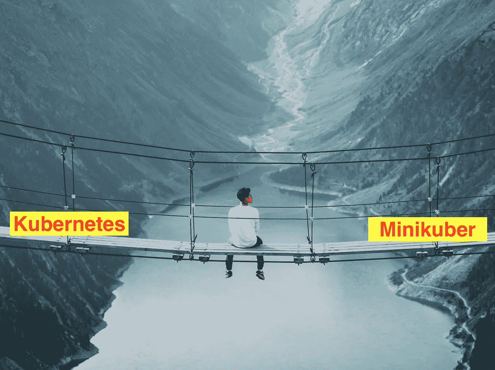
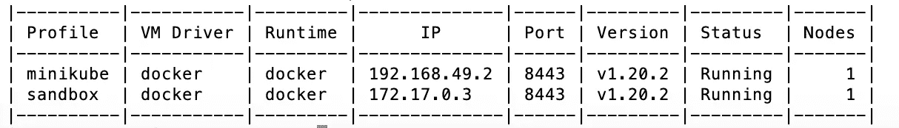
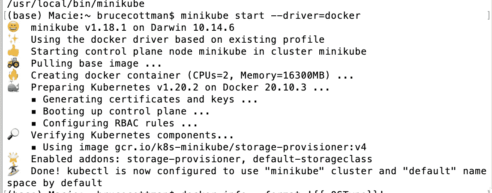
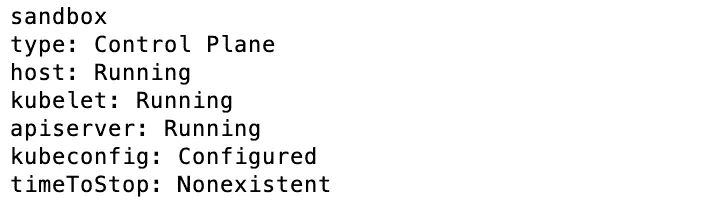
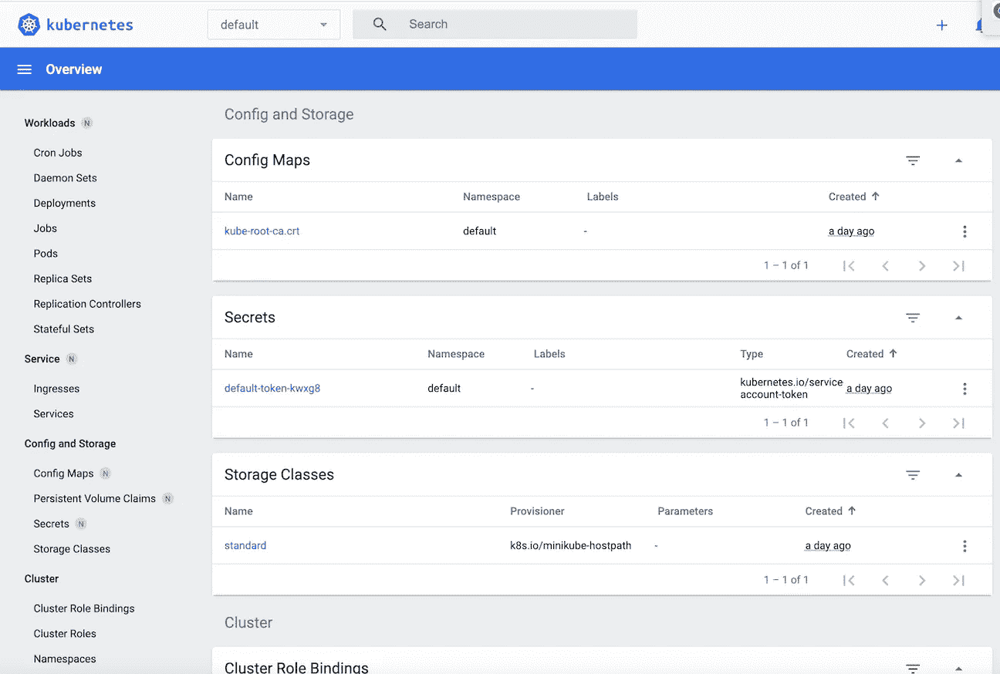
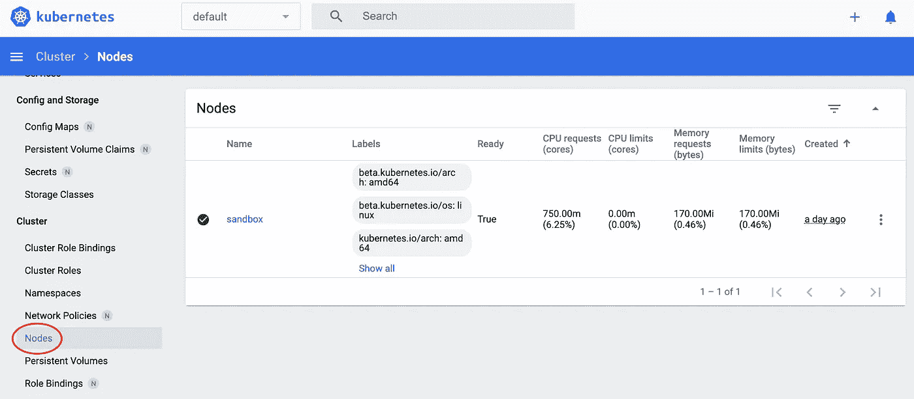
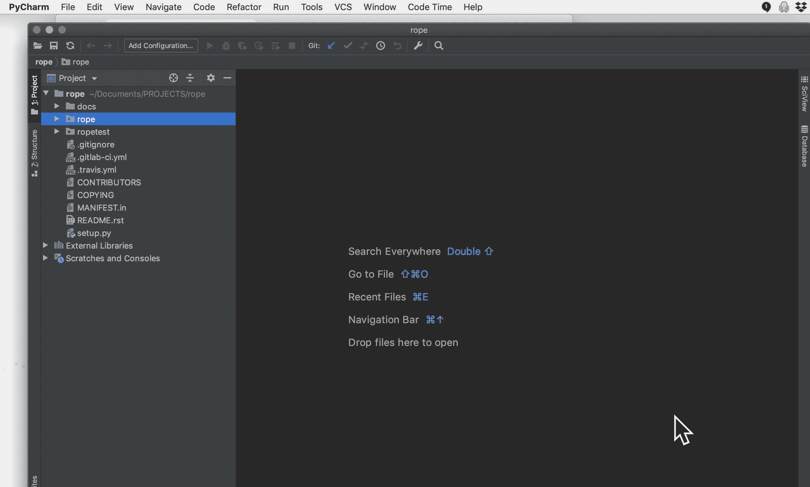

# Minikube 的配置文件是 Kubernetes 集群吗？

> 原文：<https://itnext.io/is-minikubes-profile-a-kubernetes-cluster-c0f134c5e684?source=collection_archive---------4----------------------->

## 我讨论了导致 Minikube 表现得像 Kubernetes 的稀疏记录的桥接概念。



Kubernetes 和 Minikube 之间的桥梁。由[亚历克斯·阿扎巴赫](https://unsplash.com/@alexazabache?utm_source=unsplash&utm_medium=referral&utm_content=creditCopyText)在 [Unsplash](https://unsplash.com/s/photos/bridge?utm_source=unsplash&utm_medium=referral&utm_content=creditCopyText) 上拍摄的照片

我避免深入探讨为什么以及如何使用或 Kubernetes 或 Minikube。相反，我关注 Minikube 的概要文件如何在您的本地系统上为云上的 Kubernetes 提供培训。

# 什么是 Kubernetes？

当 Kubernetes 被概念化时，它是作为微服务的云分布式操作系统(CDOS)开始的。一个"*纯粹的*"微服务云，其中复杂的应用程序由小型独立进程组成，这些进程通过网络上的 API(应用程序编程接口)相互通信。

毕竟，云是无数的异构硬件，每个都有其操作系统(裸机)，托管您的微服务，您希望复制这些微服务(扩展)并在微服务失败时重新启动(容错)。

Kubernetes 协调云服务，启动和初始化集群，在无法访问时重启 pods，复制(扩展)pods，以及许多其他分布式操作系统操作。

Kubernetes 介绍了集群、pod、容器和服务的具体定义。但是，我们不需要定义它们或理解 Kubernetes 集群，就可以像使用 Minikube 集群一样使用它们。

# Minikube 是什么？

[Minikube](https://kubernetes.io/docs/setup/learning-environment/minikube/) 是一种在本地工作站上训练或测试 Kubernetes 的流行方法。

Minikube 是你在本地计算机上运行外观和感觉都像 Kubernetes 的方式。

我认为 Minikube 是我安装在本地机器上的一个程序，用于培训或测试 Kubernetes。

在将 Kubernetes 配置推送到云之前，我们在本地沙箱上使用了 Minikube。

和 Kubernetes 一样，Minikube 使用客户端命令行工具 kubectl。然而，Minikube 需要一个名为`minikube.`的独立命令行工具

我关注 Minikube 的*简介*和 Kubectl 的*背景。我详细介绍了*我们如何使用这两者在 Minikube 或 Kubernetes 上编排相同的集群部署。

## 库贝克上下文

kubectl 命令行工具是您控制 Kubernetes 的方式。同样的 kubectl 也是控制 Minikuber 实例(本地集群)的方式。

您可以在上安装，因为 Kubernetes 通常是作为云 PaaS(平台即服务)建立的。

Kubernetes 被亚马逊称为弹性 Kubernetes 服务(EKS)，被微软称为 Azure Kubernetes 服务(AKS)，被谷歌称为 Google Kubernetes 引擎(GKE)。

Kubernetes 服务在您的云上编排一个或多个集群。

Kubernetes 拥有被命名为集群的*上下文*。通过使用上下文名，kubectl 指向要操作的 Kubernetes 服务集群。

我见过 Kubernetes 的*上下文*是以组织的应用生命周期阶段命名的，比如开发、测试、beta、alpha、生产。

***注意*** *: Kubernetes 的名称空间就是你如何将一个集群划分为命名的虚拟集群。引入名称空间是为了在多个用户之间划分集群资源。我只在大企业的 Kubernetes 环境(名为 cluster)中见过他们划分不同的项目。尽量少用名称空间。*

## Minikube 配置文件

您在本地计算机上安装 Minikube 软件包。

您可以在本地机器上为一个集群创建一个 Minikube 实例，称为概要文件。

## Minikube 配置文件和 kubectl 上下文

我猜 Minikube 开发人员面临着试图让 Minikube 与 Kubernetes 行为一致的问题，这意味着集群是通过 kubectl 控制的。

Minikube *概要文件*是 Minikube 实例的*名称*，它是本地机器上的一个集群。另一种不同但等效的说法是:“*每个新集群都需要一个新的 Minikube 实例。”*

***注*** *:集群这个术语是新的。我还没有完全定义它。幸运的是，Kubernetes 和 Minikube 中的集群概念是相同的。*

因为每个 Kubernetes 服务都可以编排一个或多个集群，所以 kubectl *上下文*命名特定的集群。

如果 Minikube *概要文件*与 kubectl *上下文*同名(字符串)，则 kubectl 在 Minikube 实例(集群)上运行。

## `minikube`命令

创建和管理 Minikube 实例需要使用`**minikube**`命令。由于 Kubernetes 是一个云 PaaS，云创建并控制 Kubernetes，您不需要类似于`**minikube.**`的命令

***注*** *:云创造并控制 Kubernetes 这个概念是一种简化。除非你为 Kubernetes 服务创建一个新的对象类型或行为，否则你可以使用*

我从`**minikube**` *profile* 命令开始，因为它们是您打包和封装不同 Minikube 实例的方式。

## `1\. Minikube profile list command`

您可以使用以下命令列出 Minikube 实例及其相关状态:

```
minikube profile list
```

*(示例)输出= >*



图一。来自`minikube profile list`的输出

## `2\. Show minikube profile namecommand`

当前 Minikube 实例名称(配置文件)显示为:

```
*(example)* minikube profile
```

*(示例)输出= >*

```
minikube
```

通知；注意

```
kubectl config current-context
```

*(示例)输出= >*

```
minikube
```

在 Minikube 的以前版本中，更改概要文件不会更改 kubectl 上下文。在 Minikube 的当前版本中，我还没有发现 Minikube 概要文件和 kubectl 上下文所引用的集群有什么不同。

## `3\. Set minikube profile command`

不同的 Minikube 配置文件名称设置为:

```
minikube profile <profile-name>
# *example*:
minikube profile sandbox
```

*(示例)输出= >*

```
✅  minikube profile was successfully set to sandbox
```

通知；注意

```
kubectl config current-context
```

*(例题)输出= >*

```
sandbox
```

如果您更改 Minikube 概要文件，kubectl 上下文也会更改。结果是 kubectl 和 Minikube 引用了相同的集群名。

***问题 1:*** *当 Minikube profile-name 与 Kubernetes 上下文名相同时会发生什么？*

## 4.创建默认的 Minikube 实例

创建名为的默认 Minikube 实例(和概要文件)。`minikube`:

```
minikube start
```



图二。minikube 开始输出。

## 4.创建命名的 Minikube 实例命令

使用`-p`选项创建名为`sandbox`的非默认 Minikube 实例(和概要文件):

```
minikube start -p *<profile-name>
#* example
minikube start -p sandbox
```

## 5.删除 Minikube 配置文件命令

如果我们要更改配置文件或完全删除配置文件:

```
minikube delete <profile-name>
example:
minikube delete sandbox
```

## 6.更改配置文件和其他 minikube 启动选项命令

如果您想要启动 Minikube 配置文件，请使用选项:

```
minikube start -p <profile-name> [options]
```

要更改一个概要文件，相当激烈的操作是删除该概要文件，然后用`minikube start -p <pofile-name>`及其众多选项之一重新创建它:

```
minikube delete <profile-name>
minikube start -p <profile-name> [options]
```

`[options]`列举有:

```
minikube start -h
```

Minikube 配置文件的一些有用选项:

```
Options:--cpus=2: Number of CPUs allocated to Kubernetes.--disk-size='20000mb': Disk size allocated to the minikube VM (format: <number>[<unit>], where unit = b, k, m or g).--dry-run=false: dry-run mode. Validates configuration, but does not mutate system state--kubernetes-version='': The Kubernetes version that the minikube VM will use (ex: v1.2.3, 'stable' for v1.20.2, 'latest' for v1.20.5-rc.0). Defaults to 'stable'.--memory='': Amount of RAM to allocate to Kubernetes (format: <number>[<unit>], where unit = b, k, m or g).-n, --nodes=1: The number of nodes to spin up in the cluster. Defaults to 1.-o, --output='text': Format to print stdout in. Options include: [text,json]--trace='': Send trace events. Options include: [gcp]
```

## 7.暂停和取消暂停 Minikube 配置文件命令

您不想使用:

```
minikube delete <profile-name>
```

集群中的所有内容(名为 Minikube 实例)都将被删除，例如正在运行的节点和应用程序。

您应该使用:

```
minikube pause <profile-name>
```

在下一篇博客中，我们将详细介绍如何使用`kubectl`更改配置文件选项，比如 CPU、内存或磁盘的数量。

使用 kubectl 对 Minikube 实例(集群)进行任何更改。

然后:

```
minikube unpause <profile-name>
```

## 8.停止 Minikube 当前配置命令

如果您想在 Minikube 配置文件中停止执行:

```
minikube stop -p <profile-name>
```

命令停止底层(Docker)容器，但保持用户数据不变。集群可以通过以下方式重新启动:

```
minikube start -p <profile-name>
```

## 11.检查 Minikube 实例的状态

```
minikube status
```



图 4: `minikube status output`

***注****:profile 决定显示哪个 Minikube 状态。*

## 13.minikube 仪表板

d [ashboard](https://kubernetes.io/docs/tasks/access-application-cluster/web-ui-dashboard/) 提供了一个基于 Web 的用户界面(Web UI)来管理 [Kubernetes](https://kubernetes.io/docs/tasks/access-application-cluster/web-ui-dashboard/) 资源和容器化的应用程序。

要启动 Minikube/Kubernetes [仪表盘](https://kubernetes.io/docs/tasks/access-application-cluster/web-ui-dashboard/):

```
minikube dashboard &
```



图 5。kubernetes dashboard at[http://127 . 0 . 0 . 1:50381/API/v1/namespaces/kubernetes-dashboard/services/http:kubernetes-dashboard:/proxy/#/overview？名称空间=默认](http://127.0.0.1:50381/api/v1/namespaces/kubernetes-dashboard/services/http:kubernetes-dashboard:/proxy/#/overview?namespace=default)

要停止 Minikube 仪表板代理并保持仪表板运行，使用(`Ctrl+C`)中止代理过程。

d [仪表板](https://kubernetes.io/docs/tasks/access-application-cluster/web-ui-dashboard/)显示 Minikube 配置文件集群或 kubectl 上下文。记住，它们都有精确的字符串。



图 6。显示沙箱节点的 Kubernetes 仪表板。

## 使用 kubectl 命令行工具访问 Minikube

[kubectl](https://kubernetes.io/docs/reference/kubectl/overview/) 是 Minikube/Kubernetes 命令行界面(CLI)客户端，用于从终端控制台管理集群资源和应用程序。

kubectl 使您能够管理本地 Kubernetes 集群，如 Minikube 集群或远程 Kubernetes 集群，或者部署在云中。

kubectl 可以用作独立的命令行工具，也可以作为脚本和自动化工具的一部分。

## 20.测试 Minkube 和 kubectl 安装

我们使用以下命令创建一个包含名为`install-chk`的 pod:

```
$ kubectl run -it --rm --restart=Never install-chk --image=alpine sh
```

如果一切正常，我们应该能看到新的外壳。命令中的`--rm`选项确保当我们离开 pod 时，pod 被删除，这可以通过在 shell 中键入`exit`来实现。

# 摘要

我避免深入探讨为什么以及如何使用或 Kubernetes 或 Minikube。相反，我关注 Minikube 的*概要文件*如何在您的本地系统上实现 Kubernetes cloud PaaS 的培训。

Minikube 是你在本地计算机上运行外观和感觉都像 Kubernetes 的方式。

我认为 Minikube 是我安装在本地计算机上的一个程序，用于培训或测试 Kubernetes。

***注*** *: Kind 也是一种在本地计算机上用 Kubernetes 进行训练的流行方法。*

我们了解了 Minikube *概要文件*概念，以及它与 kubectl *上下文*概念的相似性。

命令行工具是控制 Kubernetes 集群的方式。同样的`kubectl`是你如何控制一个 Minikube 实例(集群)。

在附录中，我详细介绍了 Minikube 的安装，并展示了针对本地 Minikube 环境的其他`minikube`命令。

对学习 Minikube 不重要的材料放在附录中:

1.  安装 Minikube 和相关的软件包在附录 a 中有详细说明。
2.  `minikube` 命令和最小 Minikube 硬件和软件要求详见附录 a。
3.  Minikube (Linux)环境变量(可选)在附录 c 中有详细说明。
4.  关于 Docker-jupyter IDE 或 Docker-PyCharm IDE 的安装，可选择参考附录 D。

编码快乐！

# 附录 a .安装 Minikube 和相关软件包

*   [安装 Minikube](https://minikube.sigs.k8s.io/docs/start/)；
*   [安装 kubectl。kubectl 用于访问和管理任何 Kubernetes 集群。Minikube 配置命令需要 kubectl。](https://kubernetes.io/docs/tasks/tools/)
*   [安装 Docker](https://docs.docker.com/get-docker/) 并可选择参考附录 d 安装 Docker-jupyter IDE 或 Docker-PyCharm IDE

# 附录 b。

使用`minikube,`,我们提供本地运行 Kubernetes 所需的额外控制命令。当 Kubernetes 托管在云上时，它不需要这些命令。

`minikube`命令是:

```
minikube --helpoutput =>minikube provisions and manages local Kubernetes clusters
optimized for development workflows.Basic Commands:
start          Starts a local Kubernetes cluster
status         Gets the status of a local Kubernetes cluster
stop           Stops a running local Kubernetes cluster
delete         Deletes a local Kubernetes cluster
dashboard      Access the Kubernetes dashboard running for
 the current minikube profile (cluster)
pause          pause Kubernetes
unpause        unpause KubernetesImages Commands:
docker-env     Configure environment to use minikube's Docker daemon
podman-env     Configure environment to use minikube's Podman       service
cache          Add, delete, or push a local image into minikube
image          Load a local image into minikubeConfiguration and Management Commands:
addons         Enable or disable a minikube addon
config         Modify persistent configuration values
profile        Get or list the current profiles (clusters)
update-context Update kubeconfig in case of an IP or port changeNetworking and Connectivity Commands:
service        Returns a URL to connect to a service
tunnel         Connect to LoadBalancer servicesAdvanced Commands:
mount          Mounts the specified directory into minikube
ssh            Log into the minikube environment (for debugging)
kubectl        Run a kubectl binary matching the cluster version
node           Add, remove, or list additional nodesTroubleshooting Commands:ssh-key        Retrieve the ssh identity key path of the specified nodessh-host       Retrieve the ssh host key of the specified node
ip             Retrieves the IP address of the specified node
logs           Returns logs to debug a local Kubernetes cluster
update-check   Print current and latest version number
version        Print the version of minikubeOther Commands:
completion     Generate command completion for a shellUse "minikube <command> --help" for more information about a given command.
```

***注意*** *:如果想建立自己的本地云，可以使用 Kubernetes。*

所有`minikube`命令都特定于本地 Minikube 安装和运行 Minikube 实例(也称为配置文件)。

*   您至少需要两个 CPU 或内核。2017 年后，几乎所有英特尔或 AMD 的芯片组都是多核的。您应该能够在 32 GB 的笔记本电脑上运行 Minikube。我使用的是 24 核、64 GB 的 MacOs 工作站。
*   2 GB 空闲内存；
*   20 0GB 的可用磁盘空间；
*   互联网连接。TCP/IP 是 MS Windows、MacOS 和几乎所有 Unix/Linus OS 变体的标准。

***注意*** *:如果一个 Docker 镜像已经被拉出来，并且你正在你的沙箱中使用一台机器，你可以关闭互联网。我从来不需要。也许你会为了安全？*

*   你可能已经安装了 [Docker](https://minikube.sigs.k8s.io/docs/drivers/docker/) 。如果没有，安装 Docker 的说明见附录 a，可以使用其他容器套件: [Hyperkit](https://minikube.sigs.k8s.io/docs/drivers/hyperkit/) 、 [Hyper-V](https://minikube.sigs.k8s.io/docs/drivers/hyperv/) 、 [KVM](https://minikube.sigs.k8s.io/docs/drivers/kvm2/) 、 [Parallels](https://minikube.sigs.k8s.io/docs/drivers/parallels/) 、 [Podman](https://minikube.sigs.k8s.io/docs/drivers/podman/) 、 [VirtualBox](https://minikube.sigs.k8s.io/docs/drivers/virtualbox/) 或 [VMWare](https://minikube.sigs.k8s.io/docs/drivers/vmware/) 。我在这篇博客文章中使用 Docker。
*   使用谷歌 Chrome 浏览器，或者你可以尝试其他浏览器。

***注*** *:人生苦短。通过使用 Chrome，你可以将怒火集中在一个开源厂商身上。*

# 附录 C. Minikube (Linux)环境变量(可选)。

有些值只能由 Minikube 环境变量访问(可选):

*   *MINIKUBE_HOME* — (string)设置。minikube 用于状态/配置的 minikube 目录。 **N *ote*** *:这仅由 minikube 使用，不影响任何与 Kubernetes 工具相关的东西，如 kubectl。*
*   *MINIKUBE _ IN _ STYLE*—(bool)手动设置表情符号和颜色是否应该出现在 MINIKUBE 中。设置为 false 或 0 以禁用该功能，设置为 true 或 1 以强制打开该功能。 *MINIKUBE_IN_STYLE* 默认开启。我让它开着(参考图 1)。
*   *MINIKUBE _ WANTUPDATENOTIFICATION*—(bool)设置用户是否需要新 MINIKUBE 版本的更新通知
*   *MINIKUBE _ REMINDERWAITPERIODINHOURS*—(int)设置检查更新通知的小时数
*   *CHANGE _ MINIKUBE _ NONE _ USER*—(bool)自动更改~/的所有权。minikube 的价值为$ SUDO _ 用户
*   *MINIKUBE _ ENABLE _ PROFILING*—(int，`1`ENABLE it)启用为 MINIKUBE 生成的跟踪分析

***注意*** *:您可能想要导出这些 Minikube* *全局环境变量，方法是将它们放在您的* `*.*[*bashrc*](https://stackoverflow.com/questions/19662713/where-do-i-find-the-bashrc-file-on-mac)` [*文件*](https://www.journaldev.com/41479/bashrc-file-in-linux) *或您用于登录初始化的任何文件中。*

# 附录 d。

# Docker 中的 Jupyter IDE

您可以将 Jupyter IDE 和一些扩展放在 Docker 映像中，如:

[](https://towardsdatascience.com/adding-jupyter-notebook-extensions-to-a-docker-image-851bc2601ca3) [## 将 Jupyter 笔记本扩展添加到 Docker 映像

### 我们的 Jupyter Python 和 R 用户的 Docker 映像要求他们在每隔…之后设置他们的 Nbextensions 首选项

towardsdatascience.com](https://towardsdatascience.com/adding-jupyter-notebook-extensions-to-a-docker-image-851bc2601ca3) 

***注*** *:在 Kubernetes 运行 Jupyter 没有实际的理由。我正在记录使用 Jupyter IDE 和任何你可能需要的包来保护你的本地裸机操作系统。*

## Docker 中的 PyCharm IDE

我将详细介绍如何使用 Docker 映像配置 PyCharm IDE。在⌃⌥s**设置/首选项**对话框中，选择**项目<项目名称> |项目解释器**。嗬



为 PyCharm Rope 项目配置一个虚拟环境(Docker)作为 Python 解释器。瑞秋·科特曼的动画

***注*** *:我在麦金塔上。在 Windows 或 Linux 上可能有所不同。还有，我用 PyCharm Professional。*

***注*** *: PyCharm 帮助正文*[*:*](https://www.jetbrains.com/help/pycharm/manage-projects-hosted-on-github.html)*:*[*https://www . jetbrains . com/Help/py charm/creating-virtual-environment . html*](https://www.jetbrains.com/help/pycharm/creating-virtual-environment.html)

如何构建 Docker 映像在以下内容中有详细介绍:

[](https://dr-bruce-cottman.medium.com/a-docker-solution-for-the-test-groups-use-cases-8e8ed6c28e11) [## 我们将 Docker 企业解决方案的速度提高了一倍

### 我们收到了大量关于 Docker 解决方案 0.0.2 版本的反馈。反馈有一个共同的主题:只有 R&D…

dr-bruce-cottman.medium.com](https://dr-bruce-cottman.medium.com/a-docker-solution-for-the-test-groups-use-cases-8e8ed6c28e11) [](https://medium.com/swlh/a-docker-solution-for-the-enterprise-7b5d2942b43a) [## 面向企业的 Docker 解决方案

### 这是一个关于我们公司推出 Docker 的故事。我展示我们的 Docker 和 Docker-Compose 解决方案。被警告…

medium.com](https://medium.com/swlh/a-docker-solution-for-the-enterprise-7b5d2942b43a) 

***注*** *:在 Kubernetes 中运行 Pycharm 没有实际的理由。我正在记录使用 Pycharm IDE 和任何你可能需要的包来保护你的本地裸机操作系统。*

## 验证 docker 的配置

您可以通过运行以下命令来验证您的 Docker 容器类型:

*   `docker info --format '{{.OSType}}'`
*   运行`--alsologtostderr -v=1`获取额外的调试信息